# Java Advanced


## 高级 Java 工程师岗位职责

- 具备扎实的 Java 基础，精通多线程编程、NIO 模型，设计模式
- 熟练掌握 Spring 等主流的开发框架，深入理解框架实现原理及特性
- 熟练掌握 MySQL 数据库，具备 MySQL 索引优化、查询优化的能力
- 熟悉常见的开源分布式中间件、缓存、消息队列等，有相关的优化经验
- 有大规模分布式系统的开发和高可用相关的实践经验，具备设计复杂系统的能力
- 热爱技术，对代码质量和开发规范有近乎苛刻的要求，善于沟通与团队协作


## 讲师：秦金卫

Apache Dubbo/ShardingSphere PMC，前阿里架构师/前火币高级技术总监

Apache Dubbo PMC，前阿里架构师/某商业银行北京研发中心负责人/前火币高级技术总监、TGO 鲲鹏会会员；

关注于互联网，电商，金融，支付，区块链等领域，熟悉海量并发低延迟交易系统的设计实现， 10 多年研发管理和架构经验；

熟悉各类中间件，擅长于 SOA /微服务等分布式系统架构，热爱各种开源技术，活跃于多个开源社区。

过去十来年的工作中：

曾作为求职者，拿到过几乎所有一二线互联网公司的架构师、技术专家/总监职位 Offer。

曾作为面试官，面试超过 2000 人次，具备丰富的一线技术人员的面试经验和辅导经验。


## 课程大纲

链接：https://shimo.im/docs/ttt3pDKgjCWYGGyK/read

### 模块一：JVM 进阶 - Java开发者大厂面试必知必会

#### 教学目标：

1. 从 0 掌握 JVM 关键技术，了解核心知识；
2. 全面了解各类 GC 算法的原理和特性，洞悉相关原理；
3. 全面学习常见的 JVM 分析调优工具，上手十八般武艺；
4. 一线大厂 JVM 面试题全面剖析，助力拿到心仪 Offer。


#### 学习和工作中的痛点：

1. 没有经过体系化 JVM 学习，不懂原理，做不到知其然知其所以然；
2. 不熟悉 JVM 工具和方法，遇到问题不知道从何下手、如何分析和解决问题；
3. 缺乏实际场景的练习，每次看看书上的知识就忘，理解不深，无法做到融会贯通；
4. 在面试过程中十回有九回都遇到问 JVM 理论和分析调优的问题，每次都很难让面试官满意。


#### 通过学习掌握的核心能力：

1. 夯实基础：掌握 JVM 的基础知识和常用工具，了解一般原理，知道从什么地方着手分析问题；
2. 深入学习：掌握各类 GC 算法的一般原理，知道如何根据实际需要选择使用合适的 GC 策略；
3. 分析问题：掌握 GC 日志、线程、内存等维度的分析技巧，知道排查问题和优化系统的套路；
4. 积累经验：了解常见的分析调优经验，熟悉常见的面试问题和技巧，彻底学会 JVM 知识。


#### 详细内容：

1. JVM 基础知识、Java 字节码技术、JVM 类加载器、JVM 内存模型、JVM 启动参数详解；
2. JDK 内置命令行工具、JDK 内置图形界面工具、JDWP 简介、JMX 与相关工具；
3. 常见的 JVM GC 算法（Parallel GC/CMS GC/G1 GC）基本原理和特点；
4. 新一代 GC 算法（Java11 ZGC/Java12 Shenandoah）和Oracle Graalvm；
5. GC 日志解读与分析、JVM 的线程堆栈等数据分析、内存 dump 和内存分析工具；
6. fastThread 相关工具以及面临复杂问题时的几个高级工具的使用；
7. JVM 问题排查分析的常用手段、性能调优的最佳实践经验等；
8. JVM 相关的常见面试问题必知必会、全面分析。


### 模块二：NIO 技术--构建高吞吐服务器的终极武器

#### 教学目标：

1. 理解 NIO 的相关概念和原理，了解核心知识；
1. 全面掌握 Netty 相关的功能特性，掌握 Netty 的技术原理；
1. 全面学会使用 Netty 技术编程，能够写出高效服务器端代码；
1. 掌握常用的性能压测技术和相关工具，能够压测 HTTP 接口性能。


#### 学习和工作中的痛点：

1. 不理解 NIO 相关概念和技术点，搞不清原理，沟通和面试时无法准确表达；
1. 缺乏实际场景的练习，对 Netty 的使用和原理不熟悉，难以应用到工作中；
1. 不会使用 Netty 做高性能服务端编程，对性能相关指标和数据没有概念。


#### 通过学习掌握的核心能力：

1. 夯实基础：掌握 NIO 相关的知识和技术，能知道各种技术有什么优缺点，适用于什么场景；
1. 深入学习：熟练掌握 Netty/NIO 编程，能够设计实现一个高性能 HTTP 服务器/API 网关；
1. 积累经验：了解常见的性能相关概念和压测入门，对性能指标有清晰概念，能够简单地量化分析。


#### 详细内容：

1. 同步/异步、阻塞/非阻塞、BIO、NIO、AIO、Reactor/Proactor；
1. ByteBuff/Acceptor/Channel/Handler、NioEventLoopGroup/EventLoop、bossGroup/workerGroup；
1. Netty 的启动和执行过程、线程模型、事件驱动、服务端和客户端的使用方式；
1. 常见的 API Gateway/HTTP Server、SEDA 原理、业务 API 网关的功能和结构；
1. Throughout/TPS/QPS、Latency/P99/P95/P90、ApacheBench/Wrk/JMeter/LoadRunner。


### 模块三：并发编程--多核处理器时代高性能的秘诀

#### 教学目标：

1. 学会多线程、高并发相关概念和技术，了解并发编程的核心知识；
1. 全面了解并发的相关技术的原理和用途，洞悉技术原理和相互关系；
1. 熟练掌握 Java 的多线程、并发包中各个类的使用，上手十八般武艺。


#### 学习和工作中的痛点：

1. 没有经过系统性学习并发编程，搞不清楚技术原理，写不出一个良好的多线程/异步代码；
1. 不熟悉 Java 的各个多线程工具和方法，遇到多线程问题常常束手无措，不会分析解决问题；
1. 缺乏实际场景的练习，平时没怎么用到多线程和并发，导致死记硬背的概念总是记不住。


#### 通过学习掌握的核心能力：

1. 夯实基础：系统掌握 Java 多线程和并发编程的技术原理和知识点，写出优秀的并发代码；
1. 深入学习：熟练应用各种并发工具，了解在什么情况下使用哪些具体的技术和方法；
1. 分析问题：掌握常见的多线程和并发问题分析技巧，知道排查一般问题的具体步骤；
1. 积累经验：构建完整全面的并发编程知识体系，熟悉常见的面试问题和技巧，彻底掌握Java并发编程知识。


#### 详细内容：

1. Java 多线程基础：线程、锁、synchronized、volatile/final、sleep/await/notify/fork/join；
1. Java 并发包基础：线程池 Executor、AQS/CAS、Atomic 原子操作、Lock/ReadWriteLock/Condition、Callable/Future；
1. Java 并发容器与工具：BlockingQueue/CopyOnWriteList/ConcurrentHashMap、CountDownLatch/CyclicBarrier/Semaphore等；
1. 其他：万金油 ThreadLocal，化繁为简 Java8 parallelStream 等。


### 模块四：开发框架--深入理解 Spring 等主流框架思想

#### 教学目标：

1. 重新认识主流开源技术框架，深入理解背后的原理和关系；
1. 掌握整合各种框架的最佳实践，学会在工作中做技术框架选型；
1. 了解主流框架的发展趋势，一线大厂的使用模式和关注点。


#### 学习和工作中的痛点：

1. 对主流开源技术框架，始终在会用、会做简单整合，不懂背后原理；
1. 只会用自己熟悉的框架，不会做技术选型，也不了解一些最佳实践经验；
1. 框架发展太快，学习跟不上了，也不太了解一线大厂使用主流框架的方式。


#### 通过学习掌握的核心能力：

1. 夯实基础：从更高的维度和更深入的原理，重新学习主流框架，了解框架的内在联系；
1. 深入学习：掌握常见框架的一些最佳实践经验，能够根据具体的项目情况进行技术框架选型；
1. 积累经验：了解常见主流框架的发展趋势，掌握最佳学习姿势，能够轻松驾驭技术发展。


#### 详细内容：

1. Spring 技术体系（Spring Core/Web/MVC/Data/Messaging、Spring Boot 等）；
1. ORM 技术体系（JPA、Hibernate、MyBatis 等）。


### 模块五：系统性能优化--学会性能分析与 MySQL 优化

#### 教学目标：

1. 深入了解业务系统性能的度量分析方法，找到性能瓶颈和关键路径；
1. 了解 MySQL 的性能关键点，学会如何进行 MySQL 和 SQL 语句的性能分析；
1. 掌握如何编写高效的 SQL 语句，能对复杂的业务 SQL 进行性能优化。


#### 学习和工作中的痛点：

1. 性能调优能力是架构师/技术专家的核心能力之一，但是对这一块没经验；
1. 遇到性能问题不知道从何下手、如何分析性能瓶颈在哪儿，也就不知道如何解决问题；
1. 缺乏实际场景的练习，每次看别人讲的理论，都没办法转化到实际工作中去；
1. 在面试过程中经常被问到分析调优的问题，总是觉得自己没有太多干货可讲。


#### 通过学习掌握的核心能力：

1. 深入学习：通过系统化的学习性能相关知识和实践经验，掌握复杂业务系统性能分析方法；
1. 分析问题：掌握 SQL/索引/事务 的分析技巧，知道排查问题和优化 MySQL/SQL 的办法；
1. 积累经验：掌握编写高性能 SQL 的技能，避免常见的各种低性能坑，提升数据库编程水平。


#### 详细内容：

1. 系统可观测性（日志、调用链跟踪、指标度量），80/20 优化原则，CPU、内存、磁盘/网络 IO 等分析；
1. MySQL 的锁、事务、索引、并发级别、死锁、执行计划、慢 SQL 统计、缓存失效、参数优化；
1. 库表设计优化，引擎选择，表结构优化设计，列类型选择，索引设计，外键等；
1. SQL 查询优化，索引选择，连接优化，聚合查询优化，Union 优化，子查询优化，条件优化等；
1. 场景分析，主键生成与优化，高效分页，快速导入导出数据，解决死锁问题等。


### 模块六：超越分库分表--掌握海量业务数据的应对之道

#### 教学目标：

1. 从 0 掌握海量业务数据处理的关键技术，了解核心知识，参与实践案例；
1. 全面学习 MySQL 主从复制架构，读写分离和数据库垂直/水平拆分；
1. 学习应对系统不同类型数据的处理办法，对数据进行冷热分离，提升系统数据处理能力；
1. 全面掌握各类场景下的读写分离，数据库拆分的框架和中间件，在实际工作中熟练使用。


#### 学习和工作中的痛点：

1. 只会增删改查，不了解对海量业务数据的处理办法；
1. 每次被人问到 MySQL 的高可用和高性能架构，都不能清晰地讲明白；
1. 缺乏实际场景的练习，不了解不同类型的数据对应的处理办法；
1. 对于常见的读写分离、分库分表等技术，停留在理论阶段，没有动手实践过。


#### 通过学习掌握的核心能力：

1. 夯实基础：全面了解 MySQL 主从复制架构，读写分离和数据库垂直/水平拆分的应用场景和技术原理；
1. 深入学习：进一步学会 MySQL 的高可用和高性能架构；
1. 分析问题：掌握应对系统不同类型数据的处理办法，对数据进行冷热分离，提升系统数据处理能力；
1. 积累经验：全面掌握各类场景下的读写分离，分库分表的框架和中间件，在实际工作中熟练使用。


#### 详细内容：

1. MySQL 主从复制，Binlog，Row/Statement 模式，主从切换，读写分离，数据库扩容；
1. 数据库垂直拆分与水平拆分，分库分表，分布式主键，分表算法，SQL 限制，数据迁移，实时同步；
1. Spring 动态切换数据库，TDDL/Sharding-JDBC 框架，MyCat/Sharding-Proxy 中间件；
1. 数据库拆分的最佳实践，分布式事务的最佳实践，多租户的最佳实践。


### 模块七：分布式服务--复杂业务系统架构演进必由之路

#### 教学目标：

1. 全面掌握 RPC 原理和常见的 RPC 技术；
1. 深刻理解服务治理相关的技术和应用场景；
1. 深入学习 Dubbo 和 Spring Cloud 的功能和技术原理；
1. 深入了解微服务架构的特点和最佳实践。


#### 学习和工作中的痛点：

1. 会用简单的 RPC 和 REST，但是对其原理和细节不够了解；
1. 一直没有实际接触过服务治理相关的技术，只知道几个名词，不清楚具体的功能和用法；
1. 对 Dubbo 和 Spring Cloud 一知半解，简单作为 RPC 调用都会，再复杂的就不太清楚了；
1. 微服务相关的知识都有些了解，但是不是很懂到底什么时候该做微服务，怎么做微服务。


#### 通过学习掌握的核心能力：

1. 夯实基础：系统的了解和学习 RPC 知识，知道每种 RPC 有什么特点，什么时候用什么 RPC 技术；
1. 深入学习：全面的学习一遍服务治理的技术，能够认识到什么情况下使用哪种具体的特性；
1. 分析问题：深刻理解 Dubbo 和 Spring Cloud 技术体系原理，遇到问题能够迅速定位和解决；
1. 积累经验：深入了解微服务架构的特点和最佳实践经验，学会何时做微服务，如何做微服务。


#### 详细内容：

1. 基础知识：RPC、通信与数据协议、WebService、Hessian、REST、gRPC、Protocol Buffers 等；
1. 服务化：服务治理、配置管理、注册发现、服务分组、版本管理、集群管理、负载均衡、限流与降级熔断等；
1. 框架：Apache Dubbo 的功能与原理分析，Spring Cloud 体系，具体的案例实践；
1. 微服务：微服务架构的 6 个最佳实践，从微服务到服务网格、云原生的介绍。


### 模块八：分布式缓存--复杂业务系统访问提速第一法宝

#### 教学目标：

1. 深入理解缓存的应用场景和缓存策略；
1. 全面掌握几种常见缓存问题的处理方式；
1. 彻底掌握 Redis 缓存中间件，了解 Hazelcast 内存网格；
1. 学会使用缓存技术实现排行数据展示，分布式 ID 生成等典型应用场景。


#### 学习和工作中的痛点：

1. 对缓存的认知停留在 JVM 内的静态 Map 和往 Redis 存 KV 数据，不了解什么时候该用缓存；
1. 不熟悉常见的缓存问题处理方案，遇到问题难以解决，例如缓存失效和雪崩问题如何解决；
1. 只了解简单的 Redis 操作，高级功能（例如集群或 Lua）没用过，其他缓存技术也没接触过；
1. 没有在实际的应用场景里用 Redis 之类的缓存技术，不知道具体有哪些典型的应用场景。


#### 通过学习掌握的核心能力：

1. 夯实基础：掌握缓存的应用场景和常见的策略，特别是与数据库的同步；
1. 深入学习：掌握常见的缓存问题的处理策略，将缓存技术应用到实际工作；
1. 分析问题：全面掌握 Redis 缓存技术，能够分析和解决缓存问题；
1. 积累经验：深入实践和掌握几个典型的应用场景，了解 Hazelcast 内存网格技术。


#### 详细内容：

1. 缓存的应用场景，缓存加载策略与失效策略，缓存与数据库同步等；
1. 缓存预热、缓存失效、缓存击穿、缓存雪崩、多级缓存、缓存与 Spring+ORM 框架集成；
1. 缓存中间件，Redis（几种常用数据结构、分布式锁、Lua 支持、集群），Hazelcast（Java 数据结构、内存网格、事务支持、集群）；
1. 缓存的应用场景，排行数据展示，分布式 ID 生成，Session 共享，热点账户操作等。


### 模块九：分布式消息--复杂业务系统关系解耦不二法门

#### 教学目标：

1. 从 0 掌握消息队列（MQ）的关键技术，了解核心知识；
1. 全面了解各类 MQ 技术的原理和特性，洞悉相关原理；
1. 全面吃透 Kafka 的基本功能，集群搭建，高可用等，上手十八般武艺；
1. 深入理解 MQ 的特点和应用场景，通过交易场景实战演练，并动手做一个简单的 MQ。


#### 学习和工作中的痛点：

1. 很少使用 MQ，就算用过也只是简单的收发消息，对 MQ 的原理和细节不了解；
1. 不熟悉常见的几个主流 MQ，其中的多数技术都没有接触过，或者只听过名词；
1. 缺乏实际场景的练习，每次看看书上的知识就忘，理解不深，无法做到融会贯通；
1. 不太了解什么时候该用 MQ，MQ 能帮我们解决哪些方面的问题，带来什么样的好处。


#### 通过学习掌握的核心能力：

1. 夯实基础：掌握 MQ 的基础知识和常用工具，了解一般原理，知道 MQ 的一些基本概念；
1. 深入学习：掌握各类 MQ 技术的一般原理和功能，知道如何根据实际需要选择使用合适的 MQ；
1. 分析问题：掌握 Kafka 等主流 MQ 技术，能对一般的 MQ 问题进行分析和解决；
1. 积累经验：了解 MQ 如何应用到一个具体的业务场景和 MQ 内部细节，彻底学会 JVM 知识。


#### 详细内容：

1. 消息队列的基本知识，Broker 与 Client，消息模式（点对点、发布订阅），消息协议（STOMP、JMS、AMQP、OpenMessaging 等），消息 QoS（最多一次、最少一次、有且仅有一次），消息重试，延迟投递，事务性，消息幂等与去重；
1. 消息中间件：ActiveMQ 的简单入门，Kafka 的基本功能与使用，高可用（集群、分区、副本）、性能，RabbitMQ 和 RocketMQ，Pulsar 的简单介绍；
1. 消息的 4 个主要功能，搭建一个 Kafka 集群，实现常用的消息发送、消息消费功能；
1. 典型使用场景，使用 MQ 实现交易订单的处理，动手实现一个简化版的消息队列。


### 模块十：分布式系统架构--如何设计高并发高可用的 Java 系统

#### 教学目标：

1. 了解大规模分布式的复杂业务系统架构技术发展脉络；
1. 全面掌握业务系统发展不同阶段应该如何做技术选型；
1. 以一个电商系统为例，深入学习如何分析系统架构；
1. 掌握高并发高可用的分布式 Java 系统的设计方法。


#### 学习和工作中的痛点：

1. 没有机会去从头设计一个高并发的大规模分布式系统，缺乏对此类问题深入的学习和思考；
1. 对业务系统架构发展不了解，技术思路一直停留在一个静态观念，一般只会选择自己熟悉的技术；
1. 缺乏实际场景的练习，每次看看书上的知识就忘，面对复杂业务系统架构设计，总觉得无从下手；
1. 平时从网上或书上看到各种零散的知识和经验，无法转化成自己的知识和能力，总是掌握不了。


#### 通过学习掌握的核心能力：

1. 夯实基础：了解大规模分布式的复杂业务系统架构技术发展脉络，从技术发展里借鉴经验；
1. 深入学习：掌握业务系统发展不同阶段应该如何做技术选型，为系统选择合适的架构方案；
1. 分析问题：深入理解如何基于系统的功能性和非功能性需求，进行详细的系统架构分析；
1. 积累经验：掌握高并发高可用的分布式 Java 系统的设计方法，能够独立设计复杂业务系统。


#### 详细内容：

1. 业务分析、功能性需求、非功能性需求、高可用、高性能、稳定性、易用性、扩展性、可维护性、安全性等；
1. “4+1” Views、TOGAF、架构方案、业务架构、数据架构、设计文档、技术选型、部署文档、运维文档等；
1. 分布式服务化、分布式消息中间件、分布式缓存、分布式文件系统、监控告警系统、权限与认证中心等。


### 模块十一：业务系统重构--重构遗留系统是架构师的必修技能

#### 教学目标：

1. 通过一个具体复杂电商业务系统的重构，掌握遗留系统重构的方法和经验；
1. 了解一线大厂系统演进的具体案例，掌握如何解决老系统的各种疑难杂症；
1. 学会如何解决困难的问题，协调资源，推动团队，完成看似不可能的目标。


#### 学习和工作中的痛点：

1. 实际工作中，我们并不是总能有机会从头去做一个大系统，维护和改造老系统，反而是更常见的任务；
1. 遗留的老系统质量很差，经常出故障，没文档，代码复杂且没人清楚细节，不知如何下手改造；
1. 改造过程中，遇到很多具体的复杂技术难题，心里没底，各项估计也不准确；
1. 涉及到的各方人员都不是很理解，也不怎么配合，阻力很大，工作难以推动。


#### 通过学习掌握的核心能力：

1. 深入学习：通过一个具体复杂电商业务系统的重构，学习遗留系统重构的方法和经验；
1. 分析问题：了解如何评估遗留老系统，做出充分、详细、客观的分析报告；
1. 积累经验：掌握业务系统重构改造中的一些通用性技术问题，以及推动工作的办法。


#### 详细内容：

1. 分析系统现状，给出明确的各项指标，了解各方对指标的期望和差距；
1. 给出多个可选的改造或重做方案，明确各方案的优缺点，提供决策依据；
1. 方案上的适当妥协，各方达成一致，快速推动重构工作启动和展开；
1. 细化具体的方案细节，形成路径，争取足够的资源，恰当的时间窗口；
1. 小步快跑，迅速取得阶段性成果，不影响业务整体的规划和发展；
1. 保持业务连续性，多做监控、兼容和特性开关，给改造加上保险丝和缓冲区；
1. 及时评估改进进展，更新方案和路线、资源和时间，推动改造顺利进行；
1. 复盘总结相关经验，提出更多建议和改进办法，实现经验分享，方法复用。


### 模块十二：架构师修炼之道--如何升级打怪终成一线技术专家

#### 教学目标：

1. 了解架构师应该具备的硬技能和软实力；
1. 全面了解架构师典型的成长路径；
1. 掌握一些实用的学习方法，借鉴一些成长经验；
1. 学习如何准备相关的面试和求职。


#### 学习和工作中的痛点：

1. 总搞不清楚怎么样才能算是一名合格的架构师，总觉得是架构师很玄乎；
1. 技术能力提升和软实力都遇到瓶颈，没人指导，找不到成长的突破口；
1. 不知道什么好的学习方法和经验，总是走弯路，浪费了很多时间精力；
1. 总是觉得自己面试准备的不好，发挥的不好，不能够给面试官足够好的评价。


#### 通过学习掌握的核心能力：

1. 夯实基础：学习架构师应该具备的硬技能和软实力，摸清自己哪些方面可以进一步提升；
1. 深入学习：找到自己成长到下一个层次的突破口，制定相关的规划路径，实现成长；
1. 借鉴方法：掌握一些实用的好方法和经验，能够让我们少走弯路，事半功倍；
1. 积累经验：如何提前准备面试，怎样打磨简历突出亮点，如何在面试过程中脱颖而出。


#### 详细内容：

1. 分享我个人的成长第一手经验，升级打怪，成为架构师、技术专家、技术总监；

1. 六个硬能力：技术能力、设计能力、抽象能力、管理能力、结构化思考能力、系统化分析能力；

1. 七个软实力：大局观能力、沟通协作能力、持续学习能力、关注力、探索力、决策力、自我驱动力。


## 开营直播

### 内卷化

35岁，焦虑危机。

每隔3-5年，看看自己是不是在重复之前做的事，停留在之前的层次，如果是，赶紧改变自己。


### 如何解决？

学习，跳出恶性循环。

提升技术能力，练习内外功。

保持初心！


### TPS

淘宝，秒杀的时候，几十万TPS最大；

一般一天的请求量是3000万，每秒差不多几百TPS；


### 课程内容

#### 深入基础

- JVM进阶
- NIO技术
- 并发编程
- 开发框架


#### 剖析性能

- 系统性能优化
- 分库分表


#### 掌握分布式

- 分布式服务
- 分布式缓存 
- 分布式消息


#### 综合运用

- 分布式系统架构
- 业务系统重构
- 架构师修炼之道


### 八大案例

- 使用JVM分析工具剖析JVM系统性能
- 使用Nety实现一个高性能业务网关
- 使用多线程实现高并发业务处理程序
- 基于分库分表优化处理千万业务数据
- 设计实现一个功能完善的服务框架
- 设计实现一个简单高效的消息队列
- 淘宝某业务系统的优化重构经验拆解
- 设计一个简版双十一/618秒杀系统


### 作业练习

15周时间；

作业题，写代码，画图，调研


### 学习安排

周四：20:00 - 22:00

周六：19:00 - 22:00

课件，视频回放，作业提交github。


## JVM 核心技术--基础知识 

### 1. JVM 核心技术--基础知识 

#### 编程语言 

- 面向过程、面向对象、面向函数
- 静态类型、动态类型
- 编译执行、解释执行
- 有虚拟机、无虚拟机
- 有 GC、无 GC 

Java 是一种面向对象、静态类型、编译执行，有 VM/GC 和运行时、跨平台的高级语言。 

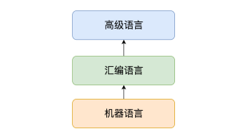


#### 编程语言跨平台 

##### 源代码跨平台 

> 需要在不同的平台上进行源码的编译，例如：在linux上安装软件的时候，进行编译后安装。

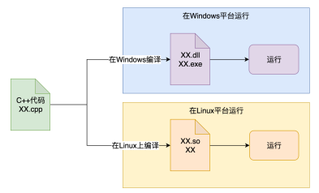

##### 二进制跨平台 

> 一次编译，到处运行。
>
> 由编程语言屏蔽各个操作系统之间的差异。

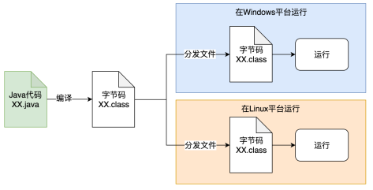


#### Java、C++、Rust 的区别 

C/C++ 完全相信而且惯着程序员，让大家自行管理内存，可以编写很自由的代码，但一不小心就会造成内存泄漏等问题，导致程序崩溃。

Java/Golang 完全不相信程序员，但也惯着程序员。所有的内存生命周期都由 JVM 运行时统一管理。 在绝大部分场景下，你可以非常自由的写代码，而且不用关心内存到底是什么情况。 内存使用有问题的时候，我们可以通过 JVM 来进行信息相关的分析诊断和调整。 这也是本课程的目标。

Rust 语言选择既不相信程序员，也不惯着程序员。 让你在写代码的时候，必须清楚明白的用 Rust 的规则管理好你的变量，好让机器能明白高效地分析和管理内存。 但是这样会导致代码不利于人的理解，写代码很不自由，学习成本也很高。 


#### 字节码、类加载器、虚拟机 

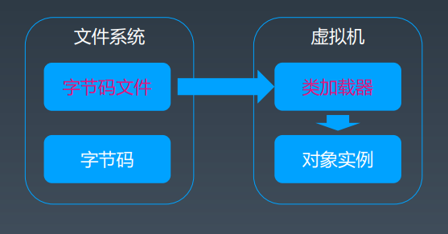


### 2. Java 字节码技术 

#### 什么是字节码？

Java bytecode 由单字节（byte）的指令组成，理论上最多支持 256 个操作（opcode）。实际上 Java 只使用了**200**左右的操作码， 还有一些操作码则保留给调试操作。

根据指令的性质，主要分为四个大类：

1. **栈**操作指令，包括与局部变量交互的指令
2. **程序流程**控制指令
3. **对象**操作指令，包括方法调用指令
4. **算术运算**以及**类型转换**指令 

> 字节码为什么是256为呢？
>
> 反编译之后，可以看到每一个字节码都是两个16进制表示，那么总共可以表示256中字节码。


#### 生成字节码

假如有一个最简单的类，源代码如下： 

```java
package org.copydays.thinking.java.jvm.core.technology;

public class HelloByteCode {
    public static void main(String[] args) {
        HelloByteCode obj = new HelloByteCode();
    }
}

```

进入src目录下之后，进行编译与反编译操作：

- 编译：javac org/copydays/thinking/java/jvm/core/technology/bytecode/HelloByteCode.java
- 查看字节码：javap -c org/copydays/thinking/java/jvm/core/technology/bytecode/HelloByteCode


#### 最简单的字节码

结果如下所示： 

- 本地变量表，load，到栈，进行计算；
- 计算完成，store，到本地变量表，进行存储；
- 只有栈有计算能力

```java
Compiled from "HelloByteCode.java"
public class org.copydays.thinking.java.jvm.core.technology.HelloByteCode {
  public org.copydays.thinking.java.jvm.core.technology.HelloByteCode();
    Code:
       0: aload_0
       1: invokespecial #1                  // Method java/lang/Object."<init>":()V
       4: return

  public static void main(java.lang.String[]);
    Code:
       0: new           #2                  // class org/copydays/thinking/java/jvm/core/technology/bytecode/HelloByteCode
       3: dup
       4: invokespecial #3                  // Method "<init>":()V
       7: astore_1
       8: return
}

```

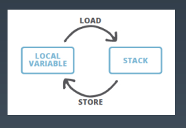


#### 复杂点的例子

进一步：javap -c -verbose org/copydays/thinking/java/jvm/core/technology/bytecode/HelloByteCode

> 使用verbose ，输出附加信息，看到更详细的字节码参数:
>
> major version:52，表示java的版本(使用的事1.8)
>
> flags: ACC_PUBLIC, ACC_SUPER，表示是不是public和非public
>
> Constant pool: ....  表示常量池，使用一个号表示

- 编译结果，参见示例程序：MyJava\thinking-java\jvm-core-technology\src\org\copydays\thinking\java\jvm\core\technology\HelloByteCodeJavaPDetial.java


#### 字节码的运行时结构

JVM 是一台基于栈的计算机器。

每个线程都有一个独属于自己的线程栈（JVM Stack），用于存储栈帧（Frame）。

每一次方法调用，JVM 都会自动创建一个栈帧。

栈帧由操作数栈， 局部变量数组以及一个 Class 引用组成。

Class 引用 指向当前方法在运行时常量池中对应的 Class。 

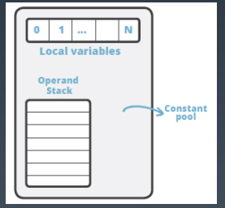


#### 从助记符到二进制 

> 将反编译后的内容，转换为对应的二进制，后续进行jvm指令的调用。

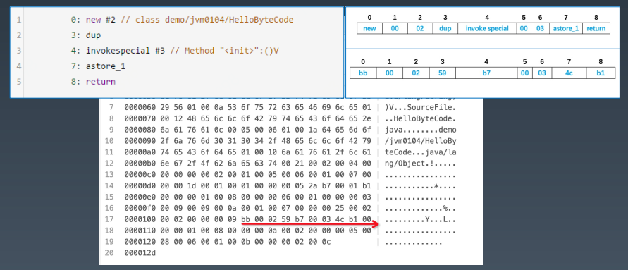


#### 四则运行的例子 

> 出现新的指令，astore_1，istore_2，istore_3，dstore 4，在数字（Slot）比较小的时候，直接下划线写在后面，数字变大之后，就会将数字直接写在后面。
>
> 对于的，数字小是一个字节，数字大之后，就是两个字节。
>
> istore 与 iload 和 astore 与 aload 一样，是匹配的相对操作，进行本地变量表与栈之间的读取和写回操作；
>
> iconst_1，表示的就是一个常量是1，iconst_2，表示的就是一个常量是2；
>
> dstore 4，表示将double类型数据，写回到本地变量表；
>
> I，表示int，D表示double;
>
> i2d，表示i  to d，表示int 转换为 double；

- 编译前程序，参见示例程序：MyJava\thinking-java\jvm-core-technology\src\org\copydays\thinking\java\jvm\core\technology\LocalVariableTest.java


#### 数值处理与本地变量表 

- 反编译后信息，参见示例程序：MyJava\thinking-java\jvm-core-technology\src\org\copydays\thinking\java\jvm\core\technology\LocalVariableTestJavaPDetial.java

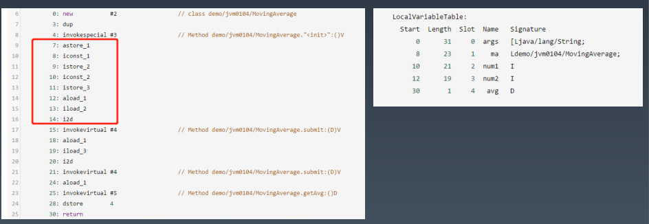


#### 算数操作与类型转换

> 算数操作与类型转换 ，只有四种类型；
>
> 布尔等，都是使用int进行表示，在字节码中，存储的时候使用的是int的32为表示，而不是直接使用一个二进制的位表示布尔类型；
>
> int是32位，lang是64为，在32位CPU中，lang会分两次处理，那么就会出现问题，计算错误，在64为的CPU中计算，直接保证原子性，直接处理64为，不会出错；
>
> 在程序编译的时候，直接预处理将需要类型转换的数据直接转换，使用i2f或者i2d等等，在执行阶段，不需要进行类型转换，直接进行执行就可以。

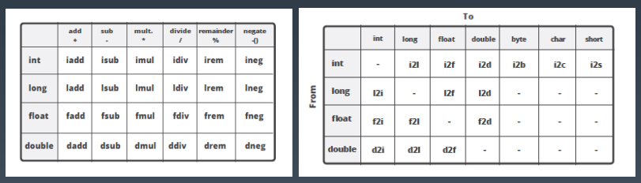


#### 一个完整的循环控制 

> 写循环的时候，可以使用类型推断，直接进行循环，不需要进行i++等，三部曲；
>
> if_icmpge指令，表示进行int类型判断比较，满足则执行跳转；
>
> iinc指令，int类型的指令进行自增加1；
>
> goto指令，将语句跳转回程序的制定位置标号；
>
> 使用上述三个指令，实现程序逻辑的控制；

- 参见示例程序：MyJava\thinking-java\jvm-core-technology\src\org\copydays\thinking\java\jvm\core\technology\ForLoopTest.java


#### 方法调用的指令

方法调用的指令：

- invokestatic，顾名思义，这个指令用于调用某个类的静态方法，这是方法调用指令中最快的一个。
- invokespecial, 用来调用构造函数，但也可以用于调用同一个类中的 private 方法, 以及可见的超类方法。
- invokevirtual，如果是具体类型的目标对象，invokevirtual 用于调用公共，受保护和package 级的私有方法（虚方法，子类直接覆盖父类的方法）。
- invokeinterface，当通过接口引用来调用方法时，将会编译为 invokeinterface 指令。
- invokedynamic，JDK7 新增加的指令，是实现“动态类型语言”（Dynamically TypedLanguage）支持而进行的升级改进，同时也是 JDK8 以后支持 lambda 表达式的实现基础。 


#### 一个动态例子 

> 展示栈与本地变量表，程序计数器的操作；
>
> 对应于复杂点的例子中，程序中，Code： stack=1；locals=1,args_size=1;
>
> 通过字节码文件，可以知道程序执行的时候，创建的栈的大小，本地变量表的大小，参数的大小；
>
> iadd，加法；imul，乘法；

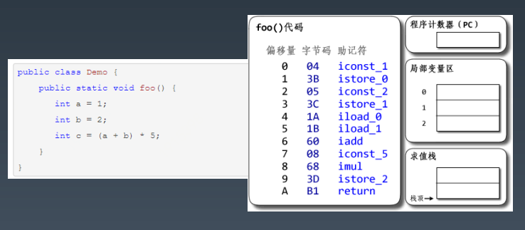


### 3. JVM 类加载器 

#### 类的生命周期

1. 加载（Loading）：找 Class 文件
2. 验证（Verification）：验证格式、依赖
3. 准备（Preparation）：静态字段、方法表
4. 解析（Resolution）：符号解析为引用
5. 初始化（Initialization）：构造器、静态变量赋值、静态代码块
6. 使用（Using）
7. 卸载（Unloading） 

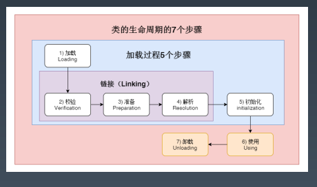


#### 类的加载时机

1. 当虚拟机启动时，初始化用户指定的主类，就是启动执行的 main 方法所在的类；
2. 当遇到用以新建目标类实例的 new 指令时，初始化 new 指令的目标类，就是 new一个类的时候要初始化；
3. 当遇到调用静态方法的指令时，初始化该静态方法所在的类；
4. 当遇到访问静态字段的指令时，初始化该静态字段所在的类；
5. 子类的初始化会触发父类的初始化；
6. 如果一个接口定义了 default 方法，那么直接实现或者间接实现该接口的类的初始化，会触发该接口的初始化；
7. 使用反射 API 对某个类进行反射调用时，初始化这个类，其实跟前面一样，反射调用要么是已经有实例了，要么是静态方法，都需要初始化；
8. 当初次调用 MethodHandle 实例时，初始化该 MethodHandle 指向的方法所在的类（MethodHandle 使用函数的反指针反射机制，进行加载）。 


#### 不会初始化（可能会加载）

1. 通过子类引用父类的静态字段，只会触发父类的初始化，而不会触发子类的初始化。
2. 定义对象数组，不会触发该类的初始化。
3. 常量在编译期间会存入调用类的常量池中，本质上并没有直接引用定义常量的类，不会触发定义常量所在的类。
4. 通过类名获取 Class 对象，不会触发类的初始化，Hello.class 不会让 Hello 类初始化。
5. 通过 Class.forName 加载指定类时，如果指定参数 initialize 为 false 时，也不会触发类初始化，其实这个参数是告诉虚拟机，是否要对类进行初始化。Class.forName（“jvm.Hello”）默认会加载 Hello 类。
6. 通过 ClassLoader 默认的 loadClass 方法，也不会触发初始化动作（加载了，但是不初始化）。 


#### 三类加载器

三类加载器：

1. 启动类加载器（BootstrapClassLoader）
2. 扩展类加载器（ExtClassLoader）
3. 应用类加载器（AppClassLoader）


加载器特点：

1. 双亲委托（类的查找路径，一级一级向父类加载器查找）
2. 负责依赖
3. 缓存加载 

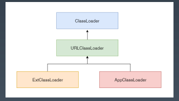


#### 显示当前 ClassLoader 加载了哪些 Jar？ 

> jar包和一个文件是等同的；

- 参见示例程序，MyJava\thinking-java\jvm-core-technology\src\org\copydays\thinking\java\jvm\core\technology\classload\JvmClassLoaderPrintPath.java

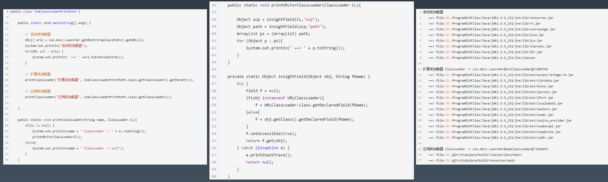


#### 自定义 ClassLoader 

> 使用Base64，进行编码，之后实现代码的加密保存与解密执行；

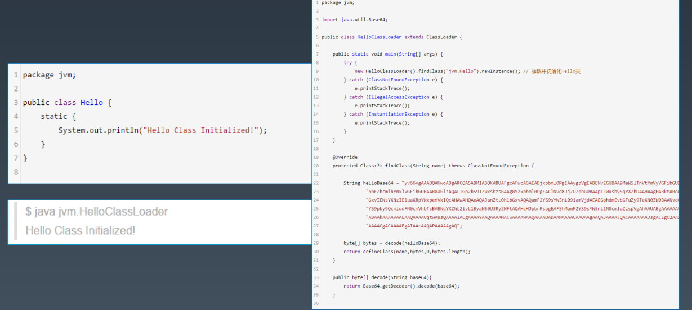


#### 添加引用类的几种方式

1、放到 JDK 的 lib/ext 下，或者-Djava.ext.dirs

2、 java –cp/classpath 或者 class 文件放到当前路径

3、自定义 ClassLoader 加载

4、拿到当前执行类的 ClassLoader，反射调用 addUrl 方法添加 Jar 或路径(JDK9 无效)。 （JDK9 之后，直接new classLoader，加上类的路径即可，更简单了。）

- 参见示例程序，MyJava\thinking-java\jvm-core-technology\src\org\copydays\thinking\java\jvm\core\technology\classload\JvmAppClassLoaderAddURL.java


### 4. JVM 内存模型 

#### JVM 内存结构

每个线程都只能访问自己的线程栈（栈生命周期短，一开始就是知道的）。

每个线程都不能访问（看不见）其他线程的局部变量。

所有原生类型的局部变量都存储在线程栈中，因此对其他线程是不可见的。

线程可以将一个原生变量值的副本传给另一个线程，但不能共享原生局部变量本身。

堆内存中包含了 Java 代码中创建的所有对象，不管是哪个线程创建的。 其中也涵盖了包装类型（例如 Byte，Integer，Long 等）（堆一开始是不知道大小的，会扩容，生命周期长；对象在栈上就是一个int类型的32位指针）。

不管是创建一个对象并将其赋值给局部变量， 还是赋值给另一个对象的成员变量， 创建的对象都会被保存到堆内存中。 

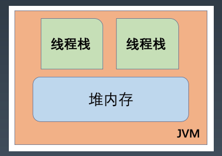


如果是原生数据类型的局部变量，那么它的内容就全部保留在线程栈上。

如果是对象引用，则栈中的局部变量槽位中保存着对象的引用地址，而实际的对象内容保存在堆中（栈中引用对象的额数据一起被多个线程更改之后，就会出现线程安全问题，数据不一致现象，类似于数据库的并发问题）。

对象的成员变量与对象本身一起存储在堆上, 不管成员变量的类型是原生数值，还是对象引用。

类的静态变量则和类定义一样都保存在堆中。 

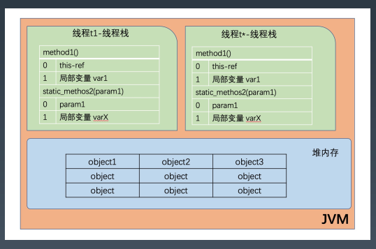


总结一下：方法中使用的原生数据类型和对象引用地址在栈上存储；对象、对象成员与类定义、静态变
量在堆上。

堆内存又称为“共享堆”，堆中的所有对象，可以被所有线程访问, 只要他们能拿到对象的引用地址。

如果一个线程可以访问某个对象时，也就可以访问该对象的成员变量。

如果两个线程同时调用某个对象的同一方法，则它们都可以访问到这个对象的成员变量，但每个线程的局部变量副本是独立的。（此时计算，就会出现数据问题，并发的问题） 

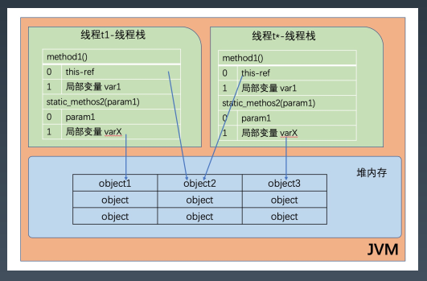


#### JVM 内存整体结构

每启动一个线程，JVM 就会在栈空间栈分配对应的 线程栈, 比如 1MB 的空间（-Xss1m）。

线程栈也叫做 Java 方法栈。 如果使用了JNI 方法，则会分配一个单独的本地方法栈(Native Stack)。

线程执行过程中，一般会有多个方法组成调用栈（Stack Trace）, 比如 A 调用 B，B调用 C。。。每执行到一个方法，就会创建对应的 栈帧（Frame）。 

> Xms 最小堆内存，Xmx最大堆内存，表示堆的内存，是放置对象的内存；
>
> java进程，包含：栈，堆，非堆，JVM自身;
>
> 堆外内存和堆的内存差不多大，一半一半；
>
> Xmx=4GB，实际占用内存会有5个多G，如果分配不合理，就会OOM崩溃；
>
> 操作系统有4G，Xmx配置70%，也就是2.7GB，如果是8G，配置6GB；

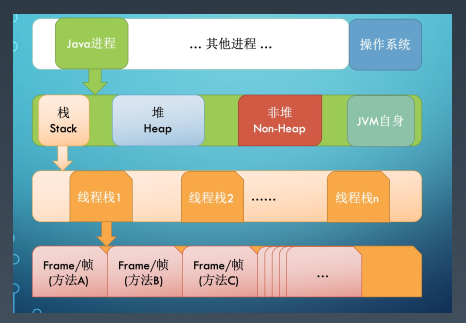


#### JVM 栈内存结构

栈帧是一个逻辑上的概念，具体的大小在一个方法编写完成后基本上就能确定。

比如返回值 需要有一个空间存放吧，每个局部变量都需要对应的地址空间，此外还有给指令使用的 操作数栈，以及 class 指针（标识这个栈帧对应的是哪个类的方法,指向非堆里面的 Class 对象）。 

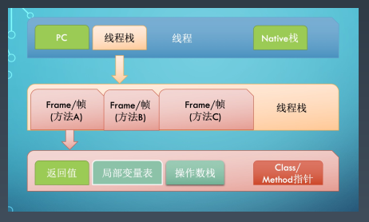


#### JVM 堆内存结构

堆内存是所有线程共用的内存空间，JVM 将Heap 内存分为年轻代（Young generation）和
老年代（Old generation, 也叫 Tenured）两部分(一个对象，创建的时候，就比较大，那么就会直接创建之后，放到老年代)。

年轻代还划分为 3 个内存池，新生代（Eden space）和存活区（Survivor space）, 在大部分GC 算法中有 2 个存活区（S0, S1），在我们可以观察到的任何时刻，S0 和 S1 总有一个是空的,但一般较小，也不浪费多少空间（s0和s1之间的相互复制，解决堆中出现数据空洞的问题）。

Non-Heap 本质上还是 Heap，只是一般不归 GC管理，里面划分为 3 个内存池。

Metaspace, 以前叫持久代（永久代, Permanentgeneration）, Java8 换了个名字叫 Metaspace. 

CCS, Compressed Class Space, 存放 class 信息的，和 Metaspace 有交叉。

Code Cache, 存放 JIT 编译器编译后的本地机器代码。 

注意：

- 新生代 占1/3，老年代 占2/3，新生代：老年代 = 85MB : 170MB
- Eden 区 占8/10，S0 区 占 1/10，S1 区 占 1/10，Eden：S0：S1  = 65MB : 10MB: 10MB
- 使用 jmap -heap pid 查看

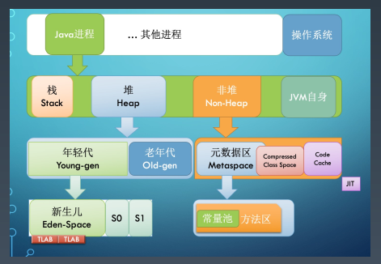


#### CPU 与内存行为

CPU 乱序执行（多核执行，打散指令）

volatile 关键字（可见性）

原子性操作

内存屏障 

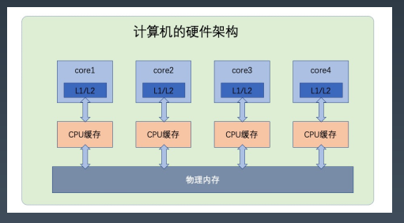


#### 小结：什么是 JMM? 

JMM 规范对应的是“[JSR-133. Java Memory Model and Thread Specification]”，《Java 语言规范》的 [$17.4. Memory Model章节]

JMM 规范明确定义了不同的线程之间，通过哪些方式，在什么时候可以看见其他线程保存到共享变量中的值；以及在必要时，如何对共享变量的访问进行同步。这样的好处是屏蔽各种硬件平台和操作系统之间的内存访问差异，实现了 Java 并发程序真正的跨平台。 

所有的对象(包括内部的实例成员变量)，static 变量，以及数组，都必须存放到堆内存中。

局部变量，方法的形参/入参，异常处理语句的入参不允许在线程之间共享，所以不受内存模型的影响。

多个线程同时对一个变量访问时【读取/写入】，这时候只要有某个线程执行的是写操作，那么这种现象就称之为“冲突”。

可以被其他线程影响或感知的操作，称为线程间的交互行为， 可分为： 读取、写入、同步操作、外部操作等等。 其中同步操作包括：对 volatile 变量的读写，对管程（monitor）的锁定与解锁，线程的起始操作与结尾操作，线程启动和结束等等。 外部操作则是指对线程执行环境之外的操作，比如停止其他线程等等。

JMM 规范的是线程间的交互操作，而不管线程内部对局部变量进行的操作。 


### 5. JVM 启动参数 

#### JVM 启动参数配置方式

> VM options 中添加命令（-Dfile.encoding=UTF-8 Da=1）
>
> java [-options] class [args...]
>            (执行类)
> 或  java [-options] -jar jarfile [args...]
>            (执行 jar 文件)

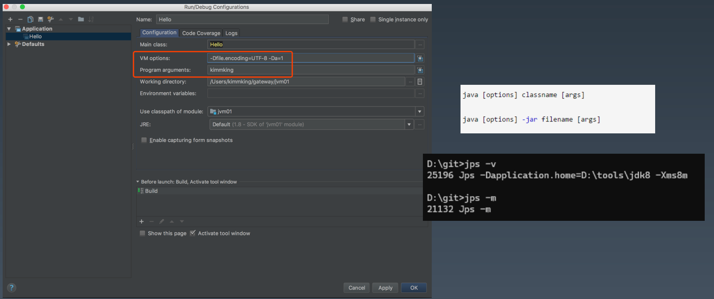


#### JVM 启动参数 

```java
-server
-Dfile.encoding=UTF-8
-Xmx8g
-XX:+UseG1GC
-XX:MaxPermSize=256m
```

以**-**开头为标准参数，所有的 JVM 都要实现这些参数，并且向后兼容。

**-D** 设置系统属性。

以 **-X** 开头为非标准参数， 基本都是传给 JVM 的，默认 JVM 实现这些参数的功能，但是并不保证所有 JVM 实现都满足，且不保证向后兼容。 可以使用 java -X 命令来查看当前 JVM 支持的非标准参数。

以 **–XX**：开头为非稳定参数, 专门用于控制 JVM的行为，跟具体的 JVM 实现有关，随时可能会在下个版本取消。

-XX：+-Flags 形式, +- 是对布尔值进行开关。
-XX：key=value 形式, 指定某个选项的值。 


#### JVM 启动参数作用分类

1. 系统属性参数
2. 运行模式参数
3. 堆内存设置参数
4. GC 设置参数
5. 分析诊断参数
6. JavaAgent 参数 


#### JVM 启动参数--系统属性 

```sh
-Dfile.encoding=UTF-8
-Duser.timezone=GMT+08
-Dmaven.test.skip=true
-Dio.netty.eventLoopThreads=8

System.setProperty("a","A100");
String a=System.getProperty("a");

# Linux上还可以通过: a=A100 java XXX
```

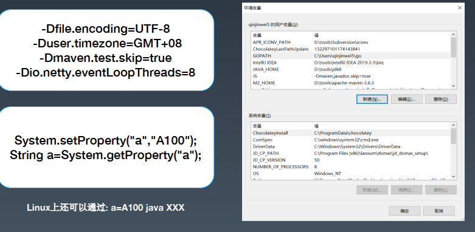


#### JVM 启动参数--运行模式

1. -server：设置 JVM 使用 server 模式，特点是启动速度比较慢，但运行时性能和内存管理效率很高，适用于生产环境。在具有 64 位能力的 JDK 环境下将默认启用该模式，而忽略 -client 参数。
2. -client ：JDK1.7 之前在32位的 x86 机器上的默认值是 -client 选项。设置 JVM 使用 client 模式，特点是启动速度比较快，但运行时性能和内存管理效率不高，通常用于客户端应用程序或者 PC 应用开发和调试。此外，我们知道 JVM 加载字节码后，可以解释执行，也可以编译成本地代码再执行，所以可以配置 JVM 对字节码的处理模式：
3. -Xint：在解释模式（interpreted mode）下运行，-Xint 标记会强制 JVM 解释执行所有的字节码，这当然会降低运行速度，通常低10倍或更多。
4. -Xcomp：-Xcomp 参数与-Xint 正好相反，JVM 在第一次使用时会把所有的字节码编译成本地代码，从而带来最大程度的优化。【注意预热】
5. -Xmixed：-Xmixed 是混合模式，将解释模式和编译模式进行混合使用，有 JVM 自己决定，这是 JVM 的默认模式，也是推荐模式。 我们使用 java -version 可以看到 mixed mode 等信息。 


#### JVM 启动参数--堆内存 

Xmx, 指定最大堆内存。 如 -Xmx4g. 这只是限制了 Heap 部分的最大值为4g。这个内存不包括栈内存，也不包括堆外使用的内存。

-Xms, 指定堆内存空间的初始大小。 如 -Xms4g。 而且指定的内存大小，并不是操作系统实际分配的初始值，而是GC先规划好，用到才分配。 专用服务器上需要保持 –Xms 和 –Xmx 一致，否则应用刚启动可能就有好几个 FullGC。当两者配置不一致时，堆内存扩容可能会导致性能抖动。

-Xmn, 等价于 -XX:NewSize，使用 G1 垃圾收集器 不应该 设置该选项，在其他的某些业务场景下可以设置。官方建议设置为 -Xmx 的 1/2 ~ 1/4.

-XX：MaxPermSize=size, 这是 JDK1.7 之前使用的。Java8 默认允许的Meta空间无限大，此参数无效。

-XX：MaxMetaspaceSize=size, Java8 默认不限制 Meta 空间, 一般不允许设置该选项。

-XX：MaxDirectMemorySize=size，系统可以使用的最大堆外内存，这个参数跟 -Dsun.nio.MaxDirectMemorySize 效果相同。

-Xss, 设置每个线程栈的字节数。 例如 -Xss1m 指定线程栈为 1MB，与-XX:ThreadStackSize=1m 等价 

> 1. 如果什么都不配置会如何？
> 2. Xmx 是否与 Xms 设置相等？
> 3. Xmx 设置为机器内存的什么比例合适？
> 4. 作业：画一下 Xmx、Xms、Xmn、Meta、
> DirectMemory、Xss 这些内存参数的关系 

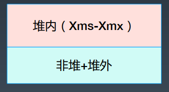


#### JVM 启动参数 -- GC 相关 

-XX：+UseG1GC：使用 G1 垃圾回收器

-XX：+UseConcMarkSweepGC：使用 CMS 垃圾回收器

-XX：+UseSerialGC：使用串行垃圾回收器

-XX：+UseParallelGC：使用并行垃圾回收器  

// Java 11+
-XX：+UnlockExperimentalVMOptions -XX:+UseZGC 

 // Java 12+
 -XX：+UnlockExperimentalVMOptions -XX:+UseShenandoahGC 

> 各个 JVM 版本的默认 GC 是什么？

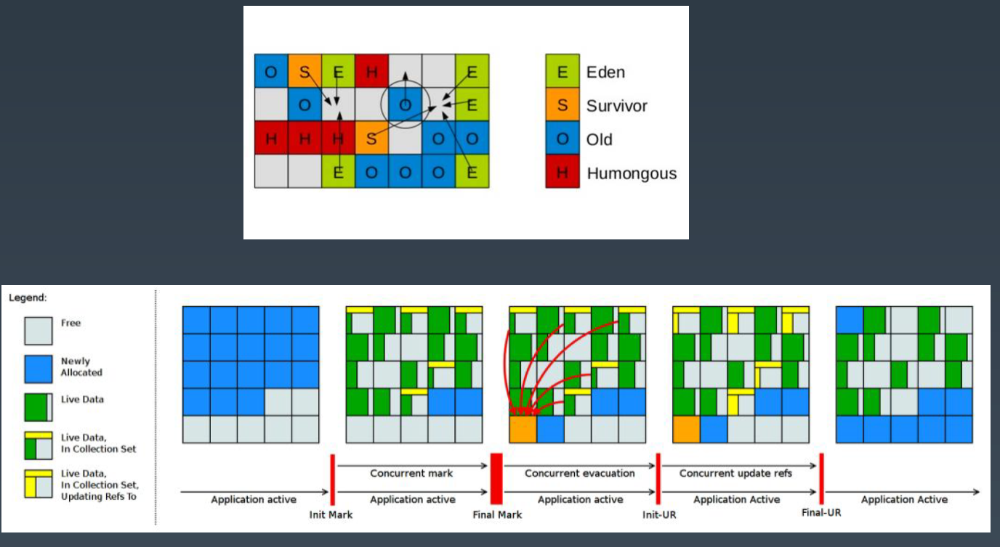


#### JVM 启动参数--分析诊断

-XX：+-HeapDumpOnOutOfMemoryError 选项, 当 OutOfMemoryError 产生，即内存溢出(堆内存或持久代)时，自动 Dump 堆内存。
示例用法： java -XX:+HeapDumpOnOutOfMemoryError -Xmx256m ConsumeHeap

-XX：HeapDumpPath 选项, 与 HeapDumpOnOutOfMemoryError 搭配使用, 指定内存溢出时 Dump 文件的目录。如果没有指定则默认为启动 Java 程序的工作目录。
示例用法： java -XX:+HeapDumpOnOutOfMemoryError -XX:HeapDumpPath=/usr/local/ ConsumeHeap 
自动 Dump 的 hprof 文件会存储到 /usr/local/ 目录下。

-XX：OnError 选项, 发生致命错误时（fatal error）执行的脚本。例如, 写一个脚本来记录出错时间, 执行一些命令, 或者 curl 一下某个在线报警的 url.
示例用法：java -XX:OnError="gdb - %p" MyApp 
可以发现有一个 %p 的格式化字符串，表示进程 PID。

-XX：OnOutOfMemoryError 选项, 抛出 OutOfMemoryError 错误时执行的脚本。

-XX：ErrorFile=filename 选项, 致命错误的日志文件名,绝对路径或者相对路径。

-Xdebug -Xrunjdwp:transport=dt_socket,server=y,suspend=n,address=1506，远程调试 


#### VM 启动参数 --JavaAgent

Agent 是 JVM 中的一项黑科技, 可以通过无侵入方式来做很多事情，比如注入 AOP 代码，执行统计等等，权限非常大。这里简单介绍一下配置选项，详细功能需要专门来讲。

设置 agent 的语法如下:
-agentlib:libname[=options] 启用 native 方式的 agent, 参考 LD_LIBRARY_PATH 路径。
-agentpath:pathname[=options] 启用 native 方式的 agent。
-javaagent:jarpath[=options] 启用外部的 agent 库, 比如 pinpoint.jar 等等。
-Xnoagent 则是禁用所有 agent。

以下示例开启 CPU 使用时间抽样分析:
JAVA_OPTS="-agentlib:hprof=cpu=samples,file=cpu.samples.log" 


### 6.总结回顾与作业实践 

#### 总结回顾

- 字节码技术
- 类加载器
- 内存模型
- 启动参数 


#### 作业实践

1、自己写一个简单的 Hello.java，里面需要涉及基本类型，四则运行，if 和 for，然后自己分析一下对应的字节码，有问题群里讨论。

2、自定义一个 Classloader，加载一个 Hello.xlass 文件，执行 hello 方法，此文件内容是一个 Hello.class 文件所有字节（x=255-x）处理后的文件。文件群里提供。

3、画一张图，展示 Xmx、Xms、Xmn、Meta、DirectMemory、Xss 这些内存参数的关系。

4、检查一下自己维护的业务系统的 JVM 参数配置，用 jstat 和 jstack、jmap 查看一下详情，并且自己独立分析一下大概情况，思考有没有不合理的地方，如何改进。

注意：如果没有线上系统，可以自己 run 一个 web/java 项目。 


## JVM 核心技术--工具与 GC 策略 

### JDK 内置命令行工具 

#### JVM 命令行工具 -基本


| 工具       | 简介                                                         |
| ---------- | ------------------------------------------------------------ |
| java       | Java 应用的启动程序                                          |
| javac      | JDK 内置的编译工具                                           |
| javap      | 反编译 class 文件的工具                                      |
| javadoc    | 根据 Java 代码和标准注释,自动生成相关的API说明文档           |
| javah      | JNI 开发时, 根据 java 代码生成需要的 .h文件。                |
| extcheck   | 检查某个 jar 文件和运行时扩展 jar 有没有版本冲突，很少使用   |
| jdb        | Java Debugger ; 可以调试本地和远端程序, 属于 JPDA 中的一个 demo 实现, 供 其他调试器参考。开发时很少使用 |
| jdeps      | 探测 class 或 jar 包需要的依赖                               |
| jar        | 打包工具，可以将文件和目录打包成为 .jar 文件； .jar 文件本质上就是 zip 文件, 只是后缀不同。使用时按顺序对应好选项和参数即可。 |
| keytool    | 安全证书和密钥的管理工具; （支持生成、导入、导出等操作）     |
| jarsigner  | JAR 文件签名和验证工具                                       |
| policytool | 实际上这是一款图形界面工具, 管理本机的 Java 安全策略         |


#### JVM 命令行工具 -常用

| 工具           | 简介                              |
| -------------- | --------------------------------- |
| jps/jinfo      | 查看 java 进程                    |
| jstat          | 查看 JVM 内部 gc 相关信息         |
| jmap           | 查看 heap 或类占用空间统计        |
| jstack         | 查看线程信息                      |
| jcmd           | 执行 JVM 相关分析命令（整合命令） |
| jrunscript/jjs | 执行 js 命令                      |


#### JVM 命令行工具--jps/jinfo 

- 看单个进程，jvm的配置

- jps

```sh
# 查看java进程信息，但是有的进程只有进程号，内容看不到
C:\Users\rmliu>jps
10580
25460 Launcher
5668 Jps
24604 RemoteMavenServer36

C:\Users\rmliu>jps -help
usage: jps [-help]
       jps [-q] [-mlvV] [<hostid>]

Definitions:
    <hostid>:      <hostname>[:<port>]
```

- jps -mlv

```sh
# 查看更详细的java进程信息
C:\Users\rmliu>jps -mlv
20336 sun.tools.jps.Jps -mlv -Dapplication.home=D:\java1.8 -Xms8m
10580  exit -Xms128m -Xmx2028m -XX:ReservedCodeCacheSize=240m -XX:+UseConcMarkSweepGC -XX:SoftRefLRUPolicyMSPerMB=50 -ea -XX:CICompilerCount=2 ...
24604 org.jetbrains.idea.maven.server.RemoteMavenServer36 ...
```

- jinfo 10680

```sh
# 查看某一个 java 进程的信息，看进程中 JVM 信息，各种系统设置属性，
# 如果没有权限，会挂载不上去
C:\Users\rmliu>jinfo 25460
Attaching to process ID 25460, please wait...
Debugger attached successfully.
Server compiler detected.
JVM version is 25.221-b11
Java System Properties:

java.vendor = Oracle Corporation
...
idea.paths.selector = IdeaIC2019.3
```


#### JVM 命令行工具--jstat

- jstat -options
  - -class 类加载(Class loader)信息统计.
  - -compiler JIT 即时编译器相关的统计信息。
  - **-gc** GC 相关的堆内存信息. 用法: jstat -gc -h 10 -t 864 1s 20
  - -gccapacity 各个内存池分代空间的容量。
  - -gccause 看上次 GC, 本次 GC（如果正在 GC中）的原因, 其他输出和 -gcutil 选项一致。
  - -gcnew 年轻代的统计信息. （ New = Young = Eden + S0 + S1）
  - -gcnewcapacity 年轻代空间大小统计.
  - -gcold 老年代和元数据区的行为统计。
  - -gcoldcapacity old 空间大小统计.
  - -gcmetacapacity meta 区大小统计.
  - **-gcutil** GC 相关区域的使用率（ utilization）统计。
  - -printcompilation 打印 JVM 编译统计信息。 

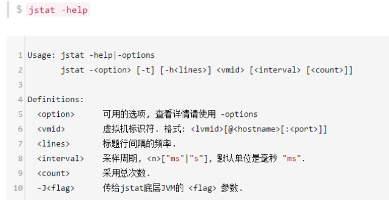


- jstat -gc 25460 1000 1000
- 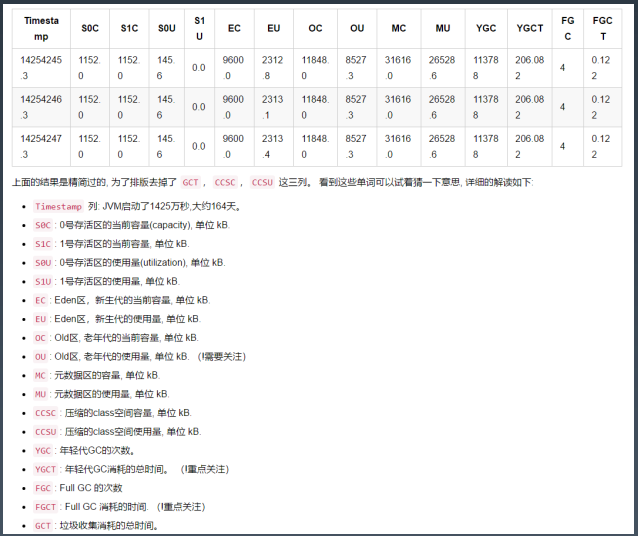

```sh
# java 内存信息
# 按照字节展示
# S0C    S1C  表示两个存活区 S0和S1的容量，两个容量是一样的
# S0U    S1U  表示 S0的使用
# EC 表示 Eden 区容量
# OC 表示 Old 区容量
# MC 表示 元数据区 meta区容量
# CCSC   CCSU 表示压缩 class区，MC     MU    CCSC   CCSU 表示非堆区
#  YGC     YGCT 表示 young GC 的次数和使用时间(s)
# FGC    FGCT 表示 Full GC 的次数和使用时间(s)
# GCT 表示所有的 GC 时间


C:\Users\rmliu>jstat -gc 25460 1000 1000
 S0C    S1C    S0U    S1U      EC       EU        OC         OU       MC     MU    CCSC   CCSU   YGC     YGCT    FGC    FGCT     GCT
10752.0 10752.0  0.0   5044.1 65024.0  18982.8   173568.0     99.1    16640.0 16185.3 2048.0 1876.4      1    0.017   0      0.000    0.017
...
10752.0 10752.0  0.0   5044.1 65024.0  18982.8   173568.0     99.1    16640.0 16185.3 2048.0 1876.4      1    0.017   0      0.000    0.017
```


- jstat -gcutil 25460 1000 1000
- 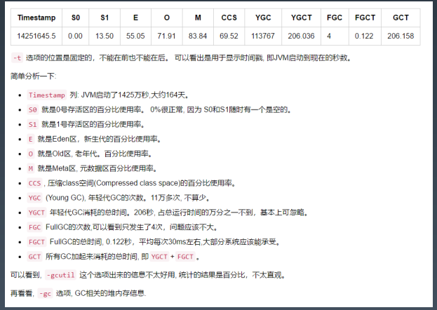

```sh
# 按照百分比展示
# 表示 -gcutil GC 相关区域的使用率（ utilization）统计。

C:\Users\rmliu>jstat -gcutil 25460 1000 1000
  S0     S1     E      O      M     CCS    YGC     YGCT    FGC    FGCT     GCT
  0.00  46.91  29.19   0.06  97.27  91.62      1    0.017     0    0.000    0.017

  0.00  46.91  29.19   0.06  97.27  91.62      1    0.017     0    0.000    0.017
  0.00  46.91  29.19   0.06  97.27  91.62      1    0.017     0    0.000    0.017
```


#### JVM 命令行工具--jmap 

常用选项就 3 个：

- -heap 打印堆内存（ /内存池）的配置和使用信息。
- -histo 看哪些类占用的空间最多, 直方图
- -dump:format=b,file=xxxx.hprof Dump 堆内存。

演示:

- jmap -heap pid
- jmap -histo pid
- jmap -dump:format=b,file=3826.hprof 3826 


- jmap -histo pid

```sh
# java 内存堆信息
# -histo 看哪些类占用的空间最多, 直方图
# B 字节
# I int
# [ 数组
# L 对象
# JVM 的堆，管理了 数十万，数百万的对象示例

C:\Users\rmliu>jmap -histo 17120

 num     #instances         #bytes  class name
----------------------------------------------
   1:         26403       10219528  [B
   2:         46894        6076392  [C
   3:          3015        2987192  [I
   4:         28297         679128  java.lang.String
   5:          6405         565864  [Ljava.lang.Object;
   6:          3676         409752  java.lang.Class
   7:          7240         231680  java.util.concurrent.ConcurrentHashMap$Node
   8:          2072         165296  [S
   9:          1955         109480  java.util.zip.ZipFile$ZipFileInputStream
  10:          6681         106896  java.lang.Object
  ....
  1546:             1             16  sun.util.resources.LocaleData
  1547:             1             16  sun.util.resources.LocaleData$LocaleDataResourceBundleControl
Total        177303       23426792
```

- jmap -heap pid

```sh
# -heap 打印堆内存（ /内存池）的配置和使用信息
# Parallel GC with 6 thread(s)， 并行 GC，使用6个线程
# 堆内存信息
# Young Generation：
    # Eden Space
    # From Space
    # To Space
# Old Generation

C:\Users\rmliu>jmap -heap 17120
Attaching to process ID 17120, please wait...
Debugger attached successfully.
Server compiler detected.
JVM version is 25.221-b11

using thread-local object allocation.
Parallel GC with 6 thread(s)

Heap Configuration:
   MinHeapFreeRatio         = 0
   MaxHeapFreeRatio         = 100
   MaxHeapSize              = 734003200 (700.0MB)
   NewSize                  = 88604672 (84.5MB)
   MaxNewSize               = 244318208 (233.0MB)
   OldSize                  = 177733632 (169.5MB)
   NewRatio                 = 2
   SurvivorRatio            = 8
   MetaspaceSize            = 21807104 (20.796875MB)
   CompressedClassSpaceSize = 1073741824 (1024.0MB)
   MaxMetaspaceSize         = 17592186044415 MB
   G1HeapRegionSize         = 0 (0.0MB)

Heap Usage:
PS Young Generation
Eden Space:
   capacity = 66584576 (63.5MB)
   used     = 18207160 (17.36370086669922MB)
   free     = 48377416 (46.13629913330078MB)
   27.344410813699557% used
From Space:
   capacity = 11010048 (10.5MB)
   used     = 5048528 (4.8146514892578125MB)
   free     = 5961520 (5.6853485107421875MB)
   45.85382370721726% used
To Space:
   capacity = 11010048 (10.5MB)
   used     = 0 (0.0MB)
   free     = 11010048 (10.5MB)
   0.0% used
PS Old Generation
   capacity = 177733632 (169.5MB)
   used     = 171104 (0.163177490234375MB)
   free     = 177562528 (169.33682250976562MB)
   0.0962699057429941% used

5616 interned Strings occupying 497904 bytes.
```


#### JVM 命令行工具--jstack 

-F 强制执行 thread dump. 可在 Java 进程卡死（ hung 住）时使用, 此选项可能需要系统权限。
-m 混合模式(mixed mode),将 Java 帧和 native帧一起输出, 此选项可能需要系统权限。
-l 长列表模式. 将线程相关的 locks 信息一起输出，比如持有的锁，等待的锁。

演示：jstack pid -l 


- jstack -l pid

```sh
# 线程信息
# runnable，waiting...
# 打出锁的信息，看一下是不是死锁
# linux 下可以使用，kill -3 pid，在启动进程的窗口显示堆栈

C:\Users\rmliu>jstack -l 17120
2020-11-19 10:06:56
Full thread dump Java HotSpot(TM) 64-Bit Server VM (25.221-b11 mixed mode):

"DestroyJavaVM" #17 prio=5 os_prio=0 tid=0x00000000047c6000 nid=0x5408 waiting on condition [0x0000000000000000]
   java.lang.Thread.State: RUNNABLE

   Locked ownable synchronizers:
        - None

"JPS event loop" #10 prio=5 os_prio=0 tid=0x0000000018fcc000 nid=0x2b70 runnable [0x000000001957e000]
   java.lang.Thread.State: RUNNABLE
   ...
```


#### JVM 命令行工具--jcmd

Jcmd 综合了前面的几个命令

示例：
jcmd pid VM.version
jcmd pid VM.flags
jcmd pid VM.command_line
jcmd pid VM.system_properties
jcmd pid Thread.print
jcmd pid GC.class_histogram
jcmd pid GC.heap_info 

- jcmd pidhelp

```sh
# 查看当前进程，可以使用查看的 所有命令
# jVM, gc, 线程等命令的整合

C:\Users\rmliu>jcmd 17120 help
17120:
The following commands are available:
JFR.stop
...
VM.dynlibs
VM.flags
VM.system_properties
VM.command_line
VM.version
help

For more information about a specific command use 'help <command>'.
```

- jcmd pid VM.version

```sh
C:\Users\rmliu>jcmd 17120 VM.version
17120:
Java HotSpot(TM) 64-Bit Server VM version 25.221-b11
JDK 8.0_221
```


#### JVM 命令行工具--jrunscript/jjs 

当curl命令用：jrunscript -e "cat('http://www.baidu.com')"
执行js脚本片段：jrunscript -e "print('hello,kk.jvm'+1)"
执行js文件：jrunscript -l js -f /XXX/XXX/test.js 

- jrunscript -e "cat('http://www.baidu.com')"

```sh
# 模拟 curl 命令，访问百度

C:\Users\rmliu>jrunscript -e "cat('http://www.baidu.com')"
<!DOCTYPE html>
<!--STATUS OK--><html> <head><meta http-equiv=content-type content=text/html;charset=utf-8><meta http-equiv=X-UA-Compatible content=IE=Edge><meta content=always n
...
```


- jjs

```sh
# 进行交互的执行命令
# 可以执行算数，函数等
C:\Users\rmliu>jjs
jjs> 11
11
jjs> 12+11
23
jjs> function a(b){return b+1;}
function a(b){return b+1;}
jjs>
jjs> a(2)
3
jjs> exit()
```


###  JDK 内置图形化工具 

#### JVM 图形化工具--jconsole 

- 信息少
- 在命令行输入 jconsole 即可打开 
- 本地 JVM 可以直接选择
- 远程 JVM 可以通过 JMX 方式连接 


##### jconsole -概览

共有 6 个面板

第一个为概览，四项指标具体为：

堆内存使用量：此处展示的就是前面 Java 内存模型课程中提到的堆内存使用情况，从图上可以看到，堆内存使用了 94MB 左右，并且一直在增长。

线程：展示了 JVM 中活动线程的数量，当前时刻共有 17 个活动线程。

类： JVM 一共加载了 5563 个类，没有卸载类。

CPU 占用率：目前 CPU 使用率为 0.2%，这个数值非常低，且最高的时候也不到 3%，初步判断系统当前并没有什么负载和压力。

有如下几个时间维度可供选择：
1分钟、 5分钟、 10分钟、 30分钟、 1小时、 2小时、 3小时、 6小时、12小时、 1天、 7天、 1个月、 3个月、 6个月、 1年、全部，一共是16档。
当我们想关注最近1小时或者1分钟的数据，就可以选择对应的档。旁边的3个标签页(内存、线程、类)，也都支持选择时间范围。 

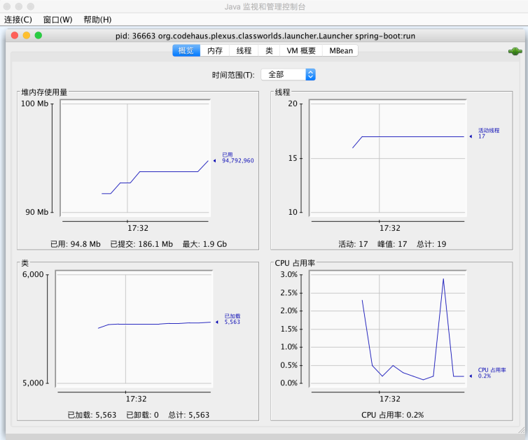


##### jconsole -内存

内存图表包括：
• 堆内存使用量，主要包括老年代（内存池 “PS Old Gen”）、新生代（ “PS Eden Space”）、存活区
（ “PS Survivor Space”）；
• 非堆内存使用量，主要包括内存池“Metaspace”、 “Code Cache”、 “Compressed Class Space”等；

可以分别选择对应的 6 个内存池。

通过内存面板，我们可以看到各个区域的内存使用和变化情况，并且可以：
1.手动执行 gc，见图上的标号1，点击按钮即可执行JDK 中的 System.gc()
2.通过图中右下角标号 2 的界面，可以看到各个内存池的百分比使用率，以及堆/非堆空间的汇总使用情况
3.从左下角标号 3 的界面，可以看到 JVM 使用的垃圾收集器，以及执行垃圾收集的次数，以及相应的时间消耗。 


##### jconsole -线程

线程面板展示了线程数变化信息，以及监测到的线程列表。

我们可以常根据名称直接查看线程的状态（运行还是等待中）和调用栈（正在执行什么操作）。

特别地，我们还可以直接点击“检测死锁”按钮来检测死锁，如果没有死锁则会提示“未检测到死锁”。 

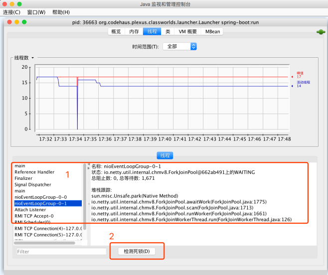

##### jconsole -类

类监控面板，可以直接看到 JVM 加载和卸载的类数量汇总信息，以及随着时间的动态变化。 

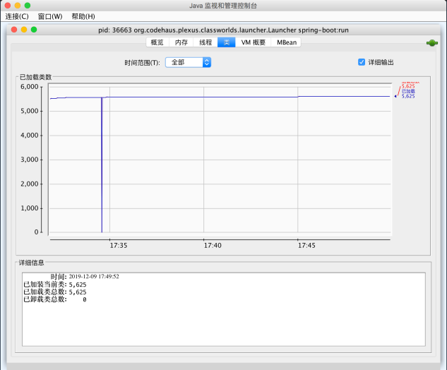

##### jconsole -VM概要

VM 概要的数据有五个部分：
第一部分是虚拟机的信息；
第二部分是线程数量，以及类加载的汇总信息；
第三部分是堆内存和 GC 统计。
第四部分是操作系统和宿主机的设备信息，比如 CPU 数量、物理内存、虚拟内存等等。
第五部分是 JVM 启动参数和几个关键路径，这些信息其实跟 jinfo 命令看到的差不多。 

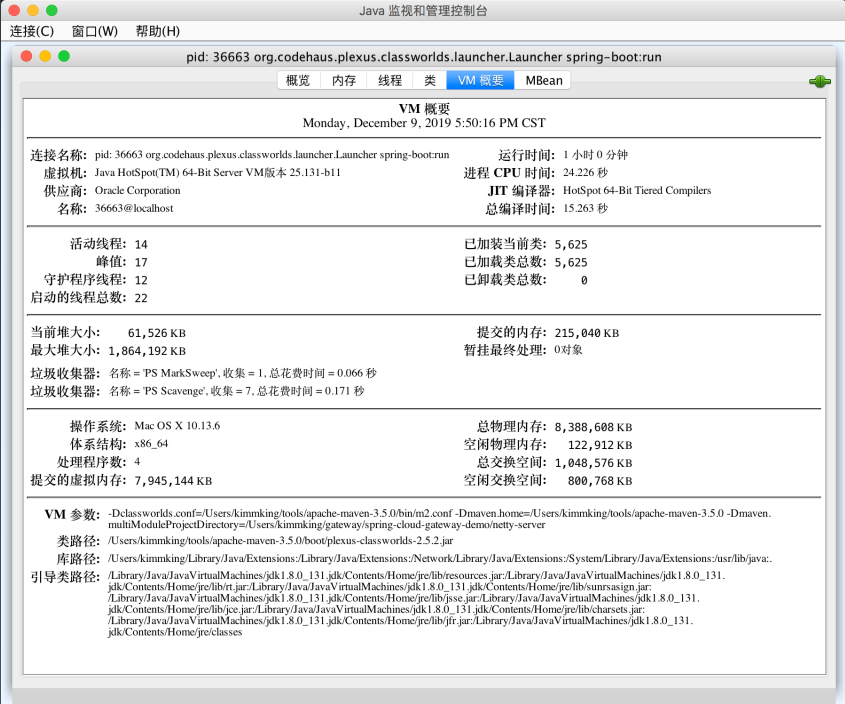


#### JVM 图形化工具--jvisualvm 

- 信息多，更强大
- 在命令行输入  jvisualvm 即可打开 
- 使用抽样器，进行数据的dump，进行后续的操作
- 概述，监控，线程，抽样器，Profiler

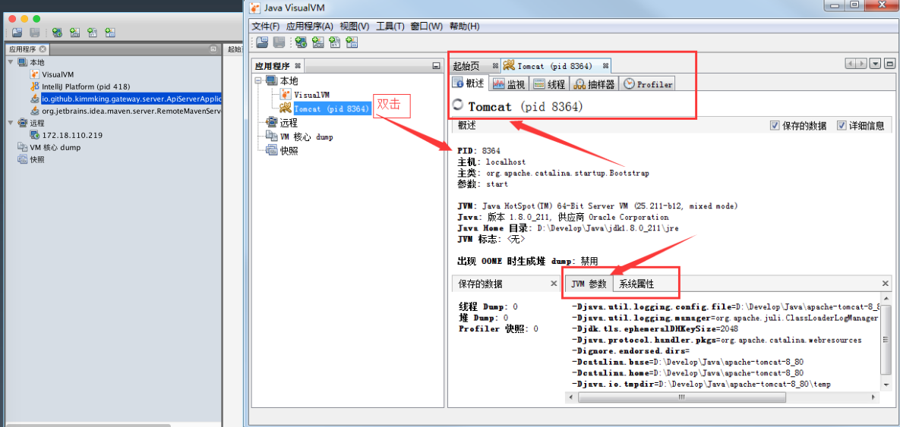

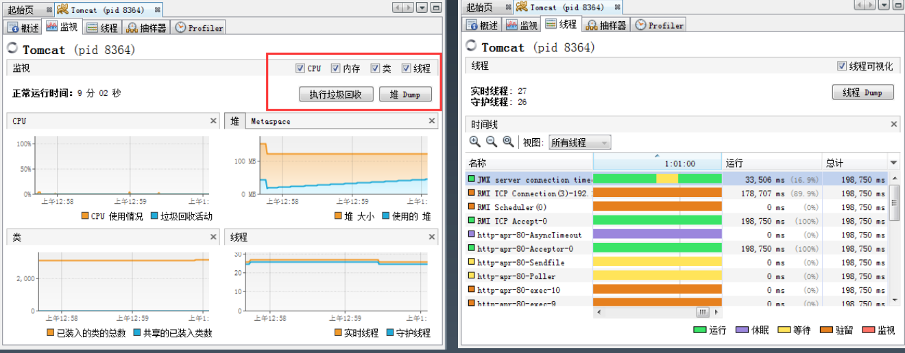

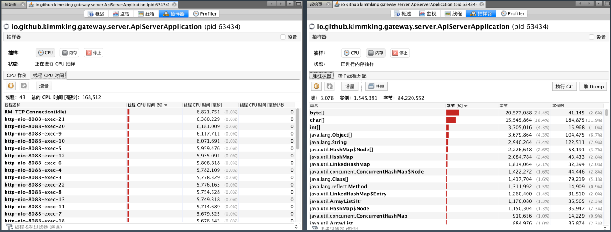

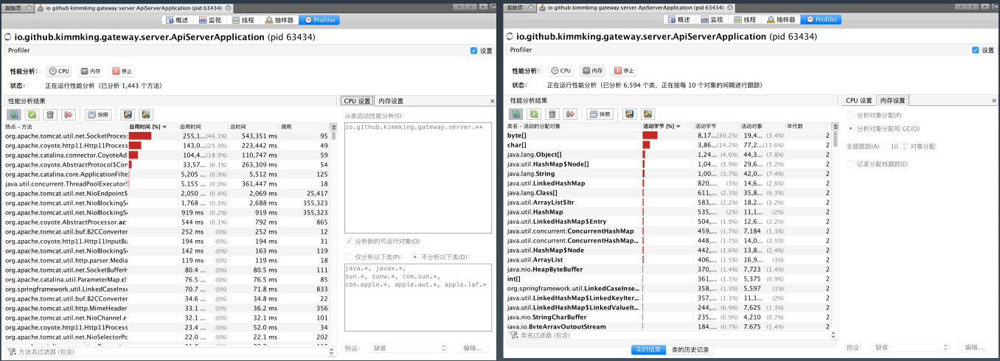


#### JVM 图形化工具--VisualGC 

- 一个插件，idea中安装使用
- 网格化显示，有意思

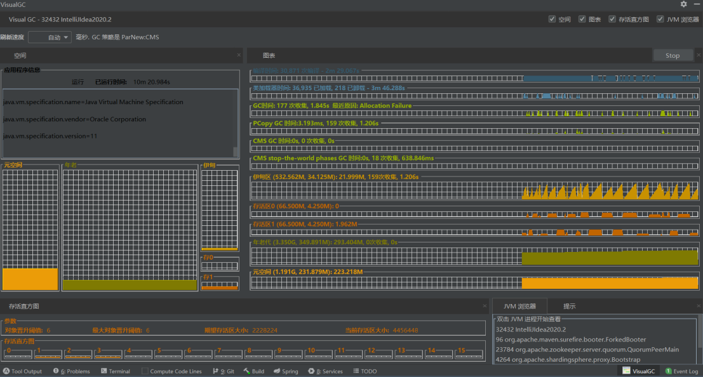


#### JVM 图形化工具--jmc 

- 信息多，更更强大，多用
- 在命令行输入  jmc 即可打开 
- 飞行记录器，保证记录的是动态的
- 一般信息，内存，代码，线程，I/O，系统，事件

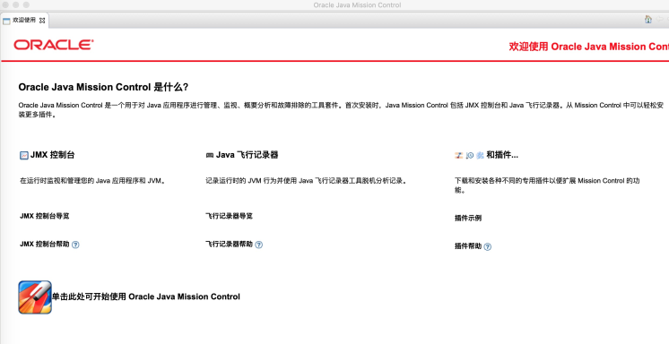

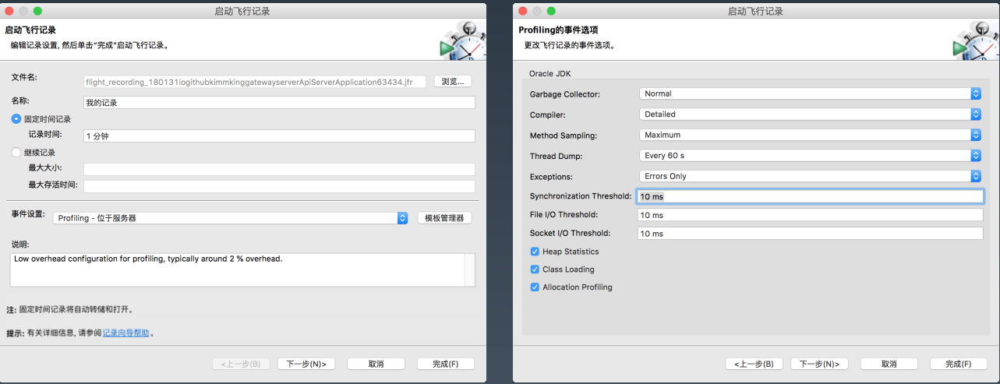


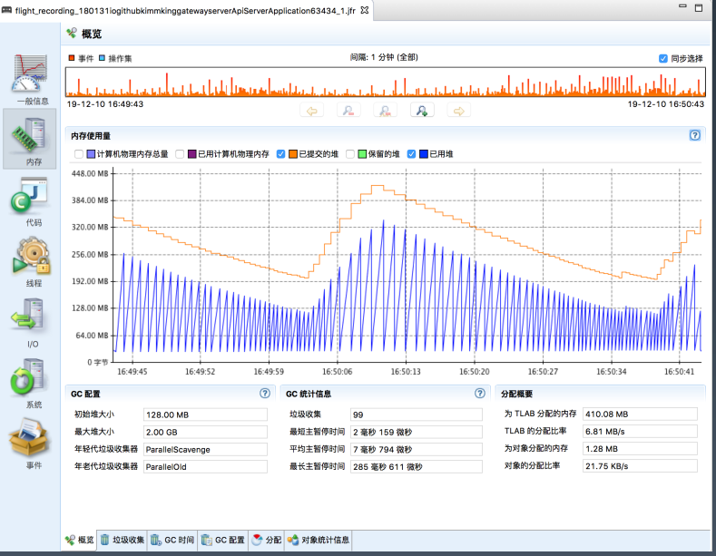

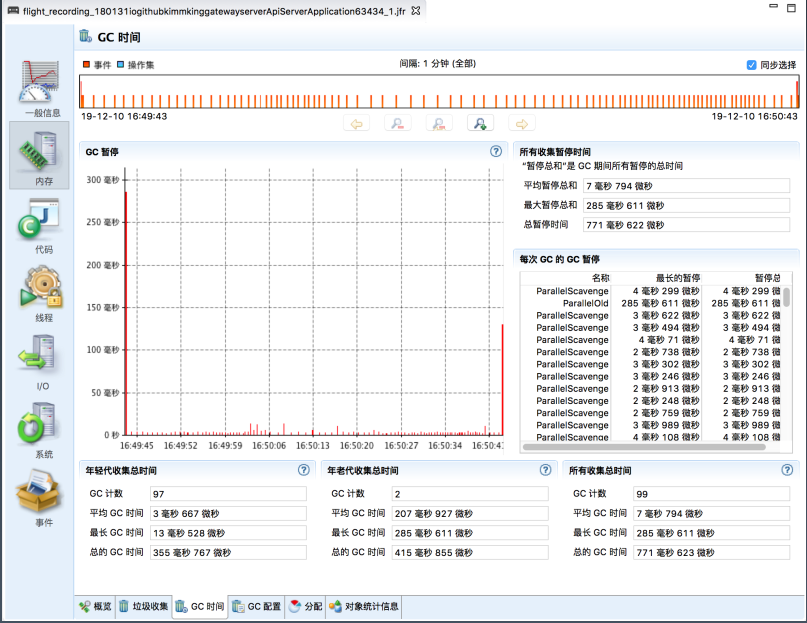

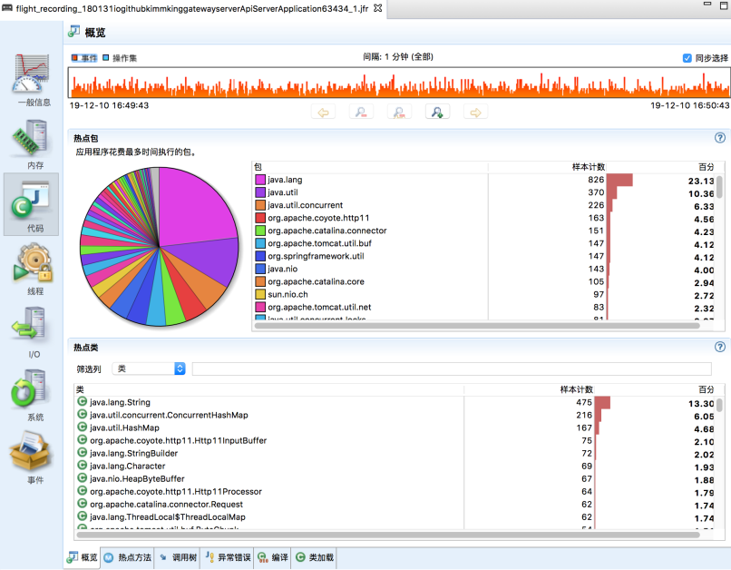

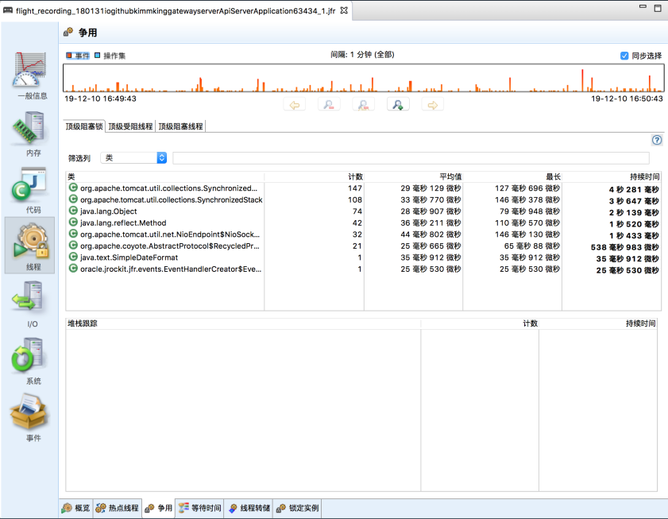


### JVM 工具总结 

- jps/jinfo
- jstat
- jmap
- jstack
- jcmd
- jrunscript/jjs 

- jsonsole
- jvisualvm
- visualGC
- jmc 


### GC 的背景与一般原理 

#### GC 的背景与一般原理 

- 为什么会有 GC
- 本质上是内存资源的有限性
- 因此需要大家共享使用，手工申请，手动释放。
- 下面我们举个例子 


#### 引用计数

- 循环依赖问题
- 内存泄漏->内存溢出

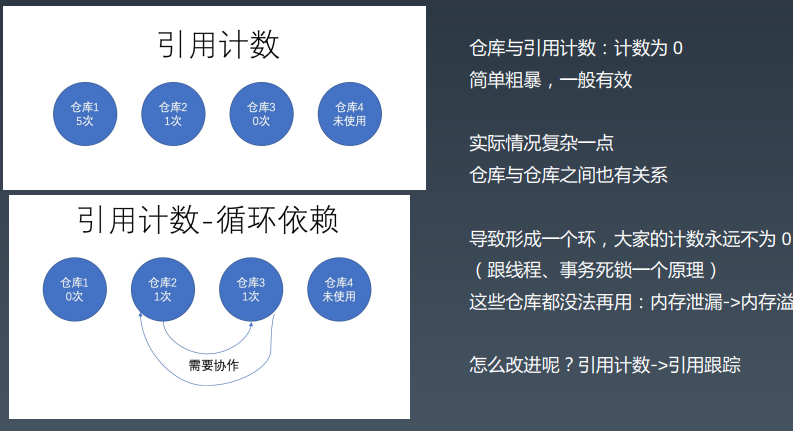


#### 引用跟踪

**标记清除算法（ Mark and Sweep）**

- Marking（ 标记） : 遍历所有的可达对象，并在本地内存(native)中分门别类记下。
- Sweeping（ 清除） : 这一步保证了，不可达对象所占用的内存，在之后进行内存分配时可以重用。 
- +压缩，整理

并行 GC 和 CMS 的基本原理。

优势：可以处理循环依赖，只扫描部分对象

除了清除，还要做压缩。

怎么才能标记和清除清楚上百万对象呢？

答案就是 STW，让全世界停止下来。 （stop the world! 标记照片。）


#### 分代假设

分代假设：大部分新生对象很快无用；存活较长时间的对象，可能存活更长时间。 

JVM 中年轻代默认使用 **15 代**，如果还没有 GC，就直接放到 老年代


内存池划分

不同类型对象不同区域，不同策略处理。 

**TLAB**，是线程分配缓冲区，给每一个线程一部分内存。

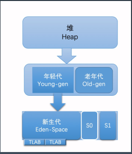


#### 对象在GC中的转移

对象分配在新生代的 Eden 区，标记阶段 Eden 区存活的对象就会**复制**到存活区；

注意：为什么是复制，不是移动？？？大家想想

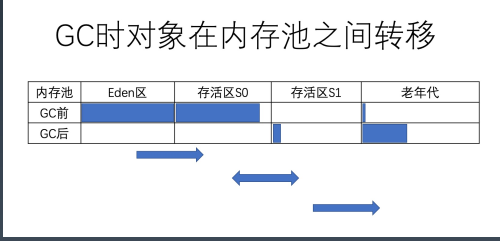

两个存活区 from 和 to，互换角色。对象存活到一定周期会提升到老年代。 

由如下参数控制提升**阈值**：-XX： +MaxTenuringThreshold=15

老年代默认都是存活对象，采用**移动**方式：

- 标记所有通过 GC roots 可达的对象；
- 删除所有不可达对象；
- 整理老年代空间中的内容，方法是将所有的存活对象复制，从老年代空间开始的地方依次存放。

持久代/元数据区

- java 1.8 之前 -XX:MaxPermSize=256m
- java 1.8 之后 -XX:MaxMetaspaceSize=256m ，1.8后Metaspace 放到了非堆的内存中。


#### 可以作为 GC Roots 的对象

**GC Roots** 主要作为标记的根对象使用。

- 当前正在执行的方法里的局部变量和输入参数
- 活动线程（ Active threads）
- 所有类的静态字段（ static field）
- JNI 引用（外部容器，连接内部区）

此阶段暂停的时间，与堆内存大小,对象的总数没有直接关系，而是由存活对象（ alive objects）的数量来决定。所以增加堆内存的大小并不会直接影响标记阶段占用的时间。 

引用关系**跨代**，需要单独的集合，使用 RSet

**Young GC 的 速度快的原因？**
虽然对象几百万个，但是存活的对象少，剩下的全部清除，所以快！快在标记的数量少。

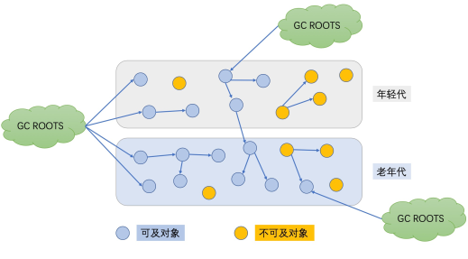


#### 三种算法

- 清除算法
- 复制算法
- 整理算法

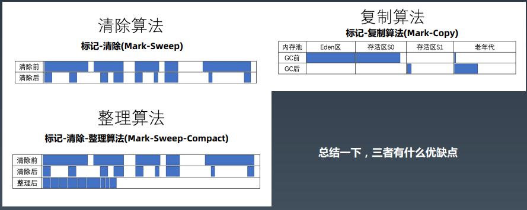


### 串行 GC/并行 GC（ Serial GC/Parallel GC） 

#### 串行 GC（ Serial GC） /ParNewGC 

**-XX： +UseSerialGC** 配置串行 GC

串行 GC 对年轻代使用 mark-copy（标记-复制） 算法，对老年代使用 mark-sweep-compact （标记-清除-整理）算法。

两者都是**单线程**的垃圾收集器，不能进行并行处理，所以都会触发全线暂停（ STW），停止所有的应用线程。

因此这种 GC 算法不能充分利用多核 CPU。不管有多少 CPU 内核， JVM 在垃圾收集时都只能使用单个核心。

CPU 利用率高，暂停时间长。简单粗暴，就像老式的电脑，动不动就卡死。

该选项只适合几百 MB 堆内存的 JVM，而且是单核 CPU 时比较有用。
想想 why？

**-XX： +USeParNewGC** 改进版本的 Serial GC，可以配合 CMS 使用。 


#### 并行 GC（ Parallel GC）

**-XX: +UseParallelGC**
**-XX: +UseParallelOldGC**
**-XX: +UseParallelGC -XX:+UseParallelOldGC**

年轻代和老年代的垃圾回收都会触发 STW 事件。
在年轻代使用 标记-复制（ mark-copy）算法，在老年代使用 标记-清除-整理（ mark-sweepcompact）算法。
-XX： ParallelGCThreads=N 来指定 GC 线程数， 其**默认值为 CPU 核心数**。

并行垃圾收集器适用于多核服务器，主要目标是增加**吞吐量**。因为对系统资源的有效使用，能达到更高的吞吐量:

- 在 GC 期间，所有 CPU 内核都在并行清理垃圾，所以总暂停时间更短；
- 在两次 GC 周期的间隔期，没有 GC 线程在运行，不会消耗任何系统资源。 


#### 演示：并行 GC，常用参数以及其内存分配 

- java -jar -XX: +UseParallelGC -XX:+UseParallelOldGC target/xxx.jar
- jmap -heap 13664

结果：

- MaxHeapSize 大小为 物理内存的 1/4
- NewSize 大小文 物理内存的 1/64
- MaxNewSize 只在并行GC中有效

java 8 的 默认GC是什么？8之前的默认GC是什么？ 都是 并行GC。

java 9 的 默认GC是什么？9之后的默认GC是什么？都是G1。


### CMS GC/G1 GC 

#### CMS GC（ Mostly Concurrent Mark and Sweep Garbage Collector）

-XX: +UseConcMarkSweepGC
其对年轻代采用**并行** STW 方式的 mark-copy (标记-复制)算法，对老年代主要使用**并发** mark-sweep (标记-清除)算法。

CMS GC 的设计目标是避免在老年代垃圾收集时出现长时间的卡顿，主要通过两种手段来达成此目标：

1. 不对老年代进行整理，而是使用**空闲列表（ free-lists）** 来管理内存空间的回收。
2. 在 mark-and-sweep （ 标记-清除） 阶段的大部分工作和应用线程一起并发执行。

也就是说，在这些阶段并没有明显的应用线程暂停。但值得注意的是，它仍然和应用线程争抢CPU 时间。默认情况下， CMS 使用的并发线程数等于 **CPU 核心数的 1/4**。

如果服务器是多核 CPU，并且主要调优目标是降低 GC 停顿导致的系统延迟，那么使用 CMS 是个很明智的选择。进行老年代的并发回收时，可能会伴随着多次年轻代的 minor GC。

思考：并行 Parallel 与并发 Concurrent 的区别？ 
（并发，表示处理的时候业务线程还在工作。并行，表示处理的时候业务线程不工作。）


#### CMS GC 的处理步骤

#####  1（ STW） -Initial Mark（ 初始标记） 

阶段 1: Initial Mark（ 初始标记） 

这个阶段伴随着 STW 暂停。初始标记的目标是标记所有的根对象，包括根对象直接引用的对象，以及被年轻代中所有存活对象所引用的对象（老年代单独回收）。 

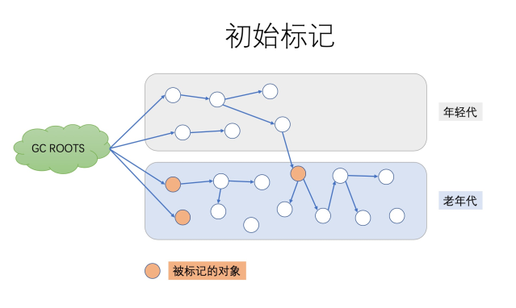


#####  2- Concurrent Mark（ 并发标记） 

阶段 2: Concurrent Mark（ 并发标记） 

在此阶段， CMS GC 遍历老年代，标记所有的存活对象，从前一阶段 “Initial Mark” 找到的根对象开始算起。 “并发标记”阶段，就是与应用程序同时运行，不用暂停的阶段。 

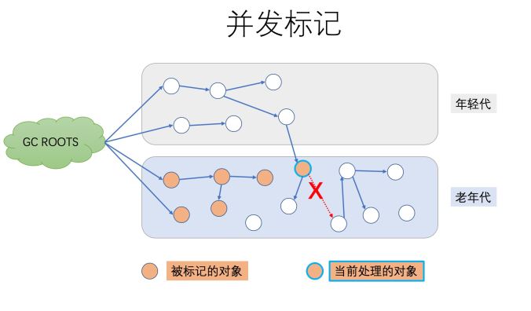


##### 3（ STW） -Concurrent Preclean（ 并发预清理）

阶段 3: Concurrent Preclean（ 并发预清理） 

此阶段同样是与应用线程并发执行的，不需要停止应用线程。 因为前一阶段【并发标记】与程序并发运行，可能有一些引用关系已经发生了改变。如果在并发标记过程中引用关系发生了变化， JVM 会通过“Card（卡片） ”的方式将发生了改变的区域标记为“脏”区，这就是所谓的 卡片标记（ Card Marking）。 

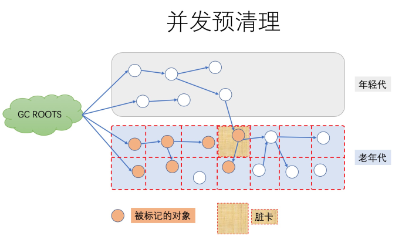


#####  4- Final Remark（ 最终标记） 

阶段 4: Final Remark（ 最终标记） 

最终标记阶段是此次 GC 事件中的第二次（也是最后一次） STW 停顿。本阶段的目标是完成老年代中所有存活对象的标记. 因为之前的预清理阶段是并发执行的，有可能 GC 线程跟不上应用程序的修改速度。所以需要一次STW 暂停来处理各种复杂的情况。

通常 CMS 会尝试在年轻代尽可能空的情况下执行 FinalRemark 阶段，以免连续触发多次 STW 事件。 

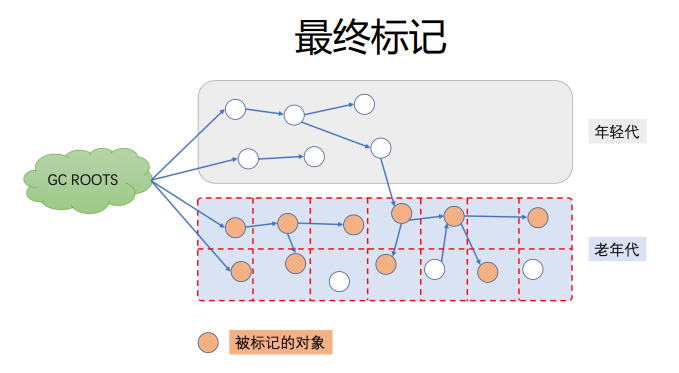


#####  5-Concurrent Sweep（ 并发清除） 

阶段 5: Concurrent Sweep（ 并发清除） 

此阶段与应用程序并发执行，不需要 STW 停顿。 JVM 在此阶段删除不再使用的对象，并回收他们占用的内存空间。 

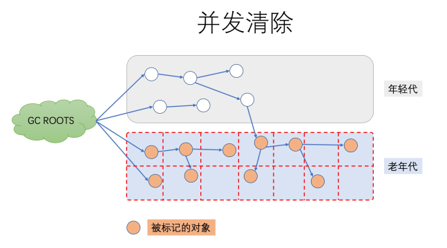


#####  6- Concurrent Reset（ 并发重置）

阶段 6: Concurrent Reset（ 并发重置） 

此阶段与应用程序并发执行，重置 CMS 算法相关的内部数据，为下一次 GC 循环做准备。 

CMS 垃圾收集器在减少停顿时间上做了很多复杂而有用的工作，用于垃圾回收的并发线程执行的同时，并不需要暂停应用线程。 当然，CMS 也有一些缺点，其中最大的问题就是老年代内存碎片问题（因为不压缩），在某些情况下 GC 会造成不可预测的暂停时间，特别是堆内存较大的情况下。 


#### 演示： CMS GC，常用参数以及其内存分配

（注意跟 ParallelGC 有什么差异） 

提醒：

- 使用java 11，ZGC 在 Mac 上是不能使用的，没有Mac的版本，只有其他的linux版本，才可以使用ZGC
- 使用 jdk 15, 才可以用起来ZGC

演示：

- java -jar -xx: +UseConcMarkSweepGC target/xxx.jar
- jmap -heap 13664
- MaxNewSize ，是 64 * 4*13 /10 = 332.8。（4是CPU的核心数，不同核心不同）
- 其他都和并行GC一样


#### G1 GC 

G1 的全称是 Garbage-First，意为垃圾优先，哪一块的垃圾最多就优先清理它。

G1 GC 最主要的设计目标是：将 STW 停顿的时间和分布，变成可预期且可配置的。

事实上， G1 GC 是一款软**实时**垃圾收集器，可以为其设置某项特定的性能指标。为了达成可预期停顿
时间的指标， G1 GC 有一些独特的实现。

-XX: +UseG1GC -XX:MaxGCPauseMillis=50 

(MaxGCPauseMillis默认值是200)

首先，堆不再分成年轻代和老年代，而是划分为多个（通常是 **2048 个**）可以存放对象的 小块堆区域
(smaller heap regions)。每个小块，可能一会被定义成 Eden 区，一会被指定为 Survivor区或者Old 区。在逻辑上，所有的 Eden 区和 Survivor区合起来就是年轻代，所有的 Old 区拼在一起那就是老年代

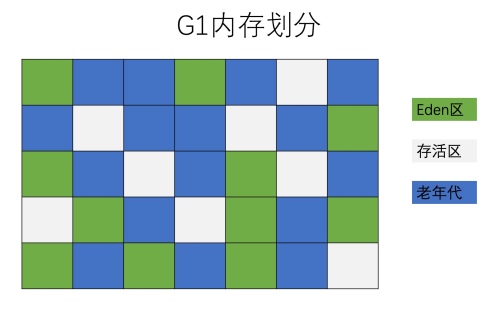

这样划分之后，使得 G1 不必每次都去收集整个堆空间，而是以增量的方式来进行处理: 每次只处理一部分内存块，称为此次 **GC 的回收集(collection set)**。每次 GC 暂停都会收集所有年轻代的内存块，但一般只包含部分老年代的内存块。

G1 的另一项创新是，在并发阶段估算每个小堆块存活对象的总数。构建回收集的原则是：垃圾最多的小块会被优先收集。这也是 G1 名称的由来。 

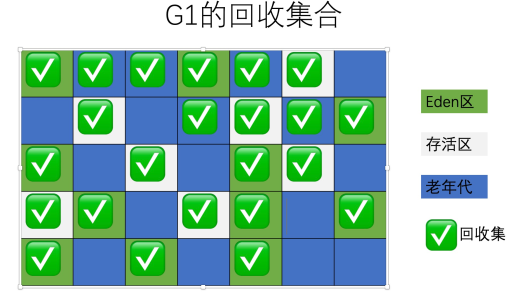

对于G1而言的大对象，默认2048个 region，1MB，当大于512KB对象，一个对象600KB，放在一个 region中，此时就会有1MB- 600KB的浪费。

放大对象的 region就一定会有 内存碎片。


#### G1 GC--配置参数

-XX： +UseG1GC：启用 G1 GC；

**-XX： G1NewSizePercent**：初始年轻代占整个 Java Heap 的大小，默认值为 5%；

**-XX： G1MaxNewSizePercent**：最大年轻代占整个 Java Heap 的大小，默认值为 60%；

**-XX： G1HeapRegionSize**：设置每个 Region 的大小，单位 MB，需要为 1， 2， 4， 8， 16， 32 中的某个值，默认是堆内存的 1/2000。如果这个值设置比较大，那么大对象就可以进入 Region 了。

-XX： ConcGCThreads：与 Java 应用一起执行的 GC 线程数量，默认是 Java 线程的 **1/4**，减少这个参数的数值可能会提升并行回收的效率，提高系统内部吞吐量。如果这个数值过低，参与回收垃圾的线程不足，也会导致并行回收机制耗时加长。

**-XX： +InitiatingHeapOccupancyPercent**（简称 IHOP）： G1 内部并行回收循环启动的阈值，默认为 Java Heap的 45%。这个可以理解为老年代使用大于等于 **45%** 的时候， JVM 会启动垃圾回收。这个值非常重要，它决定了在什么时间启动老年代的并行回收。

**-XX： G1HeapWastePercent**： G1停止回收的最小内存大小，默认是堆大小的 5%。 GC 会收集所有的 Region 中的对象，但是如果下降到了 5%，就会停下来不再收集了。就是说，不必每次回收就把所有的垃圾都处理完，可以遗留少量的下次处理，这样也降低了单次消耗的时间。

-XX： G1MixedGCCountTarget：设置并行循环之后需要有多少个混合 GC 启动，默认值是 8 个。老年代 Regions的回收时间通常比年轻代的收集时间要长一些。所以如果混合收集器比较多，可以允许 G1 延长老年代的收集时间。 

-XX： +G1PrintRegionLivenessInfo：这个参数需要和 -XX:+UnlockDiagnosticVMOptions 配合启动，打印 JVM 的调试信息，每个 Region 里的对象存活信息。

-XX： G1ReservePercent： G1 为了保留一些空间用于年代之间的提升，默认值是堆空间的 10%。因为大量执行回收的地方在年轻代（存活时间较短），所以如果你的应用里面有比较大的堆内存空间、比较多的大对象存活，这里需要保留一些内存。

-XX： +G1SummarizeRSetStats：这也是一个 VM 的调试信息。如果启用，会在 VM 退出的时候打印出 Rsets 的详细总结信息。如果启用 -XX:G1SummaryRSetStatsPeriod 参数，就会阶段性地打印 Rsets 信息。

-XX： +G1TraceConcRefinement：这个也是一个 VM 的调试信息，如果启用，并行回收阶段的日志就会被详细打印出来。

**-XX： +GCTimeRatio**：这个参数就是计算花在 Java 应用线程上和花在 GC 线程上的时间比率，默认是 9，跟新生代内存的分配比例一致。这个参数主要的目的是让用户可以控制花在应用上的时间， G1 的计算公式是 100/（ 1+GCTimeRatio）。这样如果参数设置为 9，则最多 10% 的时间会花在 GC 工作上面。 Parallel GC 的默认值是 99，表示 1% 的时间被用在 GC 上面，这是因为 Parallel GC 贯穿整个 GC，而 G1 则根据 Region 来进行划分，不需要全局性扫描整个内存堆。

-XX： +UseStringDeduplication：手动开启 Java String 对象的去重工作，这个是 JDK8u20 版本之后新增的参数，主要用于相同 String 避免重复申请内存，节约 Region 的使用。

**-XX： MaxGCPauseMills**：预期 G1 每次执行 GC 操作的暂停时间，单位是毫秒，默认值是 200 毫秒， G1 会尽量保证控制在这个范围内。 


#### G1 GC 的处理步骤 

##### 1、 年轻代模式转移暂停（ Evacuation Pause）

G1 GC 会通过前面一段时间的运行情况来不断的调整自己的回收策略和行为，以此来比较稳定地控制暂停时间。在应用程序刚启动时， G1 还没有采集到什么足够的信息，这时候就处于初始的 fullyyoung 模式。当年轻代空间用满后，应用线程会被暂停，年轻代内存块中的存活对象被拷贝到存活区。如果还没有存活区，则任意选择一部分空闲的内存块作为存活区。

拷贝的过程称为转移（ Evacuation)，这和前面介绍的其他年轻代收集器是一样的工作原理。 


##### 2、 并发标记（ Concurrent Marking）

同时我们也可以看到， G1 GC 的很多概念建立在 CMS 的基础上，所以下面的内容需要对 CMS 有一定的理解。

G1 并发标记的过程与 CMS 基本上是一样的。 G1 的并发标记通过 Snapshot-At-The-Beginning（ 起始快照） 的方式，在标记阶段开始时记下所有的存活对象。即使在标记的同时又有一些变成了垃圾。通过对象的存活信息，可以构建出每个小堆块的存活状态，以便回收集能高效地进行选择。

这些信息在接下来的阶段会用来执行老年代区域的垃圾收集。

有两种情况是可以完全并发执行的：
一、如果在标记阶段确定某个小堆块中没有存活对象，只包含垃圾；
二、在 STW 转移暂停期间，同时包含垃圾和存活对象的老年代小堆块。

当堆内存的总体使用比例达到一定数值，就会触发并发标记。这个默认比例是 45%，但也可以通过 JVM参数 InitiatingHeapOccupancyPercent 来设置。和 CMS 一样， G1 的并发标记也是由多个阶段组成，其中一些阶段是完全并发的，还有一些阶段则会暂停应用线程。 


阶段 1: Initial Mark（ 初始标记）
此阶段标记所有从 GC 根对象直接可达的对象。

阶段 2: Root Region Scan（ Root区扫描）
此阶段标记所有从 "根区域" 可达的存活对象。根区域包括：非空的区域，以及在标记过程中不得不收集的区域。

阶段 3: Concurrent Mark（ 并发标记）
此阶段和 CMS 的并发标记阶段非常类似：只遍历对象图，并在一个特殊的位图中标记能访问到的对象。

阶段 4: Remark（ 再次标记）
和 CMS 类似，这是一次 STW 停顿(因为不是并发的阶段)，以完成标记过程。 G1 收集器会短暂地停止应用线程，停止并发更新信息的写入，处理其中的少量信息，并标记所有在并发标记开始时未被标记的存活对象。

阶段 5: Cleanup（ 清理）
最后这个清理阶段为即将到来的转移阶段做准备，统计小堆块中所有存活的对象，并将小堆块进行排序，以提升GC 的效率，维护并发标记的内部状态。 所有不包含存活对象的小堆块在此阶段都被回收了。有一部分任务是并发的：例如空堆区的回收，还有大部分的存活率计算。此阶段也需要一个短暂的 STW 暂停。 


##### 3、 转移暂停: 混合模式（ Evacuation Pause (mixed)）

并发标记完成之后， G1将执行一次混合收集（ mixed collection），就是不只清理年轻代，还将一部分老年代区域也加入到 回收集 中。混合模式的转移暂停不一定紧跟并发标记阶段。有很多规则和历史数据会影响混合模式的启动时机。比如，假若在老年代中可以并发地腾出很多的小堆块，就没有必要启动混合模式。

因此，在并发标记与混合转移暂停之间，很可能会存在多次 young 模式的转移暂停。

具体添加到回收集的老年代小堆块的大小及顺序，也是基于许多规则来判定的。其中包括指定的软实时性能指标，存活性，以及在并发标记期间收集的 GC 效率等数据，外加一些可配置的 JVM 选项。混合收集的过程，很大程度上和前面的 fully-young gc 是一样的。 


#### G1 GC 的注意事项

特别需要注意的是， 某些情况下 G1 触发了 Full GC，这时 G1 会**退化**使用 Serial 收集器来完成垃圾的清理工作，它仅仅使用单线程来完成 GC 工作， GC 暂停时间将达到秒级别的。

1.并发模式失败
G1 启动标记周期，但在 Mix GC 之前，老年代就被填满，这时候 G1 会放弃标记周期。解决办法：增加堆大小，或者调整周期（例如增加线程数-XX： ConcGCThreads 等）。

2.晋升失败
没有足够的内存供存活对象或晋升对象使用，由此触发了 Full GC(to-space exhausted/to-space overflow）。
解决办法：
a) 增加 –XX： G1ReservePercent 选项的值（并相应增加总的堆大小）增加预留内存量。
b) 通过减少 –XX： InitiatingHeapOccupancyPercent 提前启动标记周期。
c) 也可以通过增加 –XX： ConcGCThreads 选项的值来**增加并行标记线程的数目**。

3.巨型对象分配失败
当巨型对象找不到合适的空间进行分配时，就会启动 Full GC，来释放空间。解决办法：增加内存或者增大 -XX： G1HeapRegionSize 


#### 演示： G1 GC，常用参数以及其内存分配

（注意跟 CMS/ParallelGC 有什么差异） 

- java -jar -XX: +UseG1GC -XX:MaxGCPauseMillis=50 
- gmap -heap pid


### GC 对比与组合选择

#### 各个 GC 对比 

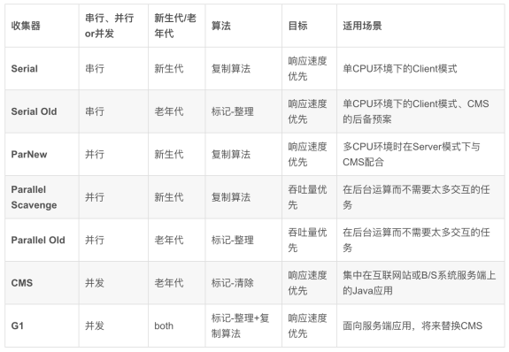


#### 常用的 GC 组合（重点） 

常用的组合为：
（ 1） Serial+Serial Old 实现单线程的低延迟垃圾回收机制；
（ 2） ParNew+CMS，实现多线程的低延迟垃圾回收机制；
（ 3） Parallel Scavenge和ParallelScavenge Old，实现多线程的高吞吐量垃圾回收机制； 

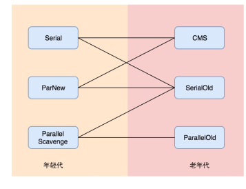


#### GC 如何选择 

选择正确的 GC 算法，唯一可行的方式就是去尝试，一般性的指导原则：
1. 如果系统考虑吞吐优先， CPU 资源都用来最大程度处理业务，用 Parallel GC；
2. 如果系统考虑低延迟有限，每次 GC 时间尽量短，用 CMS GC；
3. 如果系统内存堆较大，同时希望整体来看平均 GC 时间可控，使用 G1 GC。

对于内存大小的考量：

1. 一般 4G 以上，算是比较大，用 G1 的性价比较高。
2. 一般超过 8G，比如 16G-64G 内存，非常推荐使用 G1 GC。

最后讨论一个很多开发者经常忽视的问题，也是面试大厂常问的问题： JDK8 的默认 GC 是什么？
JDK9， JDK10， JDK11…等等默认的是 GC 是什么？ 


### ZGC/Shenandoah GC 

#### ZGC 介绍 

-XX： +UnlockExperimentalVMOptions -XX:+UseZGC -Xmx16g

ZGC 最主要的特点包括:

1. GC 最大停顿时间不超过 10ms
2. 堆内存支持范围广，小至几百 MB 的堆空间，大至 4TB 的超大堆内存（ JDK13 升至 16TB）
3. 与 G1 相比，应用吞吐量下降不超过 15%
4. 当前只支持 Linux/x64 位平台， JDK15 后支持 MacOS 和Windows 系统 

技术点：

- 着色(状态)指针
- 读屏障（挪老对象的时候，放一个新对象的引用，访问对象的时候，从老对象导到新的对象）


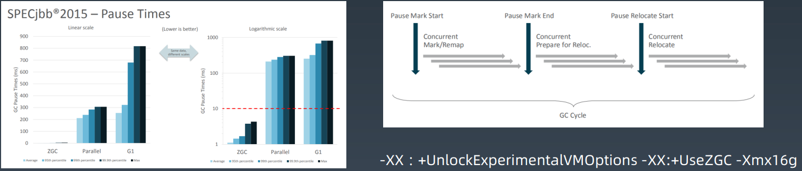


#### ShennandoahGC 介绍

-XX： +UnlockExperimentalVMOptions -XX:+UseShenandoahGC -Xmx16g

Shenandoah GC 立项比 ZGC 更早，设计为GC 线程与应用线程并发执行的方式，通过实现垃圾回收过程的并发处理，改善停顿时间，使得 GC 执行线程能够在业务处理线程运行过程中进行堆压缩、标记和整理，从而消除了绝大部分的暂停时间。

Shenandoah 团队对外宣称 ShenandoahGC 的暂停时间与堆大小无关，无论是 200MB 还是 200 GB的堆内存，都可以保障具有很低的暂停时间（注意:并不像 ZGC 那样保证暂停时间在 10ms 以内）。 

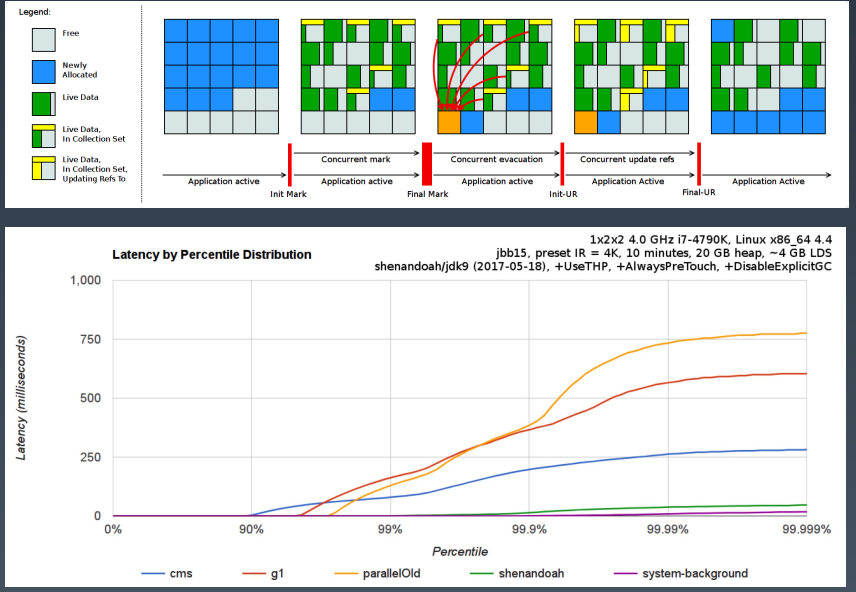


#### ShennandoahGC 与其他 GC 的 STW 比较 


### GC 总结

到目前为止，我们一共了解了 Java 目前支持的所有 GC 算法，一共有 7 类:

1. 串行 GC（Serial GC）: 单线程执行，应用需要暂停；
2. 并行 GC（ParNew、Parallel Scavenge、Parallel Old）: 多线程并行地执行垃圾回收，关注与高吞吐；
3. CMS（Concurrent Mark-Sweep）: 多线程并发标记和清除，关注与降低延迟；
4. G1（G First）: 通过划分多个内存区域做增量整理和回收，进一步降低延迟；
5. ZGC（Z Garbage Collector）: 通过着色指针和读屏障，实现几乎全部的并发执行，几毫秒级别的延迟，线性可扩展；
6. Epsilon: 实验性的 GC，供性能分析使用；
7. Shenandoah: G1 的改进版本，跟 ZGC 类似。 

可以看出 GC 算法和实现的演进路线:
1. 串行 -> 并行: 重复利用多核 CPU 的优势，大幅降低 GC 暂停时间，提升吞吐量。
2. 并行 -> 并发： 不只开多个 GC 线程并行回收，还将GC操作拆分为多个步骤，让很多繁重的任务和应用线程一起并
发执行，减少了单次 GC 暂停持续的时间，这能有效降低业务系统的延迟。
3. CMS -> G1： G1 可以说是在 CMS 基础上进行迭代和优化开发出来的，划分为多个小堆块进行增量回收，这样就更
进一步地降低了单次 GC 暂停的时间
4. G1 -> ZGC:： ZGC 号称无停顿垃圾收集器，这又是一次极大的改进。 ZGC 和 G1 有一些相似的地方，但是底层的算法和思想又有了全新的突破。

脱离场景谈性能都是耍流氓”。

目前绝大部分 Java 应用系统，堆内存并不大比如 2G-4G 以内，而且对 10ms 这种低延迟的 GC 暂停不敏感，也就是说处理一个业务步骤，大概几百毫秒都是可以接受的， GC 暂停 100ms 还是 10ms 没多大区别。另一方面，系统的吞吐量反而往往是我们追求的重点，这时候就需要考虑采用并行 GC。

如果堆内存再大一些，可以考虑 G1 GC。如果内存非常大（比如超过 16G，甚至是 64G、 128G），或者是对延迟非常敏感（比如高频量化交易系统），就需要考虑使用本节提到的新 GC（ ZGC/Shenandoah）。 


### 总结回顾与作业实践 

#### 总结回顾

工具有哪些？

GC 有哪些？

都有什么特点？ 


#### 作业实践 

1、本机使用 G1 GC 启动一个程序，仿照课上案例分析一下 JVM 情况 


## JVM核心技术--调优分析与面试经验 

### GC 日志解读与分析 

#### GC日志打印

- 编译java文件，由于windows的编码是 gbk，文件是utf-8，直接编译会出错，需要使用命令： javac -encoding UTF-8 GCLogAnalysis.java。
- 低版本编译和执行是分开实现，高版本可以直接使用：java GCLogAnalysis.java。
- 打印GC的详细信息：java -XX:+PrintGCDetails GCLogAnalysis 
- 打印GC的详细信息并且生成log：java -Xloggc:gc.demo.log -XX:+PrintGCDetails -XX:+PrintGCDateStamps GCLogAnalysis
  - 分析log
  - 系统会出现GC或者Full GC
  - 观察每一次GC的时候，堆内存的变化，之一看到出现年轻代向老年代移动的现象
  - 观察GC的耗时，可以看到每一次GC的时间远远小于Full GC


#### OOM GC 示例

- 模拟一下 OOM，java -Xmx128m -XX:+PrintGCDetails GCLogAnalysis
  - 将堆内存调整为128MB，默认是物理内存的1/4
  - 控制台出现：Exception in thread "main" java.lang.OutOfMemoryError: Java heap space
  - 控制台，前期都是young GC，后期都是Full GC
- 分别使用 512m,1024m,2048m,4086m,观察 GC 信息的不同 
  - 内存小的时候，GC的频率比较高
  - 随着内存的变大，生成对象的次数变大，300MB的时候和1024MB的时候，生成的对象变多
- 如何最快的方式实现程序的OOM? 
  - 直接调小堆内存即可。


#### Minor GC 与 Major GC

究竟是
• Young GC
• Full GC

还是
• Minor GC（小型 GC）
• Major GC（大型 GC）？ 


#### 串行 GC

- java -XX:+UseSerialGC -Xms512m -Xmx512m -Xloggc:gc.demo.log -XX:+PrintGCDetails -XX:+PrintGCDateStamps GCLogAnalysis
- java -XX:+UseSerialGC -Xms512m -Xmx512m -XX:+PrintGCDetails -XX:+PrintGCDateStamps GCLogAnalysis
- java -XX:+UseSerialGC -Xms2048m -Xmx2048m -XX:+PrintGCDetails -XX:+PrintGCDateStamps GCLogAnalysis
- java -XX:+UseSerialGC -Xms128m -Xmx128m -XX:+PrintGCDetails -XX:+PrintGCDateStamps GCLogAnalysis

- 观察 Young GC 与 Full GC 


#### 并行 GC

- java -XX:+UseParallelGC -Xms512m -Xmx512m -XX:+PrintGCDetails -XX:+PrintGCDateStamps GCLogAnalysis
- java -XX:+UseParallelGC -Xms2048m -Xmx2048m -XX:+PrintGCDetails -XX:+PrintGCDateStamps GCLogAnalysis
- java -XX:+UseParallelGC -Xms4g -Xmx4g -XX:+PrintGCDetails -XX:+PrintGCDateStamps GCLogAnalysis
- java -XX:+UseParallelGC -Xms128m -Xmx128m -XX:+PrintGCDetails -XX:+PrintGCDateStamps GCLogAnalysis
- java -XX:+UseParallelGC -Xms128m  -XX:+PrintGCDetails -XX:+PrintGCDateStamps GCLogAnalysis
- 观察 Young GC 与 Full GC
- 思考：如果不配置 Xms 会怎么样？ 
- 一般并行GC适合，大的吞吐量，多线程工作，STW明显。


#### CMS GC

- java -XX:+UseConcMarkSweepGC -Xms512m -Xmx512m -XX:+PrintGCDetails -XX:+PrintGCDateStamps GCLogAnalysis

- java -XX:+UseConcMarkSweepGC -Xms4g -Xmx4g -XX:+PrintGCDetails -XX:+PrintGCDateStamps GCLogAnalysis

- 观察 Young GC 与 Full GC

- 思考：假如 Xmx/Xms 设置 4g 会怎么样？

- 4g 内存下跟并行 gc 相比呢？ 

- CMS GC 的步骤：

  - ```sh
    # 阶段 1：Initial Mark（初始标记）
    # 阶段 2：Concurrent Mark（并发标记）
    # 阶段 3：Concurrent Preclean（并发预清理）
    # 阶段 4： Final Remark（最终标记）
    # 阶段 5： Concurrent Sweep（并发清除）
    # 阶段 6： Concurrent Reset（并发重置）
    
    # CMS Initial Mark
    2020-11-19T20:20:10.736+0800: [GC (CMS Initial Mark) [1 CMS-initial-mark: 280994K(349568K)] 299082K(506816K), 0.0001499 secs] [Times: user=0.00 sys=0.00, real=0.00 secs]
    # CMS-concurrent-mark
    2020-11-19T20:20:10.736+0800: [CMS-concurrent-mark-start]
    2020-11-19T20:20:10.737+0800: [CMS-concurrent-mark: 0.001/0.001 secs] [Times: user=0.00 sys=0.00, real=0.00 secs]
    # CMS-concurrent-preclean
    2020-11-19T20:20:10.737+0800: [CMS-concurrent-preclean-start]
    2020-11-19T20:20:10.738+0800: [CMS-concurrent-preclean: 0.000/0.000 secs] [Times: user=0.00 sys=0.00, real=0.00 secs]
    # CMS-concurrent-abortable-preclean
    2020-11-19T20:20:10.738+0800: [CMS-concurrent-abortable-preclean-start]
    2020-11-19T20:20:10.757+0800: [GC (Allocation Failure) 2020-11-19T20:20:10.757+0800: [ParNew: 157128K->17468K(157248K), 0.0203096 secs] 438123K->346220K(506816K), 0.0203527 secs] [Times: user=0.06 sys=0.01, real=0.02 secs]
    2020-11-19T20:20:10.778+0800: [CMS-concurrent-abortable-preclean: 0.001/0.040 secs] [Times: user=0.08 sys=0.01, real=0.04 secs]
    # CMS Final Remark
    2020-11-19T20:20:10.778+0800: [GC (CMS Final Remark) [YG occupancy: 24805 K (157248 K)]2020-11-19T20:20:10.778+0800: [Rescan (parallel) , 0.0002502 secs]2020-11-19T20:20:10.778+0800: [weak refs processing, 0.0000102 secs]2020-11-19T20:20:10.778+0800: [class unloading, 0.0002020 secs]2020-11-19T20:20:10.779+0800: [scrub symbol table, 0.0002735 secs]2020-11-19T20:20:10.779+0800: [scrub string table, 0.0000824 secs][1 CMS-remark: 328751K(349568K)] 353556K(506816K), 0.0008734 secs] [Times: user=0.00 sys=0.00, real=0.00 secs]
    # CMS-concurrent-sweep
    2020-11-19T20:20:10.779+0800: [CMS-concurrent-sweep-start]
    2020-11-19T20:20:10.780+0800: [CMS-concurrent-sweep: 0.001/0.001 secs] [Times: user=0.00 sys=0.00, real=0.00 secs]
    # CMS-concurrent-reset
    2020-11-19T20:20:10.780+0800: [CMS-concurrent-reset-start]
    2020-11-19T20:20:10.780+0800: [CMS-concurrent-reset: 0.000/0.000 secs] [Times: user=0.00 sys=0.00, real=0.00 secs]
    ```


#### G1 GC

- java -XX:+UseG1GC -Xms512m -Xmx512m -XX:+PrintGCDetails -XX:+PrintGCDateStamps GCLogAnalysis

- java -XX:+UseG1GC -Xms512m -Xmx512m -XX:+PrintGC -XX:+PrintGCDateStamps GCLogAnalysis

- java -XX:+UseG1GC -Xms4g -Xmx4g -XX:+PrintGC -XX:+PrintGCDateStamps GCLogAnalysis

- 观察 Young GC 与 Full GC

- 思考：假如Xmx/Xms 设置 4g 会怎么样？

- 4g 内存下跟 cms gc 相比呢？ 

  - 4G 内存时的 G1，完全不一样 

- G1 GC 的步骤：

  - ```sh
    # Evacuation Pause: young（纯年轻代模式转移暂停）
    # Concurrent Marking（并发标记）
    # 阶段 1: Initial Mark（初始标记）
    # 阶段 2: Root Region Scan（Root区扫描）
    # 阶段 3: Concurrent Mark（并发标记）
    # 阶段 4: Remark（再次标记）
    # 阶段 5: Cleanup（清理）
    # Evacuation Pause (mixed)（转移暂停: 混合模式）
    # Full GC (Allocation Failure)
    
    2020-11-19T20:32:21.473+0800: [GC pause (G1 Evacuation Pause) (young)-- 416M->268M(512M), 0.0094140 secs]
    2020-11-19T20:32:21.483+0800: [GC pause (G1 Evacuation Pause) (young) (initial-mark) 269M->270M(512M), 0.0072150 secs]
    2020-11-19T20:32:21.490+0800: [GC concurrent-root-region-scan-start]
    2020-11-19T20:32:21.491+0800: [GC concurrent-root-region-scan-end, 0.0001382 secs]
    2020-11-19T20:32:21.491+0800: [GC concurrent-mark-start]
    2020-11-19T20:32:21.492+0800: [GC concurrent-mark-end, 0.0016133 secs]
    2020-11-19T20:32:21.492+0800: [GC remark, 0.0014565 secs]
    2020-11-19T20:32:21.494+0800: [GC cleanup 281M->280M(512M), 0.0010754 secs]
    2020-11-19T20:32:21.495+0800: [GC concurrent-cleanup-start]
    2020-11-19T20:32:21.495+0800: [GC concurrent-cleanup-end, 0.0000168 secs]
    
    ```


#### 一个退化时的例子 


#### GCEasy

网址：https://gceasy.io/

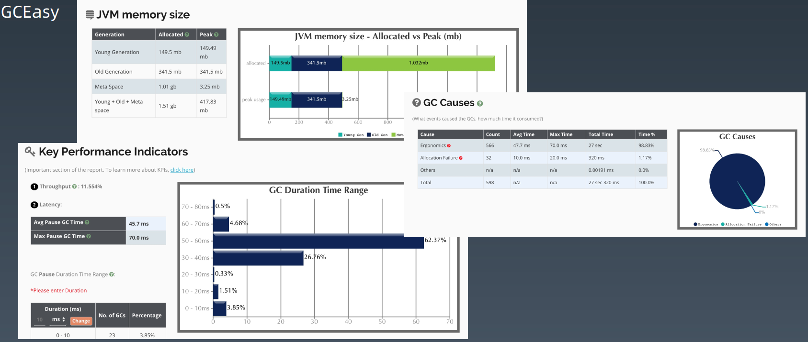


#### GCViewer

https://github.com/chewiebug/GCViewer

http://www.javaperformancetuning.com/tools/gcviewer/index.shtml

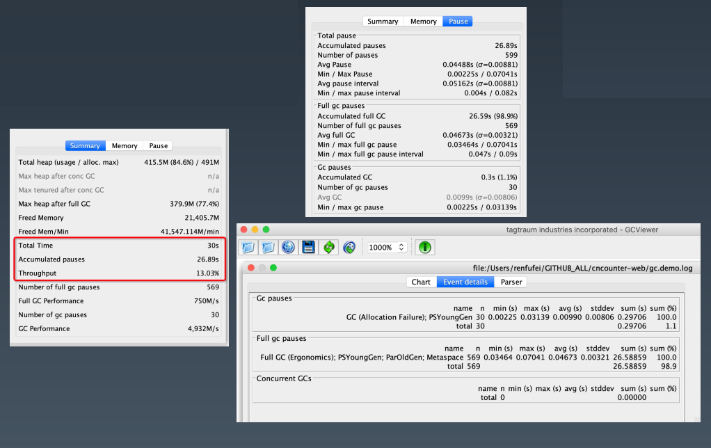


#### 总结

如何查看/分析不同 GC 配置下的日志信息？

各种 GC 有什么特点和使用场景？ 


### JVM 线程堆栈数据分析 

#### JVM 线程模型示意图

- JVM的线程与操作系统的线程是一一对应的关系，所以线程的操作比较重
- 线程设计三层的内容：Java层面，JVM层面，OS层面

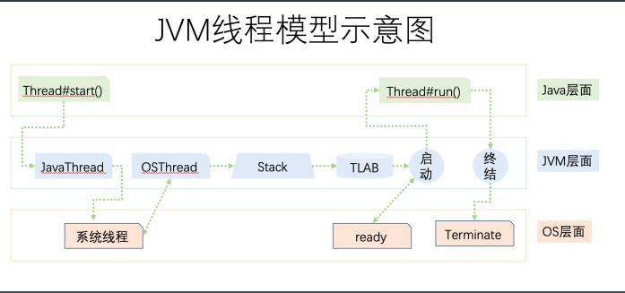


#### JVM 内部线程 

JVM 内部线程主要分为以下几种：

- VM 线程：单例的 VMThread 对象，负责执行 VM 操作，下文将对此进行讨论;
- 定时任务线程：单例的 WatcherThread 对象， 模拟在VM 中执行定时操作的计时器中断；
- GC 线程：垃圾收集器中，用于支持并行和并发垃圾回收的线程;
- 编译器线程： 将字节码编译为本地机器代码（JNI线程）;
- 信号分发线程：等待进程指示的信号，并将其分配给Java级别的信号处理方法 


#### 安全点

1. 方法代码中被植入的安全点检测入口；
2. 线程处于安全点状态：线程暂停执行，这个时候线程栈不再发生改变；
3. JVM 的安全点状态：所有线程都处于安全点状态。


#### 线程转储

JVM 支持多种方式来进行线程转储：

1. JDK 工具, 包括: jstack 工具, jcmd 工具, jconsole, jvisualvm, Java Mission Control 等；
2. Shell 命令或者系统控制台, 比如 Linux 的 kill -3, Windows 的 Ctrl + Break 等；
3. JMX 技术， 主要是使用 ThreadMxBean。 


#### 死锁检测

- 先检查
- 再中止死锁线程
  - 设置超时，解锁
  - 强制杀掉线程
- fastthread 线程分析 ：https://fastthread.io/
- jconsole

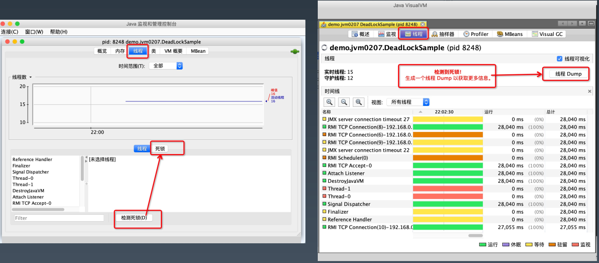

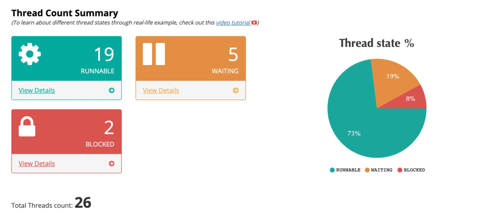


### 内存分析与相关工具 

#### 思考题

请思考一个问题：
一个对象具有100个属性，与100个对象每个具有1个属性，哪个占用的内存空间更大？ 

答案：100个对象每个具有1个属性 大。（类比书柜和书的道理）


#### Java 对象占用多少内存

一个 Java 对象占用多少内存？

可以使用 Instrumentation.getObjectSize() 方法来估算一个对象占用的内存空间。

JOL (Java Object Layout) 可以用来查看对象内存布局。

对比结构体与Data Object？ 

java 会进行对象内部的补齐，所以精确的对象大小，不好计算！

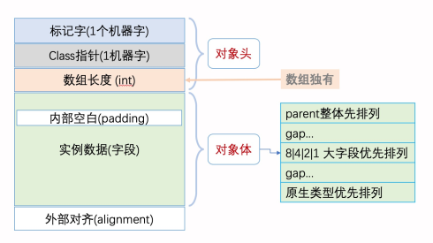


#### 对象头和对象引用

在64位 JVM 中，对象头占据的空间是 12-byte(=96bit=64+32)，但是以8字节对齐，所以一
个空类的实例至少占用16字节。

在32位 JVM 中，对象头占8个字节，以4的倍数对齐(32=4*8)。
所以 new 出来很多简单对象，甚至是 new Object()，都会占用不少内容哈。

通常在32位 JVM，以及内存小于 -Xmx32G 的64位JVM 上(默认开启**指针压缩**)，一个引用占的内存默
认是4个字节。

因此，64位 JVM 一般需要多消耗堆内存。 


#### 包装类型

比原生数据类型消耗的内存要多，详情可以参考JavaWorld ：

**Integer**：占用16字节(8+4=12+补齐)，因为 int 部分占4个字节。 所以使用 Integer 比原生类型 int 要多消
耗 300% 的内存。

**Long**：一般占用16个字节(8+8=16)，当然，对象的实际大小由底层平台的内存对齐确定，具体由特定 CPU
平台的 JVM 实现决定。 看起来一个 Long 类型的对象，比起原生类型 long 多占用了8个字节（也多消耗了100%）。 

**多维数组**：在二维数组 int[dim1]\[dim2] 中，每个嵌套的数组 int[dim2] 都是一个单独的 Object，会
额外占用16字节的空间。当数组维度更大时，这种开销特别明显。

int[128]\[2] 实例占用3600字节。 而 int[256] 实例则只占用1040字节。里面的有效存储空间是一样
的，3600 比起1040多了246%的额外开销。在极端情况下，byte[256]\[1]，额外开销的比例是19倍!

**String**: String 对象的空间随着内部字符数组的增长而增长。当然，String 类的对象有24个字节的额外开销。
对于10字符以内的非空 String，增加的开销比起有效载荷（每个字符2字节 + 4 个字节的 length），多占用了100% 到 400% 的内存。 


#### 对齐是绕不过去的问题

我们可能会认为，一个 X 类的实例占用17字节的空间。但是由于需要对齐(padding)，JVM 分配的内存是8字节的整数倍，所以占用的空间不是17字节,而是24字节。 

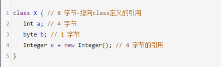


#### 内存泄漏的例子 

- while 死循环，后面执行的时候由于key是不等的，没法判断之前的对象是不是在HashMap中
- 此时就会 OOM

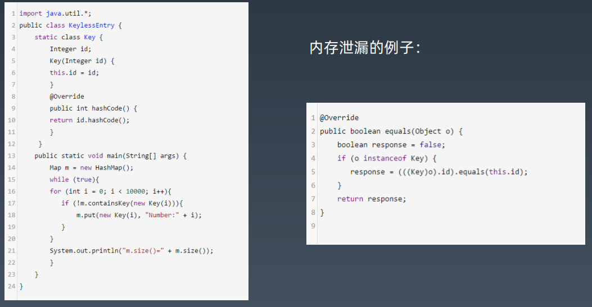


#### OOM

##### OutOfMemoryError: Java heap space

创建新的对象时，堆内存中的空间不足以存放新创建的对象

产生的原因，很多时候就类似于将 XXL 号的对象，往 S 号的 Java heap space 里面塞。其实清楚了原因，问题就很容易解决了：只要增加堆内存的大小，程序就能正常运行。

另外还有一些情况是由**代码问题**导致的：

• 超出预期的访问量/数据量：应用系统设计时，一般是有 “容量” 定义的，部署这么多机器，用来处理一定流量的数据/业务。 如果访问量突然飙升，超过预期的阈值，类似于时间坐标系中针尖形状的图谱。那么在峰值所在的时间段，程序很可能就会卡死、并触发java.lang.OutOfMemoryError: Java heap space错误。

• 内存泄露(Memory leak)：这也是一种经常出现的情形。由于代码中的某些隐蔽错误，导致系统占用的内存越来越多。如果某个方法/某段代码存在内存泄漏，每执行一次，就会（有更多的垃圾对象）占用更多的内存。随着运行时间的推移，泄漏的对象耗光了堆中的所有内存，那么java.lang.OutOfMemoryError: Java heap space 错误就爆发了。 


##### OutOfMemoryError: PermGen space/OutOfMemoryError: Metaspace

java.lang.OutOfMemoryError: PermGen space 的主要原因，是加载到内存中的 class 数量太多或体积太大，超过了 PermGen 区的大小。

解决办法：增大 PermGen/Metaspace
-XX:MaxPermSize=512m
-XX:MaxMetaspaceSize=512m

高版本 JVM 也可以：
-XX:+CMSClassUnloadingEnabled 

注意：Metaspace 存放的是class对象的基本信息，不是对象。对象一旦被创建出来，都是需要放到堆上。


##### OutOfMemoryError: Unable to create new native thread

java.lang.OutOfMemoryError: Unable to create new native thread 错误是程序创建的线程数量已达到上限值的异常信息。

解决思路：

1. 调整系统参数 ulimit -a，echo 120000 > /proc/sys/kernel/threads-max
2. 降低 xss 等参数
3. 调整代码，改变线程创建和使用方式 

注意：linux 一切接文件，在操作的时候windows对应的是端口，linux使用的是文件句柄。当进行网络程序的时候，可能程序结束了，操作系统并没有完全回收端口的资源，导致下一次启动会报端口的错误，起不来！


#### 内存 Dump 分析工具

• Eclipse MAT
• jhat

留给大家自己研究 

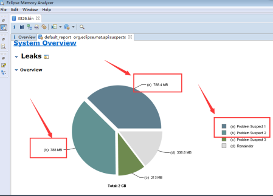


### JVM 问题分析调优经验 

#### 1、高分配速率(High Allocation Rate)

分配速率(Allocation rate)表示单位时间内分配的内存量。通常使用 MB/sec 作为单位。上一次垃圾收集之后，与下一次 GC 开始之前的年轻代使用量，两者的差值除以时间,就是分配速率。

分配速率过高就会严重影响程序的性能，在 JVM 中可能会导致巨大的 GC 开销。

正常系统：分配速率较低 ~ 回收速率 -> 健康
内存泄漏：分配速率 持续大于 回收速率 -> OOM
性能劣化：分配速率较高 ~ 回收速率 -> 压健康 

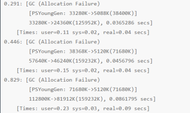

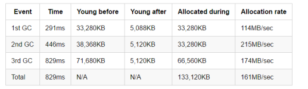

JVM 启动之后 291ms，共创建了 33,280 KB 的对象。第一次 Minor GC（小型GC) 完成后，年轻代中还有 5,088 KB 的对象存活。
在启动之后 446 ms，年轻代的使用量增加到38,368 KB，触发第二次 GC，完成后年轻代的使用量减少到 5,120 KB。
在启动之后 829 ms，年轻代的使用量为 71,680KB，GC 后变为 5,120 KB。 


思考一个问题，
分配速率，到底影响什么？

想一想，new 出来的对象，在什么地方。
答案就是，Eden。

假如我们增加 Eden，会怎么样。
考虑蓄水池效应。

最终的效果是，影响 Minor GC的次数和时间，进而影响吞吐量。
在某些情况下，只要增加年轻代的大小，即可降低分配速率过高所造成的影响。增加年轻代空间并不会降低分配速率，但是会减少 GC 的频率。如果每次 GC 后只有少量对象存活，minor GC 的暂停时间就不会明显增加。 


#### 2、过早提升(Premature Promotion)

提升速率（promotion rate）用于衡量单位时间内从年轻代提升到老年代的数据量。一般使用 MB/sec 作为单位, 和分配速率类似。

JVM 会将长时间存活的对象从年轻代提升到老年代。根据分代假设，可能存在一种情况，老年代中不仅有存活时间长的对象,，也可能有存活时间短的对象。这就是过早提升：对象存活时间还不够长的时候就被提升到了老年代。

major GC 不是为频繁回收而设计的，但 major GC 现在也要清理这些生命短暂的对象，就会导致 GC 暂停时间过长。这会严重影响系统的吞吐量。 


GC 之前和之后的年轻代使用量以及堆内存使用量。这样就可以通过差值算出老年代的使用量。

和分配速率一样，提升速率也会影响 GC 暂停的频率。但**分配速率主要影响 minor GC，而提升速率**
**则影响 major GC 的频率**。

有大量的对象提升，自然很快将老年代填满。老年代填充的越快，则 major GC 事件的频率就会越高。 

一般来说过早提升的症状表现为以下形式：
1. 短时间内频繁地执行 full GC
2. 每次 full GC 后老年代的使用率都很低，在10-20%或以下
3. 提升速率接近于分配速率

要演示这种情况稍微有点麻烦，所以我们使用特殊手段，让对象提升到老年代的年龄比默认情况小很
多。指定 GC 参数 -Xmx24m -XX:NewSize=16m-XX:MaxTenuringThreshold=1，运行程序之后，可以看到下面的 GC 日志。 

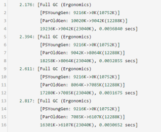

解决这类问题，需要让年轻代存放得下暂存的数据，有两种简单的方法：

- 一是增加年轻代的大小，设置 JVM 启动参数，类似这样：-Xmx64m -XX:NewSize=32m，程序在执行时，Full GC 的次数自然会减少很多，只会对 minor GC 的持续时间产生影响。
- 二是减少每次批处理的数量，也能得到类似的结果。

至于选用哪个方案，要根据业务需求决定。 在某些情况下，业务逻辑不允许减少批处理的数量，那就只能增加堆内存，或者重新指定年轻代的大小。 如果都不可行，就只能优化数据结构，减少内存消耗。

但总体目标依然是一致的：让临时数据能够在年轻代存放得下。 


### GC 疑难情况问题分析 

#### Arthas 诊断分析工具 

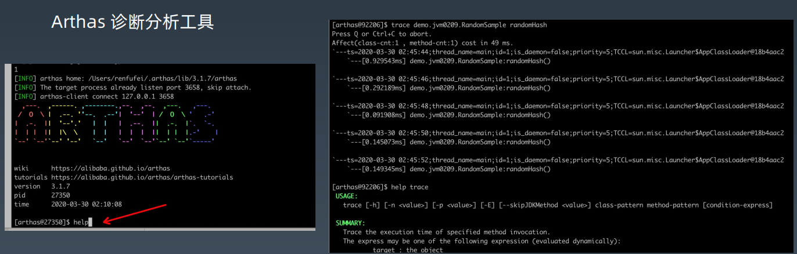


#### 问题分析方向

1、查询业务日志，可以发现这类问题：
请求压力大，波峰，遭遇降级，熔断等等， 基础服务、外部 API依赖 。

2、查看系统资源和监控信息：
硬件信息、操作系统平台、系统架构；
排查 CPU 负载、内存不足，磁盘使用量、硬件故障、磁盘分区用满、IO 等待、IO 密集、丢数据、并发竞争等情况；
排查网络：流量打满，响应超时，无响应，DNS 问题，网络抖动，防火墙问题，物理故障，网络参数调整、超时、连接数。

3、查看性能指标，包括实时监控、历史数据。可以发现 假死，卡顿、响应变慢等现象；
排查数据库， 并发连接数、慢查询、索引、磁盘空间使用量、内存使用量、网络带宽、死锁、TPS、查询数据量、redo日志、undo、 binlog 日志、代理、工具 BUG。可以考虑的优化包括： 集群、主备、只读实例、分片、分区；
大数据，中间件，JVM 参数。

4、排查系统日志， 比如重启、崩溃、Kill 。

5、APM，比如发现有些链路请求变慢等等。 

6、排查应用系统
排查配置文件: 启动参数配置、Spring 配置、JVM 监控参数、数据库参数、Log 参数、APM 配置、内存问题，比如是否存在内存泄漏，内存溢出、批处理导致的内存放大、GC 问题等等；
GC 问题， 确定 GC 算法、确定 GC 的 KPI，GC 总耗时、GC 最大暂停时间、分析 GC 日志和监控指标： 内存分配度，分代提升速度，内存使用率等数据。适当时修改内存配置；
排查线程, 理解线程状态、并发线程数，线程 Dump，锁资源、锁等待，死锁，线程池（一般机器50的效果优于500）；
排查代码， 比如安全漏洞、低效代码、算法优化、存储优化、架构调整、重构、解决业务代码 BUG、第三方库、XSS、CORS、正则；
单元测试： 覆盖率、边界值、Mock 测试、集成测试。

7、 排除资源竞争、坏邻居效应

8、疑难问题排查分析手段
DUMP 线程\内存；
抽样分析\调整代码、异步化、削峰填谷。 


#### 一个真实的案例分析 

- 文档：[GC问题排查实战案例 ](./GCProblemTrainingCase.md)
- 并行 GC 暂停太高
- G1 GC 暂停还是太高
- 找到问题，最终优化 
- 有容器存在，不知道JVM看到的数据，是不是真实的配置数据，可能直接看到的是物理机的信息
- 注意：JVM参数需要明确指定

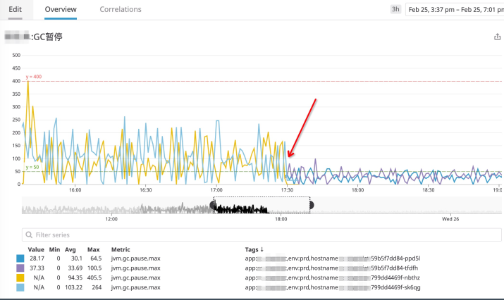


### JVM 常见面试问题汇总 

- 文档：[VM 常见面试问题汇总 ](./JVMInterviewQuestion.md)


### 本地环境压测测试

#### 压测程序

1.可以从github获取
git clone https://github.com/kimmking/atlantis
cd atlantis\gateway-server
mvn clean package
然后在target目录可以找到gateway-server-0.0.1-SNAPSHOT.jar

2.也可以从此处下载已经编译好的：
链接：https://pan.baidu.com/s/1NbpYX4M3YKLYM1JJeIzgSQ 
提取码：sp85 

3.启动程序
java -jar -Xmx512m -Xms512m gateway-server-0.0.1-SNAPSHOT.jar
java -jar -Xmx1024m -Xms1024m gateway-server-0.0.1-SNAPSHOT.jar


#### Windows

1.管理员身份打开powershell

2.运行
Set-ExecutionPolicy Bypass -Scope Process -Force; [System.Net.ServicePointManager]::SecurityProtocol = [System.Net.ServicePointManager]::SecurityProtocol -bor 3072; iex ((New-Object System.Net.WebClient).DownloadString('https://chocolatey.org/install.ps1'))

3.执行choco install superbenchmarker

4.输入 sb

5.执行 sb -u http://localhost:8088/api/hello -c 20 -N 60


#### Mac

1.执行brew install wrk
如果显式brew update很慢，可以ctrl+C打断更新

2.输入 wrk

执行 wrk -t8 -c40 -d60s http://localhost:8088/api/hello


#### jmc

1.控制台输入：jmc

2.在JVM浏览器中，找到对应的进程，开启飞行记录，设置默认1分钟记录

3.启动程序，并且压测

注意：使用jmc进行飞行记录的挂载，对于原系统的性能会有严重影响。


### 总结回顾与作业实践 

#### 总结回顾

1. GC 日志解读与分析*
2. JVM 线程堆栈数据分析
3. 内存分析与相关工具*
4. JVM 问题分析调优经验*
5. GC 疑难情况问题分析
6. JVM 常见面试问题汇总* 


#### 作业实践 

1、使用 GCLogAnalysis.java 自己演练一遍串行/并行/CMS/G1的案例。
2、使用压测工具（wrk或sb），演练gateway-server-0.0.1-SNAPSHOT.jar 示例。
3、(选做)如果自己本地有可以运行的项目，可以按照2的方式进行演练。

根据上述自己对于1和2的演示，写一段对于不同 GC 的总结，提交到 Github。 


## NIO 模型与 Netty 入门 

### Java Socket 编程 

#### 服务器通信原理 

- IP（对应计算机）
- 端口（对应计算机的进程）

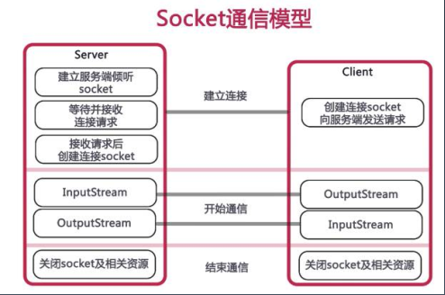


#### Java 实现一个最简的 HTTP 服务器-01 

1. 创建一个 ServerSocket
2. 绑定8801端口
3. 当有客户端请求时通过 accept 方法拿到 Socket，进而可以进行处理
4. sleep 20ms，模拟业务操作(IO)
5. 模拟输出 HTTP 报文头和 hello
6. 关闭 socket

```java
package java0.nio01;

import java.io.IOException;
import java.io.PrintWriter;
import java.net.ServerSocket;
import java.net.Socket;

public class HttpServer01 {
    public static void main(String[] args) throws IOException{
        ServerSocket serverSocket = new ServerSocket(8801);
        while (true) {  // 死循环
            try {
                Socket socket = serverSocket.accept();  // 阻塞
                service(socket);
            } catch (IOException e) {
                e.printStackTrace();
            }
        }
    }
    
    private static void service(Socket socket) {
        try {
            Thread.sleep(20);
            PrintWriter printWriter = new PrintWriter(socket.getOutputStream(), true);
            printWriter.println("HTTP/1.1 200 OK");
            printWriter.println("Content-Type:text/html;charset=utf-8");
            String body = "hello,nio";
            printWriter.println("Content-Length:" + body.getBytes().length);
            printWriter.println();
            printWriter.write(body);
            printWriter.close();
            socket.close();
        } catch (IOException | InterruptedException e) {
            e.printStackTrace();
        }
    }
}
```

可以浏览器访问 http://localhost:8801思考一下有什么问题？ 

设置-Xmx512 然后启动

压测：
sb -u http://localhost:8801 -c 40 -N 30
wrk -c 40 -d30s http://localhost:8801 

```sh
C:\Users\rmliu>sb -u http://localhost:8801/ -c 40 -N 30
Starting at 2020/11/20 17:12:44
[Press C to stop the test]
1436    (RPS: 41.9)
---------------Finished!----------------
Finished at 2020/11/20 17:13:18 (took 00:00:34.3992873)
1471    (RPS: 42.9)                     Status 200:    1471

RPS: 47.3 (requests/second)  # 理论不会超过50
Max: 1401ms
Min: 580ms
Avg: 825.3ms

  50%   below 820ms
  60%   below 821ms
  70%   below 822ms
  80%   below 824ms
  90%   below 826ms
  95%   below 829ms
  98%   below 841ms
  99%   below 1111ms
99.9%   below 1380ms
```

慢的原因：

- 有一个 Sleep 时间
- 只有一个单线程执行，串行处理


#### Java 实现一个最简的 HTTP 服务器-02 

改进一下，绑定8802端口

```java
package java0.nio01;

import java.io.IOException;
import java.io.PrintWriter;
import java.net.ServerSocket;
import java.net.Socket;

public class HttpServer02 {
    public static void main(String[] args) throws IOException {
        ServerSocket serverSocket = new ServerSocket(8802);
        while (true) {
            try {
                final Socket socket = serverSocket.accept();
                new Thread(() -> {  // 一个线程处理一个请求
                    service(socket);
                }).start();
            } catch (IOException e) {
                e.printStackTrace();
            }
        }
    }

    private static void service(Socket socket) {
        try {
            Thread.sleep(20);
            PrintWriter printWriter = new PrintWriter(socket.getOutputStream(), true);
            printWriter.println("HTTP/1.1 200 OK");
            printWriter.println("Content-Type:text/html;charset=utf-8");
            String body = "hello,nio";
            printWriter.println("Content-Length:" + body.getBytes().length);
            printWriter.println();
            printWriter.write(body);
            printWriter.close();
            socket.close();
        } catch (IOException | InterruptedException e) {
            e.printStackTrace();
        }
    }
}
```

每个客户端请求进来时创建一个线程有什么问题？ 

设置-Xmx512 然后启动

压测：
sb -u http://localhost:8802 -c 40 -N 30
wrk -c 40 -d30s http://localhost:8802 

```sh
C:\Users\rmliu>sb -u http://localhost:8802/ -c 40 -N 30
Starting at 2020/11/20 17:18:47
[Press C to stop the test]
38210   (RPS: 1114.8)
---------------Finished!----------------
Finished at 2020/11/20 17:19:22 (took 00:00:34.5036252)
Status 200:    38174
Status 303:    36

RPS: 1224 (requests/second)  # 提升很明显
Max: 148ms
Min: 0ms
Avg: 23.1ms

  50%   below 21ms
  60%   below 22ms
  70%   below 22ms
  80%   below 23ms
  90%   below 27ms
  95%   below 32ms
  98%   below 43ms
  99%   below 52ms
99.9%   below 84ms
```

慢的原因：

- 每一次请求就创建一个线程，直接去操作系统创建一个线程，最后销毁，线程的使用效率低
- 线程的创建和销毁，开销较大


#### Java 实现一个最简的 HTTP 服务器-03

再改进一下，绑定8803端口

```java
package java0.nio01;

import java.io.IOException;
import java.io.PrintWriter;
import java.net.ServerSocket;
import java.net.Socket;
import java.util.concurrent.ExecutorService;
import java.util.concurrent.Executors;

public class HttpServer03 {
    public static void main(String[] args) throws IOException{
        ExecutorService executorService = Executors.newFixedThreadPool(40);
        final ServerSocket serverSocket = new ServerSocket(8803);
        while (true) {
            try {
                final Socket socket = serverSocket.accept();
                executorService.execute(() -> service(socket));
            } catch (IOException e) {
                e.printStackTrace();
            }
        }
    }
    
    private static void service(Socket socket) {
        try {
            Thread.sleep(20);
            PrintWriter printWriter = new PrintWriter(socket.getOutputStream(), true);
            printWriter.println("HTTP/1.1 200 OK");
            printWriter.println("Content-Type:text/html;charset=utf-8");
            String body = "hello,nio";
            printWriter.println("Content-Length:" + body.getBytes().length);
            printWriter.println();
            printWriter.write(body);
            printWriter.close();
            socket.close();
        } catch (IOException | InterruptedException e) {
            e.printStackTrace();
        }
    }
}
```

创建一个固定大小的线程池来处理

why？有什么问题？ 

设置-Xmx512 然后启动

压测：
sb -u http://localhost:8803 -c 40 -N 30
wrk -c 40 -d30s http://localhost:8803 

```sh
C:\Users\rmliu>sb -u http://localhost:8803/ -c 40 -N 30
Starting at 2020/11/20 17:25:19
[Press C to stop the test]
44536   (RPS: 1297.9)
---------------Finished!----------------
Finished at 2020/11/20 17:25:54 (took 00:00:34.3861722)
Status 200:    44514
Status 303:    22

RPS: 1433.9 (requests/second)  # 提升更明显
Max: 112ms
Min: 0ms
Avg: 21.3ms

  50%   below 20ms
  60%   below 21ms
  70%   below 21ms
  80%   below 21ms
  90%   below 23ms
  95%   below 26ms
  98%   below 32ms
  99%   below 36ms
99.9%   below 65ms
```


#### 总结一下，到目前为止，我们做了什么 

- 单线程处理 socket
- 每个请求一个线程
- 固定大小线程池处理 


### 深入讨论 IO 通信 

#### 服务器通信过程分析 


仔细分析一下，这个过程中，存在两种类型操作：

- CPU 计算/业务处理
- IO 操作与等待/网络、磁盘、数据库

想想我们前面的例子为什么创建大量线程？ 

- 线程在处理的时候，会Sleep，此时就会有空闲的时间；
- 保证CPU最高效的吃饱

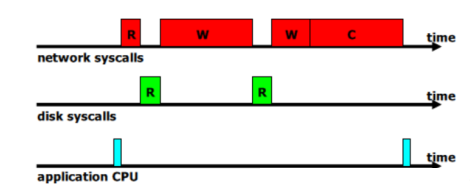

对于一个 IO 相关应用来说，例如通过网络访问，服务器端读取本地文件，再返回给客户端（如上图）。

这种情况下，大部分 CPU 等资源，可能就被浪费了 ，怎么优化？


#### 再深入一层的看问题 

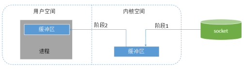

不仅面临 线程/CPU 的问题，

还要面对数据来回复制的问题。(数据从用户态，拷贝到内核态，然后发送出去，并且中间还有一个缓冲区。)

这个一来，对每个业务处理过程，使用一个线程以一竿子通到底的方式，性能不是最优的，还有提升空间。

考虑一下，理想状态，是什么样的？
流水线 


### NIO 模型与相关概念 

#### 通信模型 

考虑一下：

- 阻塞、非阻塞，
- 同步、异步，

有什么关系和区别？

- 同步异步 是通信模式。
- 阻塞、非阻塞 是 线程处理模式。 


#### 五种 IO 模型 

基本上都是同步的 


#### IO 模型-01 -阻塞式 IO、BIO

阻塞式 IO、BIO

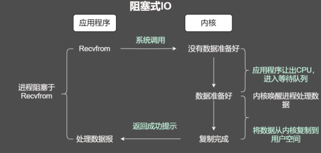

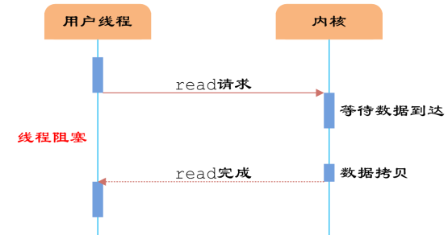

一般通过在 while(true) 循环中服务端会调用 accept() 方法等待接收客户端的连接的方式监听请求，请求一旦接收到一个连接请求，就可以建立通信套接字在这个通信套接字上进行读写操作，此时不能再接收其他客户端连接请求，只能等待当前连接的客户端的操作执行完成， 不过可以通过多线程来支持多个客户端的连接 


#### IO 模型-02 -非阻塞式 IO

非阻塞式 IO

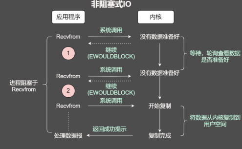

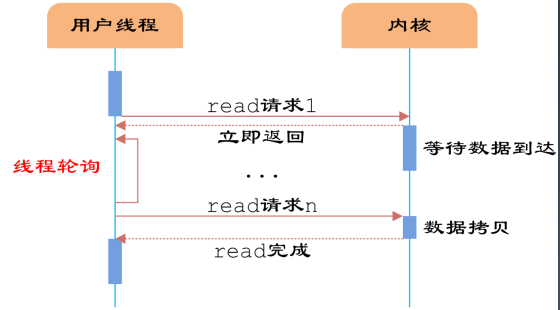

和阻塞 IO 类比，内核会立即返回，返回后获得足够的 CPU 时间继续做其它的事情。

用户进程第一个阶段不是阻塞的,需要不断的主动询问 kernel 数据好了没有；第二个阶段依然总是阻塞的。 


#### IO 模型-03 -IO 多路复用(IO multiplexing)（Reactor）（epoll）

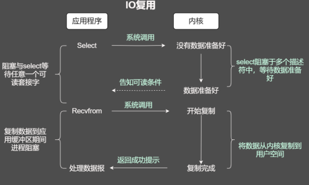

IO 多路复用(IO multiplexing)，也称事件驱动 IO(event-driven IO)，就是在单个线程里同时监控多个套接字，通过select 或 poll 轮询所负责的所有socket，当某个 socket 有数据到达了，就通知用户进程。

IO 复用同非阻塞 IO 本质一样，不过利用了新的 select 系统调用，由内核来负责本来是请求进程该做的轮询操作。看似比非阻塞 IO 还多了一个系统调用开销，不过因为可以支持多路 IO，才算提高了效率。

进程先是阻塞在 select/poll 上，再是阻塞在读操作的第二个阶段上。 

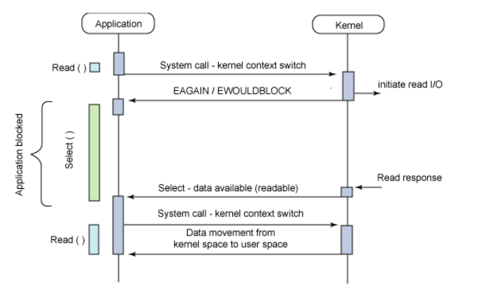

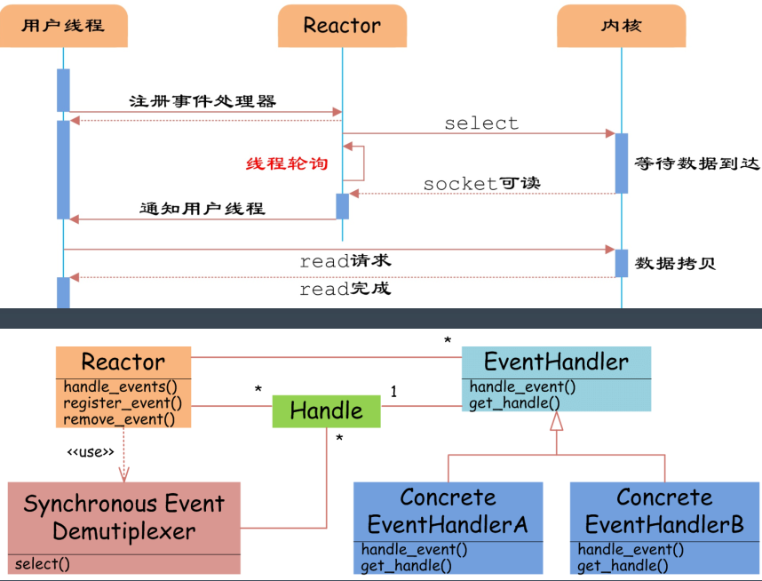

select/poll 的几大缺点：
（1）每次调用 select，都需要把 fd 集合从用户态拷贝到内核态，这个开销在 fd 很多时会很大
（2）同时每次调用 select 都需要在内核遍历传递进来的所有 fd，这个开销在 fd 很多时也很大
（3）select 支持的文件描述符数量太小了，默认是1024

epoll（Linux 2.5.44内核中引入,2.6内核正式引入,可被用于代替 POSIX select 和 poll 系统调用）：
（1）内核与用户空间共享一块内存
（2）通过回调解决遍历问题
（3）fd 没有限制，可以支撑10万连接 （C10k问题，从此之后 可以支持C100K问题）


#### IO 模型-04 -信号驱动 I/O

信号驱动 I/O

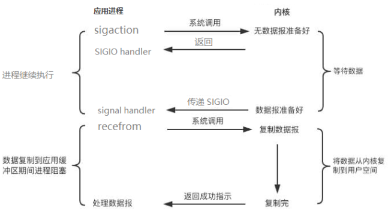

信号驱动 IO 与 BIO 和 NIO 最大的区别就在于，在 IO 执行的数据准备阶段，不会阻塞用户进程。

如图所示：当用户进程需要等待数据的时候，会向内核发送一个信号，告诉内核我要什么数据，然后用户进程就继续做别的事情去了，而当内核中的数据准备好之后，内核立马发给用户进程一个信号，说”数据准备好了，快来查收“，用户进程收到信号之后，立马调用 recvfrom，去查收数据。 


#### IO 模型-05 -异步式 IO（IOCP）（Proactor）

异步式 IO

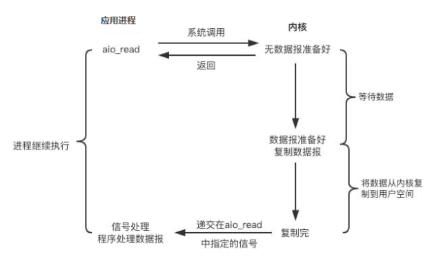

异步 IO 真正实现了 IO 全流程的非阻塞。

用户进程发出系统调用后立即返回，内核等待数据准备完成，然后将数据拷贝到用户进程缓冲区，然后发送信号告诉用户进程 IO 操作执行完毕（与 SIG IO 相比，一个是发送信号告诉用户进程数据准备完毕，一个是 IO执行完毕）。

windows 的 IOCP 模型 。

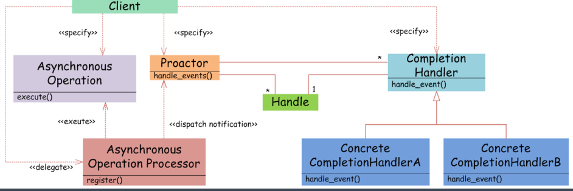

注意：这个模式，数据是内核复制到用户进程中的，只有复制好之后，才会通知数据，通知的是数据复制好了，而不是数据来了。此时，就可以直接读取了。


#### 总结

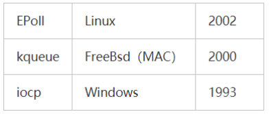

一个场景，去打印店打印文件。

同步阻塞
直接排队，别的啥也干不成，直到轮到你使用打印机了，自己打印文件

Reactor（epoll/多路复用I/O）
拿个号码，回去该干嘛干嘛，等轮到你使用打印机了，店主通知你来用打印机，打印文件

Proactor（异步I/O）
拿个号码，回去该干嘛干嘛，等轮到你使用打印机了，店主直接给你打印好文件，通知你来拿。 


### Netty 框架简介 

#### Netty 概览

官网：https://netty.io/

网络应用开发框架

1. 异步
2. 事件驱动
3. 基于 NIO

适用于:
• 服务端
• 客户端
• TCP/UDP （QQ使用最多，交易所的数据推，Zuul 2.0 网关底层）

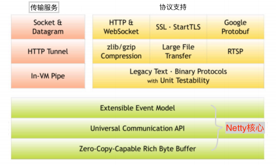


#### Netty 特性

高性能的协议服务器:
• 高吞吐
• 低延迟
• 低开销
• 零拷贝
• 可扩容

• 松耦合: 网络和业务逻辑分离
• 使用方便、可维护性好 


#### 兼容性

JDK 兼容性:
• Netty 3.x: JDK5
• Netty 4.x: JDK6
• Netty 5.x: 已废弃（思想超前，性能不足，抛弃了）

协议兼容性:
• 兼容大部分通用协议
• 支持自定义协议

嵌入式:
• HTTP Server
• HTTPS Server
• WebSocket Server
• TCP Server
• UDP Server
• In VM Pipe

Netty vs. Java EE? 


#### 基本概念

• Channel 
通道，Java NIO 中的基础概念,代表一个打开的连接,可执行读取/写入 IO 操作。Netty 对 Channel 的所有 IO 操作都是非阻塞的。

• ChannelFuture
Java 的 Future 接口，只能查询操作的完成情况, 或者阻塞当前线程等待操作完成。Netty 封装一个 ChannelFuture 接口。
我们可以将回调方法传给 ChannelFuture，在操作完成时自动执行。

• Event & Handler Netty 
基于事件驱动，事件和处理器可以关联到入站和出站数据流。

• Encoder &Decoder
处理网络 IO 时，需要进行序列化和反序列化, 转换 Java 对象与字节流。对入站数据进行解码, 基类是 ByteToMessageDecoder。
对出站数据进行编码, 基类是 MessageToByteEncoder。

• ChannelPipeline
 数据处理管道就是事件处理器链。 有顺序、同一 Channel 的出站处理器和入站处理器在同一个列表中。 


#### Event & Handler

入站事件：
• 通道激活和停用
• 读操作事件
• 异常事件
• 用户事件

出站事件：
• 打开连接
• 关闭连接
• 写入数据
• 刷新数据

事件处理程序接口:
• ChannelHandler
• ChannelOutboundHandler
• ChannelInboundHandler

适配器（空实现，需要继承使用）：
• ChannelInboundHandlerAdapter
• ChannelOutboundHandlerAdapter 

Netty 应用组成:
• 网络事件
• 应用程序逻辑事件
• 事件处理程序


### Netty 使用示例 

#### Demo

网址：https://github.com/kimmking/atlantis/tree/master/netty-server


#### Netty 简单例子

使用 Netty 改写，最开始的例子

然后，压测一下效果如何。 

```sh
C:\Users\rmliu>sb -u http://localhost:8088/test -c 40 -N 30
Starting at 2020/11/20 21:03:03
[Press C to stop the test]
68112   (RPS: 1980.9)
---------------Finished!----------------
Finished at 2020/11/20 21:03:38 (took 00:00:34.4626514)
Status 200:    68120

RPS: 2193 (requests/second)  # 提升更更明显
Max: 318ms
Min: 0ms
Avg: 0.9ms

  50%   below 0ms
  60%   below 0ms
  70%   below 0ms
  80%   below 0ms
  90%   below 0ms
  95%   below 1ms
  98%   below 11ms
  99%   below 22ms
99.9%   below 145ms
```


### 总结回顾与作业实践 

#### 总结回顾

Java Socket 编程

IO 处理过程分析

IO 模型与 NIO

Netty 介绍与示例 


#### 作业实践

1、（可选）运行课上的例子，以及 Netty 的例子，分析相关现象。

2、写一段代码，使用 HttpClient 或 OkHttp 访问 http://localhost:8801，代码提交到
Github。 


## Netty 原理与 API 网关 

### 再谈谈什么是高性能 

#### 什么是高性能？

大家思考一下，什么是高性能？

- 高并发用户（Concurrent Users）（QPS）(业务指标)
- 高吞吐量（Throughout）（TPS）（技术指标）
- 低延迟（Latency） （技术指标）

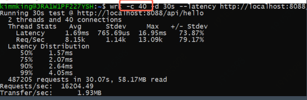

高并发用户（Concurrent Users） 

> 压测的时候，设置的  -c 参数，就是并发数

高吞吐量（Throughout） 

> 水库装水，容量大小

低延迟（Latency） 

> 延迟：是系统内部的，到达系统的时间 与 离开系统的时间 差。
>
> 响应时间：客户发送请求的时间 与 客户收到响应的时间 差。
>
> Latency Distribution：使用百分数衡量延迟，50% 在3ms 完成，P 50 = 3ms。
>
> 一般看系统的 P50 和 P99，保证请求的绝大多数都回去了。


#### 高性能的另一面

如果实现了高性能，有什么副作用呢？

系统复杂度 x10以上（淘宝，几千人，做了很多年，复杂）

建设与维护成本++++

故障或 BUG 导致的破坏性 x10以上 （坏了太难受，修复难）


#### 应对策略

稳定性建设（混沌工程）：

1、容量（量化下来，到底容量多少）
2、爆炸半径（微服务，降低半径，就一块的问题）
3、工程方面积累与改进 

> 一天 86400秒
>
> 系统，1000 TPS
>
> 则，一天总共 8600 万请求。
>
> 淘宝一天的请求量是 3000万左右，平均的 TPS 是 300 ~ 400.
>
> 美团等，二级梯度的 请求量是 1000~2000万左右
>
> 双十一活动，将所有的淘宝，天猫流量导入到 支付宝，做到了国内目前最大的并发，50万 TPS
>
> 前几年，12306 可能并发回达到 10 万 TPS

云厂商，亚马逊（AWS），微软（Awre），阿里（阿里云）；做活动的机器多，其他时间有剩余，需要多赚钱！


### Netty 如何实现高性能 

#### Netty 概览

网络应用开发框架

1. 异步
2. 事件驱动
3. 基于 NIO

适用于:
• 服务端
• 客户端
• TCP/UDP 

> Netty 对编程，实现了模型的统一，写什么代码都差不多


#### 从 Socket IO 到 NIO 

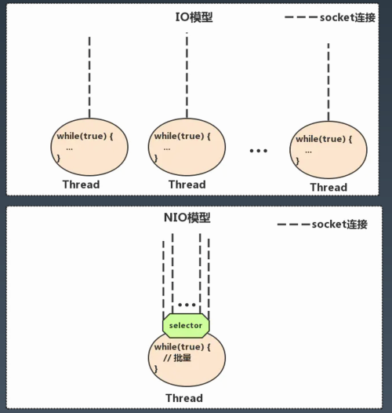


#### 从 Socket IO 到 NIO--BIO多线程模型 

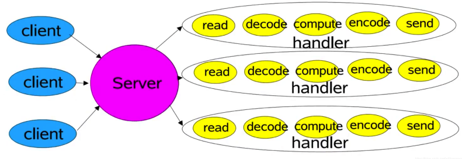


#### 回顾一下事件处理机制 

- 类比吃饭去饭馆，拿到号码，等待桌子用餐 

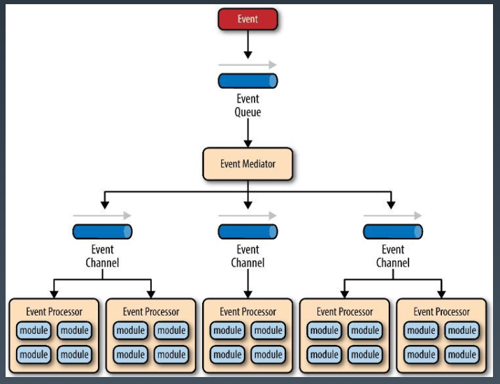


#### 从事件处理机制到 Reactor 模型 

Reactor 模式首先是事件驱动的，有一个或者多个并发输入源，有一个 Service Handler和多个EventHandlers。

这个 Service Handler 会同步的将输入的请求多路复用的分发给相应的 Event Handler。 

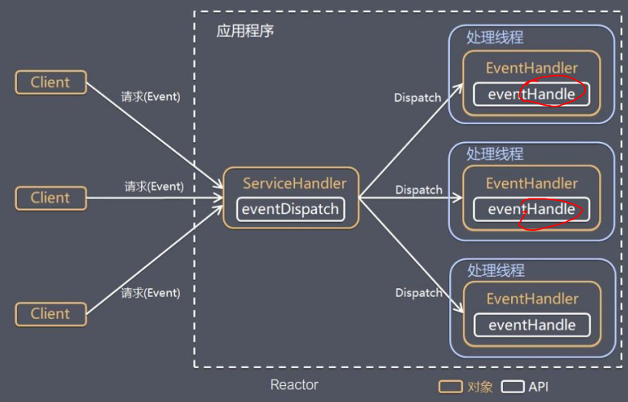


#### 从 Reactor 模型到 Netty NIO--01 

Reactor 单线程模型 

Doug lea 《Scalable IO in Java》 

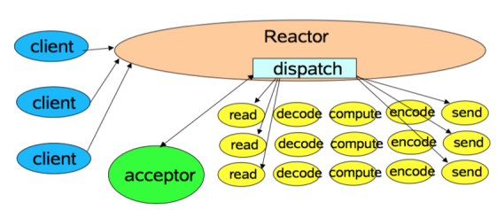

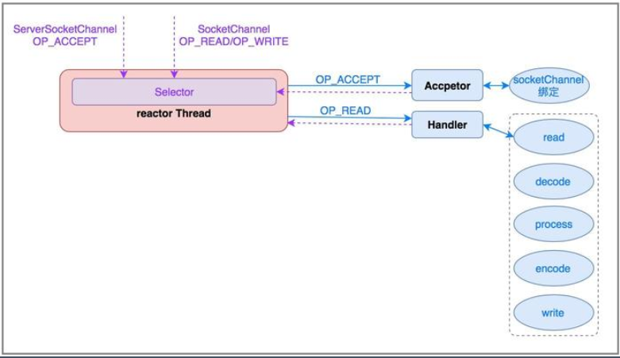


#### 从 Reactor 模型到 Netty NIO--02

Reactor 多线程模型 

默认线程数，是CPU核心的两倍。

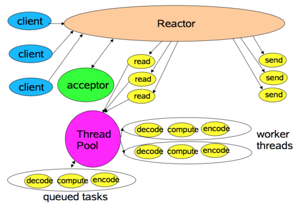

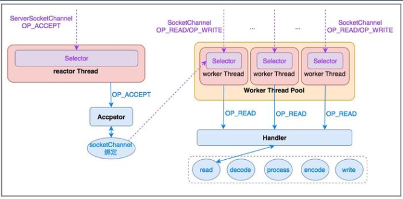


#### 从 Reactor 模型到 Netty NIO--03 

Reactor 主从模型 

> 下图画错了！

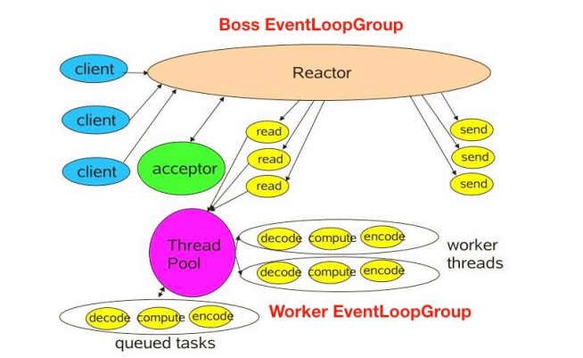

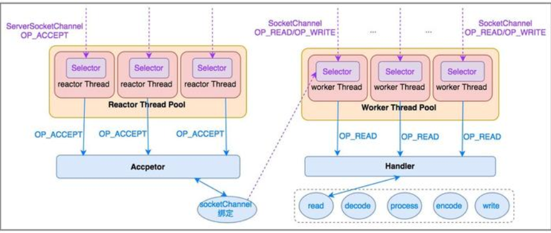


#### Netty 对三种模式的支持 

- Reactor 单线程模式
- 非主从 Reactor 多线程模式
- 主从 Reator 多线程模式

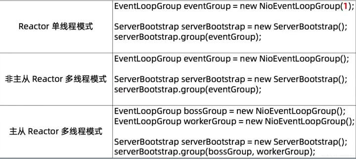


#### Netty 启动和处理流程 

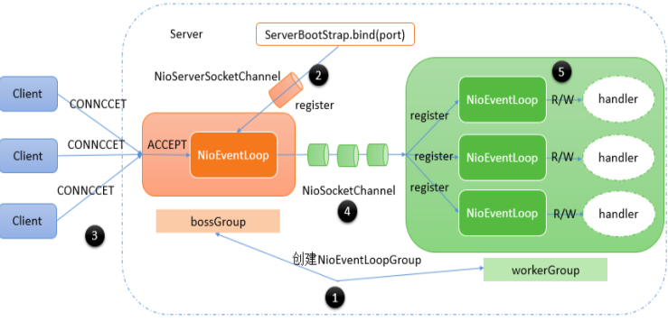


#### Netty 线程模式 

- 单线程不断地轮询，进行高效处理
- 注意：单线程模型，不能进行被堵住
- Redis 也是单线程，高效的处理（适合查询，不适合范围查询操作）

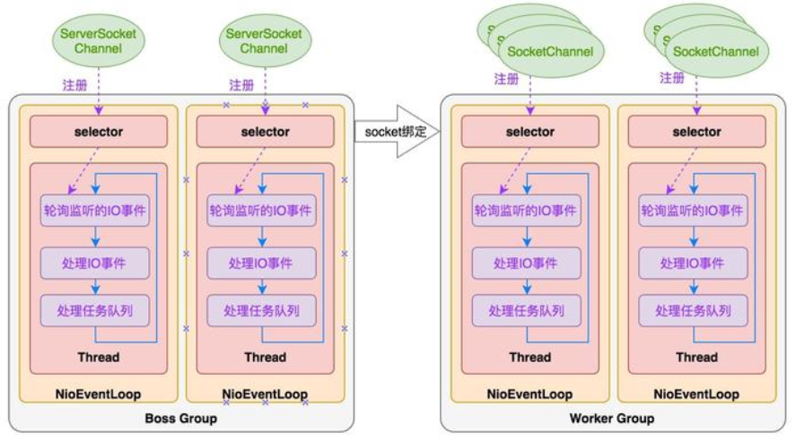


#### Netty 核心对象 

- 到底什么是 EventLoop 
- 一个 EventLoop 挂 多个 Channel
- Channel 负责 IO 事件的流通
- 核心对象：BECH（bootstrap, eventloop, chinnel, handler）

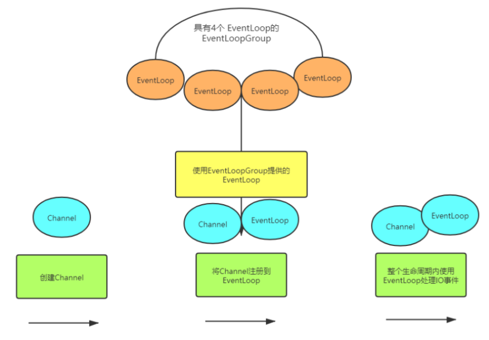


#### Netty 运行原理 

- Boss Group 配置 1个
- WorkGroup 配置 CPU核心的2倍

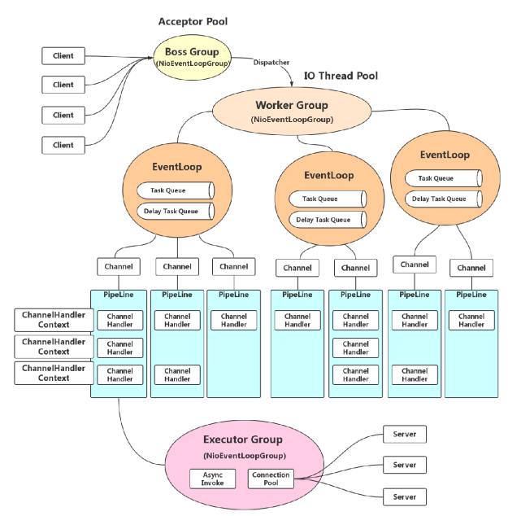


#### 关键对象 

- Bootstrap: 启动线程，开启 socket
- EventLoopGroup
- EventLoop
- SocketChannel: 连接
- ChannelInitializer: 初始化
- ChannelPipeline: 处理器链
- ChannelHandler: 处理器 


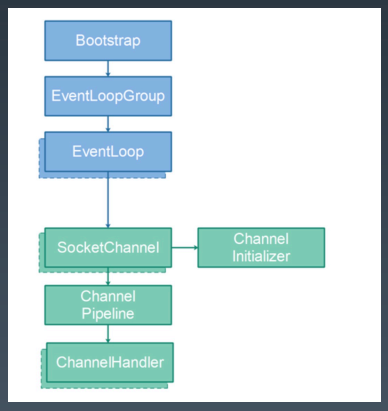


#### ChannelPipeline 

- ChannelIndoundHandler，类比 Request
- ChannelOutboundhandler，类似 Response

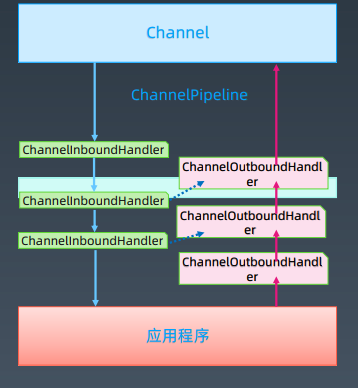


#### Event & Handler 

入站事件：
• 通道激活和停用
• 读操作事件
• 异常事件
• 用户事件

出站事件：
• 打开连接
• 关闭连接
• 写入数据
• 刷新数据

事件处理程序接口:
• ChannelHandler
• ChannelOutboundHandler
• ChannelInboundHandler

适配器（空实现，需要继承使用）：
• ChannelInboundHandlerAdapter
• ChannelOutboundHandlerAdapter 

Netty 应用组成:
• 网络事件
• 应用程序逻辑事件
• 事件处理程序


### Netty 网络程序优化 

#### 粘包与拆包

> 操作系统有个缓冲区，没有指定长度读取数据。
>
> 需要提前定义接受方式的规则，与TCP没有关系。需要保证数字一直与个数完整。
>
> HTTP 发送大文件的时候，使用 chunk机制，进行 大小指定与数据发送 形式。
>
> HTTP 断点续传机制，并发下载的时候，第一个线程取数据的第一段，第二个线程取第二段，最后拼接，完成并发任务。使用 HTTP 的 Range 命令。（FTP也存在Range命令）
>
> 粘包，只有TCP有，是全双工的，互相发消息没有影响，UDP是一片一片的，单向的，不存在粘包。
>
> QQ是 UDP，在UDP的基础上封装一层，保证数据的顺序与总个数，确保数据丢失可以确定是哪一个，重新发。

都是人为问题

ByteToMessageDecoder 提供的一些常见的实现类：

1.FixedLengthFrameDecoder：定长协议解码器，我们可以指定固定的字节数算一个完整的报文

2.LineBasedFrameDecoder：行分隔符解码器，遇到\n 或者\r\n，则认为是一个完整的报文

3.DelimiterBasedFrameDecoder：分隔符解码器，分隔符可以自己指定（@!__!@）

4.LengthFieldBasedFrameDecoder：长度编码解码器，将报文划分为报文头/报文体

5.JsonObjectDecoder：json 格式解码器，当检测到匹配数量的“{” 、”}”或”[””]”时，则认为是一个完整的 json 对象或者 json 数组 

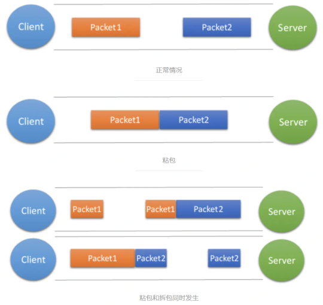


#### Nagle 与 TCP_NODELAY 

> 写soket 的程序中，使用的 send，只是将数据从用户发送给操作系统内核，并没有直接发送到网络上。
>
> 至于什么时候发送到网络上，是由操作系统完成的，取决于是否缓存区满了，是否大道理超时时间。

网络上的数据包：
MTU: Maxitum Transmission Unit最大传输单元（1500 Byte）
MSS: Maxitum Segment Size 最大分段大小（1460 Byte ）（大于这个数据，需要分包发送，在这个上下的数据，测试会有很大的差距）

网络拥堵与 Nagle 算法优化：TCP_NODELAY

优化条件：

- 缓冲区满
- 达到超时 （200ms）


#### 连接优化 

- 注意 TCP 与 UDP 区别 
- 用三次握手建立 TCP 连接 的各状态
  - 如果客户端给服务器发送 ACK的时候，服务器没收到，然后怎么办？然后客户端的发送请求就会连接超时，报错喽！类似于服务器宕机了。
- TCP连接必须经过时间 2 MSL 后才真正释放掉。
  - MSL 是周期，windows 默认1分钟，linux默认两分钟。
  - 查看本机的TCP连接状态：netstat -anot

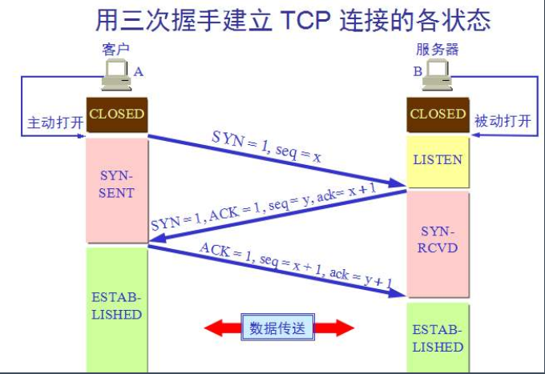

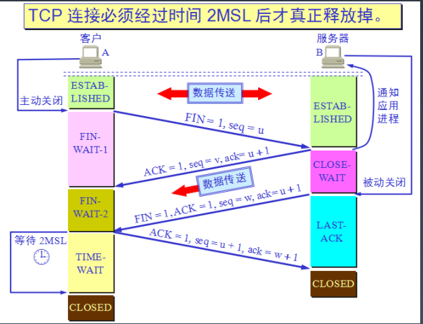


#### Netty 优化 

1、不要阻塞 EventLoop

2、系统参数优化(让系统的Tcp回收时间更快)
ulimit -a /proc/sys/net/ipv4/tcp_fin_timeout (linux), TcpTimedWaitDelay(Windows)

3、缓冲区优化
SO_RCVBUF/SO_SNDBUF/SO_BACKLOG/ REUSEXXX（重用端口和连接）

4、心跳周期优化
心跳机制（发送空的数据包，数据库中使用定时给数据库发送一个语句SELECT 1;jdbc4之后，使用isvoid直接进行检测）与断线重连

5、内存与 ByteBuffer 优化（零拷贝技术）
DirectBuffer（堆外内存，直接共享，都可以操作）与HeapBuffer（堆内存共享）

6、其他优化

- ioRatio（io比例，50：50）
- Watermark（缓冲区写满，水位，低水位，高水位）
- TrafficShaping （流控机制，削峰填谷）


### 典型应用：API 网关

#### 网关的结构和功能

- 类似于政府大院，门卫登记，鉴权，认证
- 请求接入
- 业务聚合
- 中介策略
- 统一管理

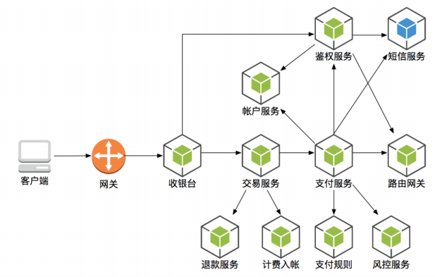

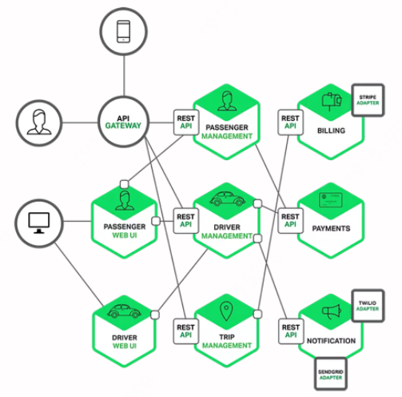

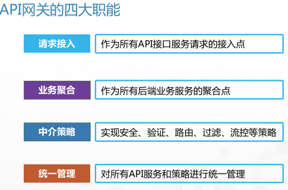


#### 网关的分类

- 流量网关
  - Nginx，俄罗斯人写的，难懂，****的指针。
- 业务网关
  - Zuul，Zuul 2.0，Spring Cloud

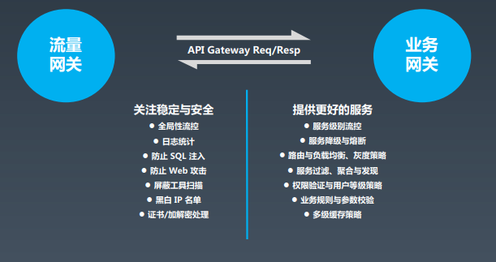


#### Zuul(BIO)

Zuul 是 Netflix 开源的 API 网关系统，它的主要设计目标是动态路由、监控、弹性和安全。

Zuul 的内部原理可以简单看做是很多不同功能 filter 的集合，最主要的就是 pre、routing、post 这三种过滤器，分别作用于调用业务服务 API 之前的请求处理、直接响应、调用业务服务 API 之后的响应处理。

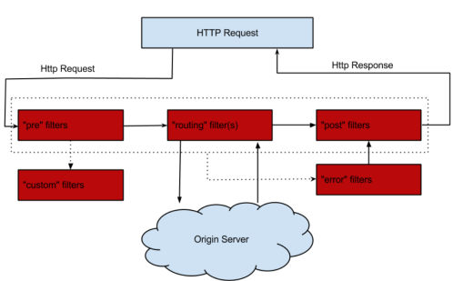


#### Zuul 2.0(NIO)

Zuul 2.x 是基于 Netty 内核重构的版本。几万行代码中，大部分都是在封装 Netty，提供 Service。

核心功能：
1.Service Discovery
2.Load Balancing
3.Connection Pooling
4.Status Categories
5.Retries
6.Request Passport
7.Request Attempts
8.Origin Concurrency Protection
9.HTTP/2
10.Mutual TLS
11.Proxy Protocol
12.GZip
13.WebSockets

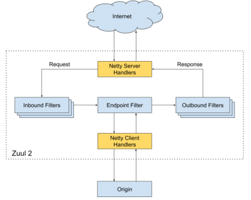


#### Spring Cloud Gateway

- 基于 Webflex 底层实现
- 早于 Zuul 2.0，所以实现上借鉴了 Zuul 1.0，详细参看微服务中：Zuul 和 微服务网关架构。

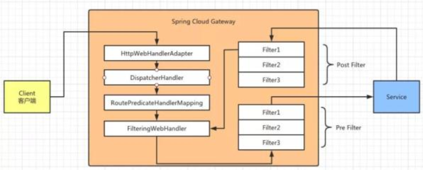


#### 网关对比

- Nginx, OpenResty, Kong
- Spring Cloud Gateway, Zuul 2.0
- 现在的网关都是不带控制台的，需求：带控制台的网关


### 自己动手实现 API 网关

#### 最简单的网关--gateway 1.0

- 网关类似于代理，Proxy
- HttpServer + 可以请求数据的程序 + 后端业务程序

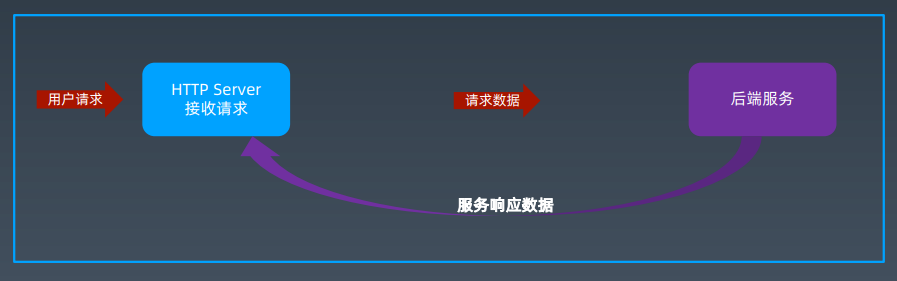

#### 最简单的网关--gateway 2.0

- 添加过滤器，网关中最重要的是过滤器
- Netty 中的 Handler，InBound,OutBound

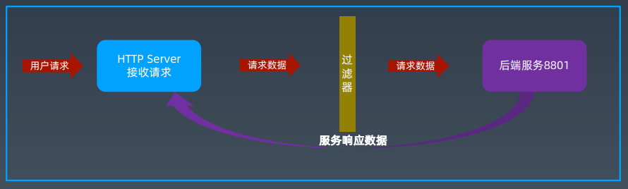


#### 最简单的网关--gateway 3.0

- 添加 Router，满足微服务的服务分发。

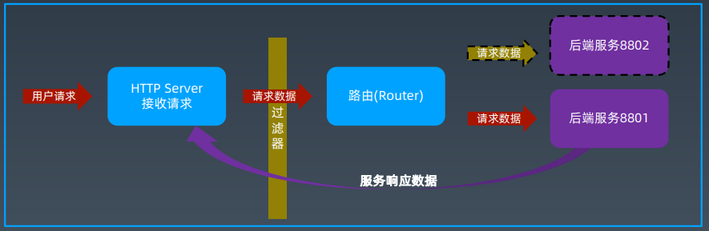


#### 架构设计

设计：技术复杂度与业务复杂度
抽象：概念理清、正确命名
组合：组件之间的相互关系

> DSL，领域特定语言
>
> 广义：你懂我的黑话。（自己的语言）


### 总结回顾与作业实践 

#### 总结回顾

再谈谈什么是高性能
Netty 如何实现高性能
Netty 网络程序优化
典型应用：API 网关
自己动手实现 API 网关


#### 作业实践

1、按今天的课程要求，实现一个网关，基础代码可以 fork：https://github.com/kimmking/JavaCourseCodes    02nio/nio02 文件夹下实现以后，代码提交到 Github。
1）周四作业：整合你上次作业的httpclient/okhttp；
2）周四作业（可选）:使用 netty 实现后端 http 访问（代替上一步骤）；
3）周六作业：实现过滤器
4）周六作业（可选）：实现路由


## Java 并发编程 --线程

### 多线程基础 

#### 为什么会有多线程 

本质原因是摩尔定律失效 -> 多核+分布式时代的来临。(仙童公司，Intel，时间与空间的局限性)

JVM、NIO 是不是都因为这个问题变复杂？

后面讲的分布式系统，也是这个原因。 


> SMP（对称多处理） VS NUMA（非均匀存储访问模式）
>
> M是对称一致内存

多 CPU 核心意味着同时操作系统有更多的并行计算资源可以使用。
操作系统以线程作为基本的调度单元。

单线程是最好处理不过的。
线程越多，管理复杂度越高。

跟我们程序员都喜欢自己单干一样。
《人月神话》里说加人可能干得更慢。

可见多核时代的编程更有挑战。 

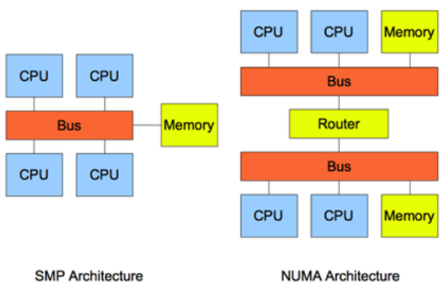


#### Java 线程的创建过程 

线程与进程的区别是什么？ 

> 在linux中，Nginx 启动5个进程，内部使用5个线程，单线程操作，每一个进程之间具有父子进程关系。可以保证，5个进程，同时监听80一个端口。

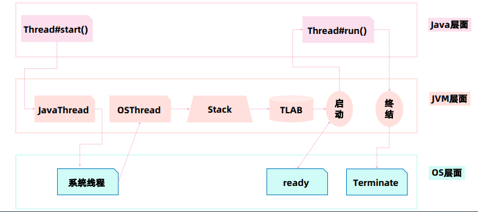


### Java 多线程

#### Thread 使用示例 

• 守护线程
• 启动方式

思考:

1. 输出结果是什么?
2. 为什么?
3. 有哪些方式可以修改? 

```java
public static void main(String[] args) {
    Runnable task = new Runnable() {
        @Override
        public void run() {
            try {
                Thread.sleep(5000);
            } catch (InterruptedException e) {
                e.printStackTrace();
            }
            Thread t = Thread.currentThread();
            System.out.println("当前线程:" + t.getName());
    	}
	};
    Thread thread = new Thread(task);
    thread.setName("test-thread-1");
    thread.setDaemon(true);
    thread.start();
}
```


#### 基础接口 - Runnable 

辨析:
Thread#start():创建新线程
Thread#run() : 本线程调用 

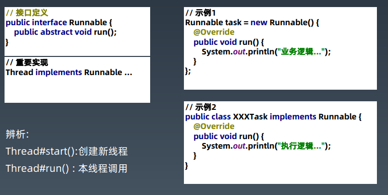


#### 线程状态 

- 线程 start() 之后，会变成 Runable状态，至于什么时候 Running ，不知道，需要看 CPU什么时候调用
- 类似于 NIO 中，send 消息，是到操作系统的缓存区中，至于什么时候发送，不知道
- sleep() 函数，没法精确的控制时间，有太多因素影响，绝对时间都是有误差的
- Windows 中，创建文件的时间，精确值到分钟，有太多误差，会导致时间不一致

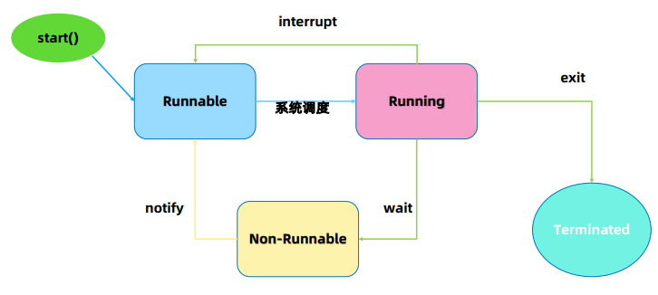


#### Thread 类 

java.lang.Thread

| 重要属性/方法                          | 说明                                   |
| -------------------------------------- | -------------------------------------- |
| volatile String name;                  | 线程名称 – 诊断分析使用                |
| boolean daemon = false;                | 后台守护线程标志 – 决定JVM优雅关闭     |
| Runnable target;                       | 任务(只能通过构造函数传入)             |
| synchronized void start()              | 【协作】启动新线程并自动执行           |
| void join()                            | 【协作】等待某个线程执行完毕（来汇合） |
| static native Thread currentThread();  | 静态方法: 获取当前线程信息             |
| static native void sleep(long millis); | 静态方法: 线程睡眠并让出CPU时间片      |


#### wait & notify 

| Object# 方法                       | 说明                                                         |
| ---------------------------------- | ------------------------------------------------------------ |
| void wait()                        | 放弃锁+等待0ms+尝试获取锁;                                   |
| void wait(long timeout, int nanos) | 放弃锁 + wait + 到时间自动唤醒/中途唤醒 (精度: nanos>0则 timeout++) |
| native void wait(long timeout);    | 放弃锁+ wait + 到时间自动唤醒/中途被唤醒 (唤醒之后需要自动获取锁) |
| native void notify();              | 发送信号通知1个等待线程                                      |
| native void notifyAll();           | 发送信号通知所有等待线程                                     |

辨析:
• Thread.sleep: 释放 CPU，睡眠，不释放锁
• Object#wait : 释放锁 ，等待


#### Thread 的状态改变操作 

1. Thread.sleep(long millis)，一定是当前线程调用此方法，当前线程进入 TIMED_WAITING 状态，但不释放对象锁，millis 后线程自动苏醒进入就绪状态。作用：给其它线程执行机会的最佳方式。
2. Thread.yield()，一定是当前线程调用此方法，当前线程放弃获取的 CPU 时间片，但不释放锁资源，由运行状态变为就绪状态，让 OS 再次选择线程。作用：让相同优先级的线程轮流执行，但并不保证一定会轮流执行。实际中无法保证yield() 达到让步目的，因为让步的线程还有可能被线程调度程序再次选中。Thread.yield() 不会导致阻塞。该方法与sleep() 类似，只是不能由用户指定暂停多长时间。（类似于死循环）
3. t.join()/t.join(long millis)，当前线程里调用其它线程 t 的 join 方法，当前线程进入WAITING/TIMED_WAITING 状态，当前线程不会释放已经持有的对象锁。线程t执行完毕或者 millis 时间到，当前线程进入就绪状态。
4. obj.wait()，当前线程调用对象的 wait() 方法，当前线程释放对象锁，进入等待队列。依靠 notify()/notifyAll() 唤醒或者 wait(long timeout) timeout 时间到自动唤醒。
5. obj.notify() 唤醒在此对象监视器上等待的单个线程，选择是任意性的。notifyAll() 唤醒在此对象监视器上等待的所有线程。 


#### Thread 的中断与异常处理

1. 线程内部自己处理异常，不溢出到外层。
2. 如果线程被 Object.wait, Thread.join 和 Thread.sleep 三种方法之一阻塞，此时调用该线程的interrupt() 方法，那么该线程将抛出一个 InterruptedException 中断异常（该线程必须事先预备好处理此异常），从而提早地终结被阻塞状态。如果线程没有被阻塞，这时调用interrupt() 将不起作用，直到执行到 wait(),sleep(),join() 时,才马上会抛出InterruptedException。
3. 如果是计算密集型的操作怎么办？
分段处理，每个片段检查一下状态，是不是要终止。 


#### Thread 状态

1、本线程主动操作
2、被动：

- 遇到锁
- 被通知

线程分三类：

- 运行和就绪 RR
- 等待和超时等待 WW
- 阻塞 B
- RWB

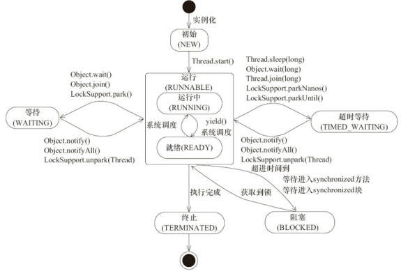


### 线程安全

#### 多线程执行会遇到什么问题?


竞态条件 临界区 共享与同步(线程间通信) 多线程

多个线程竞争同一资源时，如果对资源的访问顺序敏感，就称存在竞态条件。

导致竞态条件发生的代码区称作临界区。

不进行恰当的控制，会导致线程安全问题


#### 并发相关的性质-原子性

原子性：原子操作，注意跟事务 ACID 里原子性的区别与联系

对基本数据类型的变量的读取和赋值操作是原子性操作，即这些操作是不可被中断的，
要么执行，要么不执行。

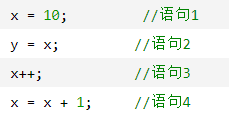

只有语句1是原子操作，如果变量定义为方法的局部变量，就不会有并发问题，其他线程看不到变量。

多个线程并发问题 类似于多个事务的并发问题


#### 并发相关的性质-可见性

可见性：对于可见性，Java 提供了 volatile 关键字来保证可见性。

当一个共享变量被 volatile 修饰时，它会保证修改的值会立即被更新到主存，当有其他线程需要读取时，它会去内存中读取新值。

另外，通过 synchronized 和 Lock 也能够保证可见性，synchronized 和 Lock 能保证同一时刻只有一个线程获取锁然后执行同步代码，并且在释放锁之前会将对变量的修改刷新到主存当中。

volatile 并不能保证原子性。


#### 并发相关的性质-有序性

有序性：Java 允许编译器和处理器**对指令进行重排序**，但是重排序过程不会影响到单线程程序的执行，却会影响到多线程并发执行的正确性。可以通过 volatile 关键字来保证一定的“有序性”（synchronized 和 Lock也可以）。

**happens-before 原则**（先行发生原则）：

1. 程序次序规则：一个线程内，按照代码先后顺序执行
2. 锁定规则：一个 unLock 操作先行发生于后面对同一个锁的 lock 操作
3. Volatile 变量规则：对一个变量的写操作先行发生于后面对这个变量的读操作
4. 传递规则：如果操作 A 先行发生于操作 B，而操作 B 又先行发生于操作 C，则可以得出 A 先于 C
5. 线程启动规则：Thread 对象的 start() 方法先行发生于此线程的每个一个动作
6. 线程中断规则：对线程 interrupt() 方法的调用先行发生于被中断线程的代码检测到中断事件的发生
7. 线程终结规则：线程中所有的操作都先行发生于线程的终止检测，我们可以通过 Thread.join() 方法结束、Thread.isAlive() 的返回值手段检测到线程已经终止执行
8. 对象终结规则：一个对象的初始化完成先行发生于他的 finalize() 方法的开始


#### 一个简单的实际例子

最简单的例子
多线程计数
如何解决？ 


#### synchronized 的实现

1. 使用对象头标记字(Object monitor)（使用锁标志位，实现加解锁）
2. Synchronized 方法优化
3. 偏向锁: BiaseLock

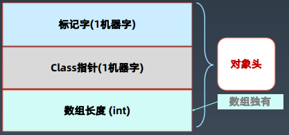

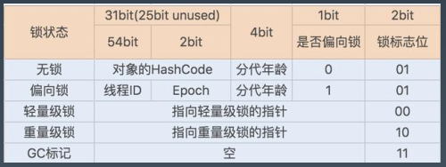


####  synchronized 使用示例

思考: 哪种方式性能更高？
• 同步块 : 粒度小
• 同步方法: 专有指令

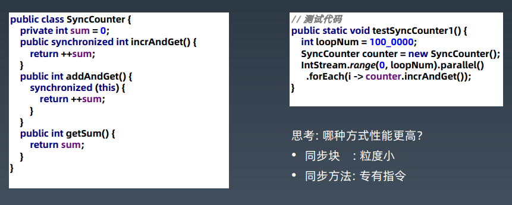


#### volatile

1. 每次读取都强制从主内存刷数据
2. 适用场景： 单个线程写；多个线程读
3. 原则： 能不用就不用，不确定的时候也不用
4. 替代方案： Atomic 原子操作类

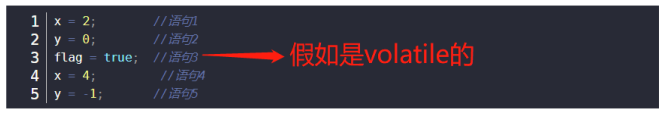

那么，语句1和2，不会被重排到3的后面，4和5也不会到前面。
同时可以保证1和2的结果是对3、4、5可见。


#### final

思考: final 声明的引用类型与原生类型在处理时有什么区别?

Java 里的常量替换。写代码最大化用 final 是个好习惯。

- Java 中使用 final 之后，就会写出静态常量。 

| final 定义类型    | 说明                                                         |
| ----------------- | ------------------------------------------------------------ |
| final class XXX   | 不允许继承                                                   |
| final 方法        | 不允许 Override                                              |
| final 局部变量    | 不允许修改                                                   |
| final 实例属性    | • 构造函数/初始化块/<init>之后不允许变更； <br />• 只能赋值一次 <br />• 安全发布: 构造函数结束返回时，final 域最 新的值被保证对其他线程可见 |
| final static 属性 | <clinit>静态块执行后不允许变更； 只能赋值一次                |


### 线程池原理与应用

#### 线程池

1. Excutor: 执行者 – 顶层接口
2. ExcutorService: 接口 API
3. ThreadFactory: 线程工厂
4. Excutors: 工具类 （线程池工厂）


####  Executor – 执行者 

| 重要方法                        | 说明             |
| ------------------------------- | ---------------- |
| void execute(Runnable command); | 执行可运行的任务 |

线程池从功能上看，就是一个**任务执行器**

submit 方法 -> 有返回值，用 Future 封装
execute 方法 -> 无返回值

submit 方法的异常可以在主线程中 catch 到。
execute 方法执行任务是捕捉不到异常的。 

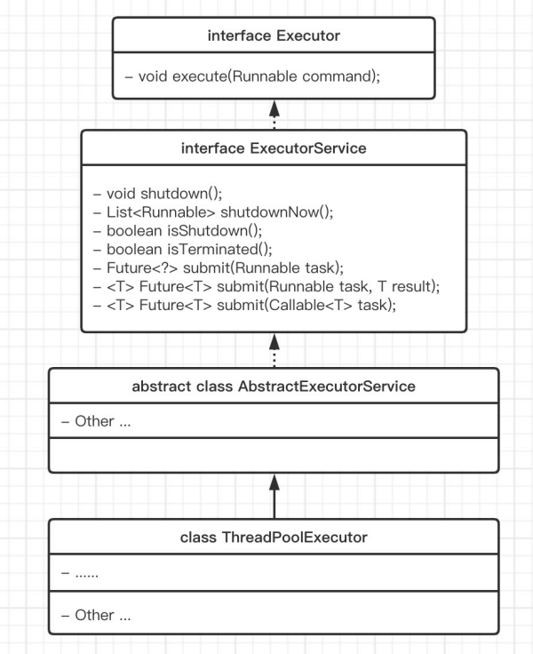


#### ExecutorService 

| 重要方法                                       | 说明                                     |
| ---------------------------------------------- | ---------------------------------------- |
| void execute(Runnable command);                | 执行可运行的任务                         |
| void shutdown();                               | 关闭线程池                               |
| List<Runnable> shutdownNow();                  | 立即关闭                                 |
| Future<?> submit(Runnable task);               | 提交任务; 允许获取执行结果               |
| <T> Future<T> submit(Runnable task, T result); | 提交任务（指定结果）; 控制\|获取执行结果 |
| <T> Future<T> submit(Callable<T> task);        | 提交任务; 允许控制任务和获取执行结果     |

shutdown()：停止接收新任务，原来的任务**继续**执行
shutdownNow()：停止接收新任务，原来的任务**停止**执行
awaitTermination(long timeOut, TimeUnit unit)：当前线程阻塞 


####  ThreadFactory

| 重要方法                      | 说明       |
| ----------------------------- | ---------- |
| Thread newThread(Runnable r); | 创建新线程 |

ThreadPoolExecutor 提交任务逻辑:

1. 判断 corePoolSize 【创建】
2. 加入 workQueue
3. 判断 maximumPoolSize 【创建】
4. 执行拒绝策略处理器 

注意：一开始没有线程，来任务创建核心线程；然后将任务加到队列中缓一缓，再接着创建非核心线程，最后执行拒绝策略。

```sh
/*
* Proceed in 3 steps:
*
* 1. If fewer than corePoolSize threads are running, try to
* start a new thread with the given command as its first
* task.  The call to addWorker atomically checks runState and
* workerCount, and so prevents false alarms that would add
* threads when it shouldn't, by returning false.
*
* 2. If a task can be successfully queued, then we still need
* to double-check whether we should have added a thread
* (because existing ones died since last checking) or that
* the pool shut down since entry into this method. So we
* recheck state and if necessary roll back the enqueuing if
* stopped, or start a new thread if there are none.
*
* 3. If we cannot queue task, then we try to add a new
* thread.  If it fails, we know we are shut down or saturated
* and so reject the task.
*/
```

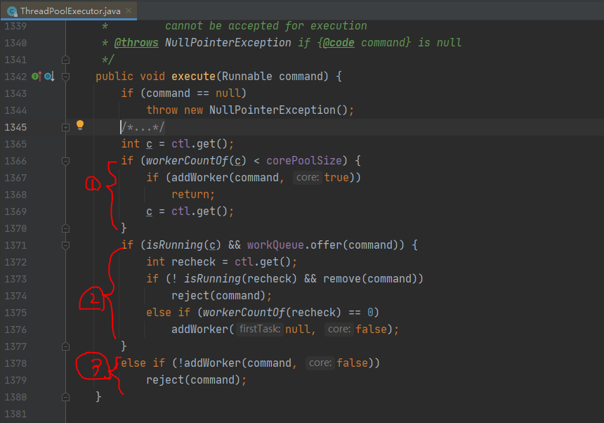


#### 线程池参数-缓冲队列

**BlockingQueue** 是双缓冲队列。BlockingQueue 内部使用两条队列，允许两个线程同
时向队列一个存储，一个取出操作。在保证并发安全的同时，提高了队列的存取效率。

1. ArrayBlockingQueue:规定大小的 BlockingQueue，其构造必须指定大小。其所含的对象是 FIFO 顺序排序的。
2. LinkedBlockingQueue:大小不固定的 BlockingQueue，若其构造时指定大小，生成的 BlockingQueue 有大小限制，不指定大小，其大小有 Integer.MAX_VALUE 来决定。其所含的对象是 FIFO 顺序排序的。
3. PriorityBlockingQueue:类似于 LinkedBlockingQueue，但是其所含对象的排序不是 FIFO，而是依据对象的自然顺序或者构造函数的 Comparator 决定。
4. SynchronizedQueue:特殊的 BlockingQueue，对其的操作必须是放和取交替完成。 

 

#### 线程池参数-拒绝策略

1. ThreadPoolExecutor.AbortPolicy:丢弃任务并抛出 RejectedExecutionException异常。（默认策略，很常见）
2. ThreadPoolExecutor.DiscardPolicy：丢弃任务，但是不抛出异常。（没有异常，不好，没法做补偿措施）
3. ThreadPoolExecutor.DiscardOldestPolicy：丢弃队列最前面的任务，然后重新提交被拒绝的任务
4. ThreadPoolExecutor.CallerRunsPolicy：由调用线程（提交任务的线程）处理该任务 （很常见，让提交任务的线程来直接执行任务，此时就不会再丢任务了）


#### ThreadFactory 示例 

 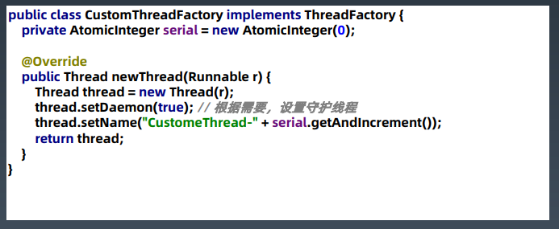


#### ThreadPoolExecutor 

| 重要属性/方法                      | 说明           |
| ---------------------------------- | -------------- |
| int corePoolSize;                  | 核心线程数     |
| int maximumPoolSize;               | 最大线程数     |
| ThreadFactory threadFactory;       | 线程创建工厂   |
| BlockingQueue<Runnable> workQueue; | 工作队列       |
| RejectedExecutionHandler handler;  | 拒绝策略处理器 |
| void execute(Runnable command)     | 执行           |
| Future<?> submit(Runnable task)    | 提交任务       |
| submit(Runnable task, T result)    | 提交任务       |
| submit(Callable<T> task)           | 提交任务       |

execute 与 submit 的区别，一个是有返回值，一个是没有返回值。（对应于java 语言设计的时候，需要针对这两种情况，分开设计不同的抽象）


#### ThreadPoolExecutor 示例 


####  创建线程池方法

1. newSingleThreadExecutor（串行GC，一个线程跑）
创建一个单线程的线程池。这个线程池只有一个线程在工作，也就是相当于单线程串行执行所有任务。如果这个唯一的线程因为异常结束，那么会有一个新的线程来替代它。此线程池保证所有任务的执行顺序按照任务的提交顺序执行。

2. newFixedThreadPool（HTTP程序3中的固定大小线程池）
    创建固定大小的线程池。每次提交一个任务就创建一个线程，直到线程达到线程池的最大大小。线程池的大小一旦达到最大值就会保持不变，如果某个线程因为执行异常而结束，那么线程池会补充
    一个新线程。

  坑：默认 LinkedQueue，没有固定大小

3. newCachedThreadPool（HTTP程序2中每一个请求new一个新的线程）
    创建一个可缓存的线程池。如果线程池的大小超过了处理任务所需要的线程，那么就会回收部分空闲（60秒不执行任务）的线程，当任务数增加时，此线程池又可以智能的添加新线程来处理任务。此线程池不会对线程池大小做限制，线程池大小完全依赖于操作系统（或者说JVM）能够创建的最大线程大小。

  坑：线程数默认无穷大，太多了，CPU切换成本高

4. newScheduledThreadPool
    创建一个大小无限的线程池。此线程池支持定时以及周期性执行任务的需求。 


#### 创建固定线程池经验

不是越大越好，太小肯定也不好：
假设核心数为 N，

1、如果是CPU密集型应用，则线程池大小设置为N或者 N+1

2、如果是IO密集型应用，则线程池大小设置为2N或2N+2


#### Callable – 基础接口

| 重要方法                   | 说明     |
| -------------------------- | -------- |
| V call() throws Exception; | 调用执行 |

对比:
• Runnable#run()没有返回值
• Callable#call()方法有返回值 

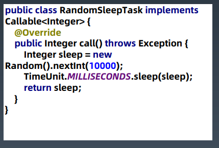


#### Future – 基础接口 

| 重要方法                                                     | 说明                        |
| ------------------------------------------------------------ | --------------------------- |
| boolean cancel(boolean mayInterruptIfRunning);               | 取消任务 （执行时是否打断） |
| boolean isCancelled();                                       | 是否被取消                  |
| boolean isDone();                                            | 是否执行完毕                |
| V get() throws InterruptedException, ExecutionException;     | 获取执行结果                |
| V get(long timeout, TimeUnit unit) throws InterruptedException, ExecutionException, TimeoutException; | 限时获取执行结果            |

注意：等待执行结果的时候，使用 Future 实现，最后使用 get 方法获得结果，设置一个超时时间，防止干等待，被阻塞。

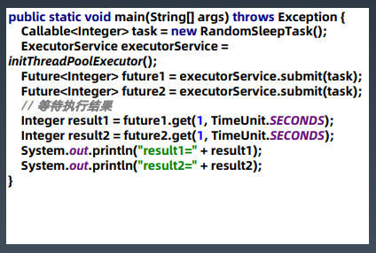


### 总结回顾与作业实践 

#### 总结回顾

1.多线程基础
2.Java 多线程*
3.线程安全*
4.线程池原理与应用* 

 

#### 作业实践 

1、（可选）跑一跑课上的各个例子，加深对多线程的理解
2、（可选）完善网关的例子，试着调整其中的线程池参数 


 

## Java 并发编程 --并发

### Java 并发包 

#### JDK 核心库的包 

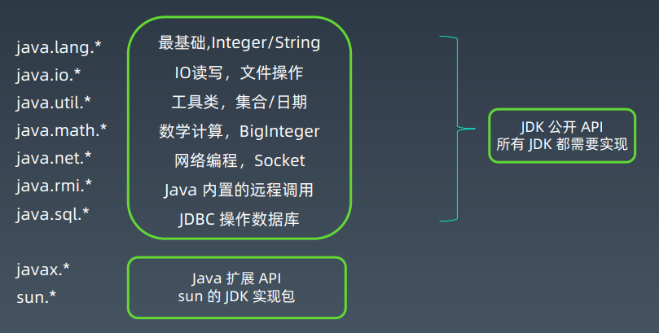


#### Java.util.concurrency 

 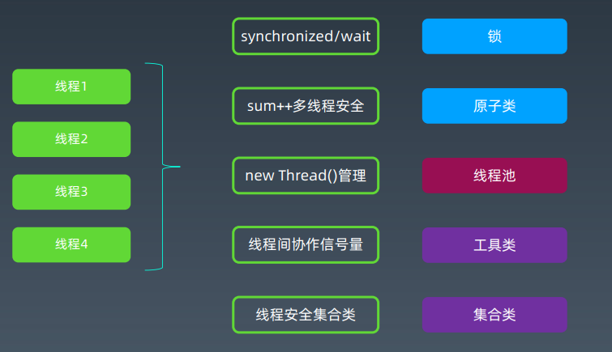

锁机制类 Locks : Lock, Condition, ReadWriteLock
原子操作类 Atomic : AtomicInteger
线程池相关类 Executer : Future, Callable, Executor
信号量三组工具类 Tools : CountDownLatch, CyclicBarrier, Semaphore
并发集合类 Collections : CopyOnWriteArrayList, ConcurrentMap 

 

### 到底什么是锁 

#### 为什么需要显式的 Lock

回忆一下，上节课讲过的，synchronized 可以加锁，wait/notify 可以看做加锁和解锁。

那为什么还需要一个显式的锁呢？ 

synchronized 方式的问题：
1、同步块的阻塞无法中断（不能 Interruptibly）
2、同步块的阻塞无法控制超时（无法自动解锁）
3、同步块无法异步处理锁（即不能立即知道是否可以拿到锁）
4、同步块无法根据条件灵活的加锁解锁（即只能跟同步块范围一致） 


#### 更自由的锁: Lock

1. 使用方式灵活可控
2. 性能开销小
3. 锁工具包: java.util.concurrent.locks

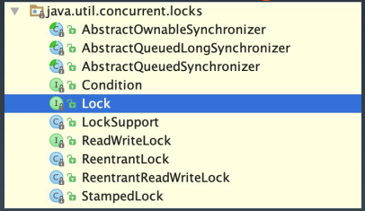

 思考: Lock 的性能比 synchronized 高吗？ 

```java
Lock 接口设计：
// 1.支持中断的 API
void lockInterruptibly() throws InterruptedException;
// 2.支持超时的 API
boolean tryLock(long time, TimeUnit unit) throws InterruptedException;
// 3.支持非阻塞获取锁的 API
boolean tryLock(); 
```


#### 基础接口 - Lock 

| 重要方法                                                     | 说明                                                         |
| ------------------------------------------------------------ | ------------------------------------------------------------ |
| void lock();                                                 | 获取锁; 类比 synchronized (lock)                             |
| void lockInterruptibly() throws InterruptedException;        | 获取锁; 允许打断;                                            |
| boolean tryLock(long time, TimeUnit unit) throws InterruptedException; | 尝试获取锁; 成功则返回 true; 超时则退出                      |
| boolean tryLock();                                           | 尝试【无等待】获取锁; 成功则返回 true                        |
| void unlock();                                               | 解锁；要求当前线程已获得锁; 类比同步块结束                   |
| Condition newCondition();                                    | 新增一个绑定到当前Lock的条件； <br />示例: （类比: Object monitor） <br />final Lock lock = new ReentrantLock(); <br />final Condition notFull = lock.newCondition(); final Condition notEmpty = lock.newCondition(); |


#### Lock 示例 

思考:
什么是可重入锁? (ReentrantLock, 默认是非公平锁)
-- 第二次进入时是否阻塞。

什么是公平锁？
-- 公平锁意味着排队靠前的优先。
-- 非公平锁则是都是同样机会。 

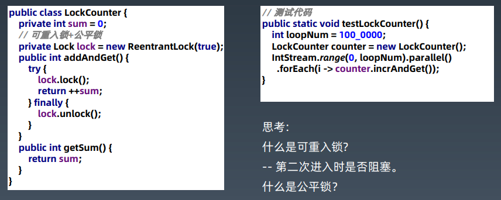


#### 读写锁 – 接口与实现 

| 重要方法          | 说明                         |
| ----------------- | ---------------------------- |
| Lock readLock();  | 获取读锁; 共享锁             |
| Lock writeLock(); | 获取写锁; 独占锁(也排斥读锁) |

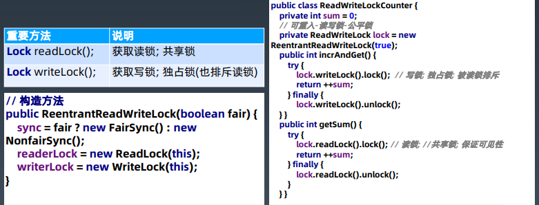

注意：ReadWriteLock 管理一组锁，一个读锁，一个写锁。
读锁可以在没有写锁的时候被多个线程同时持有，写锁是独占的。

所有读写锁的实现必须确保写操作对读操作的内存影响。每次只能有一个写线程，但是同时可以有多个线程并发地读数据。ReadWriteLock 适用于读多写少的并发情况。 


#### 基础接口 - Condition

| 重要方法                                                     | 说明                                                |
| ------------------------------------------------------------ | --------------------------------------------------- |
| void await() throws InterruptedException;                    | 等待信号; 类比 Object#wait()                        |
| void awaitUninterruptibly();                                 | 等待信号;                                           |
| boolean await(long time, TimeUnit unit) throws InterruptedException; | 等待信号; 超时则返回 false                          |
| boolean awaitUntil(Date deadline) throws InterruptedException; | 等待信号; 超时则返回 false                          |
| void signal();                                               | 给一个等待线程发送唤醒信号; 类比 Object#notify ()   |
| void signalAll();                                            | 给所有等待线程发送唤醒信号; 类比 Object#notifyAll() |

 通过 Lock.newCondition()创建。

可以看做是 Lock 对象上的信号。类似于 Object 中的 wait/notify。 


#### LockSupport--锁当前线程 

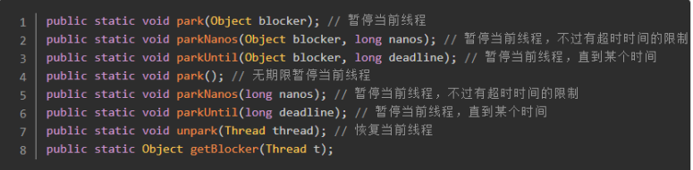

LockSupport 类似于 Thread 类的静态方法，专门处理（执行这个代码的）本线程的。

思考：为什么 unpark 需要加一个线程作为参数？
因为一个 park 的线程，无法自己唤醒自己，所以需要其他线程来唤醒。 


#### 用锁的最佳实践

Doug Lea《Java 并发编程：设计原则与模式》一书中，推荐的三个用锁的最佳实践，它们分别是：

1. 永远只在更新对象的成员变量时加锁
2. 永远只在访问可变的成员变量时加锁
3. 永远不在调用其他对象的方法时加锁

KK总结-最小使用锁：
1、降低锁范围：锁定代码的范围/作用域
2、细分锁粒度：将一个大锁，拆分成多个小锁 

 

### 并发原子类 

#### Atomic 工具类

1. 原子类工具包:
java.util.concurrent.atomic 

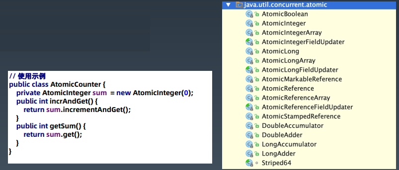

对比前面讲的，int sum，sum++线程不安全的例子。 

 

#### 无锁技术 – Atomic 工具类 

2. 无锁技术的底层实现原理
• Unsafe API ---> Compare-And-Swap
• CPU 硬件指令支持: CAS 指令 

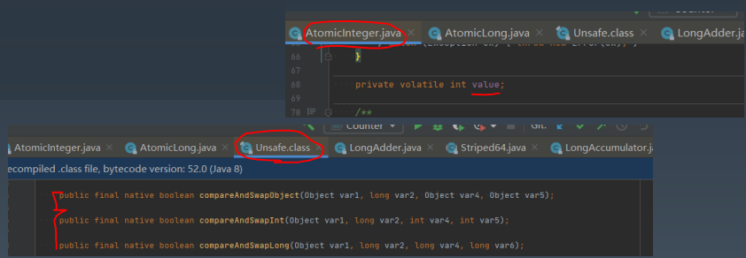

核心实现原理：
1、volatile 保证读写操作都可见（注意不保证原子）；
2、使用 CAS 指令，作为**乐观锁**实现，通过自旋重试保证写入。 

 

#### 锁与无锁之争

3. 思考一下，到底是有锁好，还是无锁好？
    什么情况下有锁好
    什么情况下无锁好

  乐观锁、悲观锁
  数据库事务锁 

CAS 本质上没有使用锁。

并发压力跟锁性能的关系：
1、压力非常小，性能本身要求就不高；
2、压力一般的情况下，无锁更快，大部分都一次写入；
3、压力非常大时，自旋导致重试过多，资源消耗很大。 


#### LongAdder 对 AtomicLong 的改进

通过分段思想改进原子类，大家想想，还有哪些是用这个思想？

多路**归并**的思想（分布式数据库主键生成）：

- 快排
- G1 GC
- ConcurrentHashMap

 还记得我们讲的爬山，做一个大项目，都需要加里程碑，也是分段 

 LongAdder 的改进思路：
1、AtomicInteger 和 AtomicLong 里的 value 是所有线程竞争读写的热点数据；
2、将单个 value 拆分成跟线程一样多的数组 Cell[]；
3、每个线程写自己的 Cell[i]++，最后对数组求和。 


### 并发工具类 

#### 什么是并发工具类

思考一下：
多个线程之间怎么相互协作？

前面讲到的：
1、wait/notify，
2、Lock/Condition,
可以作为简单的协作机制。

但是更复杂的，需要这些线程满足某些条件（数量，时间，）。 


更复杂的应用场景，比如

- 我们需要控制实际并发访问资源的并发数量
- 我们需要多个线程在某个时间同时开始运行
- 我们需要指定数量线程到达某个状态再继续处理 


#### AQS

-  AbstractQueuedSynchronizer，即**队列同步器**。它是构建锁或者其他同步组件的基础（如Semaphore、CountDownLatch、ReentrantLock、ReentrantReadWriteLock），是JUC并发包中的核心基础组件。 
- AbstractQueuedSynchronizer：抽象队列式的同步器
- 两种资源共享方式: 独占 | 共享，子类负责实现公平 OR 非公平 


#### Semaphore - 信号量

1. 准入数量 N
2. N =1 则等价于独占锁

使用场景：同一时间控制并发线程数


#### CountdownLatch 

场景: Master 线程等待 Worker 线程把任务执行完

示例: 等所有人干完手上的活，一起去吃饭。 


#### CountDownLatch 示例 


#### CyclicBarrier 

- 屏障
- 场景: 任务执行到一定阶段, 等待其他任务对齐。
- 示例: 等待所有人都到达，再一起开吃。 


#### CyclicBarrier 示例


#### CountDownLatch 与 CyclicBarrier 比较 


#### Future/FutureTask/CompletableFuture 


#### CompletableFuture 

| 重要方法                                                     | 说明                       |
| ------------------------------------------------------------ | -------------------------- |
| static final boolean useCommonPool = (ForkJoinPool.getCommonPoolParallelism() > 1); | 是否使用内置线程池         |
| static final Executor asyncPool = useCommonPool ? ForkJoinPool.commonPool() : new ThreadPerTaskExecutor(); | 线程池                     |
| CompletableFuture<Void> runAsync(Runnable runnable)；        | 异步执行【当心阻塞？】     |
| CompletableFuture<Void> runAsync(Runnable runnable, Executor executor) | 异步执行, 使用自定义线程池 |
| T get()                                                      | 等待执行结果               |
| T get(long timeout, TimeUnit unit)                           | 限时等待执行结果           |
| T getNow(T valueIfAbsent)                                    | 立即获取结果(默认值)       |
| ……                                                           |                            |


### 总结回顾与作业实践 

#### 总结回顾

1. Java 到底什么是锁 并发包（*JUC）
3. 并发原子类*
4. 并发工具类详解* 


#### 作业实践

1、（选做）把示例代码，运行一遍，思考课上相关的问题。也可以做一些比较。

2、（必做）思考有多少种方式，在 main 函数启动一个新线程，运行一个方法，拿到这个方法的返回值后，退出主线程？
写出你的方法，越多越好，提交到 Github。

一个简单的代码参考：
https://github.com/kimmking/JavaCourseCodes/tree/main/03concurrency/0301/src/main/java/java0/conc0303/Homework03.java 


## Java 并发编程 --安全编程与面试经验

### 常用线程安全类型

#### JDK 基础数据类型与集合类

- 原生类型，
- 数组类型，
- 对象引用类型
- 注意：Properties的坑，java.util.Properties#getProperty(java.lang.String)，如果取出来的对象不是String，就直接设置为 null。


#### ArrayList

基本特点：基于数组，便于按 index 访问，超过数组需要扩容，扩容成本较高

用途：大部分情况下操作一组数据都可以用 ArrayList

原理：使用数组模拟列表，默认大小10，扩容 x1.5，newCapacity = oldCapacity +(oldCapacity >> 1)

安全问题：

1、写冲突：

- 两个写，相互操作冲突

2、读写冲突：

- 读，特别是 iterator 的时候，数据个数变了，拿到了非预期数据或者报错
- 产生ConcurrentModificationException


#### LinkedList

基本特点：使用双链表实现，无需扩容

用途：不知道容量，插入变动多的情况

原理：使用双向指针将所有节点连起来

安全问题：

1、写冲突：

- 两个写，相互操作冲突

2、读写冲突：

- 读，特别是 iterator 的时候，数据个数变了，拿到了非预期数据或者报错
- 产生 ConcurrentModificationException


#### List 线程安全的简单办法

既然线程安全是写冲突和读写冲突导致的

最简单办法就是，读写都加锁。

例如：

- 1.ArrayList 的方法都加上 synchronized -> Vector
- 2.Collections.synchronizedList，强制将 List 的操作加上同步
- 3.Arrays.asList，不允许添加删除，但是可以 set 替换元素
- 4.Collections.unmodifiableList，不允许修改内容，包括添加删除和 set


#### CopyOnWriteArrayList

核心改进原理（应用发布，滚动停机，发布）：
1、写加锁，保证不会写混乱
2、写在一个 Copy 副本上，而不是原始数据上（GC young 区用复制，old 区用本区内的移动）

读写分离
最终一致

1、插入元素时，在新副本操作，不影响旧引用，why?

2、删除元素时，
1）删除末尾元素，直接使用前 N-1 个元素创建一个新数组。
2）删除其他位置元素，创建新数组，将剩余元素复制到新数组。

3、读取不需要加锁，why？

4、使用迭代器的时候，直接拿当前的数组对象做一个快照，此后的 List元素变动，就跟这次迭代没关系了。
想想：淘宝商品 item 的快照。商品价格会变，每次下单都会生成一个当时商品信息的快照。


#### HashMap

基本特点：空间换时间，哈希冲突不大的情况下查找数据性能很高

用途：存放指定 key 的对象，缓存对象

原理：使用 hash 原理，存 k-v 数据，初始容量16，扩容 x2，负载因子0.75
JDK8 以后，在链表长度到8 & 数组长度到64时，使用红黑树。

安全问题：
1、写冲突，
2、读写问题，可能会死循环
3、keys()无序问题


#### LinkedHashMap

基本特点：继承自 HashMap，对 Entry 集合添加了一个双向链表

用途：保证有序，特别是 Java8 stream 操作的 toMap 时使用

原理：同 LinkedList，包括插入顺序和访问顺序

安全问题：
同 HashMap


#### ConcurrentHashMap-Java7 分段锁

分段锁
默认16个Segment，降低锁粒度。
concurrentLevel = 16

想想：
Segment[] ~ 分库
HashEntry[] ~ 分表


#### ConcurrentHashMap-Java8

Java 7为实现并行访问，引入了Segment 这一结构，实现了分段锁，理论上最大并发度与 Segment 个数相等。

Java 8为进一步提高并发性，摒弃了分段锁的方案，而是直接使用一个大的数组。

why?

putIfAbsent() 方法


#### 并发集合类总结

- 规模小，排序数字 < 7，使用冒泡排序，
- 规模大，排序数字 > 7，使用快速排序


### 并发编程相关内容

#### 线程安全操作利器 - ThreadLocal

| 重要方法                   | 说明                |
| -------------------------- | ------------------- |
| public ThreadLocal()       | 构造方法            |
| protected T initialValue() | 覆写-设置初始默认值 |
| void set(T value)          | 设置本线程对应的值  |
| void remove()              | 清理本线程对应的值  |
| T get()                    | 获取本线程对应的值  |

- 线程本地变量
- 场景: 每个线程一个副本
- 不改方法签名静默传参（隐式传参）
- 及时进行清理 
- 可以看做是 Context 模式，减少显式传递参数 


#### 四两拨千斤 - 并行 Stream 

- 多线程执行，只需要加个 .parallel() 即可 
- 不动用其他的代码，默认启动一个线程池，将后面的任务包装成一个 Runable，默认线程个数是 CPU核心的两倍
- 数据量的大小决定了最终的性能


#### 伪并发问题

- 跟并发冲突问题类似的场景很多
- 比如浏览器端，表单的**重复提交**问题
  - 1、客户端控制（调用方），点击后按钮不可用，跳转到其他页
  - 2、服务器端控制（处理端），给每个表单生成一个编号，提交时判断重复 

还有没有其他办法？

- 提交表单，将后续的操作拆开
- 下单->下单成功->操作成功
- 永远站在客户的角度思考


#### 分布式下的锁和计数器

- 分布式环境下，多个机器的操作，超出了线程的协作机制，一定是并行的
- 例如某个任务只能由一个应用处理，部署了多个机器，怎么控制
- 例如针对用户的限流是每分钟60次计数，API 服务器有3台，用户可能随机访问到任何一台，怎么控制？（秒杀场景是不是很像？库存固定且有限。） 

不要着急，分布式缓存会详细讲


### 并发编程经验总结 

#### 加锁需要考虑的问题

1. 粒度
2. 性能
3. 重入
4. 公平
5. 自旋锁（spinlock）（乐观锁模式，如果不是最新的，就会重新提交，保证并发的量，不然越并发越占资源）
6. 场景: 脱离业务场景谈性能都是耍流氓 （业务一般在数据库，中间件一般在IO）


#### 线程间协作与通信

1. 线程间共享:
• static/实例变量(堆内存)
• Lock
• synchronized
2. 线程间协作:
• Thread#join()
• Object#wait/notify/notifyAll
• Future/Callable
• CountdownLatch
• CyclicBarrier 

可以思考：不同进程之间有哪些方式通信 ？

- 操作系统的信号量，Signal
  - kill -9 是线程的自杀信号量
  - kill -3 是jstac，打出线程栈
- 操作系统的管道，| ，前面执行的结果，传递到后面
- 共享内存，共享文件，剪切板，走socket通信，数据库


### 并发编程常见面试题 


### 总结回顾与作业实践 

#### 总结回顾

1.常用线程安全类型*
2.并发编程相关内容
3.并发编程经验总结*
4.并发编程常见面试题* 


#### 作业实践

1、（选做）列举常用的并发操作 API 和工具类，简单分析其使用场景和优缺点。

2、（选做）请思考：什么是并发？什么是高并发？实现高并发高可用系统需要考虑哪些因素，对于这些你是怎么理解的？

3、（选做）请思考：还有哪些跟并发类似/有关的场景和问题，有哪些可以借鉴的解决办法。

4、（必做）把多线程和并发相关知识带你梳理一遍，画一个脑图，截图上传到 Github上。
可选工具：xmind，百度脑图，wps，MindManage或其他。 


