# Java Advanced


## 高级 Java 工程师岗位职责

- 具备扎实的 Java 基础，精通多线程编程、NIO 模型，设计模式
- 熟练掌握 Spring 等主流的开发框架，深入理解框架实现原理及特性
- 熟练掌握 MySQL 数据库，具备 MySQL 索引优化、查询优化的能力
- 熟悉常见的开源分布式中间件、缓存、消息队列等，有相关的优化经验
- 有大规模分布式系统的开发和高可用相关的实践经验，具备设计复杂系统的能力
- 热爱技术，对代码质量和开发规范有近乎苛刻的要求，善于沟通与团队协作


## 讲师：秦金卫

Apache Dubbo/ShardingSphere PMC，前阿里架构师/前火币高级技术总监

Apache Dubbo PMC，前阿里架构师/某商业银行北京研发中心负责人/前火币高级技术总监、TGO 鲲鹏会会员；

关注于互联网，电商，金融，支付，区块链等领域，熟悉海量并发低延迟交易系统的设计实现， 10 多年研发管理和架构经验；

熟悉各类中间件，擅长于 SOA /微服务等分布式系统架构，热爱各种开源技术，活跃于多个开源社区。

过去十来年的工作中：

曾作为求职者，拿到过几乎所有一二线互联网公司的架构师、技术专家/总监职位 Offer。

曾作为面试官，面试超过 2000 人次，具备丰富的一线技术人员的面试经验和辅导经验。


## 课程大纲

链接：https://shimo.im/docs/ttt3pDKgjCWYGGyK/read

### 模块一：JVM 进阶 - Java开发者大厂面试必知必会

#### 教学目标：

1. 从 0 掌握 JVM 关键技术，了解核心知识；
2. 全面了解各类 GC 算法的原理和特性，洞悉相关原理；
3. 全面学习常见的 JVM 分析调优工具，上手十八般武艺；
4. 一线大厂 JVM 面试题全面剖析，助力拿到心仪 Offer。


#### 学习和工作中的痛点：

1. 没有经过体系化 JVM 学习，不懂原理，做不到知其然知其所以然；
2. 不熟悉 JVM 工具和方法，遇到问题不知道从何下手、如何分析和解决问题；
3. 缺乏实际场景的练习，每次看看书上的知识就忘，理解不深，无法做到融会贯通；
4. 在面试过程中十回有九回都遇到问 JVM 理论和分析调优的问题，每次都很难让面试官满意。


#### 通过学习掌握的核心能力：

1. 夯实基础：掌握 JVM 的基础知识和常用工具，了解一般原理，知道从什么地方着手分析问题；
2. 深入学习：掌握各类 GC 算法的一般原理，知道如何根据实际需要选择使用合适的 GC 策略；
3. 分析问题：掌握 GC 日志、线程、内存等维度的分析技巧，知道排查问题和优化系统的套路；
4. 积累经验：了解常见的分析调优经验，熟悉常见的面试问题和技巧，彻底学会 JVM 知识。


#### 详细内容：

1. JVM 基础知识、Java 字节码技术、JVM 类加载器、JVM 内存模型、JVM 启动参数详解；
2. JDK 内置命令行工具、JDK 内置图形界面工具、JDWP 简介、JMX 与相关工具；
3. 常见的 JVM GC 算法（Parallel GC/CMS GC/G1 GC）基本原理和特点；
4. 新一代 GC 算法（Java11 ZGC/Java12 Shenandoah）和Oracle Graalvm；
5. GC 日志解读与分析、JVM 的线程堆栈等数据分析、内存 dump 和内存分析工具；
6. fastThread 相关工具以及面临复杂问题时的几个高级工具的使用；
7. JVM 问题排查分析的常用手段、性能调优的最佳实践经验等；
8. JVM 相关的常见面试问题必知必会、全面分析。


### 模块二：NIO 技术--构建高吞吐服务器的终极武器

#### 教学目标：

1. 理解 NIO 的相关概念和原理，了解核心知识；
1. 全面掌握 Netty 相关的功能特性，掌握 Netty 的技术原理；
1. 全面学会使用 Netty 技术编程，能够写出高效服务器端代码；
1. 掌握常用的性能压测技术和相关工具，能够压测 HTTP 接口性能。


#### 学习和工作中的痛点：

1. 不理解 NIO 相关概念和技术点，搞不清原理，沟通和面试时无法准确表达；
1. 缺乏实际场景的练习，对 Netty 的使用和原理不熟悉，难以应用到工作中；
1. 不会使用 Netty 做高性能服务端编程，对性能相关指标和数据没有概念。


#### 通过学习掌握的核心能力：

1. 夯实基础：掌握 NIO 相关的知识和技术，能知道各种技术有什么优缺点，适用于什么场景；
1. 深入学习：熟练掌握 Netty/NIO 编程，能够设计实现一个高性能 HTTP 服务器/API 网关；
1. 积累经验：了解常见的性能相关概念和压测入门，对性能指标有清晰概念，能够简单地量化分析。


#### 详细内容：

1. 同步/异步、阻塞/非阻塞、BIO、NIO、AIO、Reactor/Proactor；
1. ByteBuff/Acceptor/Channel/Handler、NioEventLoopGroup/EventLoop、bossGroup/workerGroup；
1. Netty 的启动和执行过程、线程模型、事件驱动、服务端和客户端的使用方式；
1. 常见的 API Gateway/HTTP Server、SEDA 原理、业务 API 网关的功能和结构；
1. Throughout/TPS/QPS、Latency/P99/P95/P90、ApacheBench/Wrk/JMeter/LoadRunner。


### 模块三：并发编程--多核处理器时代高性能的秘诀

#### 教学目标：

1. 学会多线程、高并发相关概念和技术，了解并发编程的核心知识；
1. 全面了解并发的相关技术的原理和用途，洞悉技术原理和相互关系；
1. 熟练掌握 Java 的多线程、并发包中各个类的使用，上手十八般武艺。


#### 学习和工作中的痛点：

1. 没有经过系统性学习并发编程，搞不清楚技术原理，写不出一个良好的多线程/异步代码；
1. 不熟悉 Java 的各个多线程工具和方法，遇到多线程问题常常束手无措，不会分析解决问题；
1. 缺乏实际场景的练习，平时没怎么用到多线程和并发，导致死记硬背的概念总是记不住。


#### 通过学习掌握的核心能力：

1. 夯实基础：系统掌握 Java 多线程和并发编程的技术原理和知识点，写出优秀的并发代码；
1. 深入学习：熟练应用各种并发工具，了解在什么情况下使用哪些具体的技术和方法；
1. 分析问题：掌握常见的多线程和并发问题分析技巧，知道排查一般问题的具体步骤；
1. 积累经验：构建完整全面的并发编程知识体系，熟悉常见的面试问题和技巧，彻底掌握Java并发编程知识。


#### 详细内容：

1. Java 多线程基础：线程、锁、synchronized、volatile/final、sleep/await/notify/fork/join；
1. Java 并发包基础：线程池 Executor、AQS/CAS、Atomic 原子操作、Lock/ReadWriteLock/Condition、Callable/Future；
1. Java 并发容器与工具：BlockingQueue/CopyOnWriteList/ConcurrentHashMap、CountDownLatch/CyclicBarrier/Semaphore等；
1. 其他：万金油 ThreadLocal，化繁为简 Java8 parallelStream 等。


### 模块四：开发框架--深入理解 Spring 等主流框架思想

#### 教学目标：

1. 重新认识主流开源技术框架，深入理解背后的原理和关系；
1. 掌握整合各种框架的最佳实践，学会在工作中做技术框架选型；
1. 了解主流框架的发展趋势，一线大厂的使用模式和关注点。


#### 学习和工作中的痛点：

1. 对主流开源技术框架，始终在会用、会做简单整合，不懂背后原理；
1. 只会用自己熟悉的框架，不会做技术选型，也不了解一些最佳实践经验；
1. 框架发展太快，学习跟不上了，也不太了解一线大厂使用主流框架的方式。


#### 通过学习掌握的核心能力：

1. 夯实基础：从更高的维度和更深入的原理，重新学习主流框架，了解框架的内在联系；
1. 深入学习：掌握常见框架的一些最佳实践经验，能够根据具体的项目情况进行技术框架选型；
1. 积累经验：了解常见主流框架的发展趋势，掌握最佳学习姿势，能够轻松驾驭技术发展。


#### 详细内容：

1. Spring 技术体系（Spring Core/Web/MVC/Data/Messaging、Spring Boot 等）；
1. ORM 技术体系（JPA、Hibernate、MyBatis 等）。


### 模块五：系统性能优化--学会性能分析与 MySQL 优化

#### 教学目标：

1. 深入了解业务系统性能的度量分析方法，找到性能瓶颈和关键路径；
1. 了解 MySQL 的性能关键点，学会如何进行 MySQL 和 SQL 语句的性能分析；
1. 掌握如何编写高效的 SQL 语句，能对复杂的业务 SQL 进行性能优化。


#### 学习和工作中的痛点：

1. 性能调优能力是架构师/技术专家的核心能力之一，但是对这一块没经验；
1. 遇到性能问题不知道从何下手、如何分析性能瓶颈在哪儿，也就不知道如何解决问题；
1. 缺乏实际场景的练习，每次看别人讲的理论，都没办法转化到实际工作中去；
1. 在面试过程中经常被问到分析调优的问题，总是觉得自己没有太多干货可讲。


#### 通过学习掌握的核心能力：

1. 深入学习：通过系统化的学习性能相关知识和实践经验，掌握复杂业务系统性能分析方法；
1. 分析问题：掌握 SQL/索引/事务 的分析技巧，知道排查问题和优化 MySQL/SQL 的办法；
1. 积累经验：掌握编写高性能 SQL 的技能，避免常见的各种低性能坑，提升数据库编程水平。


#### 详细内容：

1. 系统可观测性（日志、调用链跟踪、指标度量），80/20 优化原则，CPU、内存、磁盘/网络 IO 等分析；
1. MySQL 的锁、事务、索引、并发级别、死锁、执行计划、慢 SQL 统计、缓存失效、参数优化；
1. 库表设计优化，引擎选择，表结构优化设计，列类型选择，索引设计，外键等；
1. SQL 查询优化，索引选择，连接优化，聚合查询优化，Union 优化，子查询优化，条件优化等；
1. 场景分析，主键生成与优化，高效分页，快速导入导出数据，解决死锁问题等。


### 模块六：超越分库分表--掌握海量业务数据的应对之道

#### 教学目标：

1. 从 0 掌握海量业务数据处理的关键技术，了解核心知识，参与实践案例；
1. 全面学习 MySQL 主从复制架构，读写分离和数据库垂直/水平拆分；
1. 学习应对系统不同类型数据的处理办法，对数据进行冷热分离，提升系统数据处理能力；
1. 全面掌握各类场景下的读写分离，数据库拆分的框架和中间件，在实际工作中熟练使用。


#### 学习和工作中的痛点：

1. 只会增删改查，不了解对海量业务数据的处理办法；
1. 每次被人问到 MySQL 的高可用和高性能架构，都不能清晰地讲明白；
1. 缺乏实际场景的练习，不了解不同类型的数据对应的处理办法；
1. 对于常见的读写分离、分库分表等技术，停留在理论阶段，没有动手实践过。


#### 通过学习掌握的核心能力：

1. 夯实基础：全面了解 MySQL 主从复制架构，读写分离和数据库垂直/水平拆分的应用场景和技术原理；
1. 深入学习：进一步学会 MySQL 的高可用和高性能架构；
1. 分析问题：掌握应对系统不同类型数据的处理办法，对数据进行冷热分离，提升系统数据处理能力；
1. 积累经验：全面掌握各类场景下的读写分离，分库分表的框架和中间件，在实际工作中熟练使用。


#### 详细内容：

1. MySQL 主从复制，Binlog，Row/Statement 模式，主从切换，读写分离，数据库扩容；
1. 数据库垂直拆分与水平拆分，分库分表，分布式主键，分表算法，SQL 限制，数据迁移，实时同步；
1. Spring 动态切换数据库，TDDL/Sharding-JDBC 框架，MyCat/Sharding-Proxy 中间件；
1. 数据库拆分的最佳实践，分布式事务的最佳实践，多租户的最佳实践。


### 模块七：分布式服务--复杂业务系统架构演进必由之路

#### 教学目标：

1. 全面掌握 RPC 原理和常见的 RPC 技术；
1. 深刻理解服务治理相关的技术和应用场景；
1. 深入学习 Dubbo 和 Spring Cloud 的功能和技术原理；
1. 深入了解微服务架构的特点和最佳实践。


#### 学习和工作中的痛点：

1. 会用简单的 RPC 和 REST，但是对其原理和细节不够了解；
1. 一直没有实际接触过服务治理相关的技术，只知道几个名词，不清楚具体的功能和用法；
1. 对 Dubbo 和 Spring Cloud 一知半解，简单作为 RPC 调用都会，再复杂的就不太清楚了；
1. 微服务相关的知识都有些了解，但是不是很懂到底什么时候该做微服务，怎么做微服务。


#### 通过学习掌握的核心能力：

1. 夯实基础：系统的了解和学习 RPC 知识，知道每种 RPC 有什么特点，什么时候用什么 RPC 技术；
1. 深入学习：全面的学习一遍服务治理的技术，能够认识到什么情况下使用哪种具体的特性；
1. 分析问题：深刻理解 Dubbo 和 Spring Cloud 技术体系原理，遇到问题能够迅速定位和解决；
1. 积累经验：深入了解微服务架构的特点和最佳实践经验，学会何时做微服务，如何做微服务。


#### 详细内容：

1. 基础知识：RPC、通信与数据协议、WebService、Hessian、REST、gRPC、Protocol Buffers 等；
1. 服务化：服务治理、配置管理、注册发现、服务分组、版本管理、集群管理、负载均衡、限流与降级熔断等；
1. 框架：Apache Dubbo 的功能与原理分析，Spring Cloud 体系，具体的案例实践；
1. 微服务：微服务架构的 6 个最佳实践，从微服务到服务网格、云原生的介绍。


### 模块八：分布式缓存--复杂业务系统访问提速第一法宝

#### 教学目标：

1. 深入理解缓存的应用场景和缓存策略；
1. 全面掌握几种常见缓存问题的处理方式；
1. 彻底掌握 Redis 缓存中间件，了解 Hazelcast 内存网格；
1. 学会使用缓存技术实现排行数据展示，分布式 ID 生成等典型应用场景。


#### 学习和工作中的痛点：

1. 对缓存的认知停留在 JVM 内的静态 Map 和往 Redis 存 KV 数据，不了解什么时候该用缓存；
1. 不熟悉常见的缓存问题处理方案，遇到问题难以解决，例如缓存失效和雪崩问题如何解决；
1. 只了解简单的 Redis 操作，高级功能（例如集群或 Lua）没用过，其他缓存技术也没接触过；
1. 没有在实际的应用场景里用 Redis 之类的缓存技术，不知道具体有哪些典型的应用场景。


#### 通过学习掌握的核心能力：

1. 夯实基础：掌握缓存的应用场景和常见的策略，特别是与数据库的同步；
1. 深入学习：掌握常见的缓存问题的处理策略，将缓存技术应用到实际工作；
1. 分析问题：全面掌握 Redis 缓存技术，能够分析和解决缓存问题；
1. 积累经验：深入实践和掌握几个典型的应用场景，了解 Hazelcast 内存网格技术。


#### 详细内容：

1. 缓存的应用场景，缓存加载策略与失效策略，缓存与数据库同步等；
1. 缓存预热、缓存失效、缓存击穿、缓存雪崩、多级缓存、缓存与 Spring+ORM 框架集成；
1. 缓存中间件，Redis（几种常用数据结构、分布式锁、Lua 支持、集群），Hazelcast（Java 数据结构、内存网格、事务支持、集群）；
1. 缓存的应用场景，排行数据展示，分布式 ID 生成，Session 共享，热点账户操作等。


### 模块九：分布式消息--复杂业务系统关系解耦不二法门

#### 教学目标：

1. 从 0 掌握消息队列（MQ）的关键技术，了解核心知识；
1. 全面了解各类 MQ 技术的原理和特性，洞悉相关原理；
1. 全面吃透 Kafka 的基本功能，集群搭建，高可用等，上手十八般武艺；
1. 深入理解 MQ 的特点和应用场景，通过交易场景实战演练，并动手做一个简单的 MQ。


#### 学习和工作中的痛点：

1. 很少使用 MQ，就算用过也只是简单的收发消息，对 MQ 的原理和细节不了解；
1. 不熟悉常见的几个主流 MQ，其中的多数技术都没有接触过，或者只听过名词；
1. 缺乏实际场景的练习，每次看看书上的知识就忘，理解不深，无法做到融会贯通；
1. 不太了解什么时候该用 MQ，MQ 能帮我们解决哪些方面的问题，带来什么样的好处。


#### 通过学习掌握的核心能力：

1. 夯实基础：掌握 MQ 的基础知识和常用工具，了解一般原理，知道 MQ 的一些基本概念；
1. 深入学习：掌握各类 MQ 技术的一般原理和功能，知道如何根据实际需要选择使用合适的 MQ；
1. 分析问题：掌握 Kafka 等主流 MQ 技术，能对一般的 MQ 问题进行分析和解决；
1. 积累经验：了解 MQ 如何应用到一个具体的业务场景和 MQ 内部细节，彻底学会 JVM 知识。


#### 详细内容：

1. 消息队列的基本知识，Broker 与 Client，消息模式（点对点、发布订阅），消息协议（STOMP、JMS、AMQP、OpenMessaging 等），消息 QoS（最多一次、最少一次、有且仅有一次），消息重试，延迟投递，事务性，消息幂等与去重；
1. 消息中间件：ActiveMQ 的简单入门，Kafka 的基本功能与使用，高可用（集群、分区、副本）、性能，RabbitMQ 和 RocketMQ，Pulsar 的简单介绍；
1. 消息的 4 个主要功能，搭建一个 Kafka 集群，实现常用的消息发送、消息消费功能；
1. 典型使用场景，使用 MQ 实现交易订单的处理，动手实现一个简化版的消息队列。


### 模块十：分布式系统架构--如何设计高并发高可用的 Java 系统

#### 教学目标：

1. 了解大规模分布式的复杂业务系统架构技术发展脉络；
1. 全面掌握业务系统发展不同阶段应该如何做技术选型；
1. 以一个电商系统为例，深入学习如何分析系统架构；
1. 掌握高并发高可用的分布式 Java 系统的设计方法。


#### 学习和工作中的痛点：

1. 没有机会去从头设计一个高并发的大规模分布式系统，缺乏对此类问题深入的学习和思考；
1. 对业务系统架构发展不了解，技术思路一直停留在一个静态观念，一般只会选择自己熟悉的技术；
1. 缺乏实际场景的练习，每次看看书上的知识就忘，面对复杂业务系统架构设计，总觉得无从下手；
1. 平时从网上或书上看到各种零散的知识和经验，无法转化成自己的知识和能力，总是掌握不了。


#### 通过学习掌握的核心能力：

1. 夯实基础：了解大规模分布式的复杂业务系统架构技术发展脉络，从技术发展里借鉴经验；
1. 深入学习：掌握业务系统发展不同阶段应该如何做技术选型，为系统选择合适的架构方案；
1. 分析问题：深入理解如何基于系统的功能性和非功能性需求，进行详细的系统架构分析；
1. 积累经验：掌握高并发高可用的分布式 Java 系统的设计方法，能够独立设计复杂业务系统。


#### 详细内容：

1. 业务分析、功能性需求、非功能性需求、高可用、高性能、稳定性、易用性、扩展性、可维护性、安全性等；
1. “4+1” Views、TOGAF、架构方案、业务架构、数据架构、设计文档、技术选型、部署文档、运维文档等；
1. 分布式服务化、分布式消息中间件、分布式缓存、分布式文件系统、监控告警系统、权限与认证中心等。


### 模块十一：业务系统重构--重构遗留系统是架构师的必修技能

#### 教学目标：

1. 通过一个具体复杂电商业务系统的重构，掌握遗留系统重构的方法和经验；
1. 了解一线大厂系统演进的具体案例，掌握如何解决老系统的各种疑难杂症；
1. 学会如何解决困难的问题，协调资源，推动团队，完成看似不可能的目标。


#### 学习和工作中的痛点：

1. 实际工作中，我们并不是总能有机会从头去做一个大系统，维护和改造老系统，反而是更常见的任务；
1. 遗留的老系统质量很差，经常出故障，没文档，代码复杂且没人清楚细节，不知如何下手改造；
1. 改造过程中，遇到很多具体的复杂技术难题，心里没底，各项估计也不准确；
1. 涉及到的各方人员都不是很理解，也不怎么配合，阻力很大，工作难以推动。


#### 通过学习掌握的核心能力：

1. 深入学习：通过一个具体复杂电商业务系统的重构，学习遗留系统重构的方法和经验；
1. 分析问题：了解如何评估遗留老系统，做出充分、详细、客观的分析报告；
1. 积累经验：掌握业务系统重构改造中的一些通用性技术问题，以及推动工作的办法。


#### 详细内容：

1. 分析系统现状，给出明确的各项指标，了解各方对指标的期望和差距；
1. 给出多个可选的改造或重做方案，明确各方案的优缺点，提供决策依据；
1. 方案上的适当妥协，各方达成一致，快速推动重构工作启动和展开；
1. 细化具体的方案细节，形成路径，争取足够的资源，恰当的时间窗口；
1. 小步快跑，迅速取得阶段性成果，不影响业务整体的规划和发展；
1. 保持业务连续性，多做监控、兼容和特性开关，给改造加上保险丝和缓冲区；
1. 及时评估改进进展，更新方案和路线、资源和时间，推动改造顺利进行；
1. 复盘总结相关经验，提出更多建议和改进办法，实现经验分享，方法复用。


### 模块十二：架构师修炼之道--如何升级打怪终成一线技术专家

#### 教学目标：

1. 了解架构师应该具备的硬技能和软实力；
1. 全面了解架构师典型的成长路径；
1. 掌握一些实用的学习方法，借鉴一些成长经验；
1. 学习如何准备相关的面试和求职。


#### 学习和工作中的痛点：

1. 总搞不清楚怎么样才能算是一名合格的架构师，总觉得是架构师很玄乎；
1. 技术能力提升和软实力都遇到瓶颈，没人指导，找不到成长的突破口；
1. 不知道什么好的学习方法和经验，总是走弯路，浪费了很多时间精力；
1. 总是觉得自己面试准备的不好，发挥的不好，不能够给面试官足够好的评价。


#### 通过学习掌握的核心能力：

1. 夯实基础：学习架构师应该具备的硬技能和软实力，摸清自己哪些方面可以进一步提升；
1. 深入学习：找到自己成长到下一个层次的突破口，制定相关的规划路径，实现成长；
1. 借鉴方法：掌握一些实用的好方法和经验，能够让我们少走弯路，事半功倍；
1. 积累经验：如何提前准备面试，怎样打磨简历突出亮点，如何在面试过程中脱颖而出。


#### 详细内容：

1. 分享我个人的成长第一手经验，升级打怪，成为架构师、技术专家、技术总监；

1. 六个硬能力：技术能力、设计能力、抽象能力、管理能力、结构化思考能力、系统化分析能力；

1. 七个软实力：大局观能力、沟通协作能力、持续学习能力、关注力、探索力、决策力、自我驱动力。


## 开营直播

### 内卷化

35岁，焦虑危机。

每隔3-5年，看看自己是不是在重复之前做的事，停留在之前的层次，如果是，赶紧改变自己。


### 如何解决？

学习，跳出恶性循环。

提升技术能力，练习内外功。

保持初心！


### TPS

淘宝，秒杀的时候，几十万TPS最大；

一般一天的请求量是3000万，每秒差不多几百TPS；


### 课程内容

#### 深入基础

- JVM进阶
- NIO技术
- 并发编程
- 开发框架


#### 剖析性能

- 系统性能优化
- 分库分表


#### 掌握分布式

- 分布式服务
- 分布式缓存 
- 分布式消息


#### 综合运用

- 分布式系统架构
- 业务系统重构
- 架构师修炼之道


### 八大案例

- 使用JVM分析工具剖析JVM系统性能
- 使用Nety实现一个高性能业务网关
- 使用多线程实现高并发业务处理程序
- 基于分库分表优化处理千万业务数据
- 设计实现一个功能完善的服务框架
- 设计实现一个简单高效的消息队列
- 淘宝某业务系统的优化重构经验拆解
- 设计一个简版双十一/618秒杀系统


### 作业练习

15周时间；

作业题，写代码，画图，调研


### 学习安排

周四：20:00 - 22:00

周六：19:00 - 22:00

课件，视频回放，作业提交github。


## JVM 核心技术--基础知识 

### 1. JVM 核心技术--基础知识 

#### 编程语言 

- 面向过程、面向对象、面向函数
- 静态类型、动态类型
- 编译执行、解释执行
- 有虚拟机、无虚拟机
- 有 GC、无 GC 

Java 是一种面向对象、静态类型、编译执行，有 VM/GC 和运行时、跨平台的高级语言。 

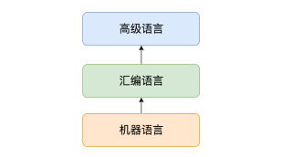


#### 编程语言跨平台 

##### 源代码跨平台 

> 需要在不同的平台上进行源码的编译，例如：在linux上安装软件的时候，进行编译后安装。

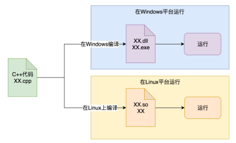

##### 二进制跨平台 

> 一次编译，到处运行。
>
> 由编程语言屏蔽各个操作系统之间的差异。

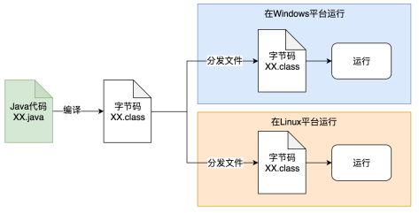


#### Java、C++、Rust 的区别 

C/C++ 完全相信而且惯着程序员，让大家自行管理内存，可以编写很自由的代码，但一不小心就会造成内存泄漏等问题，导致程序崩溃。

Java/Golang 完全不相信程序员，但也惯着程序员。所有的内存生命周期都由 JVM 运行时统一管理。 在绝大部分场景下，你可以非常自由的写代码，而且不用关心内存到底是什么情况。 内存使用有问题的时候，我们可以通过 JVM 来进行信息相关的分析诊断和调整。 这也是本课程的目标。

Rust 语言选择既不相信程序员，也不惯着程序员。 让你在写代码的时候，必须清楚明白的用 Rust 的规则管理好你的变量，好让机器能明白高效地分析和管理内存。 但是这样会导致代码不利于人的理解，写代码很不自由，学习成本也很高。 


#### 字节码、类加载器、虚拟机 

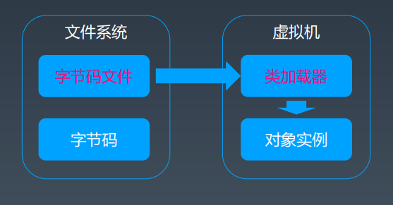


### 2. Java 字节码技术 

#### 什么是字节码？

Java bytecode 由单字节（byte）的指令组成，理论上最多支持 256 个操作（opcode）。实际上 Java 只使用了**200**左右的操作码， 还有一些操作码则保留给调试操作。

根据指令的性质，主要分为四个大类：

1. **栈**操作指令，包括与局部变量交互的指令
2. **程序流程**控制指令
3. **对象**操作指令，包括方法调用指令
4. **算术运算**以及**类型转换**指令 

> 字节码为什么是256为呢？
>
> 反编译之后，可以看到每一个字节码都是两个16进制表示，那么总共可以表示256中字节码。


#### 生成字节码

假如有一个最简单的类，源代码如下： 

```java
package org.copydays.thinking.java.jvm.core.technology;

public class HelloByteCode {
    public static void main(String[] args) {
        HelloByteCode obj = new HelloByteCode();
    }
}

```

进入src目录下之后，进行编译与反编译操作：

- 编译：javac org/copydays/thinking/java/jvm/core/technology/bytecode/HelloByteCode.java
- 查看字节码：javap -c org/copydays/thinking/java/jvm/core/technology/bytecode/HelloByteCode


#### 最简单的字节码

结果如下所示： 

- 本地变量表，load，到栈，进行计算；
- 计算完成，store，到本地变量表，进行存储；
- 只有栈有计算能力

```java
Compiled from "HelloByteCode.java"
public class org.copydays.thinking.java.jvm.core.technology.HelloByteCode {
  public org.copydays.thinking.java.jvm.core.technology.HelloByteCode();
    Code:
       0: aload_0
       1: invokespecial #1                  // Method java/lang/Object."<init>":()V
       4: return

  public static void main(java.lang.String[]);
    Code:
       0: new           #2                  // class org/copydays/thinking/java/jvm/core/technology/bytecode/HelloByteCode
       3: dup
       4: invokespecial #3                  // Method "<init>":()V
       7: astore_1
       8: return
}

```

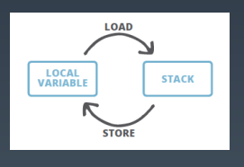


#### 复杂点的例子

进一步：javap -c -verbose org/copydays/thinking/java/jvm/core/technology/bytecode/HelloByteCode

> 使用verbose ，输出附加信息，看到更详细的字节码参数:
>
> major version:52，表示java的版本(使用的事1.8)
>
> flags: ACC_PUBLIC, ACC_SUPER，表示是不是public和非public
>
> Constant pool: ....  表示常量池，使用一个号表示

- 编译结果，参见示例程序：MyJava\thinking-java\jvm-core-technology\src\org\copydays\thinking\java\jvm\core\technology\HelloByteCodeJavaPDetial.java


#### 字节码的运行时结构

JVM 是一台基于栈的计算机器。

每个线程都有一个独属于自己的线程栈（JVM Stack），用于存储栈帧（Frame）。

每一次方法调用，JVM 都会自动创建一个栈帧。

栈帧由操作数栈， 局部变量数组以及一个 Class 引用组成。

Class 引用 指向当前方法在运行时常量池中对应的 Class。 

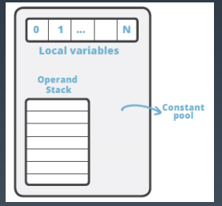


#### 从助记符到二进制 

> 将反编译后的内容，转换为对应的二进制，后续进行jvm指令的调用。

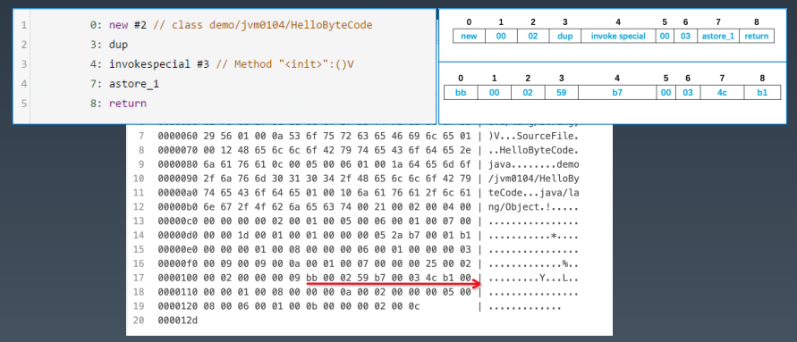


#### 四则运行的例子 

> 出现新的指令，astore_1，istore_2，istore_3，dstore 4，在数字（Slot）比较小的时候，直接下划线写在后面，数字变大之后，就会将数字直接写在后面。
>
> 对于的，数字小是一个字节，数字大之后，就是两个字节。
>
> istore 与 iload 和 astore 与 aload 一样，是匹配的相对操作，进行本地变量表与栈之间的读取和写回操作；
>
> iconst_1，表示的就是一个常量是1，iconst_2，表示的就是一个常量是2；
>
> dstore 4，表示将double类型数据，写回到本地变量表；
>
> I，表示int，D表示double;
>
> i2d，表示i  to d，表示int 转换为 double；

- 编译前程序，参见示例程序：MyJava\thinking-java\jvm-core-technology\src\org\copydays\thinking\java\jvm\core\technology\LocalVariableTest.java


#### 数值处理与本地变量表 

- 反编译后信息，参见示例程序：MyJava\thinking-java\jvm-core-technology\src\org\copydays\thinking\java\jvm\core\technology\LocalVariableTestJavaPDetial.java

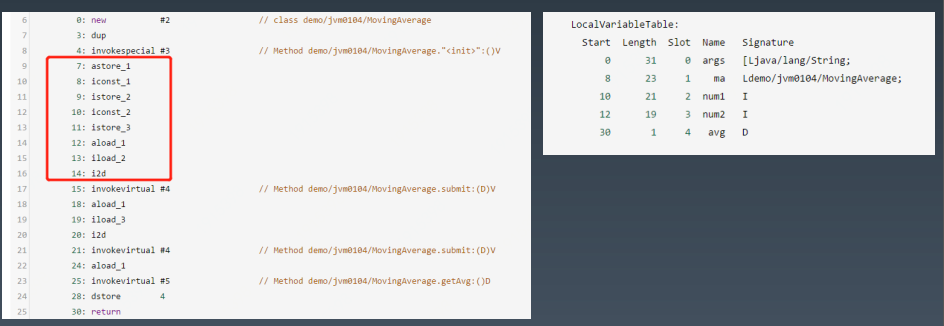


#### 算数操作与类型转换

> 算数操作与类型转换 ，只有四种类型；
>
> 布尔等，都是使用int进行表示，在字节码中，存储的时候使用的是int的32为表示，而不是直接使用一个二进制的位表示布尔类型；
>
> int是32位，lang是64为，在32位CPU中，lang会分两次处理，那么就会出现问题，计算错误，在64为的CPU中计算，直接保证原子性，直接处理64为，不会出错；
>
> 在程序编译的时候，直接预处理将需要类型转换的数据直接转换，使用i2f或者i2d等等，在执行阶段，不需要进行类型转换，直接进行执行就可以。

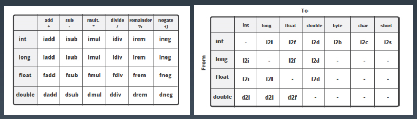


#### 一个完整的循环控制 

> 写循环的时候，可以使用类型推断，直接进行循环，不需要进行i++等，三部曲；
>
> if_icmpge指令，表示进行int类型判断比较，满足则执行跳转；
>
> iinc指令，int类型的指令进行自增加1；
>
> goto指令，将语句跳转回程序的制定位置标号；
>
> 使用上述三个指令，实现程序逻辑的控制；

- 参见示例程序：MyJava\thinking-java\jvm-core-technology\src\org\copydays\thinking\java\jvm\core\technology\ForLoopTest.java


#### 方法调用的指令

方法调用的指令：

- invokestatic，顾名思义，这个指令用于调用某个类的静态方法，这是方法调用指令中最快的一个。
- invokespecial, 用来调用构造函数，但也可以用于调用同一个类中的 private 方法, 以及可见的超类方法。
- invokevirtual，如果是具体类型的目标对象，invokevirtual 用于调用公共，受保护和package 级的私有方法（虚方法，子类直接覆盖父类的方法）。
- invokeinterface，当通过接口引用来调用方法时，将会编译为 invokeinterface 指令。
- invokedynamic，JDK7 新增加的指令，是实现“动态类型语言”（Dynamically TypedLanguage）支持而进行的升级改进，同时也是 JDK8 以后支持 lambda 表达式的实现基础。 


#### 一个动态例子 

> 展示栈与本地变量表，程序计数器的操作；
>
> 对应于复杂点的例子中，程序中，Code： stack=1；locals=1,args_size=1;
>
> 通过字节码文件，可以知道程序执行的时候，创建的栈的大小，本地变量表的大小，参数的大小；
>
> iadd，加法；imul，乘法；

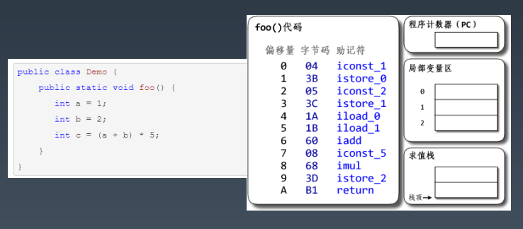


### 3. JVM 类加载器 

#### 类的生命周期

1. 加载（Loading）：找 Class 文件
2. 验证（Verification）：验证格式、依赖
3. 准备（Preparation）：静态字段、方法表
4. 解析（Resolution）：符号解析为引用
5. 初始化（Initialization）：构造器、静态变量赋值、静态代码块
6. 使用（Using）
7. 卸载（Unloading） 

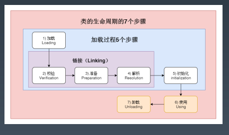


#### 类的加载时机

1. 当虚拟机启动时，初始化用户指定的主类，就是启动执行的 main 方法所在的类；
2. 当遇到用以新建目标类实例的 new 指令时，初始化 new 指令的目标类，就是 new一个类的时候要初始化；
3. 当遇到调用静态方法的指令时，初始化该静态方法所在的类；
4. 当遇到访问静态字段的指令时，初始化该静态字段所在的类；
5. 子类的初始化会触发父类的初始化；
6. 如果一个接口定义了 default 方法，那么直接实现或者间接实现该接口的类的初始化，会触发该接口的初始化；
7. 使用反射 API 对某个类进行反射调用时，初始化这个类，其实跟前面一样，反射调用要么是已经有实例了，要么是静态方法，都需要初始化；
8. 当初次调用 MethodHandle 实例时，初始化该 MethodHandle 指向的方法所在的类（MethodHandle 使用函数的反指针反射机制，进行加载）。 


#### 不会初始化（可能会加载）

1. 通过子类引用父类的静态字段，只会触发父类的初始化，而不会触发子类的初始化。
2. 定义对象数组，不会触发该类的初始化。
3. 常量在编译期间会存入调用类的常量池中，本质上并没有直接引用定义常量的类，不会触发定义常量所在的类。
4. 通过类名获取 Class 对象，不会触发类的初始化，Hello.class 不会让 Hello 类初始化。
5. 通过 Class.forName 加载指定类时，如果指定参数 initialize 为 false 时，也不会触发类初始化，其实这个参数是告诉虚拟机，是否要对类进行初始化。Class.forName（“jvm.Hello”）默认会加载 Hello 类。
6. 通过 ClassLoader 默认的 loadClass 方法，也不会触发初始化动作（加载了，但是不初始化）。 


#### 三类加载器

三类加载器：

1. 启动类加载器（BootstrapClassLoader）
2. 扩展类加载器（ExtClassLoader）
3. 应用类加载器（AppClassLoader）

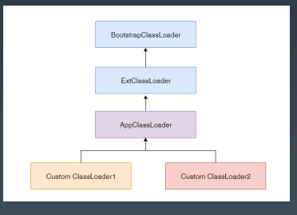

加载器特点：

1. 双亲委托（类的查找路径，一级一级向父类加载器查找）
2. 负责依赖
3. 缓存加载 

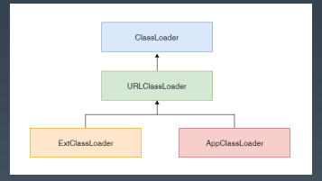


#### 显示当前 ClassLoader 加载了哪些 Jar？ 

> jar包和一个文件是等同的；

- 参见示例程序，MyJava\thinking-java\jvm-core-technology\src\org\copydays\thinking\java\jvm\core\technology\classload\JvmClassLoaderPrintPath.java

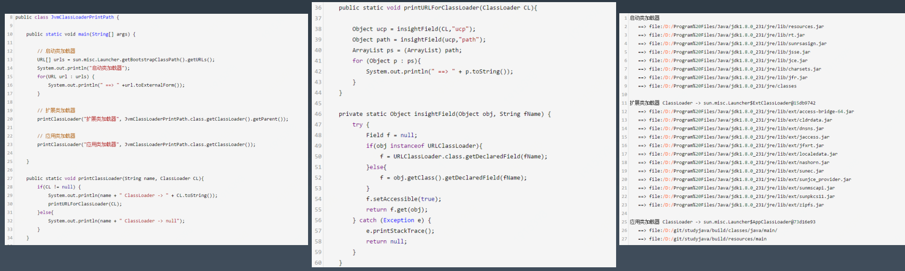


#### 自定义 ClassLoader 

> 使用Base64，进行编码，之后实现代码的加密保存与解密执行；

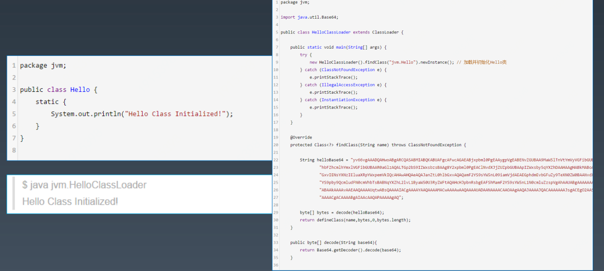


#### 添加引用类的几种方式

1、放到 JDK 的 lib/ext 下，或者-Djava.ext.dirs

2、 java –cp/classpath 或者 class 文件放到当前路径

3、自定义 ClassLoader 加载

4、拿到当前执行类的 ClassLoader，反射调用 addUrl 方法添加 Jar 或路径(JDK9 无效)。 （JDK9 之后，直接new classLoader，加上类的路径即可，更简单了。）

- 参见示例程序，MyJava\thinking-java\jvm-core-technology\src\org\copydays\thinking\java\jvm\core\technology\classload\JvmAppClassLoaderAddURL.java


### 4. JVM 内存模型 

#### JVM 内存结构

每个线程都只能访问自己的线程栈（栈生命周期短，一开始就是知道的）。

每个线程都不能访问（看不见）其他线程的局部变量。

所有原生类型的局部变量都存储在线程栈中，因此对其他线程是不可见的。

线程可以将一个原生变量值的副本传给另一个线程，但不能共享原生局部变量本身。

堆内存中包含了 Java 代码中创建的所有对象，不管是哪个线程创建的。 其中也涵盖了包装类型（例如 Byte，Integer，Long 等）（堆一开始是不知道大小的，会扩容，生命周期长；对象在栈上就是一个int类型的32位指针）。

不管是创建一个对象并将其赋值给局部变量， 还是赋值给另一个对象的成员变量， 创建的对象都会被保存到堆内存中。 

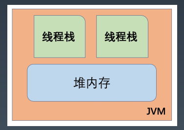


如果是原生数据类型的局部变量，那么它的内容就全部保留在线程栈上。

如果是对象引用，则栈中的局部变量槽位中保存着对象的引用地址，而实际的对象内容保存在堆中（栈中引用对象的额数据一起被多个线程更改之后，就会出现线程安全问题，数据不一致现象，类似于数据库的并发问题）。

对象的成员变量与对象本身一起存储在堆上, 不管成员变量的类型是原生数值，还是对象引用。

类的静态变量则和类定义一样都保存在堆中。 

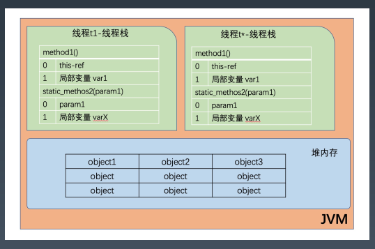


总结一下：方法中使用的原生数据类型和对象引用地址在栈上存储；对象、对象成员与类定义、静态变
量在堆上。

堆内存又称为“共享堆”，堆中的所有对象，可以被所有线程访问, 只要他们能拿到对象的引用地址。

如果一个线程可以访问某个对象时，也就可以访问该对象的成员变量。

如果两个线程同时调用某个对象的同一方法，则它们都可以访问到这个对象的成员变量，但每个线程的局部变量副本是独立的。（此时计算，就会出现数据问题，并发的问题） 

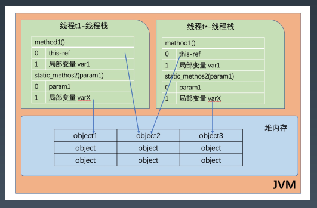


#### JVM 内存整体结构

每启动一个线程，JVM 就会在栈空间栈分配对应的 线程栈, 比如 1MB 的空间（-Xss1m）。

线程栈也叫做 Java 方法栈。 如果使用了JNI 方法，则会分配一个单独的本地方法栈(Native Stack)。

线程执行过程中，一般会有多个方法组成调用栈（Stack Trace）, 比如 A 调用 B，B调用 C。。。每执行到一个方法，就会创建对应的 栈帧（Frame）。 

> Xms 最小堆内存，Xmx最大堆内存，表示堆的内存，是放置对象的内存；
>
> java进程，包含：栈，堆，非堆，JVM自身;
>
> 堆外内存和堆的内存差不多大，一半一半；
>
> Xmx=4GB，实际占用内存会有5个多G，如果分配不合理，就会OOM崩溃；
>
> 操作系统有4G，Xmx配置70%，也就是2.7GB，如果是8G，配置6GB；

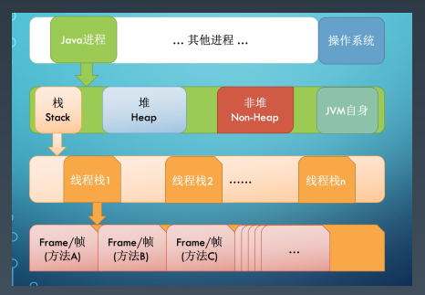


#### JVM 栈内存结构

栈帧是一个逻辑上的概念，具体的大小在一个方法编写完成后基本上就能确定。

比如返回值 需要有一个空间存放吧，每个局部变量都需要对应的地址空间，此外还有给指令使用的 操作数栈，以及 class 指针（标识这个栈帧对应的是哪个类的方法,指向非堆里面的 Class 对象）。 


#### JVM 堆内存结构

堆内存是所有线程共用的内存空间，JVM 将Heap 内存分为年轻代（Young generation）和
老年代（Old generation, 也叫 Tenured）两部分(一个对象，创建的时候，就比较大，那么就会直接创建之后，放到老年代)。

年轻代还划分为 3 个内存池，新生代（Eden space）和存活区（Survivor space）, 在大部分GC 算法中有 2 个存活区（S0, S1），在我们可以观察到的任何时刻，S0 和 S1 总有一个是空的,但一般较小，也不浪费多少空间（s0和s1之间的相互复制，解决堆中出现数据空洞的问题）。

Non-Heap 本质上还是 Heap，只是一般不归 GC管理，里面划分为 3 个内存池。

Metaspace, 以前叫持久代（永久代, Permanentgeneration）, Java8 换了个名字叫 Metaspace. 

CCS, Compressed Class Space, 存放 class 信息的，和 Metaspace 有交叉。

Code Cache, 存放 JIT 编译器编译后的本地机器代码。 

注意：

- 新生代 占1/3，老年代 占2/3，新生代：老年代 = 85MB : 170MB
- Eden 区 占8/10，S0 区 占 1/10，S1 区 占 1/10，Eden：S0：S1  = 65MB : 10MB: 10MB
- 使用 jmap -heap pid 查看

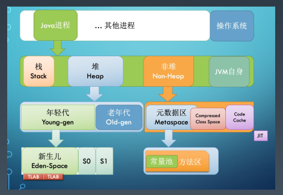


#### CPU 与内存行为

CPU 乱序执行（多核执行，打散指令）

volatile 关键字（可见性）

原子性操作

内存屏障 

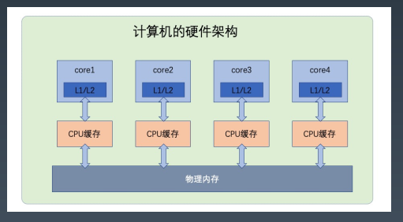


#### 小结：什么是 JMM? 

JMM 规范对应的是“[JSR-133. Java Memory Model and Thread Specification]”，《Java 语言规范》的 [$17.4. Memory Model章节]

JMM 规范明确定义了不同的线程之间，通过哪些方式，在什么时候可以看见其他线程保存到共享变量中的值；以及在必要时，如何对共享变量的访问进行同步。这样的好处是屏蔽各种硬件平台和操作系统之间的内存访问差异，实现了 Java 并发程序真正的跨平台。 

所有的对象(包括内部的实例成员变量)，static 变量，以及数组，都必须存放到堆内存中。

局部变量，方法的形参/入参，异常处理语句的入参不允许在线程之间共享，所以不受内存模型的影响。

多个线程同时对一个变量访问时【读取/写入】，这时候只要有某个线程执行的是写操作，那么这种现象就称之为“冲突”。

可以被其他线程影响或感知的操作，称为线程间的交互行为， 可分为： 读取、写入、同步操作、外部操作等等。 其中同步操作包括：对 volatile 变量的读写，对管程（monitor）的锁定与解锁，线程的起始操作与结尾操作，线程启动和结束等等。 外部操作则是指对线程执行环境之外的操作，比如停止其他线程等等。

JMM 规范的是线程间的交互操作，而不管线程内部对局部变量进行的操作。 


### 5. JVM 启动参数 

#### JVM 启动参数配置方式

> VM options 中添加命令（-Dfile.encoding=UTF-8 Da=1）
>
> java [-options] class [args...]
>            (执行类)
> 或  java [-options] -jar jarfile [args...]
>            (执行 jar 文件)

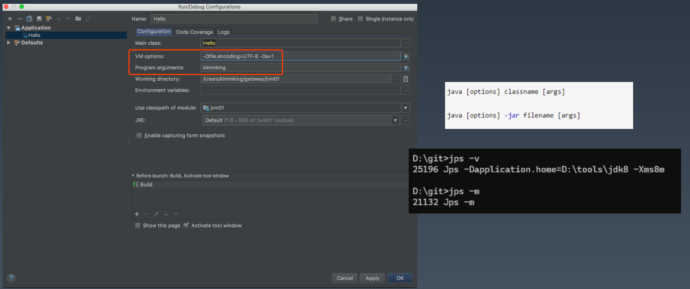


#### JVM 启动参数 

```java
-server
-Dfile.encoding=UTF-8
-Xmx8g
-XX:+UseG1GC
-XX:MaxPermSize=256m
```

以**-**开头为标准参数，所有的 JVM 都要实现这些参数，并且向后兼容。

**-D** 设置系统属性。

以 **-X** 开头为非标准参数， 基本都是传给 JVM 的，默认 JVM 实现这些参数的功能，但是并不保证所有 JVM 实现都满足，且不保证向后兼容。 可以使用 java -X 命令来查看当前 JVM 支持的非标准参数。

以 **–XX**：开头为非稳定参数, 专门用于控制 JVM的行为，跟具体的 JVM 实现有关，随时可能会在下个版本取消。

-XX：+-Flags 形式, +- 是对布尔值进行开关。
-XX：key=value 形式, 指定某个选项的值。 


#### JVM 启动参数作用分类

1. 系统属性参数
2. 运行模式参数
3. 堆内存设置参数
4. GC 设置参数
5. 分析诊断参数
6. JavaAgent 参数 


#### JVM 启动参数--系统属性 

```sh
-Dfile.encoding=UTF-8
-Duser.timezone=GMT+08
-Dmaven.test.skip=true
-Dio.netty.eventLoopThreads=8

System.setProperty("a","A100");
String a=System.getProperty("a");

# Linux上还可以通过: a=A100 java XXX
```

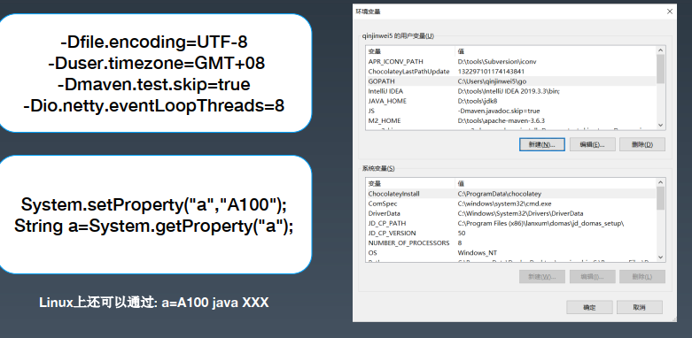


#### JVM 启动参数--运行模式

1. -server：设置 JVM 使用 server 模式，特点是启动速度比较慢，但运行时性能和内存管理效率很高，适用于生产环境。在具有 64 位能力的 JDK 环境下将默认启用该模式，而忽略 -client 参数。
2. -client ：JDK1.7 之前在32位的 x86 机器上的默认值是 -client 选项。设置 JVM 使用 client 模式，特点是启动速度比较快，但运行时性能和内存管理效率不高，通常用于客户端应用程序或者 PC 应用开发和调试。此外，我们知道 JVM 加载字节码后，可以解释执行，也可以编译成本地代码再执行，所以可以配置 JVM 对字节码的处理模式：
3. -Xint：在解释模式（interpreted mode）下运行，-Xint 标记会强制 JVM 解释执行所有的字节码，这当然会降低运行速度，通常低10倍或更多。
4. -Xcomp：-Xcomp 参数与-Xint 正好相反，JVM 在第一次使用时会把所有的字节码编译成本地代码，从而带来最大程度的优化。【注意预热】
5. -Xmixed：-Xmixed 是混合模式，将解释模式和编译模式进行混合使用，有 JVM 自己决定，这是 JVM 的默认模式，也是推荐模式。 我们使用 java -version 可以看到 mixed mode 等信息。 


#### JVM 启动参数--堆内存 

Xmx, 指定最大堆内存。 如 -Xmx4g. 这只是限制了 Heap 部分的最大值为4g。这个内存不包括栈内存，也不包括堆外使用的内存。

-Xms, 指定堆内存空间的初始大小。 如 -Xms4g。 而且指定的内存大小，并不是操作系统实际分配的初始值，而是GC先规划好，用到才分配。 专用服务器上需要保持 –Xms 和 –Xmx 一致，否则应用刚启动可能就有好几个 FullGC。当两者配置不一致时，堆内存扩容可能会导致性能抖动。

-Xmn, 等价于 -XX:NewSize，使用 G1 垃圾收集器 不应该 设置该选项，在其他的某些业务场景下可以设置。官方建议设置为 -Xmx 的 1/2 ~ 1/4.

-XX：MaxPermSize=size, 这是 JDK1.7 之前使用的。Java8 默认允许的Meta空间无限大，此参数无效。

-XX：MaxMetaspaceSize=size, Java8 默认不限制 Meta 空间, 一般不允许设置该选项。

-XX：MaxDirectMemorySize=size，系统可以使用的最大堆外内存，这个参数跟 -Dsun.nio.MaxDirectMemorySize 效果相同。

-Xss, 设置每个线程栈的字节数。 例如 -Xss1m 指定线程栈为 1MB，与-XX:ThreadStackSize=1m 等价 

> 1. 如果什么都不配置会如何？
> 2. Xmx 是否与 Xms 设置相等？
> 3. Xmx 设置为机器内存的什么比例合适？
> 4. 作业：画一下 Xmx、Xms、Xmn、Meta、
> DirectMemory、Xss 这些内存参数的关系 

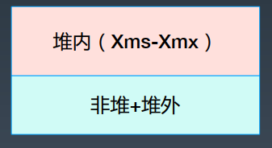


#### JVM 启动参数 -- GC 相关 

-XX：+UseG1GC：使用 G1 垃圾回收器

-XX：+UseConcMarkSweepGC：使用 CMS 垃圾回收器

-XX：+UseSerialGC：使用串行垃圾回收器

-XX：+UseParallelGC：使用并行垃圾回收器  

// Java 11+
-XX：+UnlockExperimentalVMOptions -XX:+UseZGC 

 // Java 12+
 -XX：+UnlockExperimentalVMOptions -XX:+UseShenandoahGC 

> 各个 JVM 版本的默认 GC 是什么？

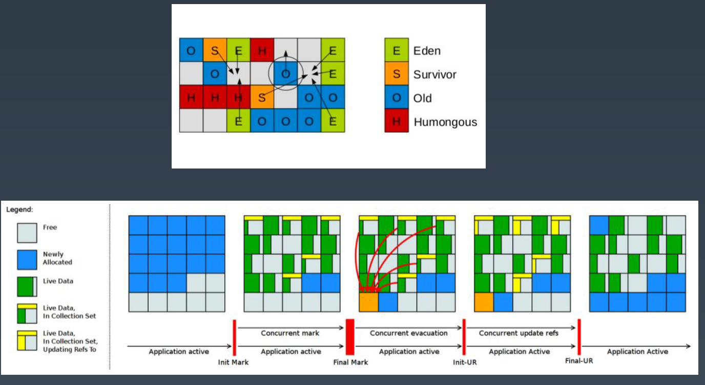


#### JVM 启动参数--分析诊断

-XX：+-HeapDumpOnOutOfMemoryError 选项, 当 OutOfMemoryError 产生，即内存溢出(堆内存或持久代)时，自动 Dump 堆内存。
示例用法： java -XX:+HeapDumpOnOutOfMemoryError -Xmx256m ConsumeHeap

-XX：HeapDumpPath 选项, 与 HeapDumpOnOutOfMemoryError 搭配使用, 指定内存溢出时 Dump 文件的目录。如果没有指定则默认为启动 Java 程序的工作目录。
示例用法： java -XX:+HeapDumpOnOutOfMemoryError -XX:HeapDumpPath=/usr/local/ ConsumeHeap 
自动 Dump 的 hprof 文件会存储到 /usr/local/ 目录下。

-XX：OnError 选项, 发生致命错误时（fatal error）执行的脚本。例如, 写一个脚本来记录出错时间, 执行一些命令, 或者 curl 一下某个在线报警的 url.
示例用法：java -XX:OnError="gdb - %p" MyApp 
可以发现有一个 %p 的格式化字符串，表示进程 PID。

-XX：OnOutOfMemoryError 选项, 抛出 OutOfMemoryError 错误时执行的脚本。

-XX：ErrorFile=filename 选项, 致命错误的日志文件名,绝对路径或者相对路径。

-Xdebug -Xrunjdwp:transport=dt_socket,server=y,suspend=n,address=1506，远程调试 


#### VM 启动参数 --JavaAgent

Agent 是 JVM 中的一项黑科技, 可以通过无侵入方式来做很多事情，比如注入 AOP 代码，执行统计等等，权限非常大。这里简单介绍一下配置选项，详细功能需要专门来讲。

设置 agent 的语法如下:
-agentlib:libname[=options] 启用 native 方式的 agent, 参考 LD_LIBRARY_PATH 路径。
-agentpath:pathname[=options] 启用 native 方式的 agent。
-javaagent:jarpath[=options] 启用外部的 agent 库, 比如 pinpoint.jar 等等。
-Xnoagent 则是禁用所有 agent。

以下示例开启 CPU 使用时间抽样分析:
JAVA_OPTS="-agentlib:hprof=cpu=samples,file=cpu.samples.log" 


### 6.总结回顾与作业实践 

#### 总结回顾

- 字节码技术
- 类加载器
- 内存模型
- 启动参数 


#### 作业实践

1、自己写一个简单的 Hello.java，里面需要涉及基本类型，四则运行，if 和 for，然后自己分析一下对应的字节码，有问题群里讨论。

2、自定义一个 Classloader，加载一个 Hello.xlass 文件，执行 hello 方法，此文件内容是一个 Hello.class 文件所有字节（x=255-x）处理后的文件。文件群里提供。

3、画一张图，展示 Xmx、Xms、Xmn、Meta、DirectMemory、Xss 这些内存参数的关系。

4、检查一下自己维护的业务系统的 JVM 参数配置，用 jstat 和 jstack、jmap 查看一下详情，并且自己独立分析一下大概情况，思考有没有不合理的地方，如何改进。

注意：如果没有线上系统，可以自己 run 一个 web/java 项目。 


## JVM 核心技术--工具与 GC 策略 

### JDK 内置命令行工具 

#### JVM 命令行工具 -基本


| 工具       | 简介                                                         |
| ---------- | ------------------------------------------------------------ |
| java       | Java 应用的启动程序                                          |
| javac      | JDK 内置的编译工具                                           |
| javap      | 反编译 class 文件的工具                                      |
| javadoc    | 根据 Java 代码和标准注释,自动生成相关的API说明文档           |
| javah      | JNI 开发时, 根据 java 代码生成需要的 .h文件。                |
| extcheck   | 检查某个 jar 文件和运行时扩展 jar 有没有版本冲突，很少使用   |
| jdb        | Java Debugger ; 可以调试本地和远端程序, 属于 JPDA 中的一个 demo 实现, 供 其他调试器参考。开发时很少使用 |
| jdeps      | 探测 class 或 jar 包需要的依赖                               |
| jar        | 打包工具，可以将文件和目录打包成为 .jar 文件； .jar 文件本质上就是 zip 文件, 只是后缀不同。使用时按顺序对应好选项和参数即可。 |
| keytool    | 安全证书和密钥的管理工具; （支持生成、导入、导出等操作）     |
| jarsigner  | JAR 文件签名和验证工具                                       |
| policytool | 实际上这是一款图形界面工具, 管理本机的 Java 安全策略         |


#### JVM 命令行工具 -常用

| 工具           | 简介                              |
| -------------- | --------------------------------- |
| jps/jinfo      | 查看 java 进程                    |
| jstat          | 查看 JVM 内部 gc 相关信息         |
| jmap           | 查看 heap 或类占用空间统计        |
| jstack         | 查看线程信息                      |
| jcmd           | 执行 JVM 相关分析命令（整合命令） |
| jrunscript/jjs | 执行 js 命令                      |


#### JVM 命令行工具--jps/jinfo 

- 看单个进程，jvm的配置

- jps

```sh
# 查看java进程信息，但是有的进程只有进程号，内容看不到
C:\Users\rmliu>jps
10580
25460 Launcher
5668 Jps
24604 RemoteMavenServer36

C:\Users\rmliu>jps -help
usage: jps [-help]
       jps [-q] [-mlvV] [<hostid>]

Definitions:
    <hostid>:      <hostname>[:<port>]
```

- jps -mlv

```sh
# 查看更详细的java进程信息
C:\Users\rmliu>jps -mlv
20336 sun.tools.jps.Jps -mlv -Dapplication.home=D:\java1.8 -Xms8m
10580  exit -Xms128m -Xmx2028m -XX:ReservedCodeCacheSize=240m -XX:+UseConcMarkSweepGC -XX:SoftRefLRUPolicyMSPerMB=50 -ea -XX:CICompilerCount=2 ...
24604 org.jetbrains.idea.maven.server.RemoteMavenServer36 ...
```

- jinfo 10680

```sh
# 查看某一个 java 进程的信息，看进程中 JVM 信息，各种系统设置属性，
# 如果没有权限，会挂载不上去
C:\Users\rmliu>jinfo 25460
Attaching to process ID 25460, please wait...
Debugger attached successfully.
Server compiler detected.
JVM version is 25.221-b11
Java System Properties:

java.vendor = Oracle Corporation
...
idea.paths.selector = IdeaIC2019.3
```


#### JVM 命令行工具--jstat

- jstat -options
  - -class 类加载(Class loader)信息统计.
  - -compiler JIT 即时编译器相关的统计信息。
  - **-gc** GC 相关的堆内存信息. 用法: jstat -gc -h 10 -t 864 1s 20
  - -gccapacity 各个内存池分代空间的容量。
  - -gccause 看上次 GC, 本次 GC（如果正在 GC中）的原因, 其他输出和 -gcutil 选项一致。
  - -gcnew 年轻代的统计信息. （ New = Young = Eden + S0 + S1）
  - -gcnewcapacity 年轻代空间大小统计.
  - -gcold 老年代和元数据区的行为统计。
  - -gcoldcapacity old 空间大小统计.
  - -gcmetacapacity meta 区大小统计.
  - **-gcutil** GC 相关区域的使用率（ utilization）统计。
  - -printcompilation 打印 JVM 编译统计信息。 

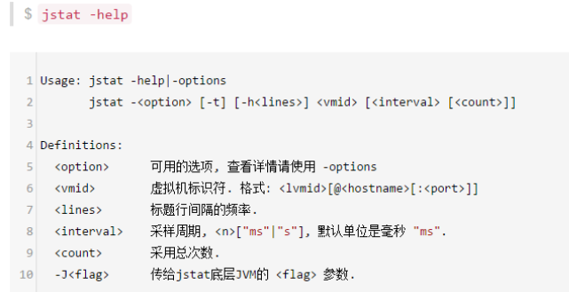


- jstat -gc 25460 1000 1000
- 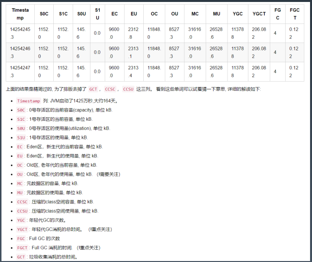

```sh
# java 内存信息
# 按照字节展示
# S0C    S1C  表示两个存活区 S0和S1的容量，两个容量是一样的
# S0U    S1U  表示 S0的使用
# EC 表示 Eden 区容量
# OC 表示 Old 区容量
# MC 表示 元数据区 meta区容量
# CCSC   CCSU 表示压缩 class区，MC     MU    CCSC   CCSU 表示非堆区
#  YGC     YGCT 表示 young GC 的次数和使用时间(s)
# FGC    FGCT 表示 Full GC 的次数和使用时间(s)
# GCT 表示所有的 GC 时间


C:\Users\rmliu>jstat -gc 25460 1000 1000
 S0C    S1C    S0U    S1U      EC       EU        OC         OU       MC     MU    CCSC   CCSU   YGC     YGCT    FGC    FGCT     GCT
10752.0 10752.0  0.0   5044.1 65024.0  18982.8   173568.0     99.1    16640.0 16185.3 2048.0 1876.4      1    0.017   0      0.000    0.017
...
10752.0 10752.0  0.0   5044.1 65024.0  18982.8   173568.0     99.1    16640.0 16185.3 2048.0 1876.4      1    0.017   0      0.000    0.017
```


- jstat -gcutil 25460 1000 1000
- 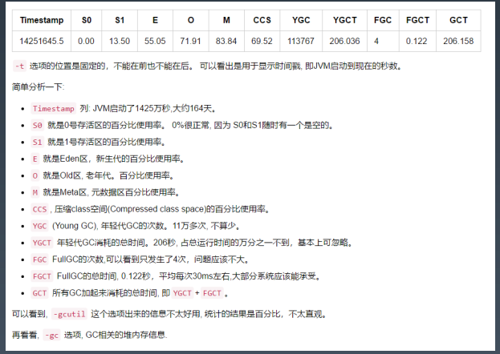

```sh
# 按照百分比展示
# 表示 -gcutil GC 相关区域的使用率（ utilization）统计。

C:\Users\rmliu>jstat -gcutil 25460 1000 1000
  S0     S1     E      O      M     CCS    YGC     YGCT    FGC    FGCT     GCT
  0.00  46.91  29.19   0.06  97.27  91.62      1    0.017     0    0.000    0.017

  0.00  46.91  29.19   0.06  97.27  91.62      1    0.017     0    0.000    0.017
  0.00  46.91  29.19   0.06  97.27  91.62      1    0.017     0    0.000    0.017
```


#### JVM 命令行工具--jmap 

常用选项就 3 个：

- -heap 打印堆内存（ /内存池）的配置和使用信息。
- -histo 看哪些类占用的空间最多, 直方图
- -dump:format=b,file=xxxx.hprof Dump 堆内存。

演示:

- jmap -heap pid
- jmap -histo pid
- jmap -dump:format=b,file=3826.hprof 3826 


- jmap -histo pid

```sh
# java 内存堆信息
# -histo 看哪些类占用的空间最多, 直方图
# B 字节
# I int
# [ 数组
# L 对象
# JVM 的堆，管理了 数十万，数百万的对象示例

C:\Users\rmliu>jmap -histo 17120

 num     #instances         #bytes  class name
----------------------------------------------
   1:         26403       10219528  [B
   2:         46894        6076392  [C
   3:          3015        2987192  [I
   4:         28297         679128  java.lang.String
   5:          6405         565864  [Ljava.lang.Object;
   6:          3676         409752  java.lang.Class
   7:          7240         231680  java.util.concurrent.ConcurrentHashMap$Node
   8:          2072         165296  [S
   9:          1955         109480  java.util.zip.ZipFile$ZipFileInputStream
  10:          6681         106896  java.lang.Object
  ....
  1546:             1             16  sun.util.resources.LocaleData
  1547:             1             16  sun.util.resources.LocaleData$LocaleDataResourceBundleControl
Total        177303       23426792
```

- jmap -heap pid

```sh
# -heap 打印堆内存（ /内存池）的配置和使用信息
# Parallel GC with 6 thread(s)， 并行 GC，使用6个线程
# 堆内存信息
# Young Generation：
    # Eden Space
    # From Space
    # To Space
# Old Generation

C:\Users\rmliu>jmap -heap 17120
Attaching to process ID 17120, please wait...
Debugger attached successfully.
Server compiler detected.
JVM version is 25.221-b11

using thread-local object allocation.
Parallel GC with 6 thread(s)

Heap Configuration:
   MinHeapFreeRatio         = 0
   MaxHeapFreeRatio         = 100
   MaxHeapSize              = 734003200 (700.0MB)
   NewSize                  = 88604672 (84.5MB)
   MaxNewSize               = 244318208 (233.0MB)
   OldSize                  = 177733632 (169.5MB)
   NewRatio                 = 2
   SurvivorRatio            = 8
   MetaspaceSize            = 21807104 (20.796875MB)
   CompressedClassSpaceSize = 1073741824 (1024.0MB)
   MaxMetaspaceSize         = 17592186044415 MB
   G1HeapRegionSize         = 0 (0.0MB)

Heap Usage:
PS Young Generation
Eden Space:
   capacity = 66584576 (63.5MB)
   used     = 18207160 (17.36370086669922MB)
   free     = 48377416 (46.13629913330078MB)
   27.344410813699557% used
From Space:
   capacity = 11010048 (10.5MB)
   used     = 5048528 (4.8146514892578125MB)
   free     = 5961520 (5.6853485107421875MB)
   45.85382370721726% used
To Space:
   capacity = 11010048 (10.5MB)
   used     = 0 (0.0MB)
   free     = 11010048 (10.5MB)
   0.0% used
PS Old Generation
   capacity = 177733632 (169.5MB)
   used     = 171104 (0.163177490234375MB)
   free     = 177562528 (169.33682250976562MB)
   0.0962699057429941% used

5616 interned Strings occupying 497904 bytes.
```


#### JVM 命令行工具--jstack 

-F 强制执行 thread dump. 可在 Java 进程卡死（ hung 住）时使用, 此选项可能需要系统权限。
-m 混合模式(mixed mode),将 Java 帧和 native帧一起输出, 此选项可能需要系统权限。
-l 长列表模式. 将线程相关的 locks 信息一起输出，比如持有的锁，等待的锁。

演示：jstack pid -l 


- jstack -l pid

```sh
# 线程信息
# runnable，waiting...
# 打出锁的信息，看一下是不是死锁
# linux 下可以使用，kill -3 pid，在启动进程的窗口显示堆栈

C:\Users\rmliu>jstack -l 17120
2020-11-19 10:06:56
Full thread dump Java HotSpot(TM) 64-Bit Server VM (25.221-b11 mixed mode):

"DestroyJavaVM" #17 prio=5 os_prio=0 tid=0x00000000047c6000 nid=0x5408 waiting on condition [0x0000000000000000]
   java.lang.Thread.State: RUNNABLE

   Locked ownable synchronizers:
        - None

"JPS event loop" #10 prio=5 os_prio=0 tid=0x0000000018fcc000 nid=0x2b70 runnable [0x000000001957e000]
   java.lang.Thread.State: RUNNABLE
   ...
```


#### JVM 命令行工具--jcmd

Jcmd 综合了前面的几个命令

示例：
jcmd pid VM.version
jcmd pid VM.flags
jcmd pid VM.command_line
jcmd pid VM.system_properties
jcmd pid Thread.print
jcmd pid GC.class_histogram
jcmd pid GC.heap_info 

- jcmd pidhelp

```sh
# 查看当前进程，可以使用查看的 所有命令
# jVM, gc, 线程等命令的整合

C:\Users\rmliu>jcmd 17120 help
17120:
The following commands are available:
JFR.stop
...
VM.dynlibs
VM.flags
VM.system_properties
VM.command_line
VM.version
help

For more information about a specific command use 'help <command>'.
```

- jcmd pid VM.version

```sh
C:\Users\rmliu>jcmd 17120 VM.version
17120:
Java HotSpot(TM) 64-Bit Server VM version 25.221-b11
JDK 8.0_221
```


#### JVM 命令行工具--jrunscript/jjs 

当curl命令用：jrunscript -e "cat('http://www.baidu.com')"
执行js脚本片段：jrunscript -e "print('hello,kk.jvm'+1)"
执行js文件：jrunscript -l js -f /XXX/XXX/test.js 

- jrunscript -e "cat('http://www.baidu.com')"

```sh
# 模拟 curl 命令，访问百度

C:\Users\rmliu>jrunscript -e "cat('http://www.baidu.com')"
<!DOCTYPE html>
<!--STATUS OK--><html> <head><meta http-equiv=content-type content=text/html;charset=utf-8><meta http-equiv=X-UA-Compatible content=IE=Edge><meta content=always n
...
```


- jjs

```sh
# 进行交互的执行命令
# 可以执行算数，函数等
C:\Users\rmliu>jjs
jjs> 11
11
jjs> 12+11
23
jjs> function a(b){return b+1;}
function a(b){return b+1;}
jjs>
jjs> a(2)
3
jjs> exit()
```


###  JDK 内置图形化工具 

#### JVM 图形化工具--jconsole 

- 信息少
- 在命令行输入 jconsole 即可打开 
- 本地 JVM 可以直接选择
- 远程 JVM 可以通过 JMX 方式连接 


##### jconsole -概览

共有 6 个面板

第一个为概览，四项指标具体为：

堆内存使用量：此处展示的就是前面 Java 内存模型课程中提到的堆内存使用情况，从图上可以看到，堆内存使用了 94MB 左右，并且一直在增长。

线程：展示了 JVM 中活动线程的数量，当前时刻共有 17 个活动线程。

类： JVM 一共加载了 5563 个类，没有卸载类。

CPU 占用率：目前 CPU 使用率为 0.2%，这个数值非常低，且最高的时候也不到 3%，初步判断系统当前并没有什么负载和压力。

有如下几个时间维度可供选择：
1分钟、 5分钟、 10分钟、 30分钟、 1小时、 2小时、 3小时、 6小时、12小时、 1天、 7天、 1个月、 3个月、 6个月、 1年、全部，一共是16档。
当我们想关注最近1小时或者1分钟的数据，就可以选择对应的档。旁边的3个标签页(内存、线程、类)，也都支持选择时间范围。 

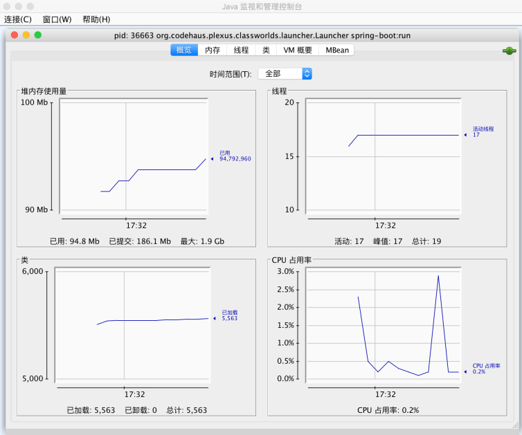


##### jconsole -内存

内存图表包括：
• 堆内存使用量，主要包括老年代（内存池 “PS Old Gen”）、新生代（ “PS Eden Space”）、存活区
（ “PS Survivor Space”）；
• 非堆内存使用量，主要包括内存池“Metaspace”、 “Code Cache”、 “Compressed Class Space”等；

可以分别选择对应的 6 个内存池。

通过内存面板，我们可以看到各个区域的内存使用和变化情况，并且可以：
1.手动执行 gc，见图上的标号1，点击按钮即可执行JDK 中的 System.gc()
2.通过图中右下角标号 2 的界面，可以看到各个内存池的百分比使用率，以及堆/非堆空间的汇总使用情况
3.从左下角标号 3 的界面，可以看到 JVM 使用的垃圾收集器，以及执行垃圾收集的次数，以及相应的时间消耗。 

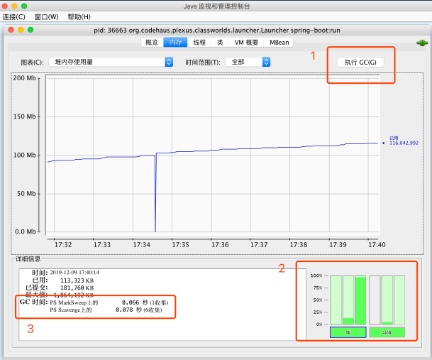


##### jconsole -线程

线程面板展示了线程数变化信息，以及监测到的线程列表。

我们可以常根据名称直接查看线程的状态（运行还是等待中）和调用栈（正在执行什么操作）。

特别地，我们还可以直接点击“检测死锁”按钮来检测死锁，如果没有死锁则会提示“未检测到死锁”。 

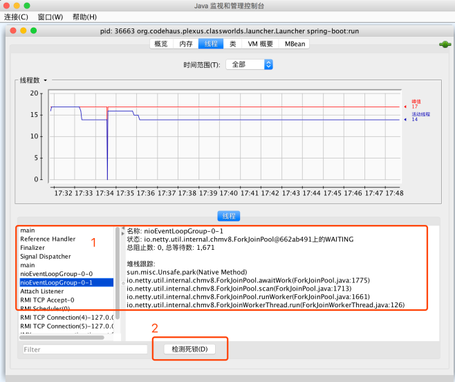

##### jconsole -类

类监控面板，可以直接看到 JVM 加载和卸载的类数量汇总信息，以及随着时间的动态变化。 

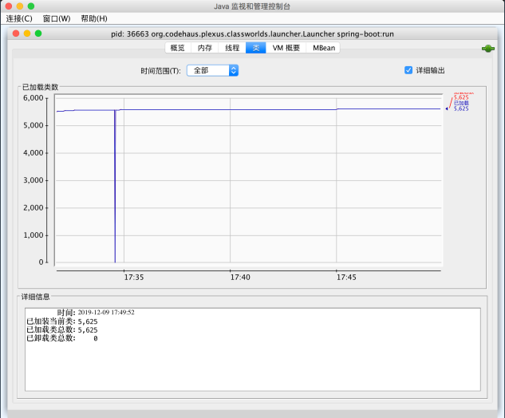

##### jconsole -VM概要

VM 概要的数据有五个部分：
第一部分是虚拟机的信息；
第二部分是线程数量，以及类加载的汇总信息；
第三部分是堆内存和 GC 统计。
第四部分是操作系统和宿主机的设备信息，比如 CPU 数量、物理内存、虚拟内存等等。
第五部分是 JVM 启动参数和几个关键路径，这些信息其实跟 jinfo 命令看到的差不多。 

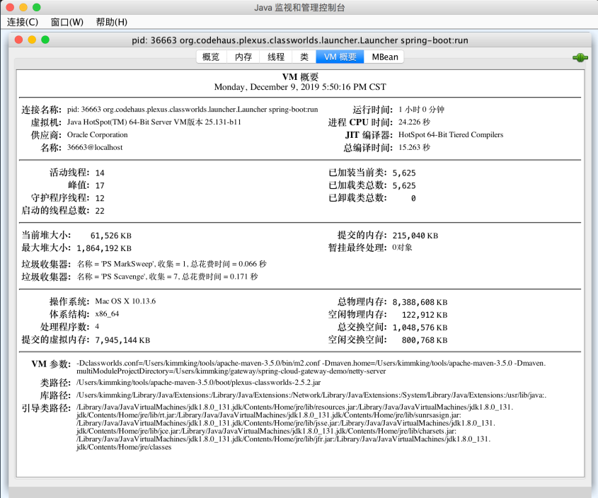


#### JVM 图形化工具--jvisualvm 

- 信息多，更强大
- 在命令行输入  jvisualvm 即可打开 
- 使用抽样器，进行数据的dump，进行后续的操作
- 概述，监控，线程，抽样器，Profiler

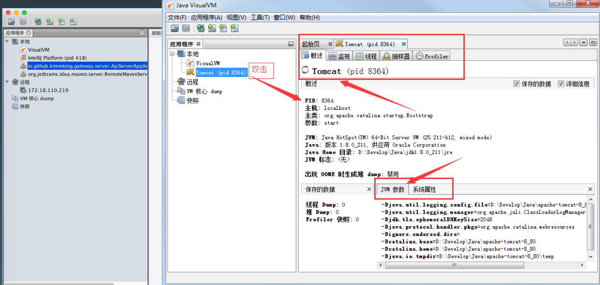

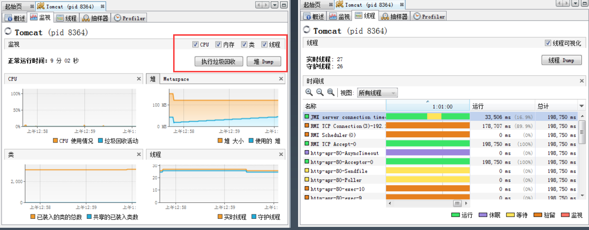

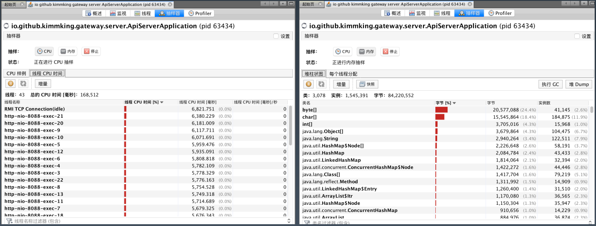

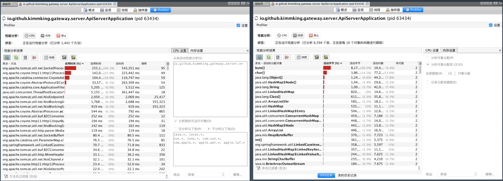


#### JVM 图形化工具--VisualGC 

- 一个插件，idea中安装使用
- 网格化显示，有意思

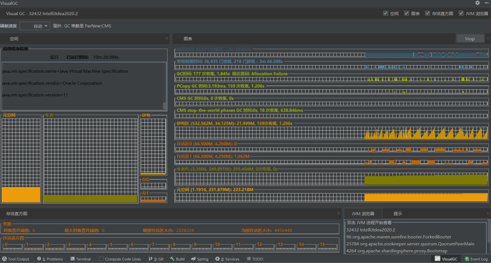


#### JVM 图形化工具--jmc 

- 信息多，更更强大，多用
- 在命令行输入  jmc 即可打开 
- 飞行记录器，保证记录的是动态的
- 一般信息，内存，代码，线程，I/O，系统，事件

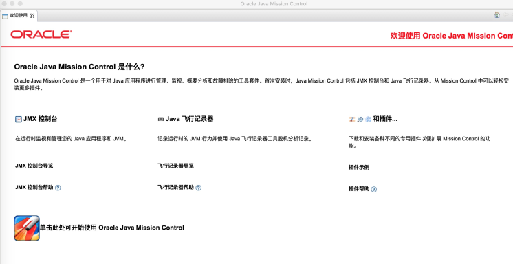

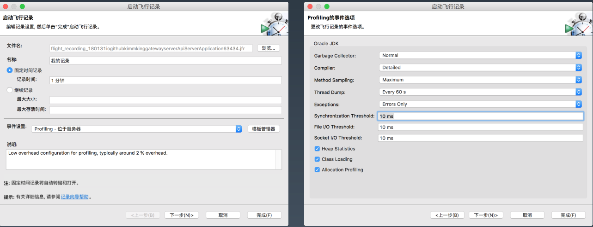


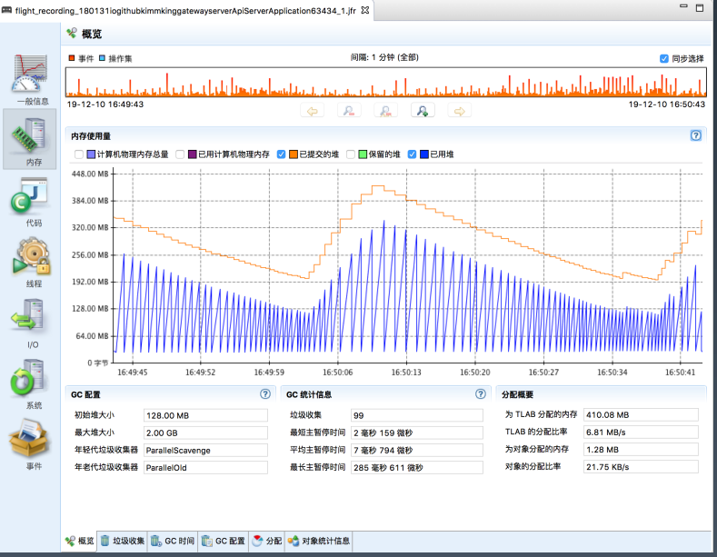

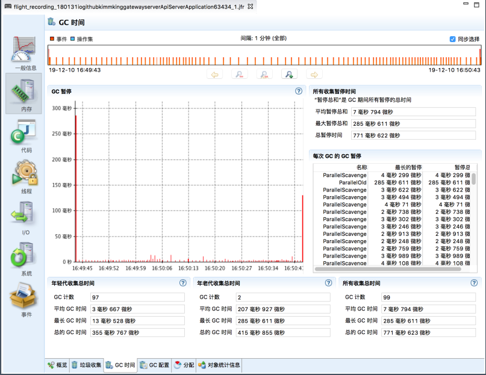

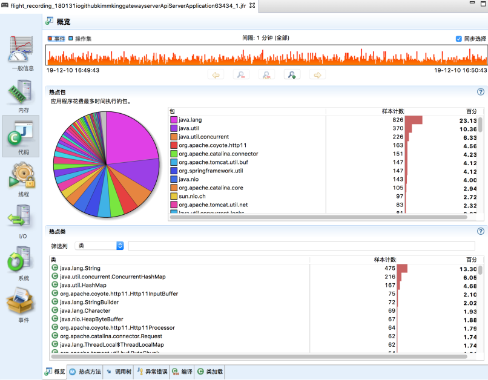

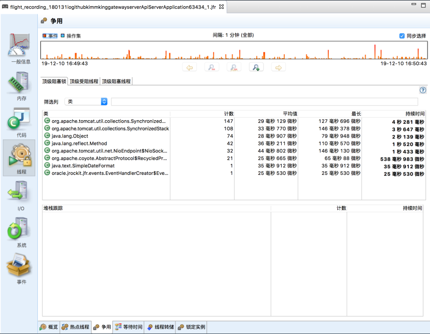


### JVM 工具总结 

- jps/jinfo
- jstat
- jmap
- jstack
- jcmd
- jrunscript/jjs 

- jsonsole
- jvisualvm
- visualGC
- jmc 


### GC 的背景与一般原理 

#### GC 的背景与一般原理 

- 为什么会有 GC
- 本质上是内存资源的有限性
- 因此需要大家共享使用，手工申请，手动释放。
- 下面我们举个例子 


#### 引用计数

- 循环依赖问题
- 内存泄漏->内存溢出


#### 引用跟踪

**标记清除算法（ Mark and Sweep）**

- Marking（ 标记） : 遍历所有的可达对象，并在本地内存(native)中分门别类记下。
- Sweeping（ 清除） : 这一步保证了，不可达对象所占用的内存，在之后进行内存分配时可以重用。 
- +压缩，整理

并行 GC 和 CMS 的基本原理。

优势：可以处理循环依赖，只扫描部分对象

除了清除，还要做压缩。

怎么才能标记和清除清楚上百万对象呢？

答案就是 STW，让全世界停止下来。 （stop the world! 标记照片。）

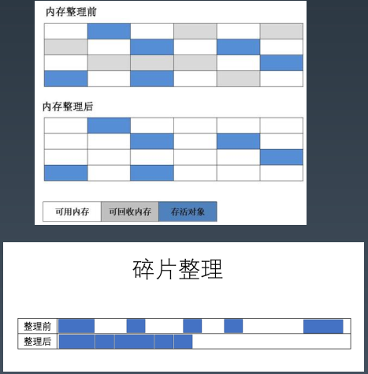


#### 分代假设

分代假设：大部分新生对象很快无用；存活较长时间的对象，可能存活更长时间。 

JVM 中年轻代默认使用 **15 代**，如果还没有 GC，就直接放到 老年代


内存池划分

不同类型对象不同区域，不同策略处理。 

**TLAB**，是线程分配缓冲区，给每一个线程一部分内存。

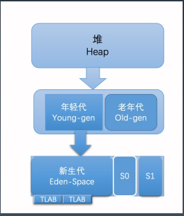


#### 对象在GC中的转移

对象分配在新生代的 Eden 区，标记阶段 Eden 区存活的对象就会**复制**到存活区；

注意：为什么是复制，不是移动？？？大家想想

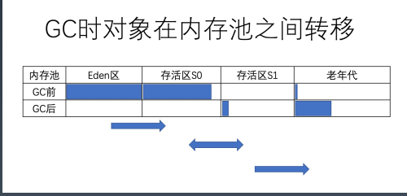

两个存活区 from 和 to，互换角色。对象存活到一定周期会提升到老年代。 

由如下参数控制提升**阈值**：-XX： +MaxTenuringThreshold=15

老年代默认都是存活对象，采用**移动**方式：

- 标记所有通过 GC roots 可达的对象；
- 删除所有不可达对象；
- 整理老年代空间中的内容，方法是将所有的存活对象复制，从老年代空间开始的地方依次存放。

持久代/元数据区

- java 1.8 之前 -XX:MaxPermSize=256m
- java 1.8 之后 -XX:MaxMetaspaceSize=256m ，1.8后Metaspace 放到了非堆的内存中。


#### 可以作为 GC Roots 的对象

**GC Roots** 主要作为标记的根对象使用。

- 当前正在执行的方法里的局部变量和输入参数
- 活动线程（ Active threads）
- 所有类的静态字段（ static field）
- JNI 引用（外部容器，连接内部区）

此阶段暂停的时间，与堆内存大小,对象的总数没有直接关系，而是由存活对象（ alive objects）的数量来决定。所以增加堆内存的大小并不会直接影响标记阶段占用的时间。 

引用关系**跨代**，需要单独的集合，使用 RSet

**Young GC 的 速度快的原因？**
虽然对象几百万个，但是存活的对象少，剩下的全部清除，所以快！快在标记的数量少。

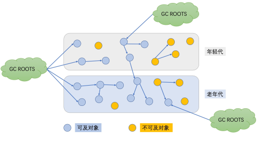


#### 三种算法

- 清除算法
- 复制算法
- 整理算法

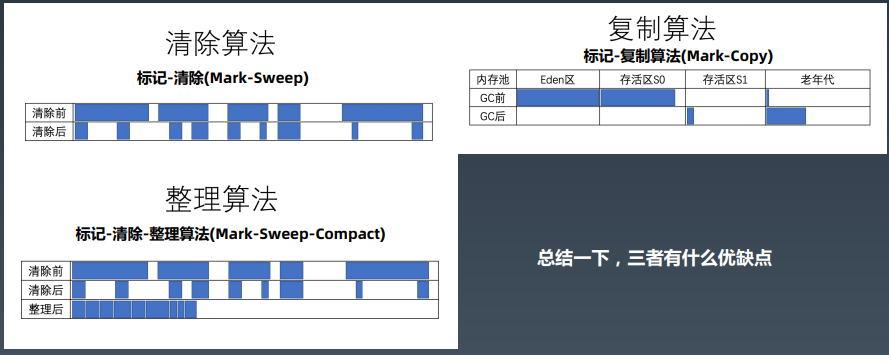


### 串行 GC/并行 GC（ Serial GC/Parallel GC） 

#### 串行 GC（ Serial GC） /ParNewGC 

**-XX： +UseSerialGC** 配置串行 GC

串行 GC 对年轻代使用 mark-copy（标记-复制） 算法，对老年代使用 mark-sweep-compact （标记-清除-整理）算法。

两者都是**单线程**的垃圾收集器，不能进行并行处理，所以都会触发全线暂停（ STW），停止所有的应用线程。

因此这种 GC 算法不能充分利用多核 CPU。不管有多少 CPU 内核， JVM 在垃圾收集时都只能使用单个核心。

CPU 利用率高，暂停时间长。简单粗暴，就像老式的电脑，动不动就卡死。

该选项只适合几百 MB 堆内存的 JVM，而且是单核 CPU 时比较有用。
想想 why？

**-XX： +USeParNewGC** 改进版本的 Serial GC，可以配合 CMS 使用。 


#### 并行 GC（ Parallel GC）

**-XX: +UseParallelGC**
**-XX: +UseParallelOldGC**
**-XX: +UseParallelGC -XX:+UseParallelOldGC**

年轻代和老年代的垃圾回收都会触发 STW 事件。
在年轻代使用 标记-复制（ mark-copy）算法，在老年代使用 标记-清除-整理（ mark-sweepcompact）算法。
-XX： ParallelGCThreads=N 来指定 GC 线程数， 其**默认值为 CPU 核心数**。

并行垃圾收集器适用于多核服务器，主要目标是增加**吞吐量**。因为对系统资源的有效使用，能达到更高的吞吐量:

- 在 GC 期间，所有 CPU 内核都在并行清理垃圾，所以总暂停时间更短；
- 在两次 GC 周期的间隔期，没有 GC 线程在运行，不会消耗任何系统资源。 


#### 演示：并行 GC，常用参数以及其内存分配 

- java -jar -XX: +UseParallelGC -XX:+UseParallelOldGC target/xxx.jar
- jmap -heap 13664

结果：

- MaxHeapSize 大小为 物理内存的 1/4
- NewSize 大小文 物理内存的 1/64
- MaxNewSize 只在并行GC中有效

java 8 的 默认GC是什么？8之前的默认GC是什么？ 都是 并行GC。

java 9 的 默认GC是什么？9之后的默认GC是什么？都是G1。


### CMS GC/G1 GC 

#### CMS GC（ Mostly Concurrent Mark and Sweep Garbage Collector）

-XX: +UseConcMarkSweepGC
其对年轻代采用**并行** STW 方式的 mark-copy (标记-复制)算法，对老年代主要使用**并发** mark-sweep (标记-清除)算法。

CMS GC 的设计目标是避免在老年代垃圾收集时出现长时间的卡顿，主要通过两种手段来达成此目标：

1. 不对老年代进行整理，而是使用**空闲列表（ free-lists）** 来管理内存空间的回收。
2. 在 mark-and-sweep （ 标记-清除） 阶段的大部分工作和应用线程一起并发执行。

也就是说，在这些阶段并没有明显的应用线程暂停。但值得注意的是，它仍然和应用线程争抢CPU 时间。默认情况下， CMS 使用的并发线程数等于 **CPU 核心数的 1/4**。

如果服务器是多核 CPU，并且主要调优目标是降低 GC 停顿导致的系统延迟，那么使用 CMS 是个很明智的选择。进行老年代的并发回收时，可能会伴随着多次年轻代的 minor GC。

思考：并行 Parallel 与并发 Concurrent 的区别？ 
（并发，表示处理的时候业务线程还在工作。并行，表示处理的时候业务线程不工作。）


#### CMS GC 的处理步骤

#####  1（ STW） -Initial Mark（ 初始标记） 

阶段 1: Initial Mark（ 初始标记） 

这个阶段伴随着 STW 暂停。初始标记的目标是标记所有的根对象，包括根对象直接引用的对象，以及被年轻代中所有存活对象所引用的对象（老年代单独回收）。 

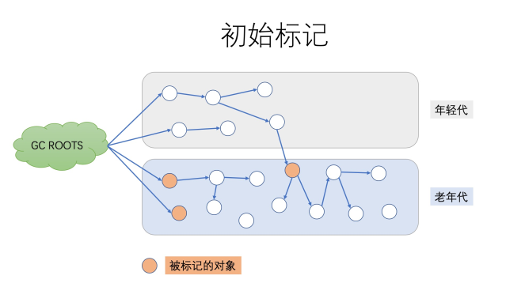


#####  2- Concurrent Mark（ 并发标记） 

阶段 2: Concurrent Mark（ 并发标记） 

在此阶段， CMS GC 遍历老年代，标记所有的存活对象，从前一阶段 “Initial Mark” 找到的根对象开始算起。 “并发标记”阶段，就是与应用程序同时运行，不用暂停的阶段。 

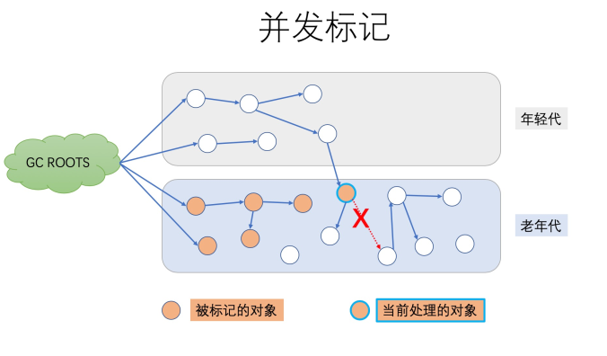


##### 3（ STW） -Concurrent Preclean（ 并发预清理）

阶段 3: Concurrent Preclean（ 并发预清理） 

此阶段同样是与应用线程并发执行的，不需要停止应用线程。 因为前一阶段【并发标记】与程序并发运行，可能有一些引用关系已经发生了改变。如果在并发标记过程中引用关系发生了变化， JVM 会通过“Card（卡片） ”的方式将发生了改变的区域标记为“脏”区，这就是所谓的 卡片标记（ Card Marking）。 

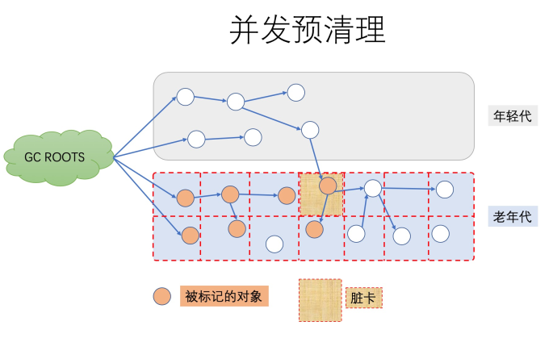


#####  4- Final Remark（ 最终标记） 

阶段 4: Final Remark（ 最终标记） 

最终标记阶段是此次 GC 事件中的第二次（也是最后一次） STW 停顿。本阶段的目标是完成老年代中所有存活对象的标记. 因为之前的预清理阶段是并发执行的，有可能 GC 线程跟不上应用程序的修改速度。所以需要一次STW 暂停来处理各种复杂的情况。

通常 CMS 会尝试在年轻代尽可能空的情况下执行 FinalRemark 阶段，以免连续触发多次 STW 事件。 

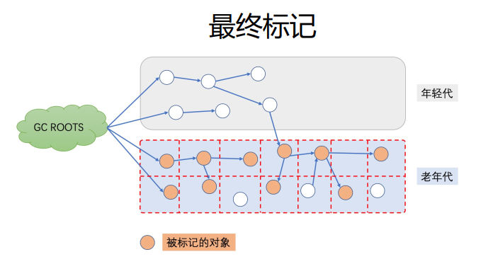


#####  5-Concurrent Sweep（ 并发清除） 

阶段 5: Concurrent Sweep（ 并发清除） 

此阶段与应用程序并发执行，不需要 STW 停顿。 JVM 在此阶段删除不再使用的对象，并回收他们占用的内存空间。 

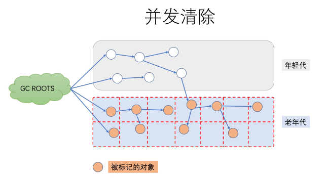


#####  6- Concurrent Reset（ 并发重置）

阶段 6: Concurrent Reset（ 并发重置） 

此阶段与应用程序并发执行，重置 CMS 算法相关的内部数据，为下一次 GC 循环做准备。 

CMS 垃圾收集器在减少停顿时间上做了很多复杂而有用的工作，用于垃圾回收的并发线程执行的同时，并不需要暂停应用线程。 当然，CMS 也有一些缺点，其中最大的问题就是老年代内存碎片问题（因为不压缩），在某些情况下 GC 会造成不可预测的暂停时间，特别是堆内存较大的情况下。 


#### 演示： CMS GC，常用参数以及其内存分配

（注意跟 ParallelGC 有什么差异） 

提醒：

- 使用java 11，ZGC 在 Mac 上是不能使用的，没有Mac的版本，只有其他的linux版本，才可以使用ZGC
- 使用 jdk 15, 才可以用起来ZGC

演示：

- java -jar -xx: +UseConcMarkSweepGC target/xxx.jar
- jmap -heap 13664
- MaxNewSize ，是 64 * 4*13 /10 = 332.8。（4是CPU的核心数，不同核心不同）
- 其他都和并行GC一样


#### G1 GC 

G1 的全称是 Garbage-First，意为垃圾优先，哪一块的垃圾最多就优先清理它。

G1 GC 最主要的设计目标是：将 STW 停顿的时间和分布，变成可预期且可配置的。

事实上， G1 GC 是一款软**实时**垃圾收集器，可以为其设置某项特定的性能指标。为了达成可预期停顿
时间的指标， G1 GC 有一些独特的实现。

-XX: +UseG1GC -XX:MaxGCPauseMillis=50 

(MaxGCPauseMillis默认值是200)

首先，堆不再分成年轻代和老年代，而是划分为多个（通常是 **2048 个**）可以存放对象的 小块堆区域
(smaller heap regions)。每个小块，可能一会被定义成 Eden 区，一会被指定为 Survivor区或者Old 区。在逻辑上，所有的 Eden 区和 Survivor区合起来就是年轻代，所有的 Old 区拼在一起那就是老年代

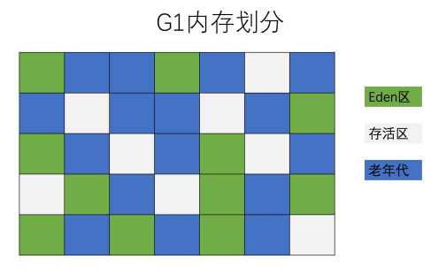

这样划分之后，使得 G1 不必每次都去收集整个堆空间，而是以增量的方式来进行处理: 每次只处理一部分内存块，称为此次 **GC 的回收集(collection set)**。每次 GC 暂停都会收集所有年轻代的内存块，但一般只包含部分老年代的内存块。

G1 的另一项创新是，在并发阶段估算每个小堆块存活对象的总数。构建回收集的原则是：垃圾最多的小块会被优先收集。这也是 G1 名称的由来。 

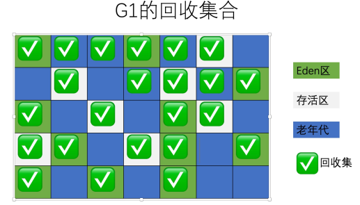

对于G1而言的大对象，默认2048个 region，1MB，当大于512KB对象，一个对象600KB，放在一个 region中，此时就会有1MB- 600KB的浪费。

放大对象的 region就一定会有 内存碎片。


#### G1 GC--配置参数

-XX： +UseG1GC：启用 G1 GC；

**-XX： G1NewSizePercent**：初始年轻代占整个 Java Heap 的大小，默认值为 5%；

**-XX： G1MaxNewSizePercent**：最大年轻代占整个 Java Heap 的大小，默认值为 60%；

**-XX： G1HeapRegionSize**：设置每个 Region 的大小，单位 MB，需要为 1， 2， 4， 8， 16， 32 中的某个值，默认是堆内存的 1/2000。如果这个值设置比较大，那么大对象就可以进入 Region 了。

-XX： ConcGCThreads：与 Java 应用一起执行的 GC 线程数量，默认是 Java 线程的 **1/4**，减少这个参数的数值可能会提升并行回收的效率，提高系统内部吞吐量。如果这个数值过低，参与回收垃圾的线程不足，也会导致并行回收机制耗时加长。

**-XX： +InitiatingHeapOccupancyPercent**（简称 IHOP）： G1 内部并行回收循环启动的阈值，默认为 Java Heap的 45%。这个可以理解为老年代使用大于等于 **45%** 的时候， JVM 会启动垃圾回收。这个值非常重要，它决定了在什么时间启动老年代的并行回收。

**-XX： G1HeapWastePercent**： G1停止回收的最小内存大小，默认是堆大小的 5%。 GC 会收集所有的 Region 中的对象，但是如果下降到了 5%，就会停下来不再收集了。就是说，不必每次回收就把所有的垃圾都处理完，可以遗留少量的下次处理，这样也降低了单次消耗的时间。

-XX： G1MixedGCCountTarget：设置并行循环之后需要有多少个混合 GC 启动，默认值是 8 个。老年代 Regions的回收时间通常比年轻代的收集时间要长一些。所以如果混合收集器比较多，可以允许 G1 延长老年代的收集时间。 

-XX： +G1PrintRegionLivenessInfo：这个参数需要和 -XX:+UnlockDiagnosticVMOptions 配合启动，打印 JVM 的调试信息，每个 Region 里的对象存活信息。

-XX： G1ReservePercent： G1 为了保留一些空间用于年代之间的提升，默认值是堆空间的 10%。因为大量执行回收的地方在年轻代（存活时间较短），所以如果你的应用里面有比较大的堆内存空间、比较多的大对象存活，这里需要保留一些内存。

-XX： +G1SummarizeRSetStats：这也是一个 VM 的调试信息。如果启用，会在 VM 退出的时候打印出 Rsets 的详细总结信息。如果启用 -XX:G1SummaryRSetStatsPeriod 参数，就会阶段性地打印 Rsets 信息。

-XX： +G1TraceConcRefinement：这个也是一个 VM 的调试信息，如果启用，并行回收阶段的日志就会被详细打印出来。

**-XX： +GCTimeRatio**：这个参数就是计算花在 Java 应用线程上和花在 GC 线程上的时间比率，默认是 9，跟新生代内存的分配比例一致。这个参数主要的目的是让用户可以控制花在应用上的时间， G1 的计算公式是 100/（ 1+GCTimeRatio）。这样如果参数设置为 9，则最多 10% 的时间会花在 GC 工作上面。 Parallel GC 的默认值是 99，表示 1% 的时间被用在 GC 上面，这是因为 Parallel GC 贯穿整个 GC，而 G1 则根据 Region 来进行划分，不需要全局性扫描整个内存堆。

-XX： +UseStringDeduplication：手动开启 Java String 对象的去重工作，这个是 JDK8u20 版本之后新增的参数，主要用于相同 String 避免重复申请内存，节约 Region 的使用。

**-XX： MaxGCPauseMills**：预期 G1 每次执行 GC 操作的暂停时间，单位是毫秒，默认值是 200 毫秒， G1 会尽量保证控制在这个范围内。 


#### G1 GC 的处理步骤 

##### 1、 年轻代模式转移暂停（ Evacuation Pause）

G1 GC 会通过前面一段时间的运行情况来不断的调整自己的回收策略和行为，以此来比较稳定地控制暂停时间。在应用程序刚启动时， G1 还没有采集到什么足够的信息，这时候就处于初始的 fullyyoung 模式。当年轻代空间用满后，应用线程会被暂停，年轻代内存块中的存活对象被拷贝到存活区。如果还没有存活区，则任意选择一部分空闲的内存块作为存活区。

拷贝的过程称为转移（ Evacuation)，这和前面介绍的其他年轻代收集器是一样的工作原理。 


##### 2、 并发标记（ Concurrent Marking）

同时我们也可以看到， G1 GC 的很多概念建立在 CMS 的基础上，所以下面的内容需要对 CMS 有一定的理解。

G1 并发标记的过程与 CMS 基本上是一样的。 G1 的并发标记通过 Snapshot-At-The-Beginning（ 起始快照） 的方式，在标记阶段开始时记下所有的存活对象。即使在标记的同时又有一些变成了垃圾。通过对象的存活信息，可以构建出每个小堆块的存活状态，以便回收集能高效地进行选择。

这些信息在接下来的阶段会用来执行老年代区域的垃圾收集。

有两种情况是可以完全并发执行的：
一、如果在标记阶段确定某个小堆块中没有存活对象，只包含垃圾；
二、在 STW 转移暂停期间，同时包含垃圾和存活对象的老年代小堆块。

当堆内存的总体使用比例达到一定数值，就会触发并发标记。这个默认比例是 45%，但也可以通过 JVM参数 InitiatingHeapOccupancyPercent 来设置。和 CMS 一样， G1 的并发标记也是由多个阶段组成，其中一些阶段是完全并发的，还有一些阶段则会暂停应用线程。 


阶段 1: Initial Mark（ 初始标记）
此阶段标记所有从 GC 根对象直接可达的对象。

阶段 2: Root Region Scan（ Root区扫描）
此阶段标记所有从 "根区域" 可达的存活对象。根区域包括：非空的区域，以及在标记过程中不得不收集的区域。

阶段 3: Concurrent Mark（ 并发标记）
此阶段和 CMS 的并发标记阶段非常类似：只遍历对象图，并在一个特殊的位图中标记能访问到的对象。

阶段 4: Remark（ 再次标记）
和 CMS 类似，这是一次 STW 停顿(因为不是并发的阶段)，以完成标记过程。 G1 收集器会短暂地停止应用线程，停止并发更新信息的写入，处理其中的少量信息，并标记所有在并发标记开始时未被标记的存活对象。

阶段 5: Cleanup（ 清理）
最后这个清理阶段为即将到来的转移阶段做准备，统计小堆块中所有存活的对象，并将小堆块进行排序，以提升GC 的效率，维护并发标记的内部状态。 所有不包含存活对象的小堆块在此阶段都被回收了。有一部分任务是并发的：例如空堆区的回收，还有大部分的存活率计算。此阶段也需要一个短暂的 STW 暂停。 


##### 3、 转移暂停: 混合模式（ Evacuation Pause (mixed)）

并发标记完成之后， G1将执行一次混合收集（ mixed collection），就是不只清理年轻代，还将一部分老年代区域也加入到 回收集 中。混合模式的转移暂停不一定紧跟并发标记阶段。有很多规则和历史数据会影响混合模式的启动时机。比如，假若在老年代中可以并发地腾出很多的小堆块，就没有必要启动混合模式。

因此，在并发标记与混合转移暂停之间，很可能会存在多次 young 模式的转移暂停。

具体添加到回收集的老年代小堆块的大小及顺序，也是基于许多规则来判定的。其中包括指定的软实时性能指标，存活性，以及在并发标记期间收集的 GC 效率等数据，外加一些可配置的 JVM 选项。混合收集的过程，很大程度上和前面的 fully-young gc 是一样的。 


#### G1 GC 的注意事项

特别需要注意的是， 某些情况下 G1 触发了 Full GC，这时 G1 会**退化**使用 Serial 收集器来完成垃圾的清理工作，它仅仅使用单线程来完成 GC 工作， GC 暂停时间将达到秒级别的。

1.并发模式失败
G1 启动标记周期，但在 Mix GC 之前，老年代就被填满，这时候 G1 会放弃标记周期。解决办法：增加堆大小，或者调整周期（例如增加线程数-XX： ConcGCThreads 等）。

2.晋升失败
没有足够的内存供存活对象或晋升对象使用，由此触发了 Full GC(to-space exhausted/to-space overflow）。
解决办法：
a) 增加 –XX： G1ReservePercent 选项的值（并相应增加总的堆大小）增加预留内存量。
b) 通过减少 –XX： InitiatingHeapOccupancyPercent 提前启动标记周期。
c) 也可以通过增加 –XX： ConcGCThreads 选项的值来**增加并行标记线程的数目**。

3.巨型对象分配失败
当巨型对象找不到合适的空间进行分配时，就会启动 Full GC，来释放空间。解决办法：增加内存或者增大 -XX： G1HeapRegionSize 


#### 演示： G1 GC，常用参数以及其内存分配

（注意跟 CMS/ParallelGC 有什么差异） 

- java -jar -XX: +UseG1GC -XX:MaxGCPauseMillis=50 
- gmap -heap pid


### GC 对比与组合选择

#### 各个 GC 对比 

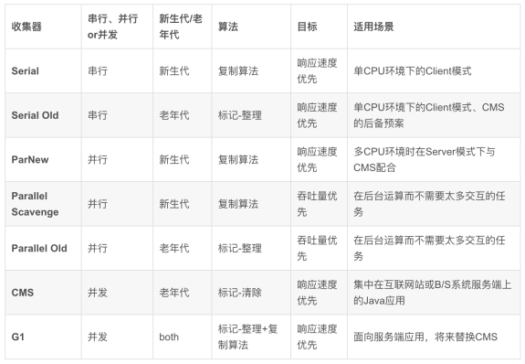


#### 常用的 GC 组合（重点） 

常用的组合为：
（ 1） Serial+Serial Old 实现单线程的低延迟垃圾回收机制；
（ 2） ParNew+CMS，实现多线程的低延迟垃圾回收机制；
（ 3） Parallel Scavenge和ParallelScavenge Old，实现多线程的高吞吐量垃圾回收机制； 

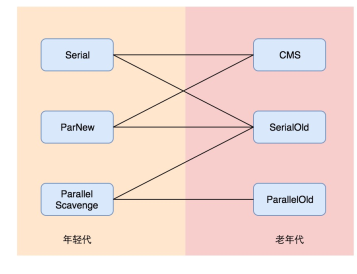


#### GC 如何选择 

选择正确的 GC 算法，唯一可行的方式就是去尝试，一般性的指导原则：
1. 如果系统考虑吞吐优先， CPU 资源都用来最大程度处理业务，用 Parallel GC；
2. 如果系统考虑低延迟有限，每次 GC 时间尽量短，用 CMS GC；
3. 如果系统内存堆较大，同时希望整体来看平均 GC 时间可控，使用 G1 GC。

对于内存大小的考量：

1. 一般 4G 以上，算是比较大，用 G1 的性价比较高。
2. 一般超过 8G，比如 16G-64G 内存，非常推荐使用 G1 GC。

最后讨论一个很多开发者经常忽视的问题，也是面试大厂常问的问题： JDK8 的默认 GC 是什么？
JDK9， JDK10， JDK11…等等默认的是 GC 是什么？ 


### ZGC/Shenandoah GC 

#### ZGC 介绍 

-XX： +UnlockExperimentalVMOptions -XX:+UseZGC -Xmx16g

ZGC 最主要的特点包括:

1. GC 最大停顿时间不超过 10ms
2. 堆内存支持范围广，小至几百 MB 的堆空间，大至 4TB 的超大堆内存（ JDK13 升至 16TB）
3. 与 G1 相比，应用吞吐量下降不超过 15%
4. 当前只支持 Linux/x64 位平台， JDK15 后支持 MacOS 和Windows 系统 

技术点：

- 着色(状态)指针
- 读屏障（挪老对象的时候，放一个新对象的引用，访问对象的时候，从老对象导到新的对象）

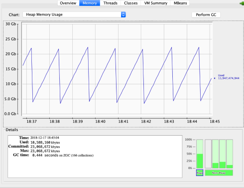

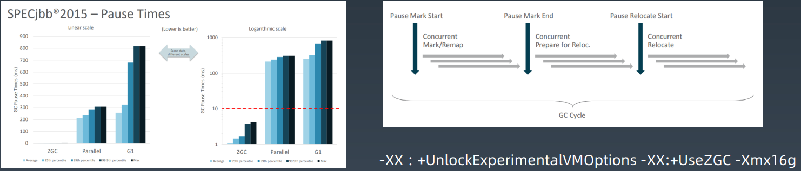


#### ShennandoahGC 介绍

-XX： +UnlockExperimentalVMOptions -XX:+UseShenandoahGC -Xmx16g

Shenandoah GC 立项比 ZGC 更早，设计为GC 线程与应用线程并发执行的方式，通过实现垃圾回收过程的并发处理，改善停顿时间，使得 GC 执行线程能够在业务处理线程运行过程中进行堆压缩、标记和整理，从而消除了绝大部分的暂停时间。

Shenandoah 团队对外宣称 ShenandoahGC 的暂停时间与堆大小无关，无论是 200MB 还是 200 GB的堆内存，都可以保障具有很低的暂停时间（注意:并不像 ZGC 那样保证暂停时间在 10ms 以内）。 

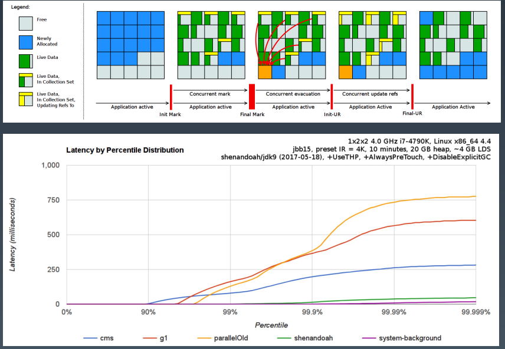


#### ShennandoahGC 与其他 GC 的 STW 比较 

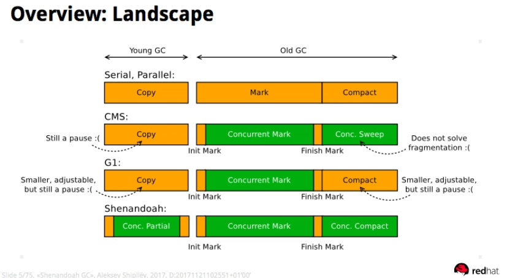


### GC 总结

到目前为止，我们一共了解了 Java 目前支持的所有 GC 算法，一共有 7 类:

1. 串行 GC（Serial GC）: 单线程执行，应用需要暂停；
2. 并行 GC（ParNew、Parallel Scavenge、Parallel Old）: 多线程并行地执行垃圾回收，关注与高吞吐；
3. CMS（Concurrent Mark-Sweep）: 多线程并发标记和清除，关注与降低延迟；
4. G1（G First）: 通过划分多个内存区域做增量整理和回收，进一步降低延迟；
5. ZGC（Z Garbage Collector）: 通过着色指针和读屏障，实现几乎全部的并发执行，几毫秒级别的延迟，线性可扩展；
6. Epsilon: 实验性的 GC，供性能分析使用；
7. Shenandoah: G1 的改进版本，跟 ZGC 类似。 

可以看出 GC 算法和实现的演进路线:
1. 串行 -> 并行: 重复利用多核 CPU 的优势，大幅降低 GC 暂停时间，提升吞吐量。
2. 并行 -> 并发： 不只开多个 GC 线程并行回收，还将GC操作拆分为多个步骤，让很多繁重的任务和应用线程一起并
发执行，减少了单次 GC 暂停持续的时间，这能有效降低业务系统的延迟。
3. CMS -> G1： G1 可以说是在 CMS 基础上进行迭代和优化开发出来的，划分为多个小堆块进行增量回收，这样就更
进一步地降低了单次 GC 暂停的时间
4. G1 -> ZGC:： ZGC 号称无停顿垃圾收集器，这又是一次极大的改进。 ZGC 和 G1 有一些相似的地方，但是底层的算法和思想又有了全新的突破。

脱离场景谈性能都是耍流氓”。

目前绝大部分 Java 应用系统，堆内存并不大比如 2G-4G 以内，而且对 10ms 这种低延迟的 GC 暂停不敏感，也就是说处理一个业务步骤，大概几百毫秒都是可以接受的， GC 暂停 100ms 还是 10ms 没多大区别。另一方面，系统的吞吐量反而往往是我们追求的重点，这时候就需要考虑采用并行 GC。

如果堆内存再大一些，可以考虑 G1 GC。如果内存非常大（比如超过 16G，甚至是 64G、 128G），或者是对延迟非常敏感（比如高频量化交易系统），就需要考虑使用本节提到的新 GC（ ZGC/Shenandoah）。 


### 总结回顾与作业实践 

#### 总结回顾

工具有哪些？

GC 有哪些？

都有什么特点？ 


#### 作业实践 

1、本机使用 G1 GC 启动一个程序，仿照课上案例分析一下 JVM 情况 


## JVM核心技术--调优分析与面试经验 

### GC 日志解读与分析 

#### GC日志打印

- 编译java文件，由于windows的编码是 gbk，文件是utf-8，直接编译会出错，需要使用命令： javac -encoding UTF-8 GCLogAnalysis.java。
- 低版本编译和执行是分开实现，高版本可以直接使用：java GCLogAnalysis.java。
- 打印GC的详细信息：java -XX:+PrintGCDetails GCLogAnalysis 
- 打印GC的详细信息并且生成log：java -Xloggc:gc.demo.log -XX:+PrintGCDetails -XX:+PrintGCDateStamps GCLogAnalysis
  - 分析log
  - 系统会出现GC或者Full GC
  - 观察每一次GC的时候，堆内存的变化，之一看到出现年轻代向老年代移动的现象
  - 观察GC的耗时，可以看到每一次GC的时间远远小于Full GC


#### OOM GC 示例

- 模拟一下 OOM，java -Xmx128m -XX:+PrintGCDetails GCLogAnalysis
  - 将堆内存调整为128MB，默认是物理内存的1/4
  - 控制台出现：Exception in thread "main" java.lang.OutOfMemoryError: Java heap space
  - 控制台，前期都是young GC，后期都是Full GC
- 分别使用 512m,1024m,2048m,4086m,观察 GC 信息的不同 
  - 内存小的时候，GC的频率比较高
  - 随着内存的变大，生成对象的次数变大，300MB的时候和1024MB的时候，生成的对象变多
- 如何最快的方式实现程序的OOM? 
  - 直接调小堆内存即可。


#### Minor GC 与 Major GC

究竟是
• Young GC
• Full GC

还是
• Minor GC（小型 GC）
• Major GC（大型 GC）？ 


#### 串行 GC

- java -XX:+UseSerialGC -Xms512m -Xmx512m -Xloggc:gc.demo.log -XX:+PrintGCDetails -XX:+PrintGCDateStamps GCLogAnalysis
- java -XX:+UseSerialGC -Xms512m -Xmx512m -XX:+PrintGCDetails -XX:+PrintGCDateStamps GCLogAnalysis
- java -XX:+UseSerialGC -Xms2048m -Xmx2048m -XX:+PrintGCDetails -XX:+PrintGCDateStamps GCLogAnalysis
- java -XX:+UseSerialGC -Xms128m -Xmx128m -XX:+PrintGCDetails -XX:+PrintGCDateStamps GCLogAnalysis

- 观察 Young GC 与 Full GC 


#### 并行 GC

- java -XX:+UseParallelGC -Xms512m -Xmx512m -XX:+PrintGCDetails -XX:+PrintGCDateStamps GCLogAnalysis
- java -XX:+UseParallelGC -Xms2048m -Xmx2048m -XX:+PrintGCDetails -XX:+PrintGCDateStamps GCLogAnalysis
- java -XX:+UseParallelGC -Xms4g -Xmx4g -XX:+PrintGCDetails -XX:+PrintGCDateStamps GCLogAnalysis
- java -XX:+UseParallelGC -Xms128m -Xmx128m -XX:+PrintGCDetails -XX:+PrintGCDateStamps GCLogAnalysis
- java -XX:+UseParallelGC -Xms128m  -XX:+PrintGCDetails -XX:+PrintGCDateStamps GCLogAnalysis
- 观察 Young GC 与 Full GC
- 思考：如果不配置 Xms 会怎么样？ 
- 一般并行GC适合，大的吞吐量，多线程工作，STW明显。


#### CMS GC

- java -XX:+UseConcMarkSweepGC -Xms512m -Xmx512m -XX:+PrintGCDetails -XX:+PrintGCDateStamps GCLogAnalysis

- java -XX:+UseConcMarkSweepGC -Xms4g -Xmx4g -XX:+PrintGCDetails -XX:+PrintGCDateStamps GCLogAnalysis

- 观察 Young GC 与 Full GC

- 思考：假如 Xmx/Xms 设置 4g 会怎么样？

- 4g 内存下跟并行 gc 相比呢？ 

- CMS GC 的步骤：

  - ```sh
    # 阶段 1：Initial Mark（初始标记）
    # 阶段 2：Concurrent Mark（并发标记）
    # 阶段 3：Concurrent Preclean（并发预清理）
    # 阶段 4： Final Remark（最终标记）
    # 阶段 5： Concurrent Sweep（并发清除）
    # 阶段 6： Concurrent Reset（并发重置）
    
    # CMS Initial Mark
    2020-11-19T20:20:10.736+0800: [GC (CMS Initial Mark) [1 CMS-initial-mark: 280994K(349568K)] 299082K(506816K), 0.0001499 secs] [Times: user=0.00 sys=0.00, real=0.00 secs]
    # CMS-concurrent-mark
    2020-11-19T20:20:10.736+0800: [CMS-concurrent-mark-start]
    2020-11-19T20:20:10.737+0800: [CMS-concurrent-mark: 0.001/0.001 secs] [Times: user=0.00 sys=0.00, real=0.00 secs]
    # CMS-concurrent-preclean
    2020-11-19T20:20:10.737+0800: [CMS-concurrent-preclean-start]
    2020-11-19T20:20:10.738+0800: [CMS-concurrent-preclean: 0.000/0.000 secs] [Times: user=0.00 sys=0.00, real=0.00 secs]
    # CMS-concurrent-abortable-preclean
    2020-11-19T20:20:10.738+0800: [CMS-concurrent-abortable-preclean-start]
    2020-11-19T20:20:10.757+0800: [GC (Allocation Failure) 2020-11-19T20:20:10.757+0800: [ParNew: 157128K->17468K(157248K), 0.0203096 secs] 438123K->346220K(506816K), 0.0203527 secs] [Times: user=0.06 sys=0.01, real=0.02 secs]
    2020-11-19T20:20:10.778+0800: [CMS-concurrent-abortable-preclean: 0.001/0.040 secs] [Times: user=0.08 sys=0.01, real=0.04 secs]
    # CMS Final Remark
    2020-11-19T20:20:10.778+0800: [GC (CMS Final Remark) [YG occupancy: 24805 K (157248 K)]2020-11-19T20:20:10.778+0800: [Rescan (parallel) , 0.0002502 secs]2020-11-19T20:20:10.778+0800: [weak refs processing, 0.0000102 secs]2020-11-19T20:20:10.778+0800: [class unloading, 0.0002020 secs]2020-11-19T20:20:10.779+0800: [scrub symbol table, 0.0002735 secs]2020-11-19T20:20:10.779+0800: [scrub string table, 0.0000824 secs][1 CMS-remark: 328751K(349568K)] 353556K(506816K), 0.0008734 secs] [Times: user=0.00 sys=0.00, real=0.00 secs]
    # CMS-concurrent-sweep
    2020-11-19T20:20:10.779+0800: [CMS-concurrent-sweep-start]
    2020-11-19T20:20:10.780+0800: [CMS-concurrent-sweep: 0.001/0.001 secs] [Times: user=0.00 sys=0.00, real=0.00 secs]
    # CMS-concurrent-reset
    2020-11-19T20:20:10.780+0800: [CMS-concurrent-reset-start]
    2020-11-19T20:20:10.780+0800: [CMS-concurrent-reset: 0.000/0.000 secs] [Times: user=0.00 sys=0.00, real=0.00 secs]
    ```


#### G1 GC

- java -XX:+UseG1GC -Xms512m -Xmx512m -XX:+PrintGCDetails -XX:+PrintGCDateStamps GCLogAnalysis

- java -XX:+UseG1GC -Xms512m -Xmx512m -XX:+PrintGC -XX:+PrintGCDateStamps GCLogAnalysis

- java -XX:+UseG1GC -Xms4g -Xmx4g -XX:+PrintGC -XX:+PrintGCDateStamps GCLogAnalysis

- 观察 Young GC 与 Full GC

- 思考：假如Xmx/Xms 设置 4g 会怎么样？

- 4g 内存下跟 cms gc 相比呢？ 

  - 4G 内存时的 G1，完全不一样 

- G1 GC 的步骤：

  - ```sh
    # Evacuation Pause: young（纯年轻代模式转移暂停）
    # Concurrent Marking（并发标记）
    # 阶段 1: Initial Mark（初始标记）
    # 阶段 2: Root Region Scan（Root区扫描）
    # 阶段 3: Concurrent Mark（并发标记）
    # 阶段 4: Remark（再次标记）
    # 阶段 5: Cleanup（清理）
    # Evacuation Pause (mixed)（转移暂停: 混合模式）
    # Full GC (Allocation Failure)
    
    2020-11-19T20:32:21.473+0800: [GC pause (G1 Evacuation Pause) (young)-- 416M->268M(512M), 0.0094140 secs]
    2020-11-19T20:32:21.483+0800: [GC pause (G1 Evacuation Pause) (young) (initial-mark) 269M->270M(512M), 0.0072150 secs]
    2020-11-19T20:32:21.490+0800: [GC concurrent-root-region-scan-start]
    2020-11-19T20:32:21.491+0800: [GC concurrent-root-region-scan-end, 0.0001382 secs]
    2020-11-19T20:32:21.491+0800: [GC concurrent-mark-start]
    2020-11-19T20:32:21.492+0800: [GC concurrent-mark-end, 0.0016133 secs]
    2020-11-19T20:32:21.492+0800: [GC remark, 0.0014565 secs]
    2020-11-19T20:32:21.494+0800: [GC cleanup 281M->280M(512M), 0.0010754 secs]
    2020-11-19T20:32:21.495+0800: [GC concurrent-cleanup-start]
    2020-11-19T20:32:21.495+0800: [GC concurrent-cleanup-end, 0.0000168 secs]
    
    ```


#### 一个退化时的例子 

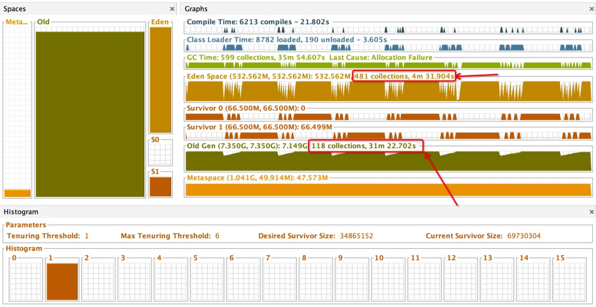


#### GCEasy

网址：https://gceasy.io/

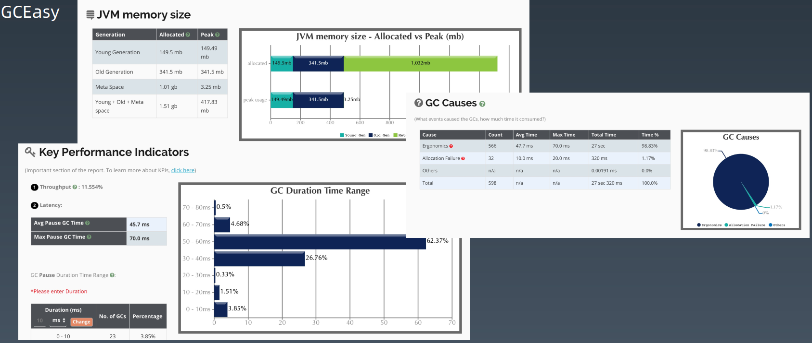


#### GCViewer

https://github.com/chewiebug/GCViewer

http://www.javaperformancetuning.com/tools/gcviewer/index.shtml

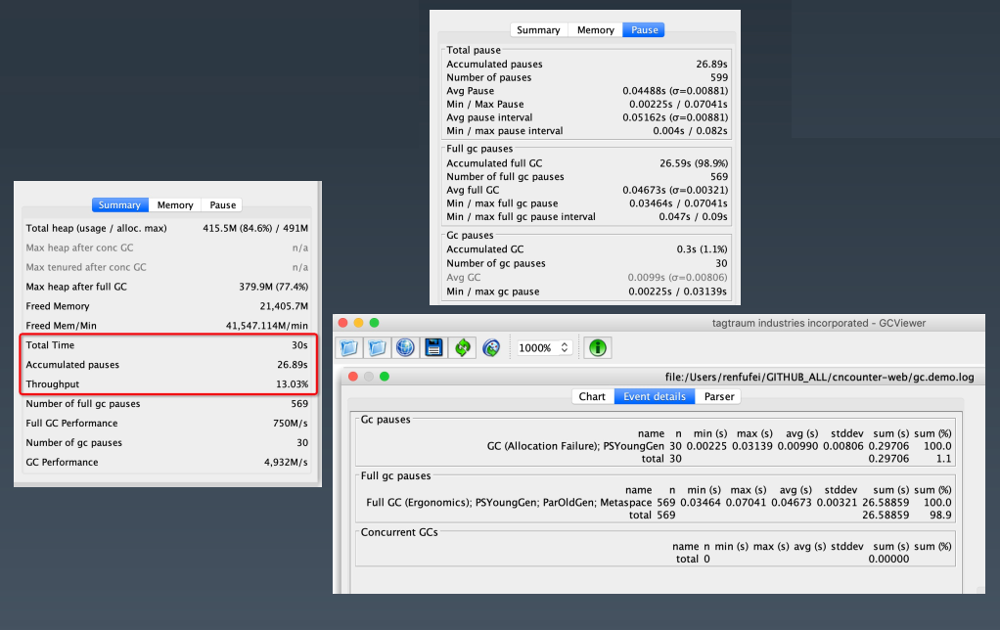


#### 总结

如何查看/分析不同 GC 配置下的日志信息？

各种 GC 有什么特点和使用场景？ 


### JVM 线程堆栈数据分析 

#### JVM 线程模型示意图

- JVM的线程与操作系统的线程是一一对应的关系，所以线程的操作比较重
- 线程设计三层的内容：Java层面，JVM层面，OS层面

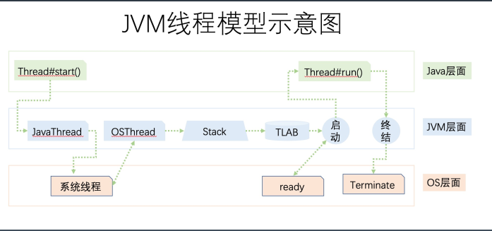


#### JVM 内部线程 

JVM 内部线程主要分为以下几种：

- VM 线程：单例的 VMThread 对象，负责执行 VM 操作，下文将对此进行讨论;
- 定时任务线程：单例的 WatcherThread 对象， 模拟在VM 中执行定时操作的计时器中断；
- GC 线程：垃圾收集器中，用于支持并行和并发垃圾回收的线程;
- 编译器线程： 将字节码编译为本地机器代码（JNI线程）;
- 信号分发线程：等待进程指示的信号，并将其分配给Java级别的信号处理方法 


#### 安全点

1. 方法代码中被植入的安全点检测入口；
2. 线程处于安全点状态：线程暂停执行，这个时候线程栈不再发生改变；
3. JVM 的安全点状态：所有线程都处于安全点状态。


#### 线程转储

JVM 支持多种方式来进行线程转储：

1. JDK 工具, 包括: jstack 工具, jcmd 工具, jconsole, jvisualvm, Java Mission Control 等；
2. Shell 命令或者系统控制台, 比如 Linux 的 kill -3, Windows 的 Ctrl + Break 等；
3. JMX 技术， 主要是使用 ThreadMxBean。 


#### 死锁检测

- 先检查
- 再中止死锁线程
  - 设置超时，解锁
  - 强制杀掉线程
- fastthread 线程分析 ：https://fastthread.io/
- jconsole

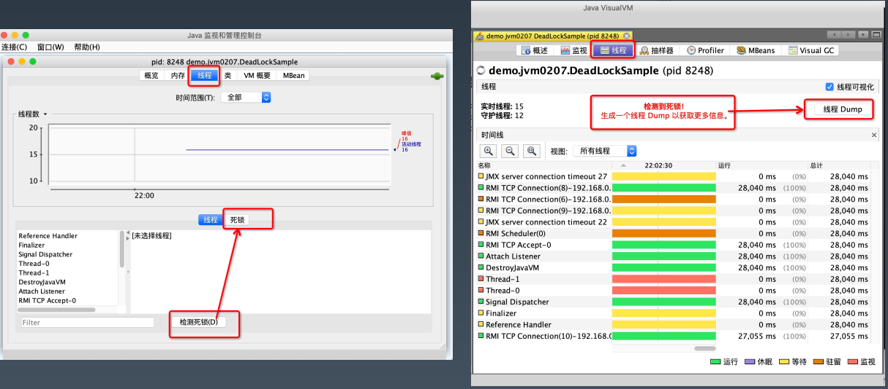

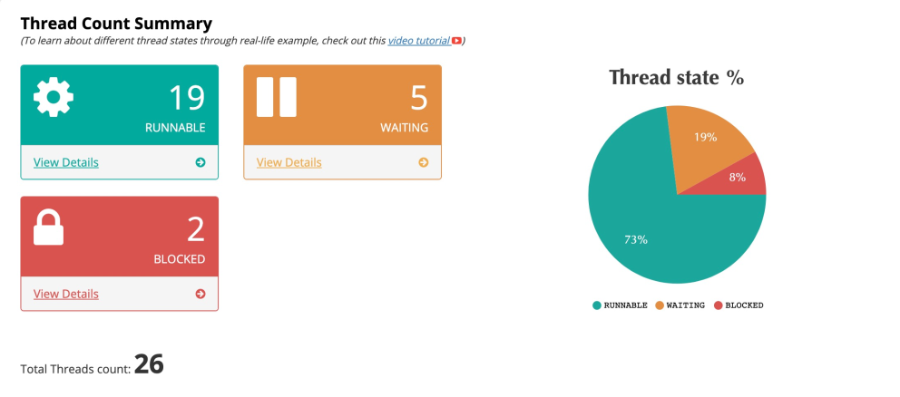


### 内存分析与相关工具 

#### 思考题

请思考一个问题：
一个对象具有100个属性，与100个对象每个具有1个属性，哪个占用的内存空间更大？ 

答案：100个对象每个具有1个属性 大。（类比书柜和书的道理）


#### Java 对象占用多少内存

一个 Java 对象占用多少内存？

可以使用 Instrumentation.getObjectSize() 方法来估算一个对象占用的内存空间。

JOL (Java Object Layout) 可以用来查看对象内存布局。

对比结构体与Data Object？ 

java 会进行对象内部的补齐，所以精确的对象大小，不好计算！

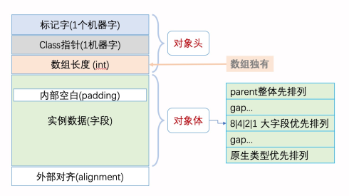


#### 对象头和对象引用

在64位 JVM 中，对象头占据的空间是 12-byte(=96bit=64+32)，但是以8字节对齐，所以一
个空类的实例至少占用16字节。

在32位 JVM 中，对象头占8个字节，以4的倍数对齐(32=4*8)。
所以 new 出来很多简单对象，甚至是 new Object()，都会占用不少内容哈。

通常在32位 JVM，以及内存小于 -Xmx32G 的64位JVM 上(默认开启**指针压缩**)，一个引用占的内存默
认是4个字节。

因此，64位 JVM 一般需要多消耗堆内存。 


#### 包装类型

比原生数据类型消耗的内存要多，详情可以参考JavaWorld ：

**Integer**：占用16字节(8+4=12+补齐)，因为 int 部分占4个字节。 所以使用 Integer 比原生类型 int 要多消
耗 300% 的内存。

**Long**：一般占用16个字节(8+8=16)，当然，对象的实际大小由底层平台的内存对齐确定，具体由特定 CPU
平台的 JVM 实现决定。 看起来一个 Long 类型的对象，比起原生类型 long 多占用了8个字节（也多消耗了100%）。 

**多维数组**：在二维数组 int[dim1]\[dim2] 中，每个嵌套的数组 int[dim2] 都是一个单独的 Object，会
额外占用16字节的空间。当数组维度更大时，这种开销特别明显。

int[128]\[2] 实例占用3600字节。 而 int[256] 实例则只占用1040字节。里面的有效存储空间是一样
的，3600 比起1040多了246%的额外开销。在极端情况下，byte[256]\[1]，额外开销的比例是19倍!

**String**: String 对象的空间随着内部字符数组的增长而增长。当然，String 类的对象有24个字节的额外开销。
对于10字符以内的非空 String，增加的开销比起有效载荷（每个字符2字节 + 4 个字节的 length），多占用了100% 到 400% 的内存。 


#### 对齐是绕不过去的问题

我们可能会认为，一个 X 类的实例占用17字节的空间。但是由于需要对齐(padding)，JVM 分配的内存是8字节的整数倍，所以占用的空间不是17字节,而是24字节。 

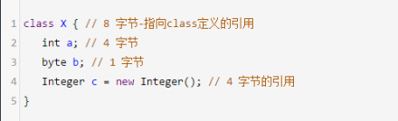


#### 内存泄漏的例子 

- while 死循环，后面执行的时候由于key是不等的，没法判断之前的对象是不是在HashMap中
- 此时就会 OOM

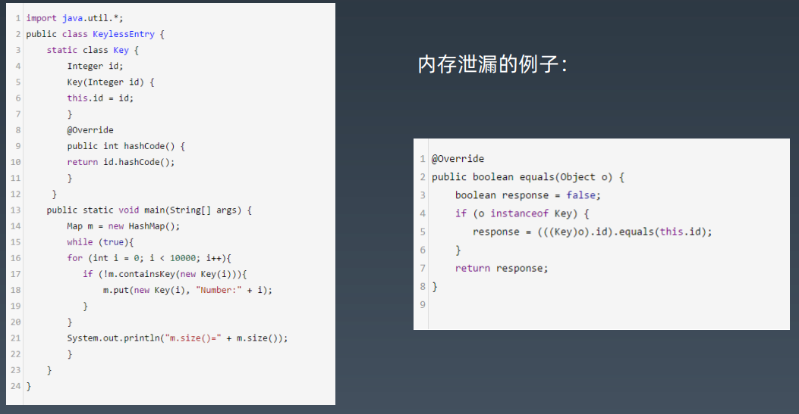


#### OOM

##### OutOfMemoryError: Java heap space

创建新的对象时，堆内存中的空间不足以存放新创建的对象

产生的原因，很多时候就类似于将 XXL 号的对象，往 S 号的 Java heap space 里面塞。其实清楚了原因，问题就很容易解决了：只要增加堆内存的大小，程序就能正常运行。

另外还有一些情况是由**代码问题**导致的：

• 超出预期的访问量/数据量：应用系统设计时，一般是有 “容量” 定义的，部署这么多机器，用来处理一定流量的数据/业务。 如果访问量突然飙升，超过预期的阈值，类似于时间坐标系中针尖形状的图谱。那么在峰值所在的时间段，程序很可能就会卡死、并触发java.lang.OutOfMemoryError: Java heap space错误。

• 内存泄露(Memory leak)：这也是一种经常出现的情形。由于代码中的某些隐蔽错误，导致系统占用的内存越来越多。如果某个方法/某段代码存在内存泄漏，每执行一次，就会（有更多的垃圾对象）占用更多的内存。随着运行时间的推移，泄漏的对象耗光了堆中的所有内存，那么java.lang.OutOfMemoryError: Java heap space 错误就爆发了。 


##### OutOfMemoryError: PermGen space/OutOfMemoryError: Metaspace

java.lang.OutOfMemoryError: PermGen space 的主要原因，是加载到内存中的 class 数量太多或体积太大，超过了 PermGen 区的大小。

解决办法：增大 PermGen/Metaspace
-XX:MaxPermSize=512m
-XX:MaxMetaspaceSize=512m

高版本 JVM 也可以：
-XX:+CMSClassUnloadingEnabled 

注意：Metaspace 存放的是class对象的基本信息，不是对象。对象一旦被创建出来，都是需要放到堆上。


##### OutOfMemoryError: Unable to create new native thread

java.lang.OutOfMemoryError: Unable to create new native thread 错误是程序创建的线程数量已达到上限值的异常信息。

解决思路：

1. 调整系统参数 ulimit -a，echo 120000 > /proc/sys/kernel/threads-max
2. 降低 xss 等参数
3. 调整代码，改变线程创建和使用方式 

注意：linux 一切接文件，在操作的时候windows对应的是端口，linux使用的是文件句柄。当进行网络程序的时候，可能程序结束了，操作系统并没有完全回收端口的资源，导致下一次启动会报端口的错误，起不来！


#### 内存 Dump 分析工具

• Eclipse MAT
• jhat

留给大家自己研究 

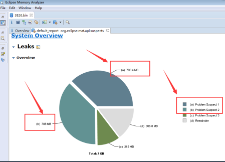


### JVM 问题分析调优经验 

#### 1、高分配速率(High Allocation Rate)

分配速率(Allocation rate)表示单位时间内分配的内存量。通常使用 MB/sec 作为单位。上一次垃圾收集之后，与下一次 GC 开始之前的年轻代使用量，两者的差值除以时间,就是分配速率。

分配速率过高就会严重影响程序的性能，在 JVM 中可能会导致巨大的 GC 开销。

正常系统：分配速率较低 ~ 回收速率 -> 健康
内存泄漏：分配速率 持续大于 回收速率 -> OOM
性能劣化：分配速率较高 ~ 回收速率 -> 压健康 

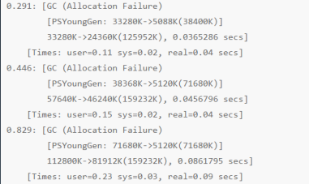

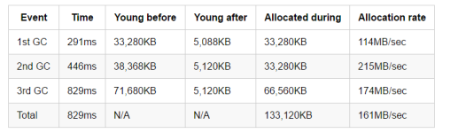

JVM 启动之后 291ms，共创建了 33,280 KB 的对象。第一次 Minor GC（小型GC) 完成后，年轻代中还有 5,088 KB 的对象存活。
在启动之后 446 ms，年轻代的使用量增加到38,368 KB，触发第二次 GC，完成后年轻代的使用量减少到 5,120 KB。
在启动之后 829 ms，年轻代的使用量为 71,680KB，GC 后变为 5,120 KB。 


思考一个问题，
分配速率，到底影响什么？

想一想，new 出来的对象，在什么地方。
答案就是，Eden。

假如我们增加 Eden，会怎么样。
考虑蓄水池效应。

最终的效果是，影响 Minor GC的次数和时间，进而影响吞吐量。
在某些情况下，只要增加年轻代的大小，即可降低分配速率过高所造成的影响。增加年轻代空间并不会降低分配速率，但是会减少 GC 的频率。如果每次 GC 后只有少量对象存活，minor GC 的暂停时间就不会明显增加。 


#### 2、过早提升(Premature Promotion)

提升速率（promotion rate）用于衡量单位时间内从年轻代提升到老年代的数据量。一般使用 MB/sec 作为单位, 和分配速率类似。

JVM 会将长时间存活的对象从年轻代提升到老年代。根据分代假设，可能存在一种情况，老年代中不仅有存活时间长的对象,，也可能有存活时间短的对象。这就是过早提升：对象存活时间还不够长的时候就被提升到了老年代。

major GC 不是为频繁回收而设计的，但 major GC 现在也要清理这些生命短暂的对象，就会导致 GC 暂停时间过长。这会严重影响系统的吞吐量。 


GC 之前和之后的年轻代使用量以及堆内存使用量。这样就可以通过差值算出老年代的使用量。

和分配速率一样，提升速率也会影响 GC 暂停的频率。但**分配速率主要影响 minor GC，而提升速率**
**则影响 major GC 的频率**。

有大量的对象提升，自然很快将老年代填满。老年代填充的越快，则 major GC 事件的频率就会越高。 

一般来说过早提升的症状表现为以下形式：
1. 短时间内频繁地执行 full GC
2. 每次 full GC 后老年代的使用率都很低，在10-20%或以下
3. 提升速率接近于分配速率

要演示这种情况稍微有点麻烦，所以我们使用特殊手段，让对象提升到老年代的年龄比默认情况小很
多。指定 GC 参数 -Xmx24m -XX:NewSize=16m-XX:MaxTenuringThreshold=1，运行程序之后，可以看到下面的 GC 日志。 

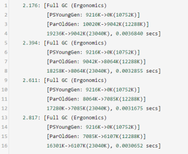

解决这类问题，需要让年轻代存放得下暂存的数据，有两种简单的方法：

- 一是增加年轻代的大小，设置 JVM 启动参数，类似这样：-Xmx64m -XX:NewSize=32m，程序在执行时，Full GC 的次数自然会减少很多，只会对 minor GC 的持续时间产生影响。
- 二是减少每次批处理的数量，也能得到类似的结果。

至于选用哪个方案，要根据业务需求决定。 在某些情况下，业务逻辑不允许减少批处理的数量，那就只能增加堆内存，或者重新指定年轻代的大小。 如果都不可行，就只能优化数据结构，减少内存消耗。

但总体目标依然是一致的：让临时数据能够在年轻代存放得下。 


### GC 疑难情况问题分析 

#### Arthas 诊断分析工具 


#### 问题分析方向

1、查询业务日志，可以发现这类问题：
请求压力大，波峰，遭遇降级，熔断等等， 基础服务、外部 API依赖 。

2、查看系统资源和监控信息：
硬件信息、操作系统平台、系统架构；
排查 CPU 负载、内存不足，磁盘使用量、硬件故障、磁盘分区用满、IO 等待、IO 密集、丢数据、并发竞争等情况；
排查网络：流量打满，响应超时，无响应，DNS 问题，网络抖动，防火墙问题，物理故障，网络参数调整、超时、连接数。

3、查看性能指标，包括实时监控、历史数据。可以发现 假死，卡顿、响应变慢等现象；
排查数据库， 并发连接数、慢查询、索引、磁盘空间使用量、内存使用量、网络带宽、死锁、TPS、查询数据量、redo日志、undo、 binlog 日志、代理、工具 BUG。可以考虑的优化包括： 集群、主备、只读实例、分片、分区；
大数据，中间件，JVM 参数。

4、排查系统日志， 比如重启、崩溃、Kill 。

5、APM，比如发现有些链路请求变慢等等。 

6、排查应用系统
排查配置文件: 启动参数配置、Spring 配置、JVM 监控参数、数据库参数、Log 参数、APM 配置、内存问题，比如是否存在内存泄漏，内存溢出、批处理导致的内存放大、GC 问题等等；
GC 问题， 确定 GC 算法、确定 GC 的 KPI，GC 总耗时、GC 最大暂停时间、分析 GC 日志和监控指标： 内存分配度，分代提升速度，内存使用率等数据。适当时修改内存配置；
排查线程, 理解线程状态、并发线程数，线程 Dump，锁资源、锁等待，死锁，线程池（一般机器50的效果优于500）；
排查代码， 比如安全漏洞、低效代码、算法优化、存储优化、架构调整、重构、解决业务代码 BUG、第三方库、XSS、CORS、正则；
单元测试： 覆盖率、边界值、Mock 测试、集成测试。

7、 排除资源竞争、坏邻居效应

8、疑难问题排查分析手段
DUMP 线程\内存；
抽样分析\调整代码、异步化、削峰填谷。 


#### 一个真实的案例分析 

- 文档：[GC问题排查实战案例 ](./GCProblemTrainingCase.md)
- 并行 GC 暂停太高
- G1 GC 暂停还是太高
- 找到问题，最终优化 
- 有容器存在，不知道JVM看到的数据，是不是真实的配置数据，可能直接看到的是物理机的信息
- 注意：JVM参数需要明确指定

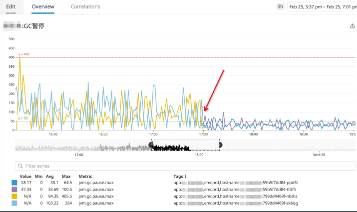


### JVM 常见面试问题汇总 

- 文档：[VM 常见面试问题汇总 ](./JVMInterviewQuestion.md)


### 本地环境压测测试

#### 压测程序

1.可以从github获取
git clone https://github.com/kimmking/atlantis
cd atlantis\gateway-server
mvn clean package
然后在target目录可以找到gateway-server-0.0.1-SNAPSHOT.jar

2.也可以从此处下载已经编译好的：
链接：https://pan.baidu.com/s/1NbpYX4M3YKLYM1JJeIzgSQ 
提取码：sp85 

3.启动程序
java -jar -Xmx512m -Xms512m gateway-server-0.0.1-SNAPSHOT.jar
java -jar -Xmx1024m -Xms1024m gateway-server-0.0.1-SNAPSHOT.jar


#### Windows

1.管理员身份打开powershell

2.运行
Set-ExecutionPolicy Bypass -Scope Process -Force; [System.Net.ServicePointManager]::SecurityProtocol = [System.Net.ServicePointManager]::SecurityProtocol -bor 3072; iex ((New-Object System.Net.WebClient).DownloadString('https://chocolatey.org/install.ps1'))

3.执行choco install superbenchmarker

4.输入 sb

5.执行 sb -u http://localhost:8088/api/hello -c 20 -N 60


#### Mac

1.执行brew install wrk
如果显式brew update很慢，可以ctrl+C打断更新

2.输入 wrk

执行 wrk -t8 -c40 -d60s http://localhost:8088/api/hello


#### jmc

1.控制台输入：jmc

2.在JVM浏览器中，找到对应的进程，开启飞行记录，设置默认1分钟记录

3.启动程序，并且压测

注意：使用jmc进行飞行记录的挂载，对于原系统的性能会有严重影响。


### 总结回顾与作业实践 

#### 总结回顾

1. GC 日志解读与分析*
2. JVM 线程堆栈数据分析
3. 内存分析与相关工具*
4. JVM 问题分析调优经验*
5. GC 疑难情况问题分析
6. JVM 常见面试问题汇总* 


#### 作业实践 

1、使用 GCLogAnalysis.java 自己演练一遍串行/并行/CMS/G1的案例。
2、使用压测工具（wrk或sb），演练gateway-server-0.0.1-SNAPSHOT.jar 示例。
3、(选做)如果自己本地有可以运行的项目，可以按照2的方式进行演练。

根据上述自己对于1和2的演示，写一段对于不同 GC 的总结，提交到 Github。 


## NIO 模型与 Netty 入门 

### Java Socket 编程 

#### 服务器通信原理 

- IP（对应计算机）
- 端口（对应计算机的进程）

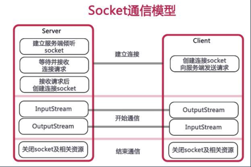


#### Java 实现一个最简的 HTTP 服务器-01 

1. 创建一个 ServerSocket
2. 绑定8801端口
3. 当有客户端请求时通过 accept 方法拿到 Socket，进而可以进行处理
4. sleep 20ms，模拟业务操作(IO)
5. 模拟输出 HTTP 报文头和 hello
6. 关闭 socket

```java
package java0.nio01;

import java.io.IOException;
import java.io.PrintWriter;
import java.net.ServerSocket;
import java.net.Socket;

public class HttpServer01 {
    public static void main(String[] args) throws IOException{
        ServerSocket serverSocket = new ServerSocket(8801);
        while (true) {  // 死循环
            try {
                Socket socket = serverSocket.accept();  // 阻塞
                service(socket);
            } catch (IOException e) {
                e.printStackTrace();
            }
        }
    }
    
    private static void service(Socket socket) {
        try {
            Thread.sleep(20);
            PrintWriter printWriter = new PrintWriter(socket.getOutputStream(), true);
            printWriter.println("HTTP/1.1 200 OK");
            printWriter.println("Content-Type:text/html;charset=utf-8");
            String body = "hello,nio";
            printWriter.println("Content-Length:" + body.getBytes().length);
            printWriter.println();
            printWriter.write(body);
            printWriter.close();
            socket.close();
        } catch (IOException | InterruptedException e) {
            e.printStackTrace();
        }
    }
}
```

可以浏览器访问 http://localhost:8801思考一下有什么问题？ 

设置-Xmx512 然后启动

压测：
sb -u http://localhost:8801 -c 40 -N 30
wrk -c 40 -d30s http://localhost:8801 

```sh
C:\Users\rmliu>sb -u http://localhost:8801/ -c 40 -N 30
Starting at 2020/11/20 17:12:44
[Press C to stop the test]
1436    (RPS: 41.9)
---------------Finished!----------------
Finished at 2020/11/20 17:13:18 (took 00:00:34.3992873)
1471    (RPS: 42.9)                     Status 200:    1471

RPS: 47.3 (requests/second)  # 理论不会超过50
Max: 1401ms
Min: 580ms
Avg: 825.3ms

  50%   below 820ms
  60%   below 821ms
  70%   below 822ms
  80%   below 824ms
  90%   below 826ms
  95%   below 829ms
  98%   below 841ms
  99%   below 1111ms
99.9%   below 1380ms
```

慢的原因：

- 有一个 Sleep 时间
- 只有一个单线程执行，串行处理


#### Java 实现一个最简的 HTTP 服务器-02 

改进一下，绑定8802端口

```java
package java0.nio01;

import java.io.IOException;
import java.io.PrintWriter;
import java.net.ServerSocket;
import java.net.Socket;

public class HttpServer02 {
    public static void main(String[] args) throws IOException {
        ServerSocket serverSocket = new ServerSocket(8802);
        while (true) {
            try {
                final Socket socket = serverSocket.accept();
                new Thread(() -> {  // 一个线程处理一个请求
                    service(socket);
                }).start();
            } catch (IOException e) {
                e.printStackTrace();
            }
        }
    }

    private static void service(Socket socket) {
        try {
            Thread.sleep(20);
            PrintWriter printWriter = new PrintWriter(socket.getOutputStream(), true);
            printWriter.println("HTTP/1.1 200 OK");
            printWriter.println("Content-Type:text/html;charset=utf-8");
            String body = "hello,nio";
            printWriter.println("Content-Length:" + body.getBytes().length);
            printWriter.println();
            printWriter.write(body);
            printWriter.close();
            socket.close();
        } catch (IOException | InterruptedException e) {
            e.printStackTrace();
        }
    }
}
```

每个客户端请求进来时创建一个线程有什么问题？ 

设置-Xmx512 然后启动

压测：
sb -u http://localhost:8802 -c 40 -N 30
wrk -c 40 -d30s http://localhost:8802 

```sh
C:\Users\rmliu>sb -u http://localhost:8802/ -c 40 -N 30
Starting at 2020/11/20 17:18:47
[Press C to stop the test]
38210   (RPS: 1114.8)
---------------Finished!----------------
Finished at 2020/11/20 17:19:22 (took 00:00:34.5036252)
Status 200:    38174
Status 303:    36

RPS: 1224 (requests/second)  # 提升很明显
Max: 148ms
Min: 0ms
Avg: 23.1ms

  50%   below 21ms
  60%   below 22ms
  70%   below 22ms
  80%   below 23ms
  90%   below 27ms
  95%   below 32ms
  98%   below 43ms
  99%   below 52ms
99.9%   below 84ms
```

慢的原因：

- 每一次请求就创建一个线程，直接去操作系统创建一个线程，最后销毁，线程的使用效率低
- 线程的创建和销毁，开销较大


#### Java 实现一个最简的 HTTP 服务器-03

再改进一下，绑定8803端口

```java
package java0.nio01;

import java.io.IOException;
import java.io.PrintWriter;
import java.net.ServerSocket;
import java.net.Socket;
import java.util.concurrent.ExecutorService;
import java.util.concurrent.Executors;

public class HttpServer03 {
    public static void main(String[] args) throws IOException{
        ExecutorService executorService = Executors.newFixedThreadPool(40);
        final ServerSocket serverSocket = new ServerSocket(8803);
        while (true) {
            try {
                final Socket socket = serverSocket.accept();
                executorService.execute(() -> service(socket));
            } catch (IOException e) {
                e.printStackTrace();
            }
        }
    }
    
    private static void service(Socket socket) {
        try {
            Thread.sleep(20);
            PrintWriter printWriter = new PrintWriter(socket.getOutputStream(), true);
            printWriter.println("HTTP/1.1 200 OK");
            printWriter.println("Content-Type:text/html;charset=utf-8");
            String body = "hello,nio";
            printWriter.println("Content-Length:" + body.getBytes().length);
            printWriter.println();
            printWriter.write(body);
            printWriter.close();
            socket.close();
        } catch (IOException | InterruptedException e) {
            e.printStackTrace();
        }
    }
}
```

创建一个固定大小的线程池来处理

why？有什么问题？ 

设置-Xmx512 然后启动

压测：
sb -u http://localhost:8803 -c 40 -N 30
wrk -c 40 -d30s http://localhost:8803 

```sh
C:\Users\rmliu>sb -u http://localhost:8803/ -c 40 -N 30
Starting at 2020/11/20 17:25:19
[Press C to stop the test]
44536   (RPS: 1297.9)
---------------Finished!----------------
Finished at 2020/11/20 17:25:54 (took 00:00:34.3861722)
Status 200:    44514
Status 303:    22

RPS: 1433.9 (requests/second)  # 提升更明显
Max: 112ms
Min: 0ms
Avg: 21.3ms

  50%   below 20ms
  60%   below 21ms
  70%   below 21ms
  80%   below 21ms
  90%   below 23ms
  95%   below 26ms
  98%   below 32ms
  99%   below 36ms
99.9%   below 65ms
```


#### 总结一下，到目前为止，我们做了什么 

- 单线程处理 socket
- 每个请求一个线程
- 固定大小线程池处理 


### 深入讨论 IO 通信 

#### 服务器通信过程分析 


仔细分析一下，这个过程中，存在两种类型操作：

- CPU 计算/业务处理
- IO 操作与等待/网络、磁盘、数据库

想想我们前面的例子为什么创建大量线程？ 

- 线程在处理的时候，会Sleep，此时就会有空闲的时间；
- 保证CPU最高效的吃饱

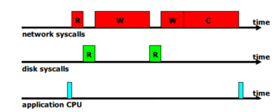

对于一个 IO 相关应用来说，例如通过网络访问，服务器端读取本地文件，再返回给客户端（如上图）。

这种情况下，大部分 CPU 等资源，可能就被浪费了 ，怎么优化？


#### 再深入一层的看问题 

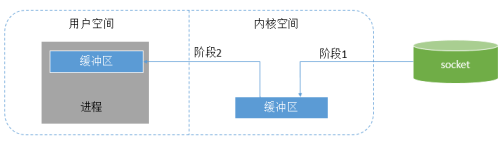

不仅面临 线程/CPU 的问题，

还要面对数据来回复制的问题。(数据从用户态，拷贝到内核态，然后发送出去，并且中间还有一个缓冲区。)

这个一来，对每个业务处理过程，使用一个线程以一竿子通到底的方式，性能不是最优的，还有提升空间。

考虑一下，理想状态，是什么样的？
流水线 


### NIO 模型与相关概念 

#### 通信模型 

考虑一下：

- 阻塞、非阻塞，
- 同步、异步，

有什么关系和区别？

- 同步异步 是通信模式。
- 阻塞、非阻塞 是 线程处理模式。 


#### 五种 IO 模型 

基本上都是同步的 

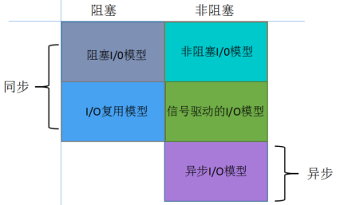


#### IO 模型-01 -阻塞式 IO、BIO

阻塞式 IO、BIO

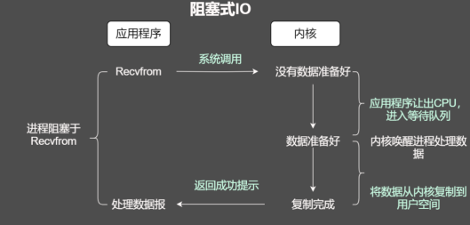

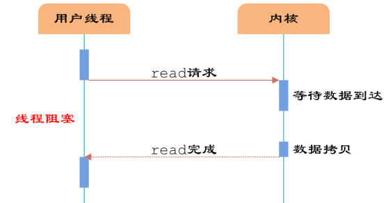

一般通过在 while(true) 循环中服务端会调用 accept() 方法等待接收客户端的连接的方式监听请求，请求一旦接收到一个连接请求，就可以建立通信套接字在这个通信套接字上进行读写操作，此时不能再接收其他客户端连接请求，只能等待当前连接的客户端的操作执行完成， 不过可以通过多线程来支持多个客户端的连接 


#### IO 模型-02 -非阻塞式 IO

非阻塞式 IO

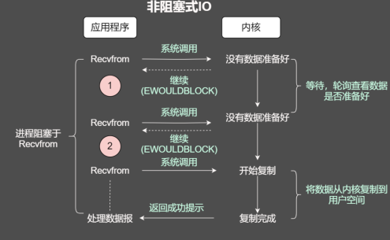

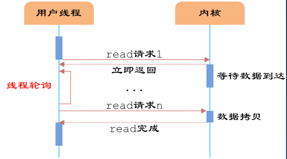

和阻塞 IO 类比，内核会立即返回，返回后获得足够的 CPU 时间继续做其它的事情。

用户进程第一个阶段不是阻塞的,需要不断的主动询问 kernel 数据好了没有；第二个阶段依然总是阻塞的。 


#### IO 模型-03 -IO 多路复用(IO multiplexing)（Reactor）（epoll）

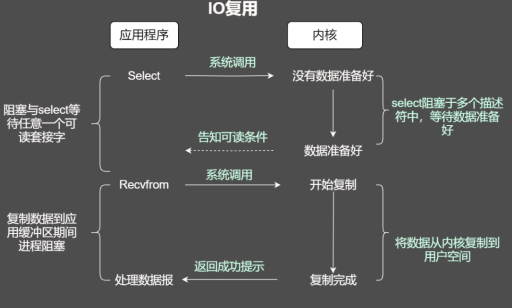

IO 多路复用(IO multiplexing)，也称事件驱动 IO(event-driven IO)，就是在单个线程里同时监控多个套接字，通过select 或 poll 轮询所负责的所有socket，当某个 socket 有数据到达了，就通知用户进程。

IO 复用同非阻塞 IO 本质一样，不过利用了新的 select 系统调用，由内核来负责本来是请求进程该做的轮询操作。看似比非阻塞 IO 还多了一个系统调用开销，不过因为可以支持多路 IO，才算提高了效率。

进程先是阻塞在 select/poll 上，再是阻塞在读操作的第二个阶段上。 

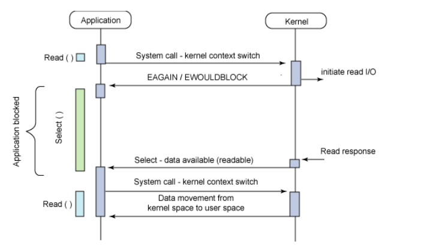

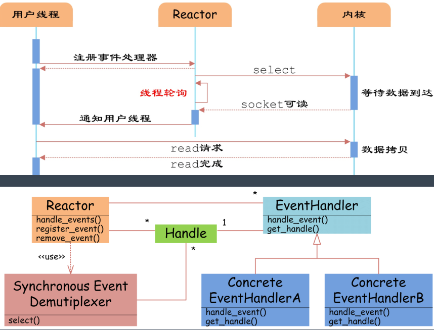

select/poll 的几大缺点：
（1）每次调用 select，都需要把 fd 集合从用户态拷贝到内核态，这个开销在 fd 很多时会很大
（2）同时每次调用 select 都需要在内核遍历传递进来的所有 fd，这个开销在 fd 很多时也很大
（3）select 支持的文件描述符数量太小了，默认是1024

epoll（Linux 2.5.44内核中引入,2.6内核正式引入,可被用于代替 POSIX select 和 poll 系统调用）：
（1）内核与用户空间共享一块内存
（2）通过回调解决遍历问题
（3）fd 没有限制，可以支撑10万连接 （C10k问题，从此之后 可以支持C100K问题）


#### IO 模型-04 -信号驱动 I/O

信号驱动 I/O

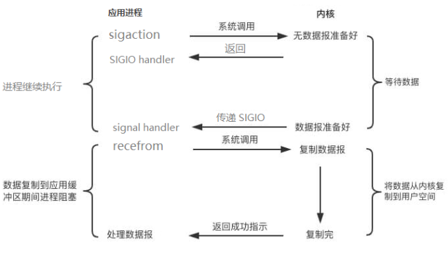

信号驱动 IO 与 BIO 和 NIO 最大的区别就在于，在 IO 执行的数据准备阶段，不会阻塞用户进程。

如图所示：当用户进程需要等待数据的时候，会向内核发送一个信号，告诉内核我要什么数据，然后用户进程就继续做别的事情去了，而当内核中的数据准备好之后，内核立马发给用户进程一个信号，说”数据准备好了，快来查收“，用户进程收到信号之后，立马调用 recvfrom，去查收数据。 


#### IO 模型-05 -异步式 IO（IOCP）（Proactor）

异步式 IO

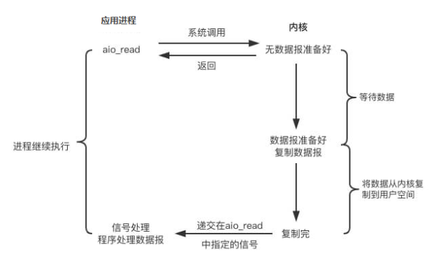

异步 IO 真正实现了 IO 全流程的非阻塞。

用户进程发出系统调用后立即返回，内核等待数据准备完成，然后将数据拷贝到用户进程缓冲区，然后发送信号告诉用户进程 IO 操作执行完毕（与 SIG IO 相比，一个是发送信号告诉用户进程数据准备完毕，一个是 IO执行完毕）。

windows 的 IOCP 模型 。

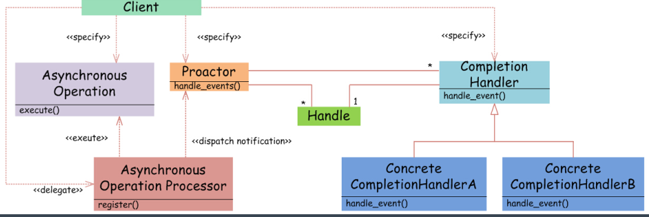

注意：这个模式，数据是内核复制到用户进程中的，只有复制好之后，才会通知数据，通知的是数据复制好了，而不是数据来了。此时，就可以直接读取了。


#### 总结

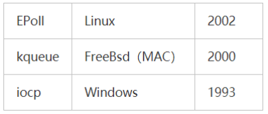

一个场景，去打印店打印文件。

同步阻塞
直接排队，别的啥也干不成，直到轮到你使用打印机了，自己打印文件

Reactor（epoll/多路复用I/O）
拿个号码，回去该干嘛干嘛，等轮到你使用打印机了，店主通知你来用打印机，打印文件

Proactor（异步I/O）
拿个号码，回去该干嘛干嘛，等轮到你使用打印机了，店主直接给你打印好文件，通知你来拿。 


### Netty 框架简介 

#### Netty 概览

官网：https://netty.io/

网络应用开发框架

1. 异步
2. 事件驱动
3. 基于 NIO

适用于:
• 服务端
• 客户端
• TCP/UDP （QQ使用最多，交易所的数据推，Zuul 2.0 网关底层）

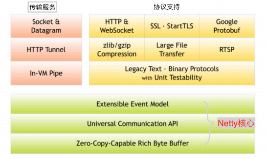


#### Netty 特性

高性能的协议服务器:
• 高吞吐
• 低延迟
• 低开销
• 零拷贝
• 可扩容

• 松耦合: 网络和业务逻辑分离
• 使用方便、可维护性好 


#### 兼容性

JDK 兼容性:
• Netty 3.x: JDK5
• Netty 4.x: JDK6
• Netty 5.x: 已废弃（思想超前，性能不足，抛弃了）

协议兼容性:
• 兼容大部分通用协议
• 支持自定义协议

嵌入式:
• HTTP Server
• HTTPS Server
• WebSocket Server
• TCP Server
• UDP Server
• In VM Pipe

Netty vs. Java EE? 


#### 基本概念

• Channel 
通道，Java NIO 中的基础概念,代表一个打开的连接,可执行读取/写入 IO 操作。Netty 对 Channel 的所有 IO 操作都是非阻塞的。

• ChannelFuture
Java 的 Future 接口，只能查询操作的完成情况, 或者阻塞当前线程等待操作完成。Netty 封装一个 ChannelFuture 接口。
我们可以将回调方法传给 ChannelFuture，在操作完成时自动执行。

• Event & Handler Netty 
基于事件驱动，事件和处理器可以关联到入站和出站数据流。

• Encoder &Decoder
处理网络 IO 时，需要进行序列化和反序列化, 转换 Java 对象与字节流。对入站数据进行解码, 基类是 ByteToMessageDecoder。
对出站数据进行编码, 基类是 MessageToByteEncoder。

• ChannelPipeline
 数据处理管道就是事件处理器链。 有顺序、同一 Channel 的出站处理器和入站处理器在同一个列表中。 


#### Event & Handler

入站事件：
• 通道激活和停用
• 读操作事件
• 异常事件
• 用户事件

出站事件：
• 打开连接
• 关闭连接
• 写入数据
• 刷新数据

事件处理程序接口:
• ChannelHandler
• ChannelOutboundHandler
• ChannelInboundHandler

适配器（空实现，需要继承使用）：
• ChannelInboundHandlerAdapter
• ChannelOutboundHandlerAdapter 

Netty 应用组成:
• 网络事件
• 应用程序逻辑事件
• 事件处理程序


### Netty 使用示例 

#### Demo

网址：https://github.com/kimmking/atlantis/tree/master/netty-server


#### Netty 简单例子

使用 Netty 改写，最开始的例子

然后，压测一下效果如何。 

```sh
C:\Users\rmliu>sb -u http://localhost:8088/test -c 40 -N 30
Starting at 2020/11/20 21:03:03
[Press C to stop the test]
68112   (RPS: 1980.9)
---------------Finished!----------------
Finished at 2020/11/20 21:03:38 (took 00:00:34.4626514)
Status 200:    68120

RPS: 2193 (requests/second)  # 提升更更明显
Max: 318ms
Min: 0ms
Avg: 0.9ms

  50%   below 0ms
  60%   below 0ms
  70%   below 0ms
  80%   below 0ms
  90%   below 0ms
  95%   below 1ms
  98%   below 11ms
  99%   below 22ms
99.9%   below 145ms
```


### 总结回顾与作业实践 

#### 总结回顾

Java Socket 编程

IO 处理过程分析

IO 模型与 NIO

Netty 介绍与示例 


#### 作业实践

1、（可选）运行课上的例子，以及 Netty 的例子，分析相关现象。

2、写一段代码，使用 HttpClient 或 OkHttp 访问 http://localhost:8801，代码提交到
Github。 


## Netty 原理与 API 网关 

### 再谈谈什么是高性能 

#### 什么是高性能？

大家思考一下，什么是高性能？

- 高并发用户（Concurrent Users）（QPS）(业务指标)
- 高吞吐量（Throughout）（TPS）（技术指标）
- 低延迟（Latency） （技术指标）

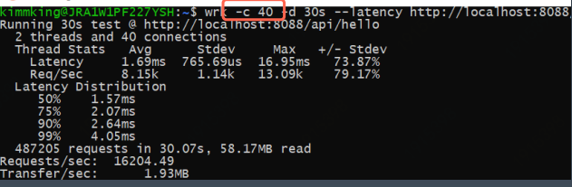

高并发用户（Concurrent Users） 

> 压测的时候，设置的  -c 参数，就是并发数

高吞吐量（Throughout） 

> 水库装水，容量大小

低延迟（Latency） 

> 延迟：是系统内部的，到达系统的时间 与 离开系统的时间 差。
>
> 响应时间：客户发送请求的时间 与 客户收到响应的时间 差。
>
> Latency Distribution：使用百分数衡量延迟，50% 在3ms 完成，P 50 = 3ms。
>
> 一般看系统的 P50 和 P99，保证请求的绝大多数都回去了。


#### 高性能的另一面

如果实现了高性能，有什么副作用呢？

系统复杂度 x10以上（淘宝，几千人，做了很多年，复杂）

建设与维护成本++++

故障或 BUG 导致的破坏性 x10以上 （坏了太难受，修复难）


#### 应对策略

稳定性建设（混沌工程）：

1、容量（量化下来，到底容量多少）
2、爆炸半径（微服务，降低半径，就一块的问题）
3、工程方面积累与改进 

> 一天 86400秒
>
> 系统，1000 TPS
>
> 则，一天总共 8600 万请求。
>
> 淘宝一天的请求量是 3000万左右，平均的 TPS 是 300 ~ 400.
>
> 美团等，二级梯度的 请求量是 1000~2000万左右
>
> 双十一活动，将所有的淘宝，天猫流量导入到 支付宝，做到了国内目前最大的并发，50万 TPS
>
> 前几年，12306 可能并发回达到 10 万 TPS

云厂商，亚马逊（AWS），微软（Awre），阿里（阿里云）；做活动的机器多，其他时间有剩余，需要多赚钱！


### Netty 如何实现高性能 

#### Netty 概览

网络应用开发框架

1. 异步
2. 事件驱动
3. 基于 NIO

适用于:
• 服务端
• 客户端
• TCP/UDP 

> Netty 对编程，实现了模型的统一，写什么代码都差不多


#### 从 Socket IO 到 NIO 

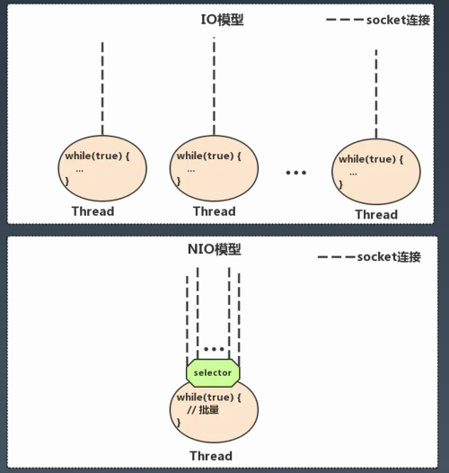


#### 从 Socket IO 到 NIO--BIO多线程模型 

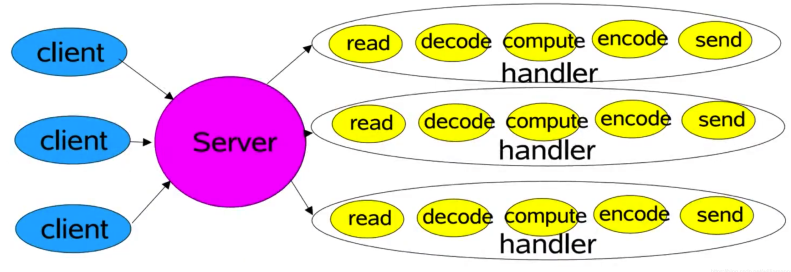


#### 回顾一下事件处理机制 

- 类比吃饭去饭馆，拿到号码，等待桌子用餐 

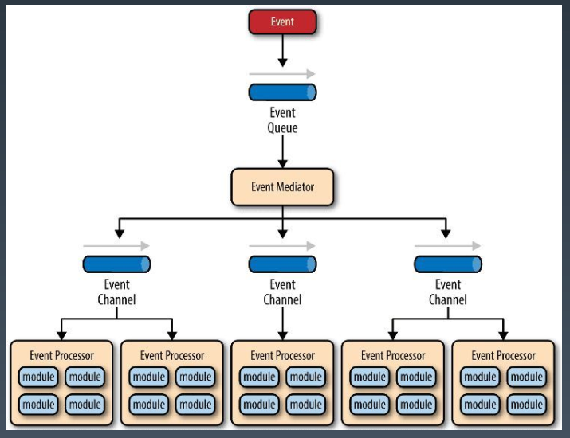


#### 从事件处理机制到 Reactor 模型 

Reactor 模式首先是事件驱动的，有一个或者多个并发输入源，有一个 Service Handler和多个EventHandlers。

这个 Service Handler 会同步的将输入的请求多路复用的分发给相应的 Event Handler。 

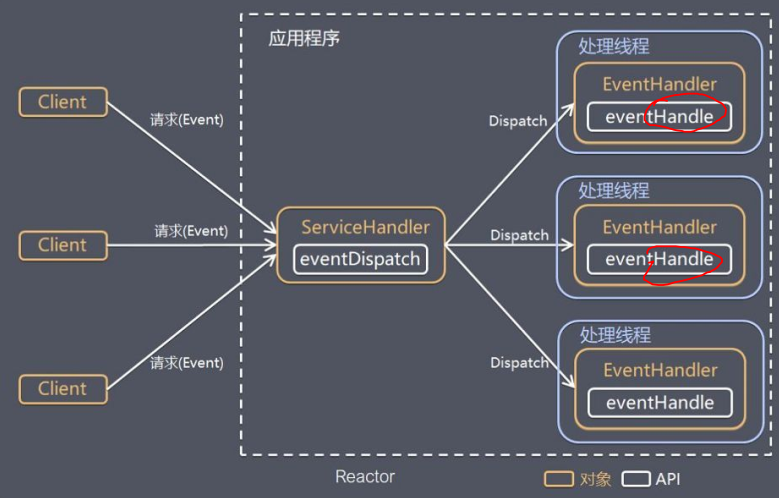


#### 从 Reactor 模型到 Netty NIO--01 

Reactor 单线程模型 

Doug lea 《Scalable IO in Java》 

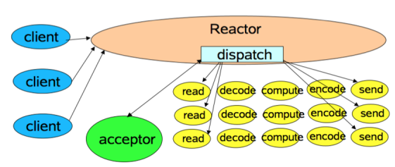

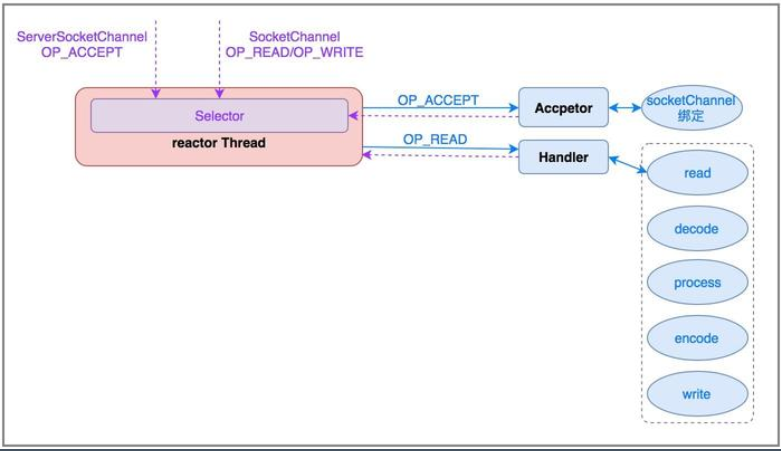


#### 从 Reactor 模型到 Netty NIO--02

Reactor 多线程模型 

默认线程数，是CPU核心的两倍。

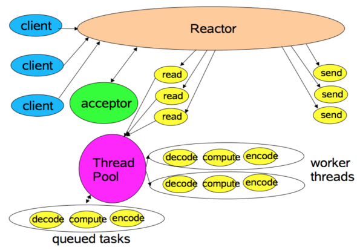

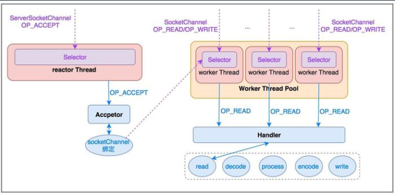


#### 从 Reactor 模型到 Netty NIO--03 

Reactor 主从模型 

> 下图画错了！

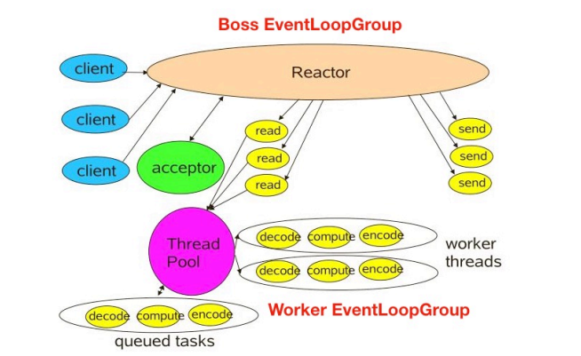

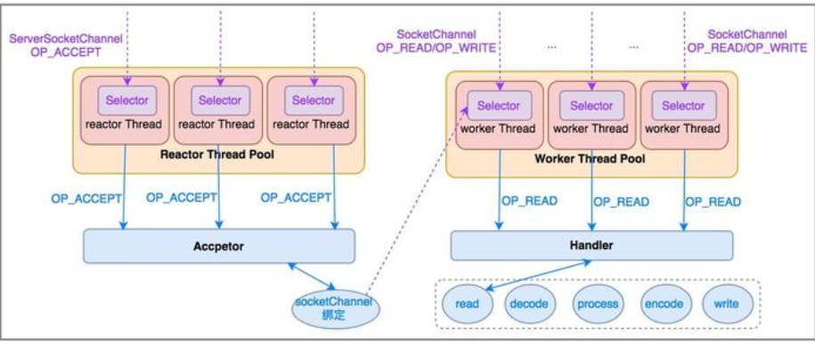


#### Netty 对三种模式的支持 

- Reactor 单线程模式
- 非主从 Reactor 多线程模式
- 主从 Reator 多线程模式

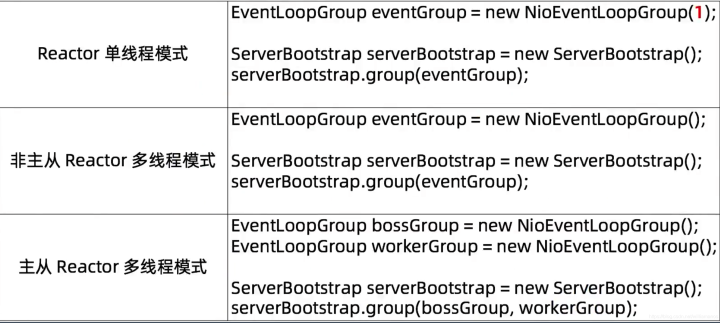


#### Netty 启动和处理流程 

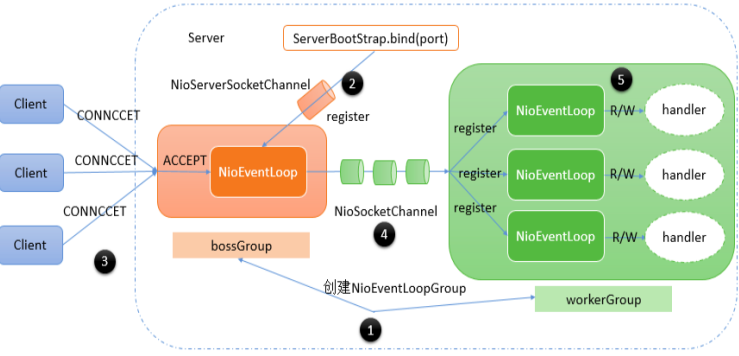


#### Netty 线程模式 

- 单线程不断地轮询，进行高效处理
- 注意：单线程模型，不能进行被堵住
- Redis 也是单线程，高效的处理（适合查询，不适合范围查询操作）

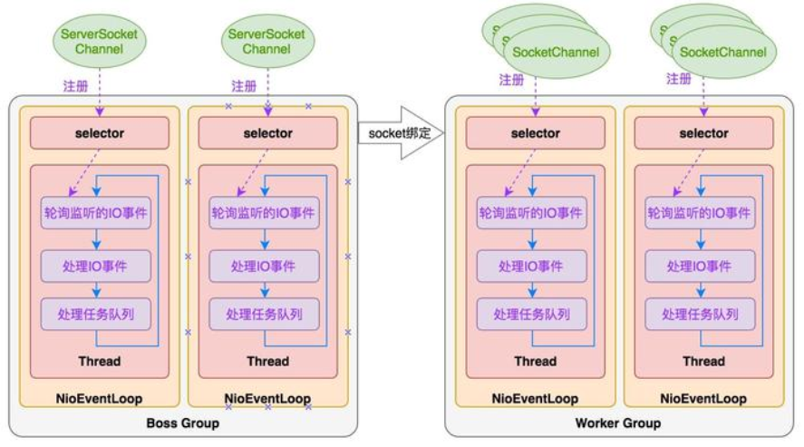


#### Netty 核心对象 

- 到底什么是 EventLoop 
- 一个 EventLoop 挂 多个 Channel
- Channel 负责 IO 事件的流通
- 核心对象：BECH（bootstrap, eventloop, chinnel, handler）

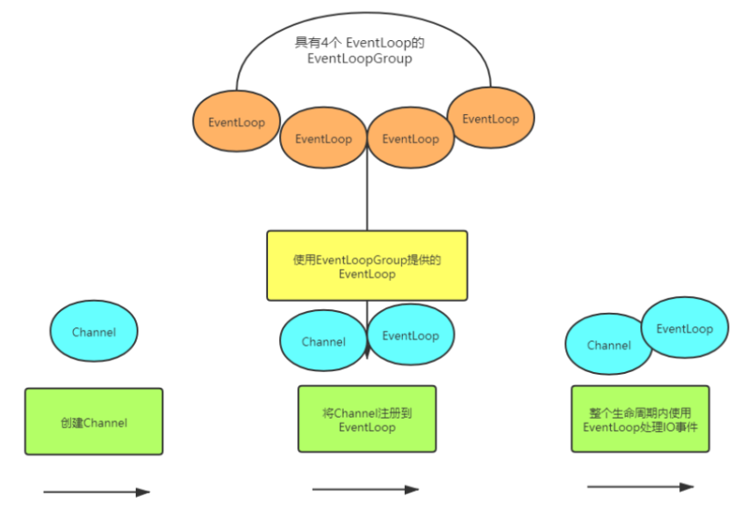


#### Netty 运行原理 

- Boss Group 配置 1个
- WorkGroup 配置 CPU核心的2倍

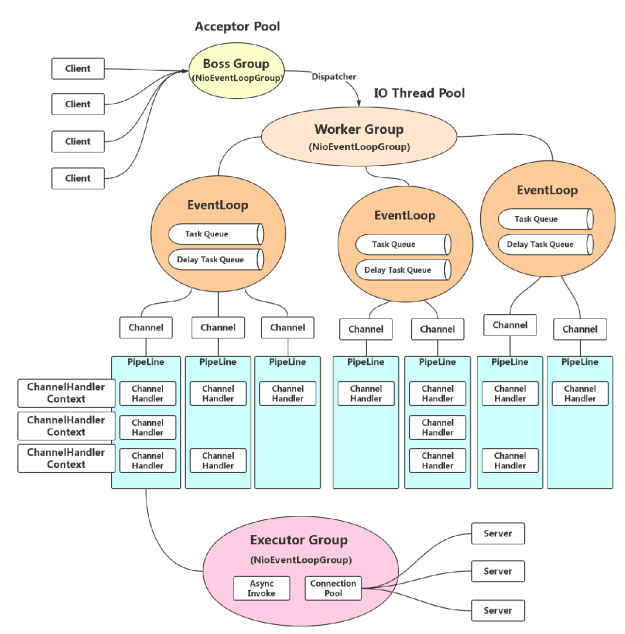


#### 关键对象 

- Bootstrap: 启动线程，开启 socket
- EventLoopGroup
- EventLoop
- SocketChannel: 连接
- ChannelInitializer: 初始化
- ChannelPipeline: 处理器链
- ChannelHandler: 处理器 

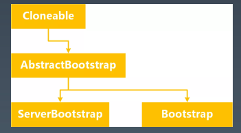

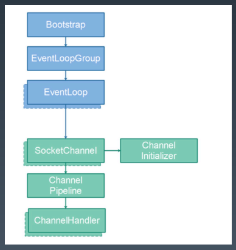


#### ChannelPipeline 

- ChannelIndoundHandler，类比 Request
- ChannelOutboundhandler，类似 Response

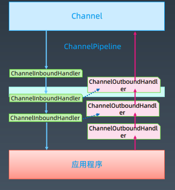


#### Event & Handler 

入站事件：
• 通道激活和停用
• 读操作事件
• 异常事件
• 用户事件

出站事件：
• 打开连接
• 关闭连接
• 写入数据
• 刷新数据

事件处理程序接口:
• ChannelHandler
• ChannelOutboundHandler
• ChannelInboundHandler

适配器（空实现，需要继承使用）：
• ChannelInboundHandlerAdapter
• ChannelOutboundHandlerAdapter 

Netty 应用组成:
• 网络事件
• 应用程序逻辑事件
• 事件处理程序


### Netty 网络程序优化 

#### 粘包与拆包

> 操作系统有个缓冲区，没有指定长度读取数据。
>
> 需要提前定义接受方式的规则，与TCP没有关系。需要保证数字一直与个数完整。
>
> HTTP 发送大文件的时候，使用 chunk机制，进行 大小指定与数据发送 形式。
>
> HTTP 断点续传机制，并发下载的时候，第一个线程取数据的第一段，第二个线程取第二段，最后拼接，完成并发任务。使用 HTTP 的 Range 命令。（FTP也存在Range命令）
>
> 粘包，只有TCP有，是全双工的，互相发消息没有影响，UDP是一片一片的，单向的，不存在粘包。
>
> QQ是 UDP，在UDP的基础上封装一层，保证数据的顺序与总个数，确保数据丢失可以确定是哪一个，重新发。

都是人为问题

ByteToMessageDecoder 提供的一些常见的实现类：

1.FixedLengthFrameDecoder：定长协议解码器，我们可以指定固定的字节数算一个完整的报文

2.LineBasedFrameDecoder：行分隔符解码器，遇到\n 或者\r\n，则认为是一个完整的报文

3.DelimiterBasedFrameDecoder：分隔符解码器，分隔符可以自己指定（@!__!@）

4.LengthFieldBasedFrameDecoder：长度编码解码器，将报文划分为报文头/报文体

5.JsonObjectDecoder：json 格式解码器，当检测到匹配数量的“{” 、”}”或”[””]”时，则认为是一个完整的 json 对象或者 json 数组 

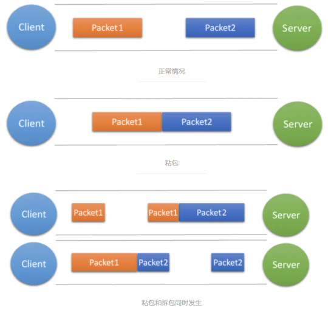


#### Nagle 与 TCP_NODELAY 

> 写soket 的程序中，使用的 send，只是将数据从用户发送给操作系统内核，并没有直接发送到网络上。
>
> 至于什么时候发送到网络上，是由操作系统完成的，取决于是否缓存区满了，是否大道理超时时间。

网络上的数据包：
MTU: Maxitum Transmission Unit最大传输单元（1500 Byte）
MSS: Maxitum Segment Size 最大分段大小（1460 Byte ）（大于这个数据，需要分包发送，在这个上下的数据，测试会有很大的差距）

网络拥堵与 Nagle 算法优化：TCP_NODELAY

优化条件：

- 缓冲区满
- 达到超时 （200ms）


#### 连接优化 

- 注意 TCP 与 UDP 区别 
- 用三次握手建立 TCP 连接 的各状态
  - 如果客户端给服务器发送 ACK的时候，服务器没收到，然后怎么办？然后客户端的发送请求就会连接超时，报错喽！类似于服务器宕机了。
- TCP连接必须经过时间 2 MSL 后才真正释放掉。
  - MSL 是周期，windows 默认1分钟，linux默认两分钟。
  - 查看本机的TCP连接状态：netstat -anot

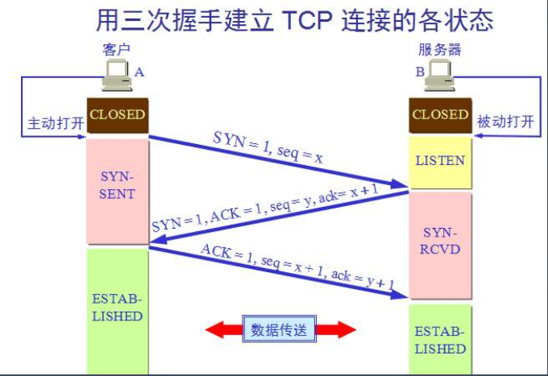

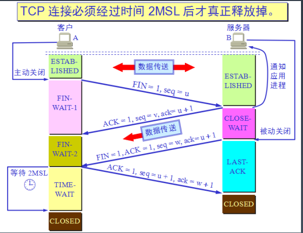


#### Netty 优化 

1、不要阻塞 EventLoop

2、系统参数优化(让系统的Tcp回收时间更快)
ulimit -a /proc/sys/net/ipv4/tcp_fin_timeout (linux), TcpTimedWaitDelay(Windows)

3、缓冲区优化
SO_RCVBUF/SO_SNDBUF/SO_BACKLOG/ REUSEXXX（重用端口和连接）

4、心跳周期优化
心跳机制（发送空的数据包，数据库中使用定时给数据库发送一个语句SELECT 1;jdbc4之后，使用isvoid直接进行检测）与断线重连

5、内存与 ByteBuffer 优化（零拷贝技术）
DirectBuffer（堆外内存，直接共享，都可以操作）与HeapBuffer（堆内存共享）

6、其他优化

- ioRatio（io比例，50：50）
- Watermark（缓冲区写满，水位，低水位，高水位）
- TrafficShaping （流控机制，削峰填谷）


### 典型应用：API 网关

#### 网关的结构和功能

- 类似于政府大院，门卫登记，鉴权，认证
- 请求接入
- 业务聚合
- 中介策略
- 统一管理

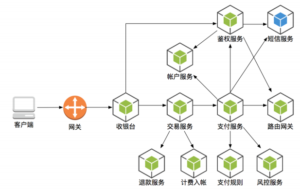


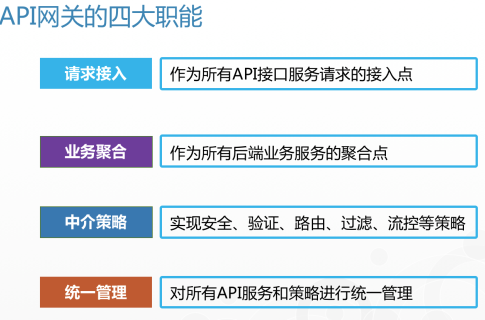


#### 网关的分类

- 流量网关
  - Nginx，俄罗斯人写的，难懂，****的指针。
- 业务网关
  - Zuul，Zuul 2.0，Spring Cloud

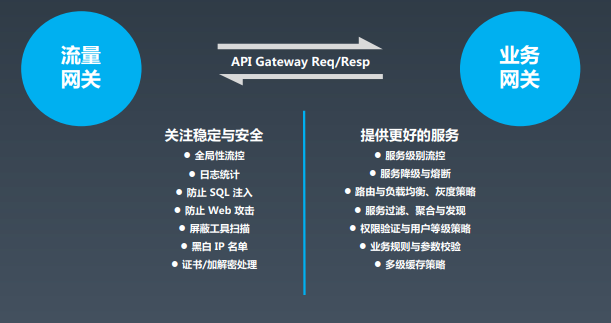


#### Zuul(BIO)

Zuul 是 Netflix 开源的 API 网关系统，它的主要设计目标是动态路由、监控、弹性和安全。

Zuul 的内部原理可以简单看做是很多不同功能 filter 的集合，最主要的就是 pre、routing、post 这三种过滤器，分别作用于调用业务服务 API 之前的请求处理、直接响应、调用业务服务 API 之后的响应处理。

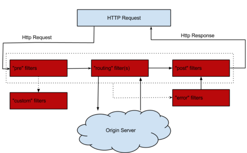


#### Zuul 2.0(NIO)

Zuul 2.x 是基于 Netty 内核重构的版本。几万行代码中，大部分都是在封装 Netty，提供 Service。

核心功能：
1.Service Discovery
2.Load Balancing
3.Connection Pooling
4.Status Categories
5.Retries
6.Request Passport
7.Request Attempts
8.Origin Concurrency Protection
9.HTTP/2
10.Mutual TLS
11.Proxy Protocol
12.GZip
13.WebSockets

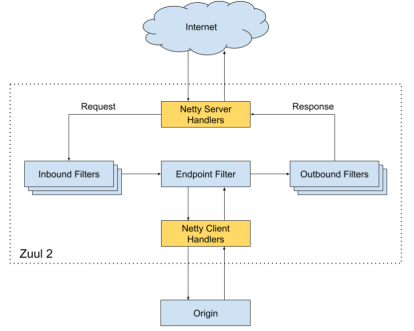


#### Spring Cloud Gateway

- 基于 Webflex 底层实现
- 早于 Zuul 2.0，所以实现上借鉴了 Zuul 1.0，详细参看微服务中：Zuul 和 微服务网关架构。

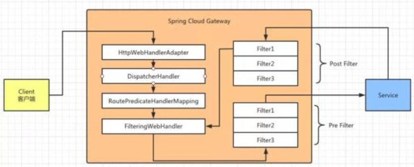


#### 网关对比

- Nginx, OpenResty, Kong
- Spring Cloud Gateway, Zuul 2.0
- 现在的网关都是不带控制台的，需求：带控制台的网关

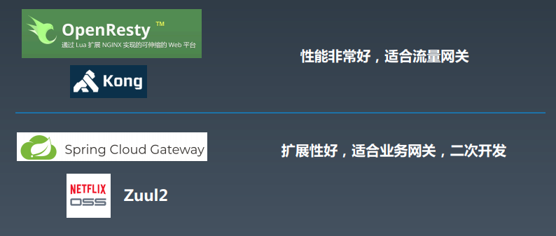


### 自己动手实现 API 网关

#### 最简单的网关--gateway 1.0

- 网关类似于代理，Proxy
- HttpServer + 可以请求数据的程序 + 后端业务程序

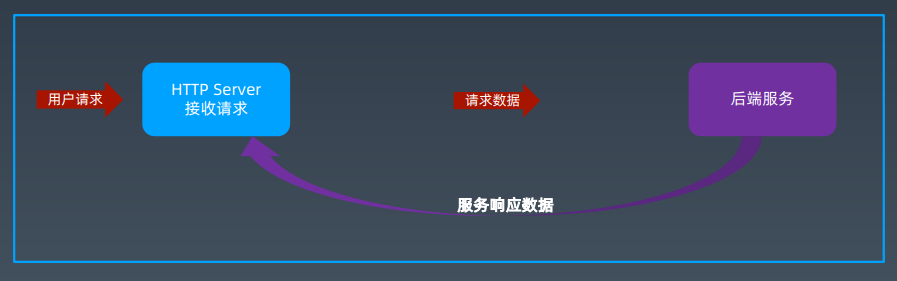

#### 最简单的网关--gateway 2.0

- 添加过滤器，网关中最重要的是过滤器
- Netty 中的 Handler，InBound,OutBound

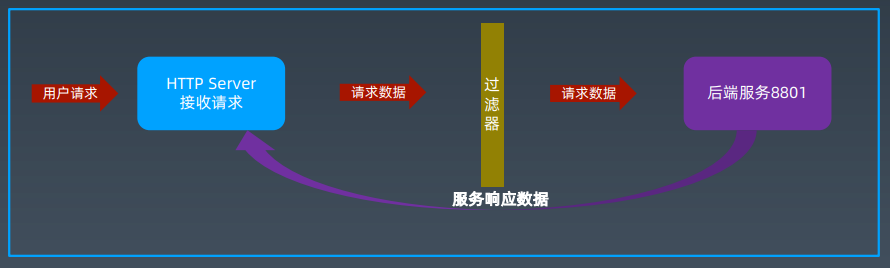


#### 最简单的网关--gateway 3.0

- 添加 Router，满足微服务的服务分发。

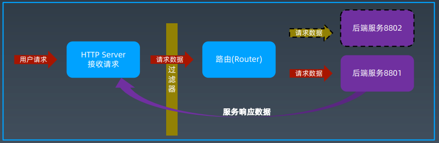


#### 架构设计

设计：技术复杂度与业务复杂度
抽象：概念理清、正确命名
组合：组件之间的相互关系

> DSL，领域特定语言
>
> 广义：你懂我的黑话。（自己的语言）


### 总结回顾与作业实践 

#### 总结回顾

再谈谈什么是高性能
Netty 如何实现高性能
Netty 网络程序优化
典型应用：API 网关
自己动手实现 API 网关


#### 作业实践

1、按今天的课程要求，实现一个网关，基础代码可以 fork：https://github.com/kimmking/JavaCourseCodes    02nio/nio02 文件夹下实现以后，代码提交到 Github。
1）周四作业：整合你上次作业的httpclient/okhttp；
2）周四作业（可选）:使用 netty 实现后端 http 访问（代替上一步骤）；
3）周六作业：实现过滤器
4）周六作业（可选）：实现路由


## Java 并发编程 --线程

### 多线程基础 

#### 为什么会有多线程 

本质原因是摩尔定律失效 -> 多核+分布式时代的来临。(仙童公司，Intel，时间与空间的局限性)

JVM、NIO 是不是都因为这个问题变复杂？

后面讲的分布式系统，也是这个原因。 


> SMP（对称多处理） VS NUMA（非均匀存储访问模式）
>
> M是对称一致内存

多 CPU 核心意味着同时操作系统有更多的并行计算资源可以使用。
操作系统以线程作为基本的调度单元。

单线程是最好处理不过的。
线程越多，管理复杂度越高。

跟我们程序员都喜欢自己单干一样。
《人月神话》里说加人可能干得更慢。

可见多核时代的编程更有挑战。 

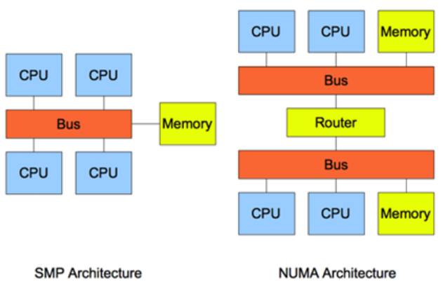


#### Java 线程的创建过程 

线程与进程的区别是什么？ 

> 在linux中，Nginx 启动5个进程，内部使用5个线程，单线程操作，每一个进程之间具有父子进程关系。可以保证，5个进程，同时监听80一个端口。

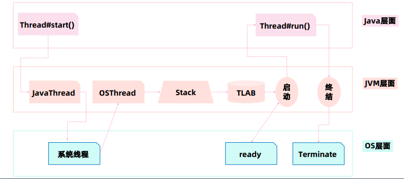


### Java 多线程

#### Thread 使用示例 

• 守护线程
• 启动方式

思考:

1. 输出结果是什么?
2. 为什么?
3. 有哪些方式可以修改? 

```java
public static void main(String[] args) {
    Runnable task = new Runnable() {
        @Override
        public void run() {
            try {
                Thread.sleep(5000);
            } catch (InterruptedException e) {
                e.printStackTrace();
            }
            Thread t = Thread.currentThread();
            System.out.println("当前线程:" + t.getName());
    	}
	};
    Thread thread = new Thread(task);
    thread.setName("test-thread-1");
    thread.setDaemon(true);
    thread.start();
}
```


#### 基础接口 - Runnable 

辨析:
Thread#start():创建新线程
Thread#run() : 本线程调用 

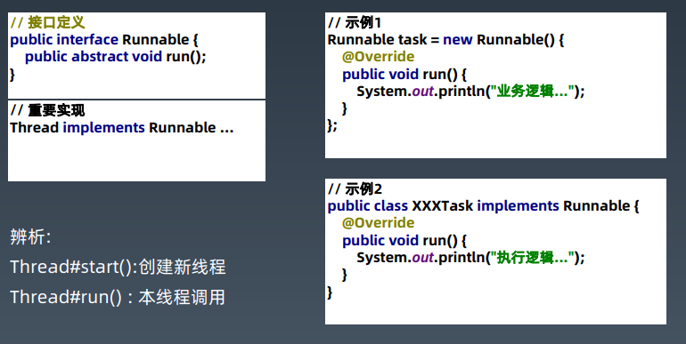


#### 线程状态 

- 线程 start() 之后，会变成 Runable状态，至于什么时候 Running ，不知道，需要看 CPU什么时候调用
- 类似于 NIO 中，send 消息，是到操作系统的缓存区中，至于什么时候发送，不知道
- sleep() 函数，没法精确的控制时间，有太多因素影响，绝对时间都是有误差的
- Windows 中，创建文件的时间，精确值到分钟，有太多误差，会导致时间不一致

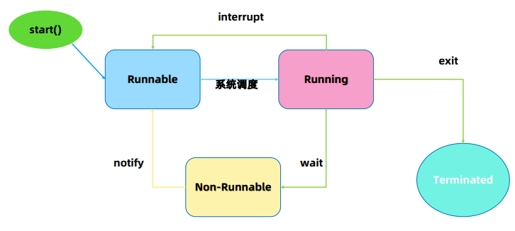


#### Thread 类 

java.lang.Thread

| 重要属性/方法                          | 说明                                   |
| -------------------------------------- | -------------------------------------- |
| volatile String name;                  | 线程名称 – 诊断分析使用                |
| boolean daemon = false;                | 后台守护线程标志 – 决定JVM优雅关闭     |
| Runnable target;                       | 任务(只能通过构造函数传入)             |
| synchronized void start()              | 【协作】启动新线程并自动执行           |
| void join()                            | 【协作】等待某个线程执行完毕（来汇合） |
| static native Thread currentThread();  | 静态方法: 获取当前线程信息             |
| static native void sleep(long millis); | 静态方法: 线程睡眠并让出CPU时间片      |


#### wait & notify 

| Object# 方法                       | 说明                                                         |
| ---------------------------------- | ------------------------------------------------------------ |
| void wait()                        | 放弃锁+等待0ms+尝试获取锁;                                   |
| void wait(long timeout, int nanos) | 放弃锁 + wait + 到时间自动唤醒/中途唤醒 (精度: nanos>0则 timeout++) |
| native void wait(long timeout);    | 放弃锁+ wait + 到时间自动唤醒/中途被唤醒 (唤醒之后需要自动获取锁) |
| native void notify();              | 发送信号通知1个等待线程                                      |
| native void notifyAll();           | 发送信号通知所有等待线程                                     |

辨析:
• Thread.sleep: 释放 CPU，睡眠，不释放锁
• Object#wait : 释放锁 ，等待


#### Thread 的状态改变操作 

1. Thread.sleep(long millis)，一定是当前线程调用此方法，当前线程进入 TIMED_WAITING 状态，但不释放对象锁，millis 后线程自动苏醒进入就绪状态。作用：给其它线程执行机会的最佳方式。
2. Thread.yield()，一定是当前线程调用此方法，当前线程放弃获取的 CPU 时间片，但不释放锁资源，由运行状态变为就绪状态，让 OS 再次选择线程。作用：让相同优先级的线程轮流执行，但并不保证一定会轮流执行。实际中无法保证yield() 达到让步目的，因为让步的线程还有可能被线程调度程序再次选中。Thread.yield() 不会导致阻塞。该方法与sleep() 类似，只是不能由用户指定暂停多长时间。（类似于死循环）
3. t.join()/t.join(long millis)，当前线程里调用其它线程 t 的 join 方法，当前线程进入WAITING/TIMED_WAITING 状态，当前线程不会释放已经持有的对象锁。线程t执行完毕或者 millis 时间到，当前线程进入就绪状态。
4. obj.wait()，当前线程调用对象的 wait() 方法，当前线程释放对象锁，进入等待队列。依靠 notify()/notifyAll() 唤醒或者 wait(long timeout) timeout 时间到自动唤醒。
5. obj.notify() 唤醒在此对象监视器上等待的单个线程，选择是任意性的。notifyAll() 唤醒在此对象监视器上等待的所有线程。 


#### Thread 的中断与异常处理

1. 线程内部自己处理异常，不溢出到外层。
2. 如果线程被 Object.wait, Thread.join 和 Thread.sleep 三种方法之一阻塞，此时调用该线程的interrupt() 方法，那么该线程将抛出一个 InterruptedException 中断异常（该线程必须事先预备好处理此异常），从而提早地终结被阻塞状态。如果线程没有被阻塞，这时调用interrupt() 将不起作用，直到执行到 wait(),sleep(),join() 时,才马上会抛出InterruptedException。
3. 如果是计算密集型的操作怎么办？
分段处理，每个片段检查一下状态，是不是要终止。 


#### Thread 状态

1、本线程主动操作
2、被动：

- 遇到锁
- 被通知

线程分三类：

- 运行和就绪 RR
- 等待和超时等待 WW
- 阻塞 B
- RWB

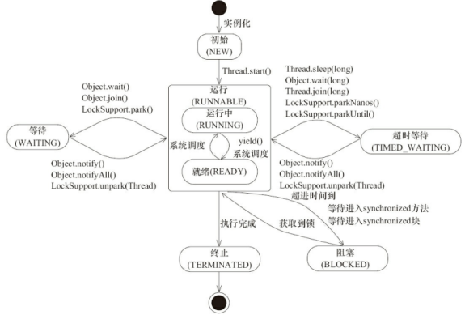


### 线程安全

#### 多线程执行会遇到什么问题?


竞态条件 临界区 共享与同步(线程间通信) 多线程

多个线程竞争同一资源时，如果对资源的访问顺序敏感，就称存在竞态条件。

导致竞态条件发生的代码区称作临界区。

不进行恰当的控制，会导致线程安全问题


#### 并发相关的性质-原子性

原子性：原子操作，注意跟事务 ACID 里原子性的区别与联系

对基本数据类型的变量的读取和赋值操作是原子性操作，即这些操作是不可被中断的，
要么执行，要么不执行。

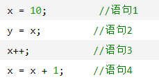

只有语句1是原子操作，如果变量定义为方法的局部变量，就不会有并发问题，其他线程看不到变量。

多个线程并发问题 类似于多个事务的并发问题


#### 并发相关的性质-可见性

可见性：对于可见性，Java 提供了 volatile 关键字来保证可见性。

当一个共享变量被 volatile 修饰时，它会保证修改的值会立即被更新到主存，当有其他线程需要读取时，它会去内存中读取新值。

另外，通过 synchronized 和 Lock 也能够保证可见性，synchronized 和 Lock 能保证同一时刻只有一个线程获取锁然后执行同步代码，并且在释放锁之前会将对变量的修改刷新到主存当中。

volatile 并不能保证原子性。


#### 并发相关的性质-有序性

有序性：Java 允许编译器和处理器**对指令进行重排序**，但是重排序过程不会影响到单线程程序的执行，却会影响到多线程并发执行的正确性。可以通过 volatile 关键字来保证一定的“有序性”（synchronized 和 Lock也可以）。

**happens-before 原则**（先行发生原则）：

1. 程序次序规则：一个线程内，按照代码先后顺序执行
2. 锁定规则：一个 unLock 操作先行发生于后面对同一个锁的 lock 操作
3. Volatile 变量规则：对一个变量的写操作先行发生于后面对这个变量的读操作
4. 传递规则：如果操作 A 先行发生于操作 B，而操作 B 又先行发生于操作 C，则可以得出 A 先于 C
5. 线程启动规则：Thread 对象的 start() 方法先行发生于此线程的每个一个动作
6. 线程中断规则：对线程 interrupt() 方法的调用先行发生于被中断线程的代码检测到中断事件的发生
7. 线程终结规则：线程中所有的操作都先行发生于线程的终止检测，我们可以通过 Thread.join() 方法结束、Thread.isAlive() 的返回值手段检测到线程已经终止执行
8. 对象终结规则：一个对象的初始化完成先行发生于他的 finalize() 方法的开始


#### 一个简单的实际例子

最简单的例子
多线程计数
如何解决？ 


#### synchronized 的实现

1. 使用对象头标记字(Object monitor)（使用锁标志位，实现加解锁）
2. Synchronized 方法优化
3. 偏向锁: BiaseLock

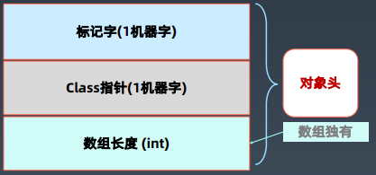

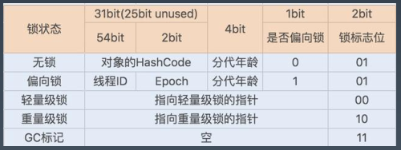


####  synchronized 使用示例

思考: 哪种方式性能更高？
• 同步块 : 粒度小
• 同步方法: 专有指令

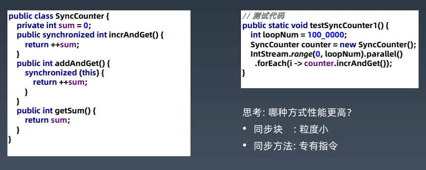


#### volatile

1. 每次读取都强制从主内存刷数据
2. 适用场景： 单个线程写；多个线程读
3. 原则： 能不用就不用，不确定的时候也不用
4. 替代方案： Atomic 原子操作类

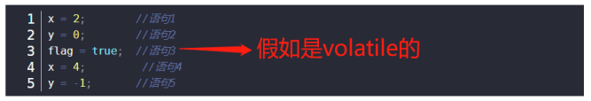

那么，语句1和2，不会被重排到3的后面，4和5也不会到前面。
同时可以保证1和2的结果是对3、4、5可见。


#### final

思考: final 声明的引用类型与原生类型在处理时有什么区别?

Java 里的常量替换。写代码最大化用 final 是个好习惯。

- Java 中使用 final 之后，就会写出静态常量。 

| final 定义类型    | 说明                                                         |
| ----------------- | ------------------------------------------------------------ |
| final class XXX   | 不允许继承                                                   |
| final 方法        | 不允许 Override                                              |
| final 局部变量    | 不允许修改                                                   |
| final 实例属性    | • 构造函数/初始化块/<init>之后不允许变更； <br />• 只能赋值一次 <br />• 安全发布: 构造函数结束返回时，final 域最 新的值被保证对其他线程可见 |
| final static 属性 | <clinit>静态块执行后不允许变更； 只能赋值一次                |


### 线程池原理与应用

#### 线程池

1. Excutor: 执行者 – 顶层接口
2. ExcutorService: 接口 API
3. ThreadFactory: 线程工厂
4. Excutors: 工具类 （线程池工厂）


####  Executor – 执行者 

| 重要方法                        | 说明             |
| ------------------------------- | ---------------- |
| void execute(Runnable command); | 执行可运行的任务 |

线程池从功能上看，就是一个**任务执行器**

submit 方法 -> 有返回值，用 Future 封装
execute 方法 -> 无返回值

submit 方法的异常可以在主线程中 catch 到。
execute 方法执行任务是捕捉不到异常的。 

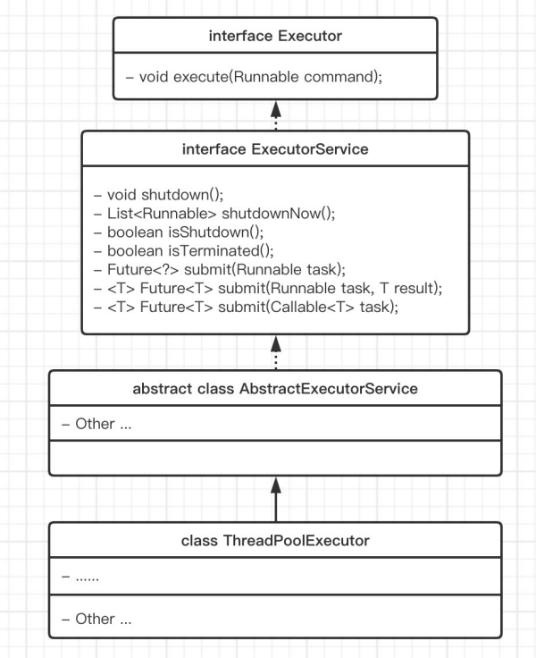


#### ExecutorService 

| 重要方法                                       | 说明                                     |
| ---------------------------------------------- | ---------------------------------------- |
| void execute(Runnable command);                | 执行可运行的任务                         |
| void shutdown();                               | 关闭线程池                               |
| List<Runnable> shutdownNow();                  | 立即关闭                                 |
| Future<?> submit(Runnable task);               | 提交任务; 允许获取执行结果               |
| <T> Future<T> submit(Runnable task, T result); | 提交任务（指定结果）; 控制\|获取执行结果 |
| <T> Future<T> submit(Callable<T> task);        | 提交任务; 允许控制任务和获取执行结果     |

shutdown()：停止接收新任务，原来的任务**继续**执行
shutdownNow()：停止接收新任务，原来的任务**停止**执行
awaitTermination(long timeOut, TimeUnit unit)：当前线程阻塞 


####  ThreadFactory

| 重要方法                      | 说明       |
| ----------------------------- | ---------- |
| Thread newThread(Runnable r); | 创建新线程 |

ThreadPoolExecutor 提交任务逻辑:

1. 判断 corePoolSize 【创建】
2. 加入 workQueue
3. 判断 maximumPoolSize 【创建】
4. 执行拒绝策略处理器 

注意：一开始没有线程，来任务创建核心线程；然后将任务加到队列中缓一缓，再接着创建非核心线程，最后执行拒绝策略。

```sh
/*
* Proceed in 3 steps:
*
* 1. If fewer than corePoolSize threads are running, try to
* start a new thread with the given command as its first
* task.  The call to addWorker atomically checks runState and
* workerCount, and so prevents false alarms that would add
* threads when it shouldn't, by returning false.
*
* 2. If a task can be successfully queued, then we still need
* to double-check whether we should have added a thread
* (because existing ones died since last checking) or that
* the pool shut down since entry into this method. So we
* recheck state and if necessary roll back the enqueuing if
* stopped, or start a new thread if there are none.
*
* 3. If we cannot queue task, then we try to add a new
* thread.  If it fails, we know we are shut down or saturated
* and so reject the task.
*/
```

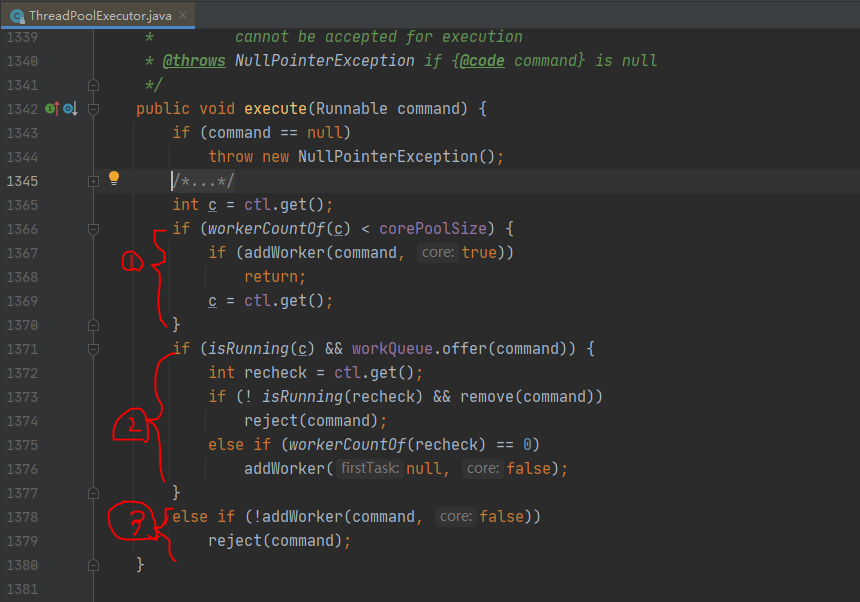


#### 线程池参数-缓冲队列

**BlockingQueue** 是双缓冲队列。BlockingQueue 内部使用两条队列，允许两个线程同
时向队列一个存储，一个取出操作。在保证并发安全的同时，提高了队列的存取效率。

1. ArrayBlockingQueue:规定大小的 BlockingQueue，其构造必须指定大小。其所含的对象是 FIFO 顺序排序的。
2. LinkedBlockingQueue:大小不固定的 BlockingQueue，若其构造时指定大小，生成的 BlockingQueue 有大小限制，不指定大小，其大小有 Integer.MAX_VALUE 来决定。其所含的对象是 FIFO 顺序排序的。
3. PriorityBlockingQueue:类似于 LinkedBlockingQueue，但是其所含对象的排序不是 FIFO，而是依据对象的自然顺序或者构造函数的 Comparator 决定。
4. SynchronizedQueue:特殊的 BlockingQueue，对其的操作必须是放和取交替完成。 

 

#### 线程池参数-拒绝策略

1. ThreadPoolExecutor.AbortPolicy:丢弃任务并抛出 RejectedExecutionException异常。（默认策略，很常见）
2. ThreadPoolExecutor.DiscardPolicy：丢弃任务，但是不抛出异常。（没有异常，不好，没法做补偿措施）
3. ThreadPoolExecutor.DiscardOldestPolicy：丢弃队列最前面的任务，然后重新提交被拒绝的任务
4. ThreadPoolExecutor.CallerRunsPolicy：由调用线程（提交任务的线程）处理该任务 （很常见，让提交任务的线程来直接执行任务，此时就不会再丢任务了）


#### ThreadFactory 示例 

 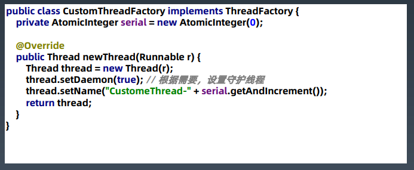


#### ThreadPoolExecutor 

| 重要属性/方法                      | 说明           |
| ---------------------------------- | -------------- |
| int corePoolSize;                  | 核心线程数     |
| int maximumPoolSize;               | 最大线程数     |
| ThreadFactory threadFactory;       | 线程创建工厂   |
| BlockingQueue<Runnable> workQueue; | 工作队列       |
| RejectedExecutionHandler handler;  | 拒绝策略处理器 |
| void execute(Runnable command)     | 执行           |
| Future<?> submit(Runnable task)    | 提交任务       |
| submit(Runnable task, T result)    | 提交任务       |
| submit(Callable<T> task)           | 提交任务       |

execute 与 submit 的区别，一个是有返回值，一个是没有返回值。（对应于java 语言设计的时候，需要针对这两种情况，分开设计不同的抽象）


#### ThreadPoolExecutor 示例 

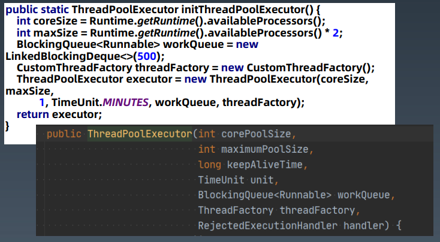


####  创建线程池方法

1. newSingleThreadExecutor（串行GC，一个线程跑）
创建一个单线程的线程池。这个线程池只有一个线程在工作，也就是相当于单线程串行执行所有任务。如果这个唯一的线程因为异常结束，那么会有一个新的线程来替代它。此线程池保证所有任务的执行顺序按照任务的提交顺序执行。

2. newFixedThreadPool（HTTP程序3中的固定大小线程池）
    创建固定大小的线程池。每次提交一个任务就创建一个线程，直到线程达到线程池的最大大小。线程池的大小一旦达到最大值就会保持不变，如果某个线程因为执行异常而结束，那么线程池会补充
    一个新线程。

  坑：默认 LinkedQueue，没有固定大小

3. newCachedThreadPool（HTTP程序2中每一个请求new一个新的线程）
    创建一个可缓存的线程池。如果线程池的大小超过了处理任务所需要的线程，那么就会回收部分空闲（60秒不执行任务）的线程，当任务数增加时，此线程池又可以智能的添加新线程来处理任务。此线程池不会对线程池大小做限制，线程池大小完全依赖于操作系统（或者说JVM）能够创建的最大线程大小。

  坑：线程数默认无穷大，太多了，CPU切换成本高

4. newScheduledThreadPool
    创建一个大小无限的线程池。此线程池支持定时以及周期性执行任务的需求。 


#### 创建固定线程池经验

不是越大越好，太小肯定也不好：
假设核心数为 N，

1、如果是CPU密集型应用，则线程池大小设置为N或者 N+1

2、如果是IO密集型应用，则线程池大小设置为2N或2N+2


#### Callable – 基础接口

| 重要方法                   | 说明     |
| -------------------------- | -------- |
| V call() throws Exception; | 调用执行 |

对比:
• Runnable#run()没有返回值
• Callable#call()方法有返回值 

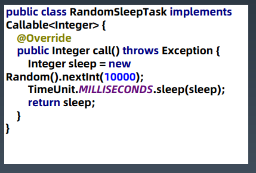


#### Future – 基础接口 

| 重要方法                                                     | 说明                        |
| ------------------------------------------------------------ | --------------------------- |
| boolean cancel(boolean mayInterruptIfRunning);               | 取消任务 （执行时是否打断） |
| boolean isCancelled();                                       | 是否被取消                  |
| boolean isDone();                                            | 是否执行完毕                |
| V get() throws InterruptedException, ExecutionException;     | 获取执行结果                |
| V get(long timeout, TimeUnit unit) throws InterruptedException, ExecutionException, TimeoutException; | 限时获取执行结果            |

注意：等待执行结果的时候，使用 Future 实现，最后使用 get 方法获得结果，设置一个超时时间，防止干等待，被阻塞。

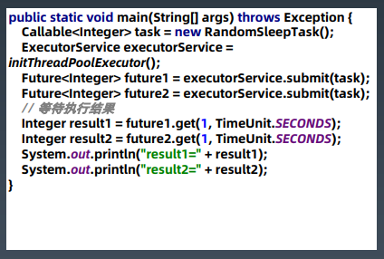


### 总结回顾与作业实践 

#### 总结回顾

1.多线程基础
2.Java 多线程*
3.线程安全*
4.线程池原理与应用* 

 

#### 作业实践 

1、（可选）跑一跑课上的各个例子，加深对多线程的理解
2、（可选）完善网关的例子，试着调整其中的线程池参数 


 

## Java 并发编程 --并发

### Java 并发包 

#### JDK 核心库的包 

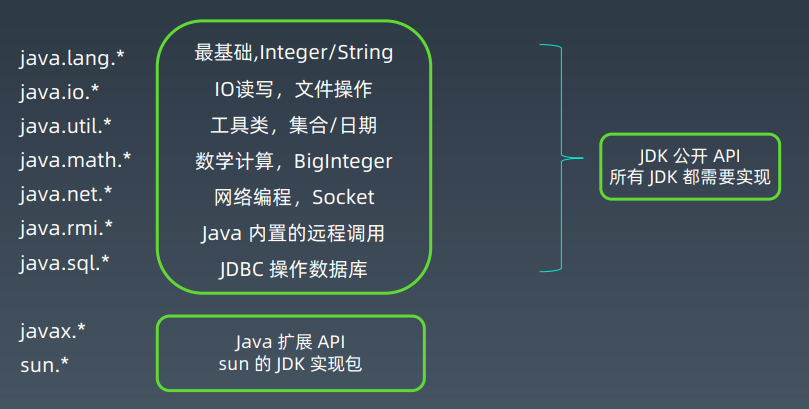


#### Java.util.concurrency 

 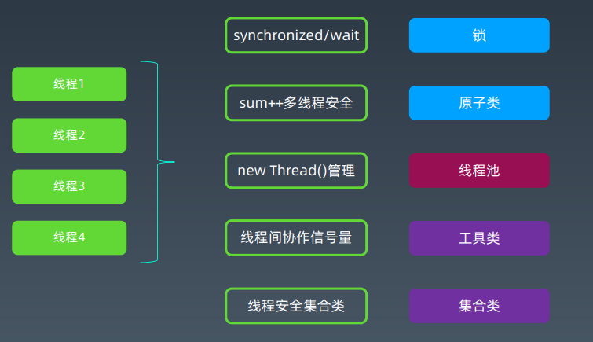

锁机制类 Locks : Lock, Condition, ReadWriteLock
原子操作类 Atomic : AtomicInteger
线程池相关类 Executer : Future, Callable, Executor
信号量三组工具类 Tools : CountDownLatch, CyclicBarrier, Semaphore
并发集合类 Collections : CopyOnWriteArrayList, ConcurrentMap 

 

### 到底什么是锁 

#### 为什么需要显式的 Lock

回忆一下，上节课讲过的，synchronized 可以加锁，wait/notify 可以看做加锁和解锁。

那为什么还需要一个显式的锁呢？ 

synchronized 方式的问题：
1、同步块的阻塞无法中断（不能 Interruptibly）
2、同步块的阻塞无法控制超时（无法自动解锁）
3、同步块无法异步处理锁（即不能立即知道是否可以拿到锁）
4、同步块无法根据条件灵活的加锁解锁（即只能跟同步块范围一致） 


#### 更自由的锁: Lock

1. 使用方式灵活可控
2. 性能开销小
3. 锁工具包: java.util.concurrent.locks


 思考: Lock 的性能比 synchronized 高吗？ 

```java
Lock 接口设计：
// 1.支持中断的 API
void lockInterruptibly() throws InterruptedException;
// 2.支持超时的 API
boolean tryLock(long time, TimeUnit unit) throws InterruptedException;
// 3.支持非阻塞获取锁的 API
boolean tryLock(); 
```


#### 基础接口 - Lock 

| 重要方法                                                     | 说明                                                         |
| ------------------------------------------------------------ | ------------------------------------------------------------ |
| void lock();                                                 | 获取锁; 类比 synchronized (lock)                             |
| void lockInterruptibly() throws InterruptedException;        | 获取锁; 允许打断;                                            |
| boolean tryLock(long time, TimeUnit unit) throws InterruptedException; | 尝试获取锁; 成功则返回 true; 超时则退出                      |
| boolean tryLock();                                           | 尝试【无等待】获取锁; 成功则返回 true                        |
| void unlock();                                               | 解锁；要求当前线程已获得锁; 类比同步块结束                   |
| Condition newCondition();                                    | 新增一个绑定到当前Lock的条件； <br />示例: （类比: Object monitor） <br />final Lock lock = new ReentrantLock(); <br />final Condition notFull = lock.newCondition(); final Condition notEmpty = lock.newCondition(); |


#### Lock 示例 

思考:
什么是可重入锁? (ReentrantLock, 默认是非公平锁)
-- 第二次进入时是否阻塞。

什么是公平锁？
-- 公平锁意味着排队靠前的优先。
-- 非公平锁则是都是同样机会。 

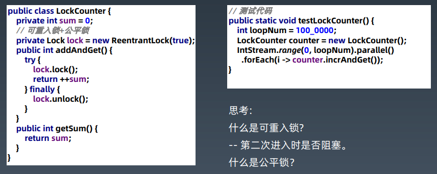


#### 读写锁 – 接口与实现 

| 重要方法          | 说明                         |
| ----------------- | ---------------------------- |
| Lock readLock();  | 获取读锁; 共享锁             |
| Lock writeLock(); | 获取写锁; 独占锁(也排斥读锁) |

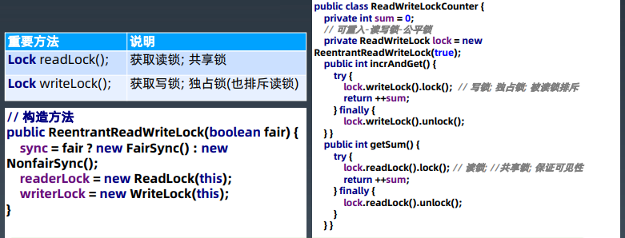

注意：ReadWriteLock 管理一组锁，一个读锁，一个写锁。
读锁可以在没有写锁的时候被多个线程同时持有，写锁是独占的。

所有读写锁的实现必须确保写操作对读操作的内存影响。每次只能有一个写线程，但是同时可以有多个线程并发地读数据。ReadWriteLock 适用于读多写少的并发情况。 


#### 基础接口 - Condition

| 重要方法                                                     | 说明                                                |
| ------------------------------------------------------------ | --------------------------------------------------- |
| void await() throws InterruptedException;                    | 等待信号; 类比 Object#wait()                        |
| void awaitUninterruptibly();                                 | 等待信号;                                           |
| boolean await(long time, TimeUnit unit) throws InterruptedException; | 等待信号; 超时则返回 false                          |
| boolean awaitUntil(Date deadline) throws InterruptedException; | 等待信号; 超时则返回 false                          |
| void signal();                                               | 给一个等待线程发送唤醒信号; 类比 Object#notify ()   |
| void signalAll();                                            | 给所有等待线程发送唤醒信号; 类比 Object#notifyAll() |

 通过 Lock.newCondition()创建。

可以看做是 Lock 对象上的信号。类似于 Object 中的 wait/notify。 


#### LockSupport--锁当前线程 

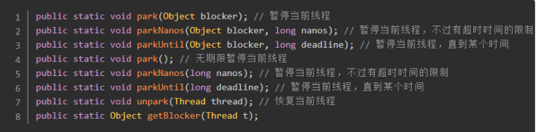

LockSupport 类似于 Thread 类的静态方法，专门处理（执行这个代码的）本线程的。

思考：为什么 unpark 需要加一个线程作为参数？
因为一个 park 的线程，无法自己唤醒自己，所以需要其他线程来唤醒。 


#### 用锁的最佳实践

Doug Lea《Java 并发编程：设计原则与模式》一书中，推荐的三个用锁的最佳实践，它们分别是：

1. 永远只在更新对象的成员变量时加锁
2. 永远只在访问可变的成员变量时加锁
3. 永远不在调用其他对象的方法时加锁

KK总结-最小使用锁：
1、降低锁范围：锁定代码的范围/作用域
2、细分锁粒度：将一个大锁，拆分成多个小锁 

 

### 并发原子类 

#### Atomic 工具类

1. 原子类工具包:
java.util.concurrent.atomic 

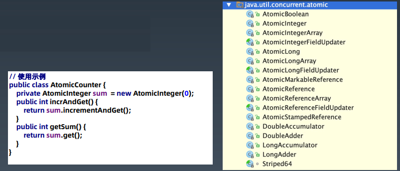

对比前面讲的，int sum，sum++线程不安全的例子。 

 

#### 无锁技术 – Atomic 工具类 

2. 无锁技术的底层实现原理
• Unsafe API ---> Compare-And-Swap
• CPU 硬件指令支持: CAS 指令 

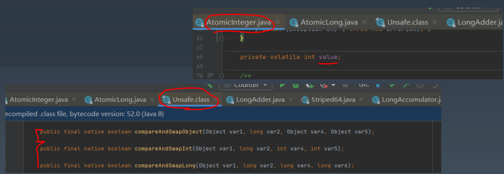

核心实现原理：
1、volatile 保证读写操作都可见（注意不保证原子）；
2、使用 CAS 指令，作为**乐观锁**实现，通过自旋重试保证写入。 

 

#### 锁与无锁之争

3. 思考一下，到底是有锁好，还是无锁好？
    什么情况下有锁好
    什么情况下无锁好

  乐观锁、悲观锁
  数据库事务锁 

Unsafe是一些不被虚拟机控制的内存操作的合集。

CAS 本质上没有使用锁。（CAS可以理解为原子性的写操作，这个概念来自于底层CPU指令。Unsafe提供了一些cas的Java接口。）

并发压力跟锁性能的关系：
1、压力非常小，性能本身要求就不高；
2、压力一般的情况下，无锁更快，大部分都一次写入；
3、压力非常大时，自旋导致重试过多，资源消耗很大。 


#### LongAdder 对 AtomicLong 的改进

通过分段思想改进原子类，大家想想，还有哪些是用这个思想？

多路**归并**的思想（分布式数据库主键生成）：

- 快排
- G1 GC
- ConcurrentHashMap

 还记得我们讲的爬山，做一个大项目，都需要加里程碑，也是分段 

 LongAdder 的改进思路：
1、AtomicInteger 和 AtomicLong 里的 value 是所有线程竞争读写的热点数据；
2、将单个 value 拆分成跟线程一样多的数组 Cell[]；
3、每个线程写自己的 Cell[i]++，最后对数组求和。 


### 并发工具类 

#### 什么是并发工具类

思考一下：
多个线程之间怎么相互协作？

前面讲到的：
1、wait/notify，
2、Lock/Condition,
可以作为简单的协作机制。

但是更复杂的，需要这些线程满足某些条件（数量，时间）。 

更复杂的应用场景，比如

- 我们需要控制实际并发访问资源的并发数量
- 我们需要多个线程在某个时间同时开始运行
- 我们需要指定数量线程到达某个状态再继续处理 


#### AQS

-  AbstractQueuedSynchronizer，即**队列同步器**。它是构建锁或者其他同步组件的基础（如Semaphore、CountDownLatch、ReentrantLock、ReentrantReadWriteLock），是JUC并发包中的核心基础组件。 
- AbstractQueuedSynchronizer：抽象队列式的同步器
- 两种资源共享方式: 独占 | 共享，子类负责实现公平 OR 非公平 

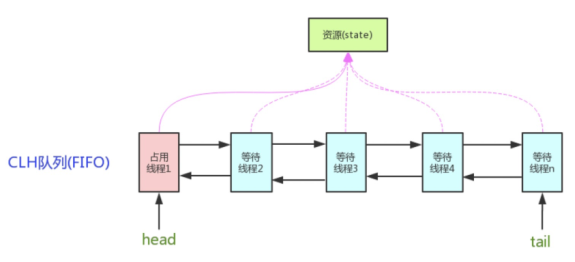


#### Semaphore - 信号量

1. 准入数量 N
2. N =1 则等价于独占锁

使用场景：同一时间控制并发线程数

注意：

- 可以使用 数量控制一次操作的线程个数
- 在每一个子线程中进行各自 信号量的 acquire() or release()
- 默认非公平同步，即使用 AQS 实现队列，进行先来后到的排序

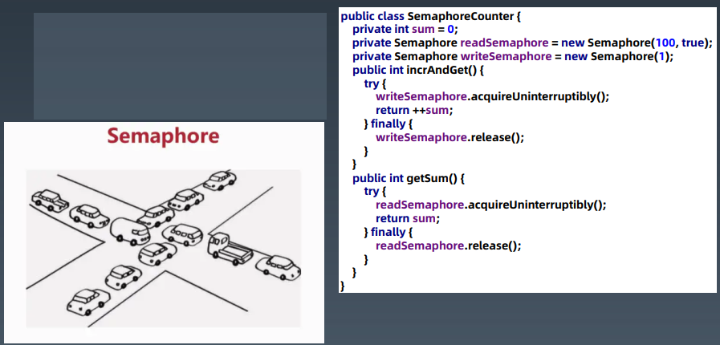


#### CountdownLatch 

场景: Master 线程等待 Worker 线程把任务执行完

示例: 等所有人干完手上的活，一起去吃饭。 

注意：

- 一般会给出CountDownLatch的个数count
- 当多个线程中的某count个线程完成任务之后，就不会继续await()，而是直接await()后面的程序
- 使用线程池的时候，需要确保countDownLatch.countDown()被执行，不然await()会等到天荒地来，并且 还需要显式的关闭线程池exec.shutdown()

| 要方法                                     | 说明             |
| ------------------------------------------ | ---------------- |
| public CountDownLatch(int count)           | 构造方法（总数） |
| void await() throws InterruptedException   | 等待数量归0      |
| boolean await(long timeout, TimeUnit unit) | 限时等待         |
| void countDown()                           | 等待数减1        |
| long getCount()                            | 返回剩余数量     |

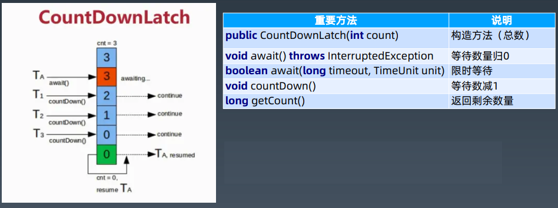


#### CountDownLatch 示例 

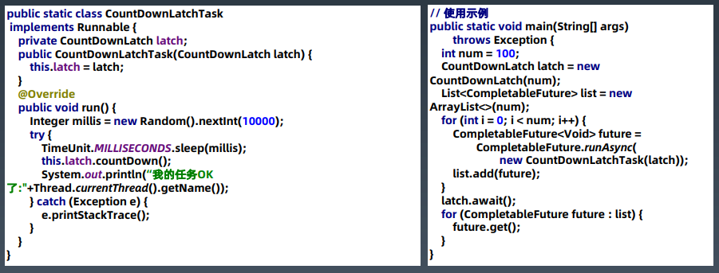


#### CyclicBarrier 

- 屏障
- 场景: 任务执行到一定阶段, 等待其他任务对齐。
- 示例: 等待所有人都到达，再一起开吃。 

注意：

- 每一次使用的时候，创建一个回调方法，给定一个调用回调的阈值
- 在单个线程中调用cyc.await(); 
- 一旦到达调用回调的阈值，就会调用回调方法
- 当调用之后，就会开始下一轮等待，后续再次到达阈值，还是继续调用回调

| 重要方法                                                  | 说明                                       |
| --------------------------------------------------------- | ------------------------------------------ |
| public CyclicBarrier(int parties)                         | 构造方法（需要等待的数量）                 |
| public CyclicBarrier(int parties, Runnable barrierAction) | 构造方法（需要等待的数量, 需要执行的任务） |
| int await()                                               | 任务内部使用; 等待大家都到齐               |
| int await(long timeout, TimeUnit unit)                    | 任务内部使用; 限时等待到齐                 |
| void reset()                                              | 重新一轮                                   |


#### CyclicBarrier 示例

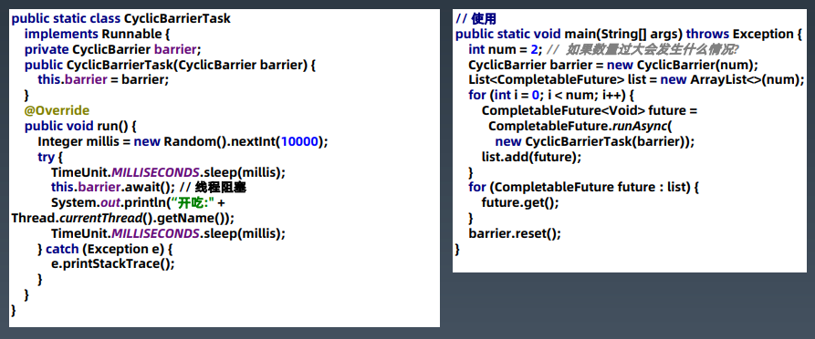


#### CountDownLatch 与 CyclicBarrier 比较 

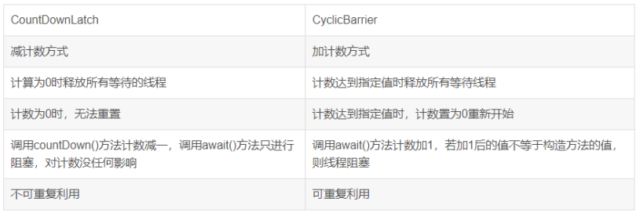

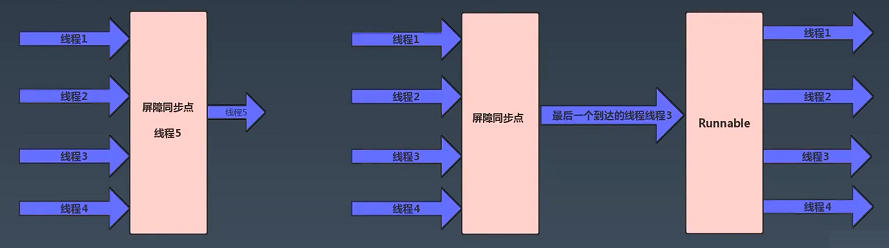


#### Future/FutureTask/CompletableFuture 

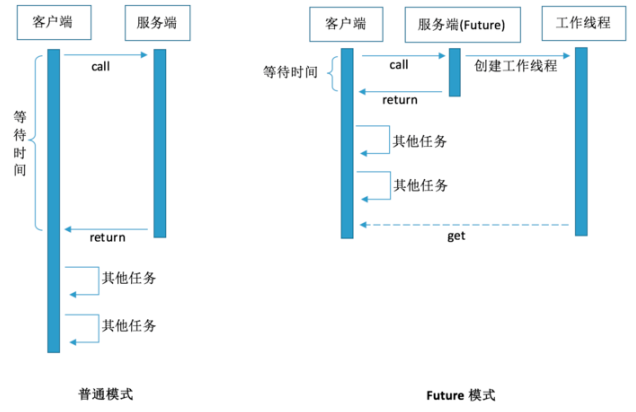

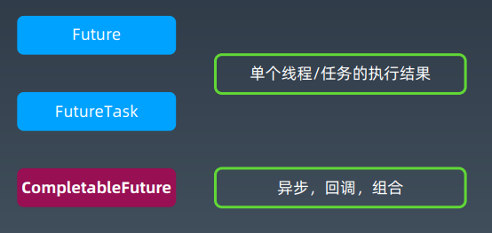


#### CompletableFuture 

| 重要方法                                                     | 说明                       |
| ------------------------------------------------------------ | -------------------------- |
| static final boolean useCommonPool = (ForkJoinPool.getCommonPoolParallelism() > 1); | 是否使用内置线程池         |
| static final Executor asyncPool = useCommonPool ? ForkJoinPool.commonPool() : new ThreadPerTaskExecutor(); | 线程池                     |
| CompletableFuture<Void> runAsync(Runnable runnable)；        | 异步执行【当心阻塞？】     |
| CompletableFuture<Void> runAsync(Runnable runnable, Executor executor) | 异步执行, 使用自定义线程池 |
| T get()                                                      | 等待执行结果               |
| T get(long timeout, TimeUnit unit)                           | 限时等待执行结果           |
| T getNow(T valueIfAbsent)                                    | 立即获取结果(默认值)       |
| ……                                                           |                            |

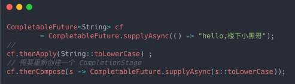


### 总结回顾与作业实践 

#### 总结回顾

1. Java  并发包（*JUC）
2. 到底什么是锁
3. 并发原子类*
4. 并发工具类详解* 


#### 作业实践

1、（选做）把示例代码，运行一遍，思考课上相关的问题。也可以做一些比较。

2、（必做）思考有多少种方式，在 main 函数启动一个新线程，运行一个方法，拿到这个方法的返回值后，退出主线程？
写出你的方法，越多越好，提交到 Github。

一个简单的代码参考：
https://github.com/kimmking/JavaCourseCodes/tree/main/03concurrency/0301/src/main/java/java0/conc0303/Homework03.java 


## Java 并发编程 --安全编程与面试经验

### 常用线程安全类型

#### JDK 基础数据类型与集合类

- 原生类型，
- 数组类型，
- 对象引用类型
- 注意：Properties的坑，java.util.Properties#getProperty(java.lang.String)，如果取出来的对象不是String，就直接设置为 null。
- 注意：Stack 和 Queue ，一个是类，一个是接口，并且都是线性数据结构
- 注意：LinkedList，属于杂交水稻

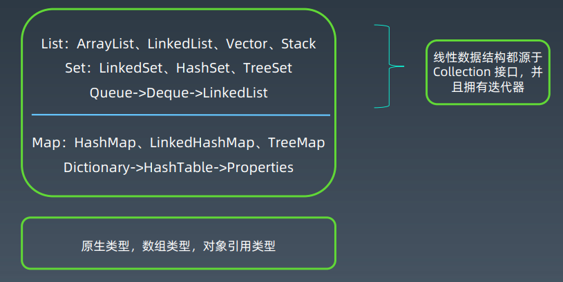


#### ArrayList

基本特点：基于数组，便于按 index 访问，超过数组需要扩容，扩容成本较高

用途：大部分情况下操作一组数据都可以用 ArrayList

原理：使用数组模拟列表，默认大小10，扩容 x1.5，newCapacity = oldCapacity +(oldCapacity >> 1)

安全问题：

1、写冲突：

- 两个写，相互操作冲突

2、读写冲突：

- 读，特别是 iterator 的时候，数据个数变了，拿到了非预期数据或者报错
- 产生ConcurrentModificationException

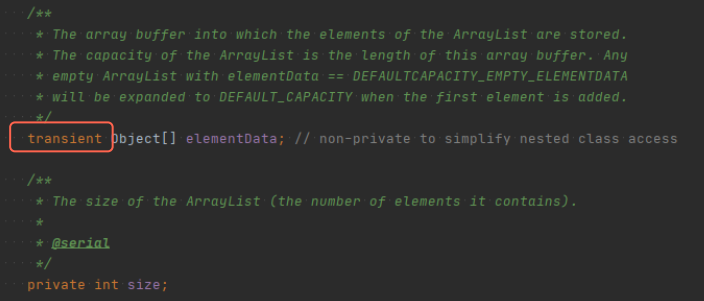


#### LinkedList

基本特点：使用双链表实现，无需扩容

用途：不知道容量，插入变动多的情况

原理：使用双向指针将所有节点连起来

安全问题：

1、写冲突：

- 两个写，相互操作冲突

2、读写冲突：

- 读，特别是 iterator 的时候，数据个数变了，拿到了非预期数据或者报错
- 产生 ConcurrentModificationException

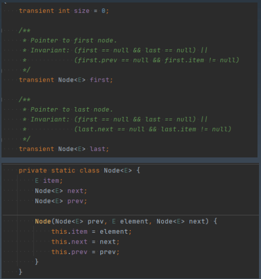


#### List 线程安全的简单办法

既然线程安全是写冲突和读写冲突导致的

最简单办法就是，读写都加锁。

例如：

- 1.ArrayList 的方法都加上 synchronized -> Vector
- 2.Collections.synchronizedList，强制将 List 的操作加上同步
- 3.Arrays.asList，不允许添加删除，但是可以 set 替换元素
- 4.Collections.unmodifiableList，不允许修改内容，包括添加删除和 set

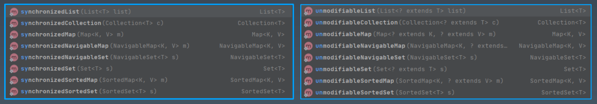


#### CopyOnWriteArrayList

核心改进原理（应用发布，滚动停机，发布）：
1、写加锁，保证不会写混乱
2、写在一个 Copy **副本**上，而不是原始数据上（GC young 区用复制，old 区用本区内的移动）
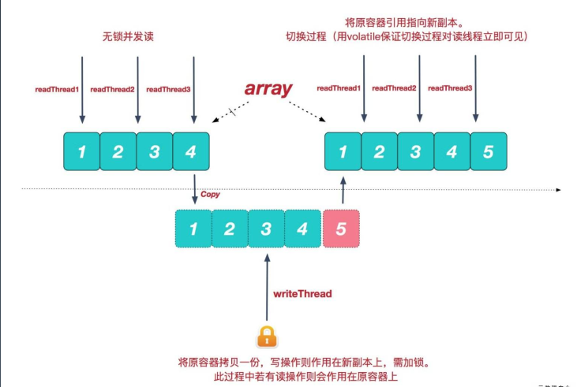

读写分离

最终一致

1、插入元素时，在新副本操作，不影响旧引用，why?
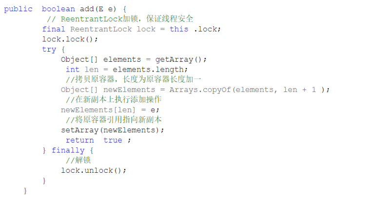

2、删除元素时，
1）删除末尾元素，直接使用前 N-1 个元素创建一个新数组。
2）删除其他位置元素，创建新数组，将剩余元素复制到新数组。
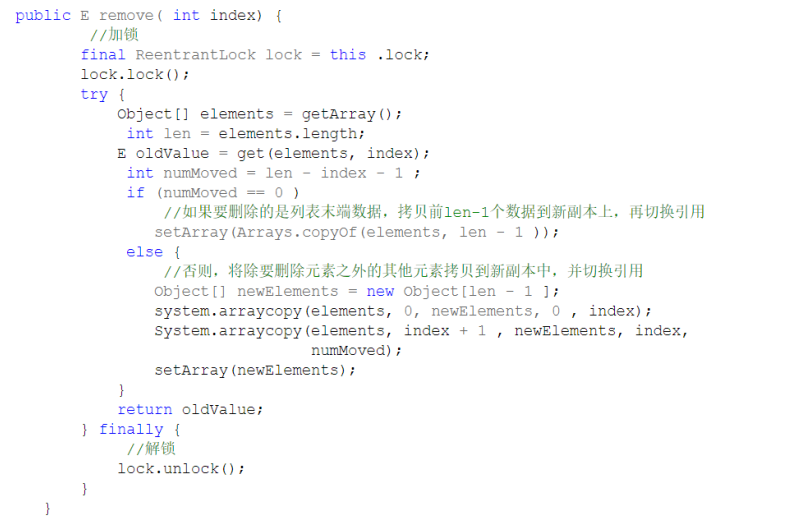

3、读取不需要加锁，why？
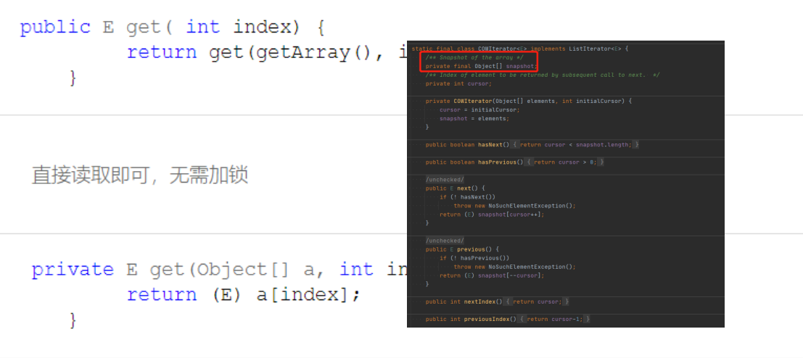

4、使用迭代器的时候，直接拿当前的数组对象做一个快照，此后的 List元素变动，就跟这次迭代没关系了。
想想：淘宝商品 item 的快照。商品价格会变，每次下单都会生成一个当时商品信息的快照。

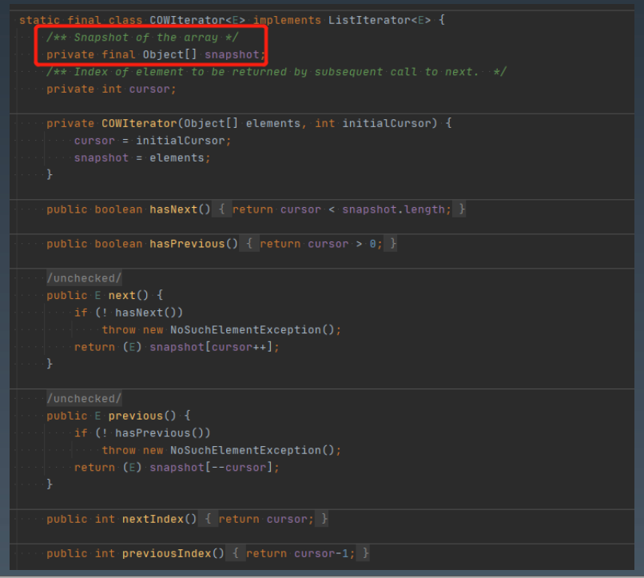


#### HashMap

基本特点：空间换时间，哈希冲突不大的情况下查找数据性能很高

用途：存放指定 key 的对象，缓存对象

原理：使用 hash 原理，存 k-v 数据，初始容量16，扩容 x2，负载因子0.75
JDK8 以后，在链表长度到8 & 数组长度到64时，使用红黑树。

安全问题：
1、写冲突，
2、读写问题，可能会死循环
3、keys()无序问题

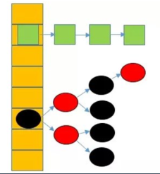


#### LinkedHashMap

基本特点：继承自 HashMap，对 Entry 集合添加了一个双向链表

用途：保证有序，特别是 Java8 stream 操作的 toMap 时使用

原理：同 LinkedList，包括插入顺序和访问顺序

安全问题：
同 HashMap


#### ConcurrentHashMap-Java7 分段锁

分段锁
默认16个Segment，降低锁粒度。
concurrentLevel = 16

想想：
Segment[] ~ 分库
HashEntry[] ~ 分表

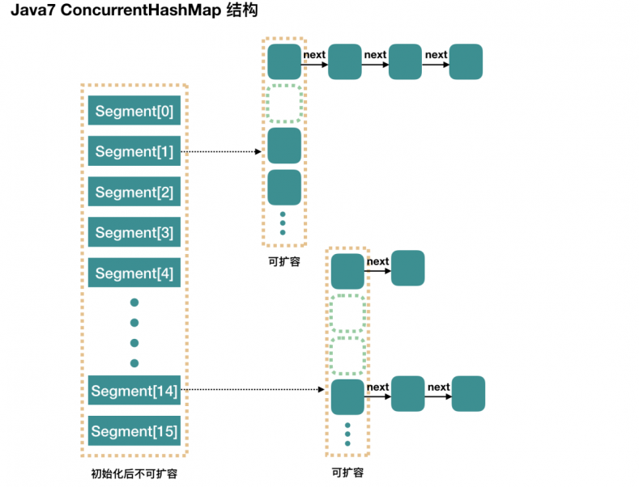

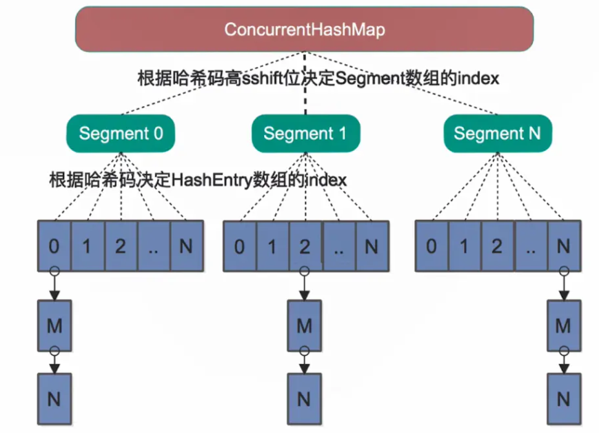


#### ConcurrentHashMap-Java8

Java 7为实现并行访问，引入了Segment 这一结构，实现了分段锁，理论上最大并发度与 Segment 个数相等。

Java 8为进一步提高并发性，摒弃了分段锁的方案，而是直接使用一个大的数组。

why?

putIfAbsent() 方法

注意，ConcurrentHashMap 随着链表的数据量上升，会将链表提升为红黑树，此时的链表就是天然的有序。

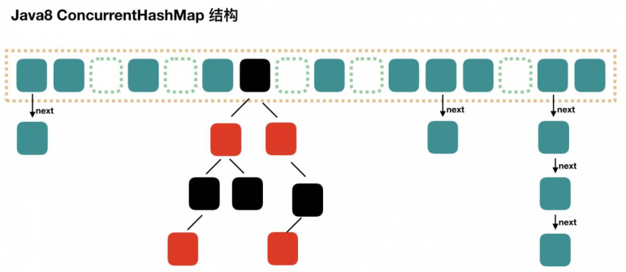

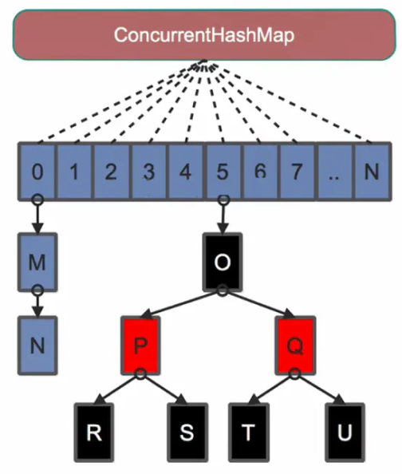


#### 并发集合类总结

- 规模小，排序数字 < 7，使用冒泡排序，
- 规模大，排序数字 > 7，使用快速排序

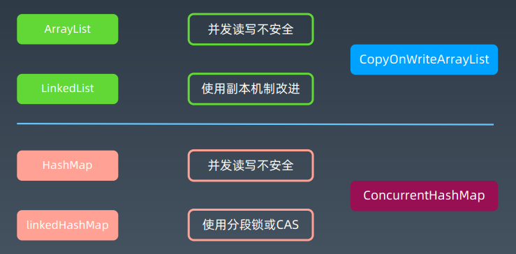


### 并发编程相关内容

#### 线程安全操作利器 - ThreadLocal

| 重要方法                   | 说明                |
| -------------------------- | ------------------- |
| public ThreadLocal()       | 构造方法            |
| protected T initialValue() | 覆写-设置初始默认值 |
| void set(T value)          | 设置本线程对应的值  |
| void remove()              | 清理本线程对应的值  |
| T get()                    | 获取本线程对应的值  |

- 线程本地变量
- 场景: 每个线程一个副本
- 不改方法签名静默传参（隐式传参）
- 及时进行清理 
- 可以看做是 Context 模式，减少显式传递参数 


#### 四两拨千斤 - 并行 Stream 

- 多线程执行，只需要加个 .parallel() 即可 
- 不动用其他的代码，默认启动一个线程池，将后面的任务包装成一个 Runable，默认线程个数是 CPU核心的两倍
- 数据量的大小决定了最终的性能
- 这样子的话，天然将业务代码和功能代码分开，只需要关注于业务代码即可

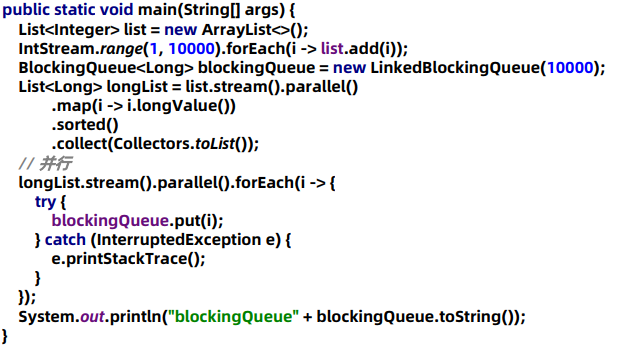


#### 伪并发问题

- 跟并发冲突问题类似的场景很多
- 比如浏览器端，表单的**重复提交**问题
  - 1、客户端控制（调用方），点击后按钮不可用，跳转到其他页
  - 2、服务器端控制（处理端），给每个表单生成一个编号，提交时判断重复 

还有没有其他办法？

- 提交表单，将后续的操作拆开
- 下单->下单成功->操作成功
- 永远站在客户的角度思考


#### 分布式下的锁和计数器

- 分布式环境下，多个机器的操作，超出了线程的协作机制，一定是并行的
- 例如某个任务只能由一个应用处理，部署了多个机器，怎么控制
- 例如针对用户的限流是每分钟60次计数，API 服务器有3台，用户可能随机访问到任何一台，怎么控制？（秒杀场景是不是很像？库存固定且有限。） 

不要着急，分布式缓存会详细讲


### 并发编程经验总结 

#### 加锁需要考虑的问题

1. 粒度
2. 性能
3. 重入
4. 公平
5. 自旋锁（spinlock）（乐观锁模式，如果不是最新的，就会重新提交，保证并发的量，不然越并发越占资源）
6. 场景: 脱离业务场景谈性能都是耍流氓 （业务一般在数据库，中间件一般在IO）


#### 线程间协作与通信

1. 线程间共享:
• static/实例变量(堆内存)
• Lock
• synchronized
2. 线程间协作:
• Thread#join()
• Object#wait/notify/notifyAll
• Future/Callable
• CountdownLatch
• CyclicBarrier 

可以思考：不同进程之间有哪些方式通信 ？

- 操作系统的信号量，Signal
  - kill -9 是线程的自杀信号量
  - kill -3 是jstac，打出线程栈
- 操作系统的管道，| ，前面执行的结果，传递到后面
- 共享内存，共享文件，剪切板，走socket通信，数据库


### 并发编程常见面试题 

见文档。


### 总结回顾与作业实践 

#### 总结回顾

1.常用线程安全类型*
2.并发编程相关内容
3.并发编程经验总结*
4.并发编程常见面试题* 


#### 作业实践

1、（选做）列举常用的并发操作 API 和工具类，简单分析其使用场景和优缺点。

2、（选做）请思考：什么是并发？什么是高并发？实现高并发高可用系统需要考虑哪些因素，对于这些你是怎么理解的？

3、（选做）请思考：还有哪些跟并发类似/有关的场景和问题，有哪些可以借鉴的解决办法。

4、（必做）把多线程和并发相关知识带你梳理一遍，画一个脑图，截图上传到 Github上。
可选工具：xmind，百度脑图，wps，MindManage或其他。 


## java 开发框架-Spring

### Spring 技术发展

#### Spring 框架的产生与发展

https://spring.io/

2002年10月，Rod Johnson 撰写了一本名为 Expert One-on-One J2EE 设计和开发的书。

Rod, Juergen 和 Yann  于2003年2月左右开始合作开发Spring项目。

自2004年1.0版本发布以来，Spring框架迅速发展。

Spring 2.0于2006年10月发布，到那时，Spring的下载量超过了100万。

在Rod领导下管理 Interface21 项目于 2007年11月 更名为 SpringSource。同时发不了Spring2.5。Spring 2.5 中的主要新功能包括支持 Java6 / Java EE 5，支持注释配置， Classpath 中 的组件自动 检测和兼容 OSGI 的 bundle。

2007年，SpringSource 从基准资本获得了 A 轮融资，1000万美元。

2009年8月，Springsource 以4.2亿美元被VMWare收购。

2009年12月，Spring 3.0 发布。

2012年7月，Rod Johnson 离开团队。

2013年4月，VMware 和 EMC通过 GE投资创建了一家名为 Pivotal 的合资企业。所有的spring 应用项目都转移到了 Pivotal。

2013年12月，Pivotal 宣布发布Spring 框架 4.0。Spring 4.0 是Spring框架的一大进步，它包含了对Java8的全面支持，更高的第三方库依赖性（groovy  1.8+，ehcache 2.1+，hibernate  3.6+等），Java EE 7支持，groovy DSL for bean定义，对 websockets 的支持以及对泛型类型的支持作为注入 Bean 的限定符。

2014年至2017年期间发不了许多 Spring 框架 4.xx 系列版本。

Spring 5.0 GA 版本与 2017年9月28日发布。Spring 5.0 开始支持 JDK 8 和 Java EE 7，同时兼容 JDK 9。全面支持  Servlet 3.1，它还引入了一个全新的模块 Spring  webflux。用于替代老话的 spring-webmvc，对Kotlin 也有了更好的支持。

Pivotal 公司成立之后，于2014年发布了 Spring Boot，2015年 发布了 Spring Cloud，2018年 Pivotal 公司在纽约上式。

公司开源产品有：Spring 以及 Spring衍生产品，Web 服务器 Tomcat，缓存中间件 Redis，消息中间件 RabbitMQ，平台即服务的 Cloud Foundry，Greenplum 数据引擎，GemFire（12306 系统解决方案组件之一）。


#### Spring 重点版本

- 2.5.6
- 3.3.1
- 4.x


### Spring 框架设计

#### Spring 框架设计

思考一下，什么是框架？

- 框架本身不解决业务问题
- 使用框架，更加关注的解决业务问题


#### Spring Framework 6大模块

- core
- Testing
- DataAccess
- Spring MVC/WebFlux
- Integration
- Languages

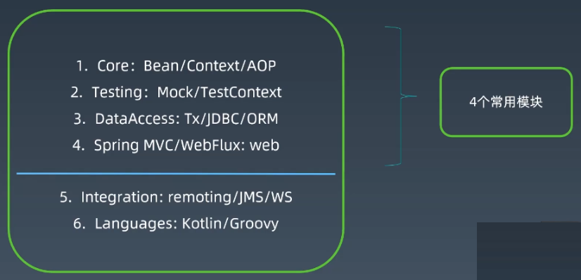


#### Spring 框架设计

- 众多项目
- Bean 与 AOP

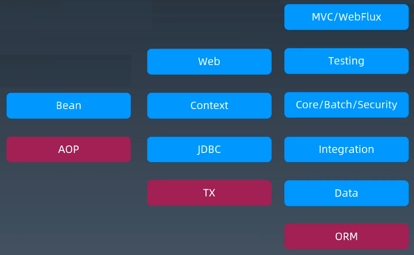

- 引入Spring意味着引入了一种研发协作模式（MVC）
- 进行系统的分层，根据功能切分为一个个小组件，方便划分工作与复杂度

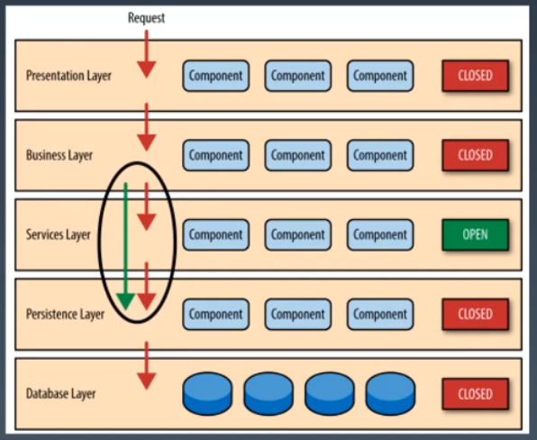


### Spring AOP 详解

#### Spring AOP

**AOP-面向切面编程**
Spring 早期版本的核心功能，管理对象生命周期与对象装配。
为了实现管理和装配，一个自然而然的想法就是，加一个中间层代理（字节码增强）来实现所有对象的托管。


**IOC-控制反转**
也称为 DI（Dependency Injection）依赖注入。
对象装配思路的改进。
从对象A直接引用和操作对象B，变成对象A里只需要依赖一个接口B。系统启动和装配阶段，把IB接口的实例对象注入到对象A，这样A就不需要依赖一个IB接口的具体实现，也即是类B。
从而实现在不修改代码的情况，修改配置文件，即可以运行时替换成注入IB接口的另一实现类C的一个对象实例。


**属性的循环依赖**，A.b=B，B.a=A，无法进行编译，先有蛋还是先有鸡。

解决方法，从编译器推迟到运行期。


什么类型的循环依赖 Spring无法处理？==>构造函数中的依赖，无法处理。

除了 Spring，循环依赖还有哪些类似场景？==>事务中的死锁，并发死锁。

如何打破依赖？==>1）将循环依赖去掉，打破一个锁，死掉线程或者扔掉锁。2）将循环操作，加上一个超时，加上可以中断的。


#### Spring AOP做法

- 接口类型
- 非接口类型
  - 默认使用 CGlib
  - 运行期生成，xxx$$ EnhancerBySpringCGLIB
- 示例程序
- org.copydays.thinking.java.spring.core.technology.aopproxy.SpringDemo

一个 对象的代理有哪些种类？用在什么场景？组合类型，门面模式，装饰模式。

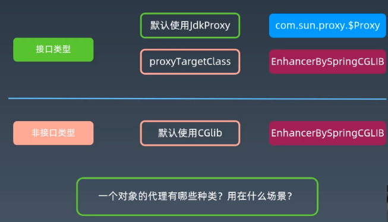


#### Spring AOP动态代理

- CGLIB
- 字节码增强 emit，C# 直接有 emit 的包
- 字节操作，都是第三方，非类库提供。
- 提供一个动态代理口子，Instrumentation，叫做java  agent，拿到的是真正改变之后的类。
- ByteBuddy 提供更友好的操作 API

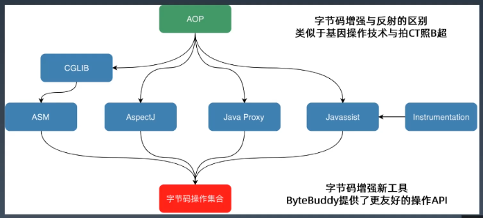


### Spring  Bean  核心原理

#### Spring Bean 生命周期

- BeanFactory
- ApplicationContext
- 从Bean 工厂到应用上下文

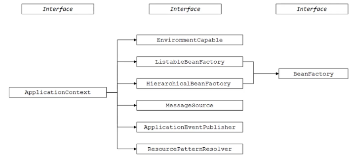


- Bean 的加载过程示意图
- 为什么设计得这么复杂？11步？
  - Spring作为通用框架，需要初始化任何类，就需要这么复杂

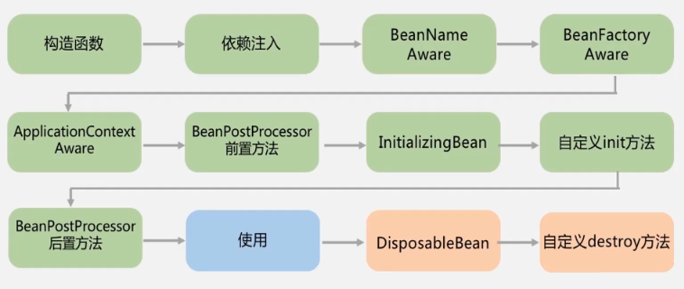


- Bean 的加载过程流程图
- 是否可以对照 Classloader加载？可以，它们是一致的。

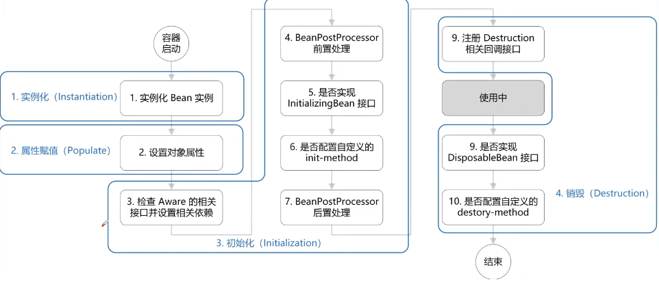


- Bean 的加载过程
- 1）创建对象
- 2）属性赋值
- 3）初始化
- 4）注销接口注册
- org.springframework.beans.factory.support.AbstractAutowireCapableBeanFactory#doCreateBean

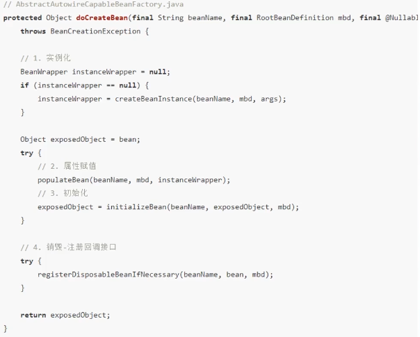


- Bean 的加载过程-初始化过程
  - 检查Aware装配
  - 前置处理，After处理
  - 调用 init method
  - 后置处理
- 返回包装类
- org.springframework.beans.factory.support.AbstractAutowireCapableBeanFactory#initializeBean(java.lang.String, java.lang.Object, org.springframework.beans.factory.support.RootBeanDefinition)

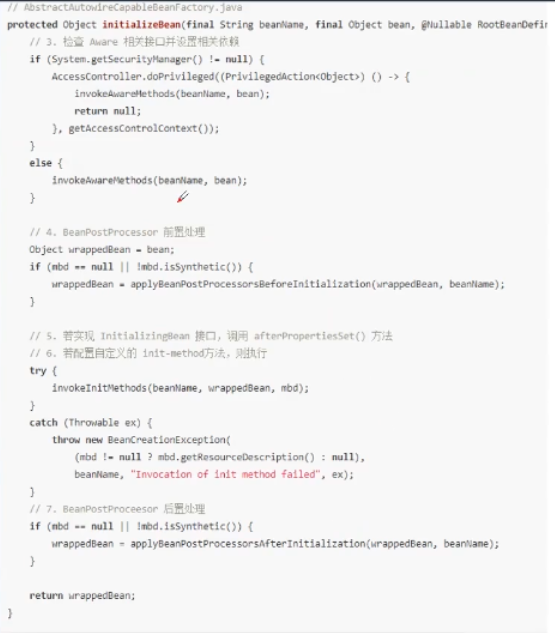


- Bean 的加载过程
- Spring Bean 工厂，都是单例的
- Spring 管理对象生命周期以后，也就改变了编程和协作模式

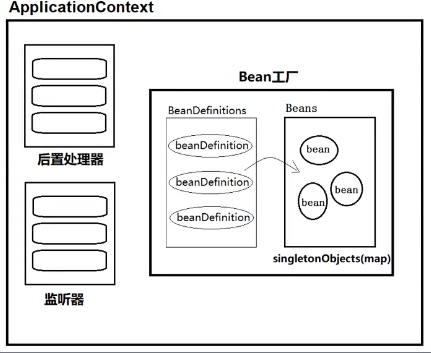

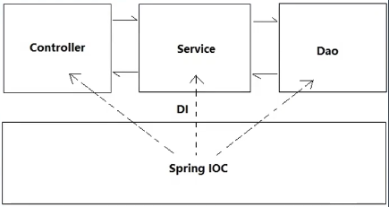


### Spring XML 配置原理

#### XML 配置原理

- XML 配置原理
- 基于 xsd 文件描述
- 本地文件的命名空间
- xxx.xml

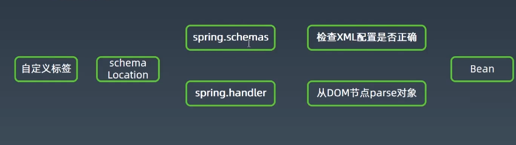

- 自动化 XML 配置工具：
  - XMLBeans -> Spring-xbean
  - 自动生成Handler等文件
- 2个原理
  - 1.根据Bean的字段结构，自动生成 XSD
  - 根据Bean的字段结构，配置XML文件
- 思考：
  - 1.解析XML的工具有哪些，都有什么特点？
  - XML <-> Bean 相互转换的工具，除了 xbean，还有什么？


- 总结
- Spring 4.0之后，可以将一个方法变成一个 Bean，不需要new那么多实例
- 自动扫描的方式实现

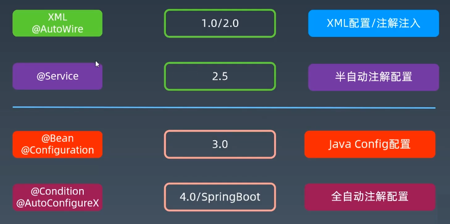


### Spring Messaging 等技术

- 介绍 Messageing 与 JMS
- RPC 与 MQ ，同步转异步，依赖关系变简单

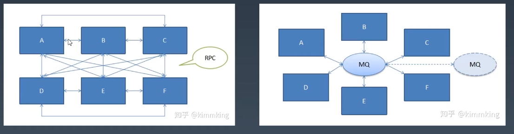


- JMS 规范类似于 JDBC
- 点对点发送消息 与 发布订阅模式


- activemq 示例
- http://activemq.apache.org/
- org.copydays.thinking.java.spring.core.technology.jms.JmsSender
- org.copydays.thinking.java.spring.core.technology.jms.JmsReceiver


### 总结回顾与作业实践 

#### 总结回顾

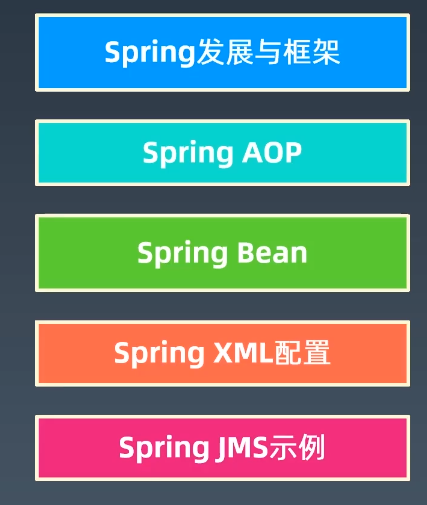


#### 作业实践

1）使java里的动态代理，实现一个简单的AOP

2）写代码实现 Spring Bean的装配，方式越多越好（XML，Annotation都可以）。

3）实现一个 Spring XML 自定义配置，配置一组 Bean，例如 Student / Klass/ School。

4）附加

4.1）将网关的 frontend /backgend /filter /router /线程池都改造成 Spring 配置方式

4.2）基于 AOP 改造 Netty 网关，filter 和 router 使用 AOP 方式实现

4.3）基于前述改造，将网关请求前后端分离，中级使用 JMS 传递消息

4.4）尝试使用 ByteBuddy 实现一个简单的基于类的AOP

4.5）尝试使用 ByteBuddy 和 Instrument 实现一个简单 JavaAgent 实现吴琴融入下的 AOP


## java 开发框架-Spring Boot

### 从 Spring 到 Spring Boot 

#### Spring 变得越来越复杂

配置的发展方向：
XML--全局
注解--类
配置类--方法
Spring 4 以上的新特性，走向 Spring Boot

功能，使用方式太复杂，怎么办？ 

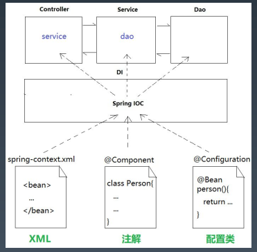


#### Spring Boot 的出发点

Spring 臃肿以后的必然选择。
一切都是为了简化。

- 让开发变简单：
- 让配置变简单：
- 让运行变简单：

怎么变简单？关键词：整合
就像是 SSH、SSM（脚手架），国产的 SpringSide（唯品会）

基于什么变简单：**约定大于配置**。 

限定性框架（框死应用领域）和非限定性框架（Spring 原始方式，什么都可以，万金油）？ 


#### Spring Boot 如何做到简化

为什么能做到简化：
1、Spring 本身技术的成熟与完善，各方面第三方组件的成熟集成
2、Spring 团队在去 web 容器化等方面的努力（内嵌Tomcat，属于Apache。Jetty 更小，只有一个jar，天然是嵌入的，属于eclipse）
3、基于 MAVEN 与 POM 的 Java 生态体系，整合 POM 模板成为可能
4、避免大量 maven 导入和各种版本冲突

Spring Boot 是 Spring 的一套快速配置**脚手架**，关注于自动配置，配置驱动。

什么是脚手架？ （框架（Spring），脚手架（Spring Boot），解决方案（Spring Cloud））


#### 什么是 Spring Boot

Spring Boot 使创建独立运行、生产级别的 Spring 应用变得容易，你可以直接运行它。
我们对 Spring 平台和第三方库采用限定性视角，以此让大家能在最小的成本下上手。大部分 Spring Boot 应用仅仅需要最少量的配置。

功能特性

1. 创建独立运行的 Spring 应用
2. 直接嵌入 Tomcat 或 Jetty，Undertow，无需部署 WAR 包 (maven  打一个 fat jar，使用插件 shade；gradle 也可以打出来 fat jar)
3. 提供限定性的 starter 依赖简化配置（就是脚手架）
4. 在必要时自动化配置 Spring 和其他三方依赖库
5. 提供生产 production-ready 特性，例如指标度量，健康检查，外部配置等
6. 完全零代码生产和不需要 XML 配置 


#### 快速构建基础 maven 项目 

- https://start.spring.io/

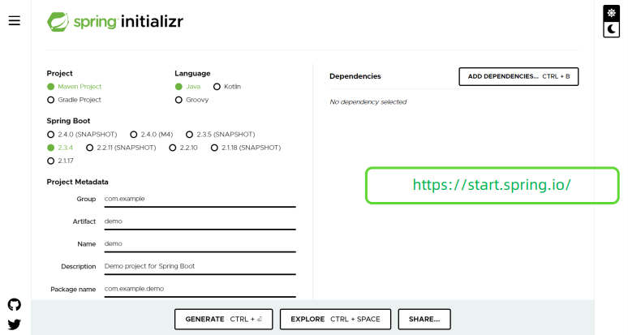


### Spring Boot 核心原理 

#### Spring Boot 两大核心原理

1、自动化配置：简化配置核心
基于 Configuration，EnableXX，Condition

2、spring-boot-starter：脚手架核心
整合各种第三方类库，协同工具 

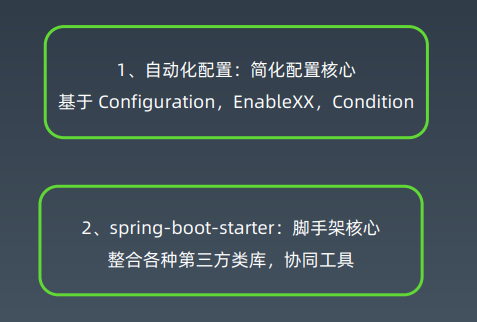

（整合到项目的pom文件中）

application.yaml --> Configuration  --> Bean

前缀  --> 一**组**配置 -->  Starter 组件 

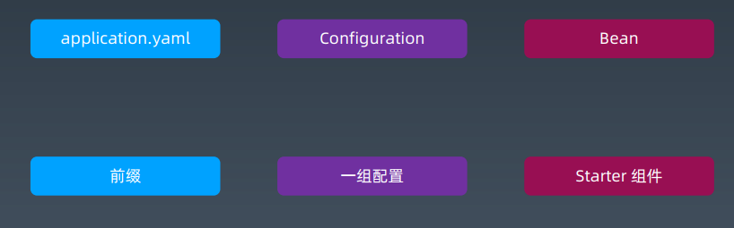


#### 为什么要约定大于配置

为什么要约定大于配置？

举例来说，JVM 有1000多个参数（查看命令：java -XX:+PrintFlagsFinal -XX:+UnlockDiagnosticVMOptions -version | wc -l），但是我们不需要一个参数，就能 java Hello。

优势在于，开箱即用：
一、Maven 的目录结构：默认有 resources 文件夹存放配置文件。默认打包方式为 jar。
二、默认的配置文件：application.properties 或 application.yml 文件
三、默认通过 spring.profiles.active 属性来决定运行环境时的配置文件。
四、EnableAutoConfiguration 默认对于依赖的 starter 进行自动装载。
五、spring-boot-start-web 中默认包含 spring-mvc 相关依赖以及内置的 web容器，使得构建一个 web 应用更加简单。


#### 自动化配置原理

自动化配置 步骤：

- 写配有注解 @EnableAutoConfiguration 的类

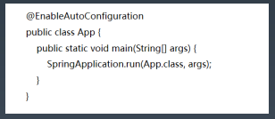

- 写配有注解 @Configuration  的类


- 写配有注解 @Import(WebConfiguration.class) 的类

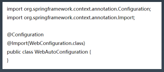

- 写 spring.factories 文件，进行映射装配

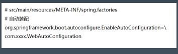


#### Spring Boot 自动配置注解

•@SpringBootApplication

SpringBoot 应用标注在某个类上说明这个类是 SpringBoot 的主配置类，SpringBoot 就会运行这个类的 main 方法来启动 SpringBoot 项目。
•@SpringBootConfiguration
•@EnableAutoConfiguration
•@AutoConfigurationPackage
•@Import({AutoConfigurationImportSelector.class})

加载所有 META-INF/spring.factories 中存在的配置类（类似 SpringMVC 中加载所有 converter）

核心启动入口 


#### 条件化自动配置

@ConditionalOnBean
@ConditionalOnClass
@ConditionalOnMissingBean
@ConditionalOnProperty
@ConditionalOnResource
@ConditionalOnSingleCandidate
@ConditionalOnWebApplication

运行时灵活组装，避免冲突 


### Spring Boot Starter 详解 

#### 以一个实际项目讲解 Starter

1、spring.provides（那个包提供了starter）
2、spring.factories（定义自动配置的类）
3、additional--metadata（配置内容，可以设置默认值）
4、自定义 Configuration 类 （配置类，扫描包的converter，）

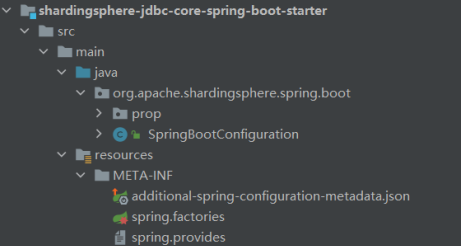

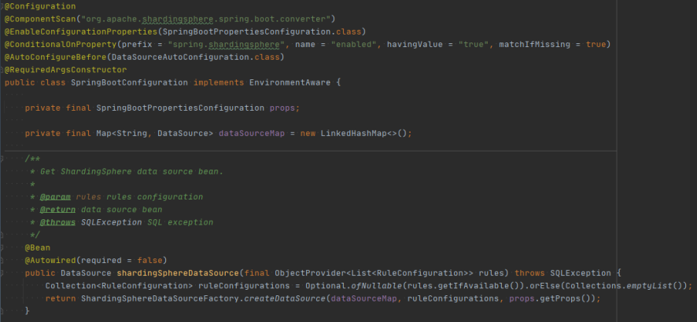


### JDBC 与数据库连接池 

#### JDBC

JDBC 定义了数据库交互接口：
DriverManager
Connection
Statement
ResultSet
后来又加了DataSource--Pool  （数据库连接池，类似于线程池）

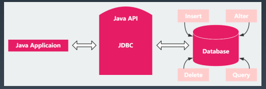

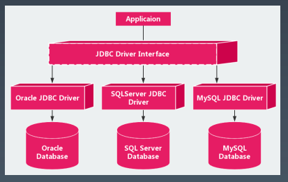


#### JDBC 是 Java 里操作数据库的核心

Java 操作数据库的各种类库，都可以看做是在 JDBC 上做的增强实现（JDBC实现了一个接口，只需要使用代理模式，进行封装即可实现各种类库）

为什么可以这么做？
加上 XA 事务--XAConnection
从连接池获取--PooledConnection
MySQL 驱动 JDBC 接口--Connection 

（基于AOP的思想，对每一个连接，添加一个状态。忙的时候就是true，不忙就是false）


#### 数据库连接池

C3P0
DBCP--Apache CommonPool
Druid（德鲁伊）
Hikari （光）

连接池需要哪些功能，如何实现？（连接池的快慢意义都不大，相比较于 整个业务操作，时间很短）


### ORM-Hibernate/MyBatis 

#### Hibernate

ORM（Object-Relational Mapping） 表示对象关系映射。

Hibernate 是一个开源的对象关系映射框架，它对JDBC 进行了非常轻量级的对象封装，它将 POJO 与数据库表建立映射关系，是一个全自动的 orm 框架，hibernate 可以自动生成 SQL 语句，自动执行，使得 Java 程序员可以使用面向对象的思维来操纵数据库。

Hibernate 里需要定义**实体类**和 **hbm 映射**关系文件（IDE 一般有工具生成）。

Hibernate 里可以使用 HQL（写一个配置映射文件）、Criteria（直接使用.的方式，.query().where()）、Native SQL（直接写的就是SQL）三种方式操作数据库。

也可以作为 JPA 适配实现，使用 JPA 接口操作。 

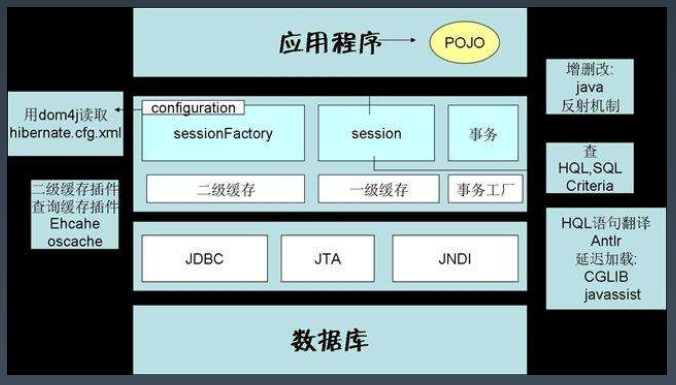


#### MyBatis

MyBatis 是一款优秀的持久层框架，它支持定制化 SQL、存储过程以及高级映射。MyBatis 避免了几乎所有的JDBC 代码和手动设置参数以及获取结果集。MyBatis 可以使用简单的 XML或注解来配置和映射原生信息，将接口和 Java 的 POJOs(Plain Old Java Objects,普通的 Java 对象)映射成数据库中的记录。 

备注：大厂使用。

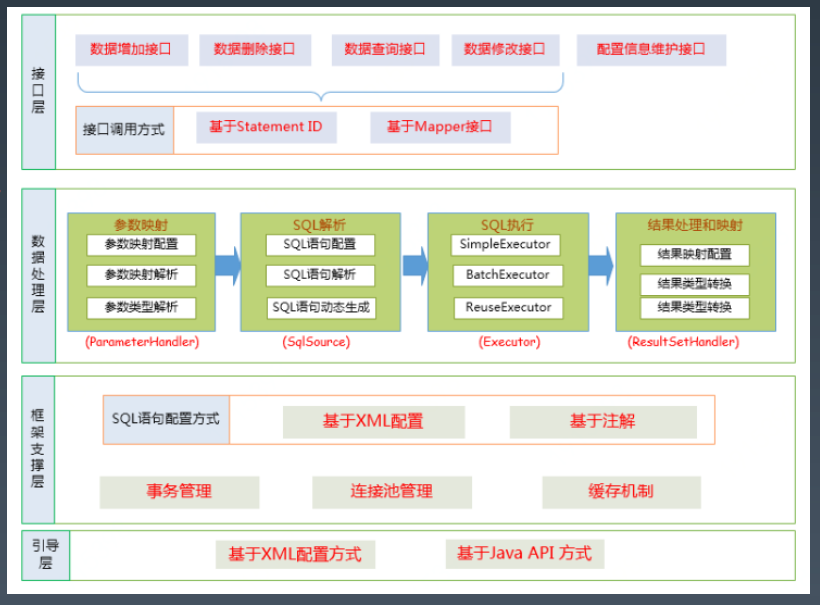


#### MyBatis-半自动化 ORM

1、需要使用映射文件 mapper.xml 定义 map规则和 SQL
2、需要定义 mapper/DAO，基于 xml 规则，操作数据库

可以使用工具生成基础的 mapper.xml 和 mapper/DAO

一个经验就是，继承生成的 mapper，而不是覆盖掉

也可以直接在 mapper 上用注解方式配置 SQL 


#### MyBatis 与 Hibernate 比较

MyBatis 与 Hibernate 的区别与联系？

Mybatis 优点：原生 SQL（XML 语法），直观，对 DBA 友好

Hibernate 优点：简单场景不用写 SQL（HQL、Cretiria、SQL）

Mybatis 缺点：繁琐，可以用 MyBatis-generator、MyBatis-Plus 之类的插件

Hibernate 缺点：对 DBA 不友好 

考虑为什么大公司都用 MyBatis？


### Spring 集成 ORM 与 JPA 

#### JPA

JPA 的全称是 Java Persistence API，即 Java 持久化 API，是一套基于 ORM 的规范，内部是由一系列的接口和抽象类构成。JPA 通过 JDK 5.0 注解描述对象-关系表映射关系，并将运行期的实体对象持久化到数据库中。

核心 EntityManager 

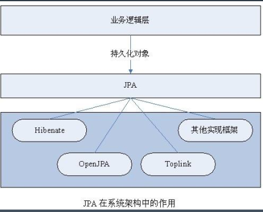


#### Spring JDBC 与 ORM

JDBC     DataSource      Spring JDBC

JPA      EntityManager      Spring ORM

Spring Data with NoSQL ? （Spring Data 是一堆的包，长的类似 JPA，进行包的统一）

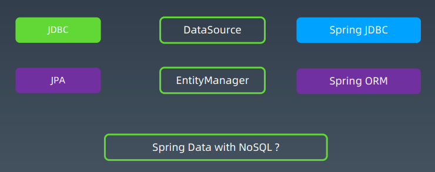


#### Spring 管理事务

JDBC 层，数据库访问层，怎么操作事务？编程式事务管理

Spring 怎么做到无侵入实现事务？声明式事务管理：事务管理器+AOP 


#### Spring 声明式事务配置参考

事务的传播性：
@Transactional(propagation=Propagation.REQUIRED)

事务的隔离级别：
@Transactional(isolation = Isolation.READ_UNCOMMITTED)
读取未提交数据(会出现脏读, 不可重复读) 基本不使用

只读：
@Transactional(readOnly=true)
该属性用于设置当前事务是否为只读事务，设置为 true 表示只读，false 则表示可读写，默认值为 false。

事务的超时性：
@Transactional(timeout=30)

回滚：
指定单一异常类：@Transactional(rollbackFor=RuntimeException.class)
指定多个异常类：@Transactional(rollbackFor={RuntimeException.class, Exception.class}) 


#### Spring 集成 MyBatis

演示操作 Spring 与 Mybatis ：
Mybatis 用法展示

User 表
XML/Mapper 

- https://gitee.com/nicefish/nicefish-backend


#### Spring 集成 Hibernate/JPA

演示操作 Spring 与 Hibernate/JPA：
Hibernate/JPA 用法展示

User 实体类
注解 

- https://github.com/apache/shardingsphere
-  git clone https://github.com/apache/shardingsphere.git --depth=1
- mysql 3306 root 无密码


### Spring Boot 集成 ORM 与 JPA 

#### Spring Boot 集成JPA/Hibernate

演示操作 Spring Boot 与 MyBatis：

准备环境与配置依赖
Configuration 与配置文件
Pojo、 Mapper 与服务类
启动类

访问测试 

- https://github.com/apache/shardingsphere
- git clone https://github.com/apache/shardingsphere.git --depth=1
- mysql 3306 root 无密码


#### Spring Boot 集成 MyBatis

演示操作 Spring Boot 与 MyBatis：

准备环境与配置依赖
Configuration 与配置文件
Pojo、 Mapper 与服务类
启动类

访问测试 

- https://gitee.com/nicefish/nicefish-backend


#### Spring/Spring Boot 使用 ORM 的经验

1、本地事务（事务的设计与坑）
2、多数据源（配置、静态制定、动态切换）
3、数据库连接池配置（大小、重连，超时，心跳）
4、ORM 内的复杂 SQL，级联查询
5、ORM 辅助工具和插件 


### 总结回顾与作业实践 

#### 总结回顾 

1.从 Spring 到 Spring Boot
2.Spring Boot 核心原理*
3.Spring Boot Starter 详解*
4.JDBC 与数据库连接池*
5.ORM-Hibernate/MyBatis*
6.Spring 集成 ORM/JPA*
7.Spring Boot 集成 ORM/JPA

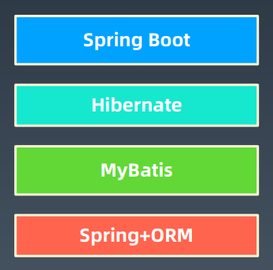


#### 作业实践

1. （选做）总结一下，单例的各种写法，比较它们的优劣。
2. （选做）maven/spring 的 profile 机制，都有什么用法？
3. （必做）给前面课程提供的 Student/Klass/School 实现自动配置和 Starter。
4. （选做）总结 Hibernate 与 MyBatis 的各方面异同点。
5. （选做）学习 MyBatis-generator 的用法和原理，学会自定义 TypeHandler 处理复杂类型。
6. （必做）研究一下 JDBC 接口和数据库连接池，掌握它们的设计和用法：
1）使用 JDBC 原生接口，实现数据库的增删改查操作。
2）使用事务，PrepareStatement 方式，批处理方式，改进上述操作。
3）配置 Hikari 连接池，改进上述操作。提交代码到 Github。

附加题（可以后面上完数据库的课再考虑做）：

1. (挑战)基于 AOP 和自定义注解，实现 @MyCache(60) 对于指定方法返回值缓存60秒。
2. (挑战)自定义实现一个数据库连接池，并整合 Hibernate/Mybatis/Spring/SpringBoot。
3. (挑战)基于 MyBatis 实现一个简单的分库分表+读写分离+分布式 ID 生成方案。 


## java 8 Advanced

### Java8 Lambda 

#### 什么是 Lambda 表达式？

Lambda 表达式（lambda expression）是一个匿名函数，Lambda 表达式基于数学中的λ演算得名，直接对应于其中的 lambda 抽象（lambda abstraction），是一个匿名函数，即没有函数名的函数。 

从动态引用到动态定义，简化写法


#### Java Lambda 表达式

面向对象与面向函数。

Java 里，函数不是第一等公民，需要封装到**接口**里。
从而 Java Lambda 表达式 --> 内部匿名类。

方法签名。
两种函数。

只有一行时可以省略大括号
(parameters) -> expression
或
(parameters) ->{ statements; } 

```java
// 1. 不需要参数,返回值为 5
() -> 5
    
// 2. 接收一个参数(数字类型),返回其2倍的值
x -> 2 * x

// 3. 接受2个参数(数字),并返回他们的差值
(x, y) -> x – y

// 4. 接收2个int型整数,返回他们的和
(int x, int y) -> x + y

// 5. 接受一个 string 对象,并在控制台打印,不返回任何值(看起来像是返回 void)
(String s) -> System.out.print(s) 
```


- 代码实例 1
- 简化的时候，内部会自动生成一个匿名类

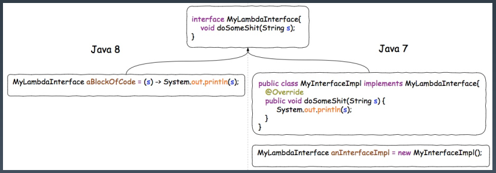

- 代码实例 2
- 可以直接将 lambda表达式 进行参数传递，此时只能保证接口只有一个未实现的方法

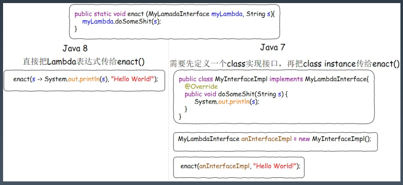


#### 深入 Java8 函数式

@FunctionalInterface

Predicate<T> 有参数、条件判断
Function<T, R> 有参数、有返回值
Consumer<T> 有参数、无返回值
Supplier<T> 有参数、有返回值

能否进一步简化：方法引用 


### Java8 Stream 

#### 再聊聊 Java 集合与泛型

什么是泛型？
伪泛型，擦除法（编译完了就擦除了）

运行期怎么判断有泛型？
lambda 里用泛型
多个泛型约束条件 

泛型也是为了简化编程


#### 什么是流

Stream（流）是一个来自数据源的元素队列并支持聚合操作

- 元素： 特定类型的对象，形成一个队列。 Java 中的 Stream 并不会存储元素，而是按需计算。
- 数据源： 流的来源。 可以是集合，数组， I/O channel， 产生器 generator 等。
- 聚合操作 类似 SQL 语句一样的操作， 比如 filter, map, reduce, find, match, sorted 等。

和以前的 Collection 操作不同， Stream 操作还有两个基础的特征：

- Pipelining： 中间操作都会返回流对象本身。 这样多个操作可以串联成一个管道， 如同流式风格(fluent style)。 这样做可以对操作进行优化， 比如延迟执行(laziness)和短路((shortcircuiting)。
- 内部迭代： 以前对集合遍历都是通过 Iterator 或者 For-Each 的方式, 显式的在集合外部进行迭代， 这叫做外部迭代。 Stream 提供了内部迭代的方式， 通过访问者模式(Visitor)实现。

创建有 Stream 有哪些方法 


#### Stream 操作

**中间操作：**

1、选择与过滤

- filter(Predicate p) 接收 Lambda ， 从流中排除某些元素。
- distinct() 筛选，通过流所生成元素的 hashCode() 和 equals() 去除重复元素
- limit(long maxSize) 截断流，使其元素不超过给定数量。
- skip(long n) 跳过元素，返回一个扔掉了前 n 个元素的流。若流中元素不足 n 个，则返回一个空流。 

2、映射

- map(Function f) 接收 Lambda ， 将元素转换成其他形式或提取信息;接收一个函数作为参数，该函数会被应用到每个元素上，并将其映射成一个新的元素。
- mapToDouble(ToDoubleFunction f) 接收一个函数作为参数，该函数会被应用到每个元素上，产生一个新的 DoubleStream。
- mapToInt(ToIntFunction f) 接收一个函数作为参数，该函数会被应用到每个元素上，产生一个新的 IntStream。
- mapToLong(ToLongFunction f) 接收一个函数作为参数，该函数会被应用到每个元素上，产生一个新的 LongStream。
- flatMap(Function f) 接收一个函数作为参数，将流中的每个值都换成另一个流，然后把所有流连接成一个流。 

3、排序

- sorted() 产生一个新流，其中按自然顺序排序
- sorted(Comparator comp) 产生一个新流，其中按比较器顺序排序 


**终止操作：**

1.查找与匹配
allMatch——检查是否匹配所有元素
anyMatch——检查是否至少匹配一个元素
noneMatch——检查是否没有匹配的元素
findFirst——返回第一个元素
findAny——返回当前流中的任意元素
count——返回流中元素的总个数
max——返回流中最大值
min——返回流中最小值  

2.归约 reduce, 需要初始值（类比Map-Reduce）

3.收集 collect
toList List<T> 把流中元素收集到 List
toSet Set<T> 把流中元素收集到 Set
toCollection Collection<T> 把流中元素收集到创建的集合
count 计算流中元素的个数
summaryStatistics 统计最大最小平均值 

4.迭代 forEach 


#### Steam 操作示例

Stream 代码 

Stream 大大简化了集合编程


### Lombok 

#### Lombok 是什么

Lombok 是什么？
Lombok 是基于 jsr269 实现的一个非常神奇的 java 类库，会利用注解自动生成 java Bean 中烦人的 get、set 方法及有参无参构造函数，还能自动生成 logger、ToString、HashCode、Builder 等 java 特色的函数或是符合设计模式的方法，能够让你 javaBean 更简洁，更美观。

基于字节码增强，编译期处理。

可以配置开发工具 IDE 或 Maven 能使用。 

编译期增强跟前面讲的字节码工具异同点？


#### Lombok 示例

@Setter @Getter
@Data
@XXXConstructor
@Builder
@ToString
@Slf4j 

泛型也是为了简化编程


### Guava 

#### 什么是 Guava

Guava 是什么?

Guava 是一种基于开源的 Java 库，其中包含谷歌正在由他们很多项目使用的很多核心库。这个库是为了方便编码，并减少编码错误。这个库提供用于集合，缓存，支持原语，并发性，常见注解，字符串处理，I/O 和验证的实用方法。

Guava 的好处
标准化 – Guava 库是由谷歌托管。
高效 - 可靠，快速和有效的扩展 JAVA 标准库。
优化 –Guava 库经过高度的优化。

JDK8 里的一些新特性源于 Guava。 


#### 集合[Collections]

Guava 对 JDK 集合的扩展，这是 Guava 最成熟和为人所知的部分

1 不可变集合: 用不变的集合进行防御性编程和性能提升。

2 新集合类型: multisets, multimaps, tables, bidirectional maps 等

3 强大的集合工具类: 提供 java.util.Collections 中没有的集合工具

4 扩展工具类：让实现和扩展集合类变得更容易，比如创建 Collection 的装饰器，或实现迭代器 


#### 缓存[Caches]

本地缓存实现，支持多种缓存过期策略

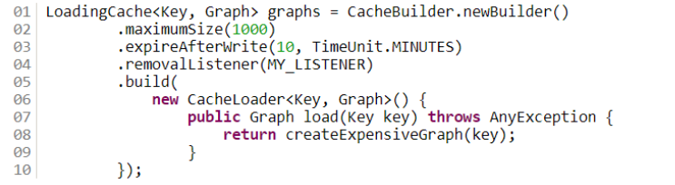


#### 并发[Concurrency]

ListenableFuture：完成后触发回调的 Future ，进行异步回调

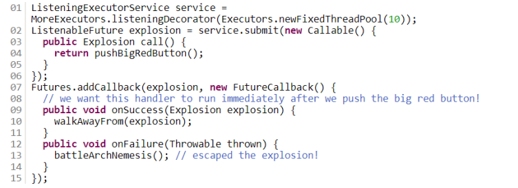


#### 字符串处理[Strings]

非常有用的字符串工具，包括分割、连接、填充等操作


#### 事件总线[EventBus]

**发布-订阅模式**的组件通信，进程内模块间解耦

- SPI
- callback机制(添加 listenner)
- EventBus


#### 反射[Reflection]

Guava 的 Java 反射机制工具类 

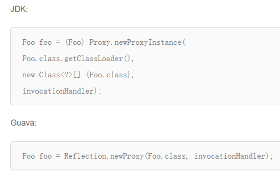


### 设计原则 

#### 面向对象设计原则 SOLID

S.O.L.I.D 是面向对象设计和编程(OOD&OOP)中几个重要编码原则(Programming Priciple)的首字母缩写。

1.SRP： The Single Responsibility Principle 单一责任原则（一个类，一个方法只做一件事）
2.OCP： The Open Closed Principle 开放封闭原则
3.LSP： The Liskov Substitution Principle 里氏替换原则
4.ISP： The Interface Segregation Principle 接口分离原则
5.DIP： The Dependency Inversion Principle 依赖倒置原则

最小知识原则， KISS，高内聚低耦合 


#### 编码规范、checkstyle

为什么需要编码规范？

常见的编码规范：
1、Google 编码规范：https://google.github.io/styleguide/javaguide.html
2、Alibaba 编码规范：https://github.com/alibaba/p3c
3、唯品会 VIP 规范：https://vipshop.github.io/vjtools/#/standard/

其他规范：
架构设计规范，技术调研规范，数据库规范等等。 


### 设计模式 

#### GoF 23 设计模式 

GoF 23 个经典设计模式（面向接口编程），本质是一类特定场景下通用解决经验。

创建型

1. Factory Method（工厂方法）
2. Abstract Factory（抽象工厂）
3. Builder（建造者）
4. Prototype（原型）
5. Singleton（单例）

结构型

1. Adapter（适配器）
2. Bridge（桥接）
3. Composite（组合）
4. Decorator（装饰）（对结果进行一定的修饰，变得更美）
5. Facade（外观）
6. Flyweight（享元）
7. Proxy（代理）（原封不动的套一个壳子）

行为型

1. Interpreter（解释器）
2. Template Method（模板方法）
3. Chain of Responsibility（责任链）
4. Command（命令）
5. Iterator（迭代器）
6. Mediator（中介者）
7. Memento（备忘录）
8. Observer（观察者）
9. State（状态）
10. Strategy（策略）
11. Visitor（访问者） 

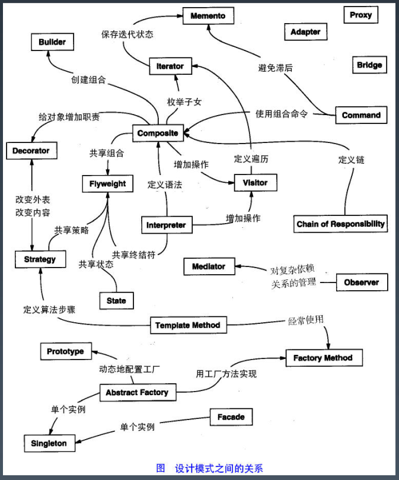


#### 设计模式与反模式

模式的3个层次：解决方案层面（架构模式），组件层面（框架模式），代码层面（ GoF设计模式）

其他模式：集成模式，事务模式， IO 模式/Context 模式，甚至状态机 FSM，规则引擎 RE， 工作流workflow 都是模式。

反模式：死用模式，都是反模式。 

> 所有的模式都是经验。


### 单元测试 

> 工具：emma，coberuta，sonar，checkstyle，findbugs，jacoco
>
> 测试覆盖率：mvn emma:emma

#### 什么是单元测试 

- 针对类，做方法测试
- 单元测试(闹钟的一个零件)
- 集成测试(闹钟的整体功能)

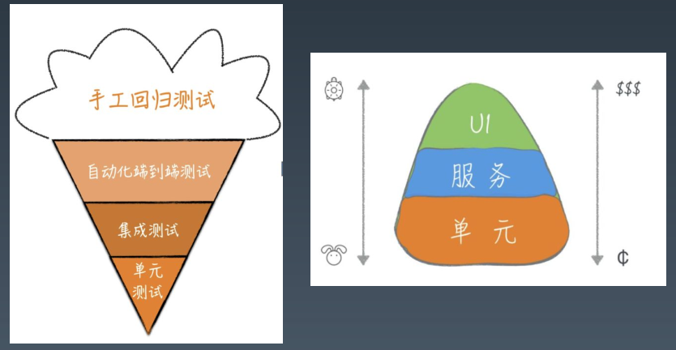

- 发现缺陷越提前，修复成本越小 


#### 如何做单元测试

JUnit -> TestCase, TestSuite, Runner

SpringTest

Mock 技术

- Mockito（常用，https://site.mockito.org/）
- easyMock 


#### 单元测试的方法

1. 单元测试方法应该每个方法是一个 case，断言充分，提示明确
2. 单测要覆盖所有的 corner case
3. 充分使用 mock（一切皆可 mock）
4. 如果发现不好测试，则说明业务代码设计存在问题，可以反向优化代码
5. 批量测试用例使用参数化单元测试
6. 注意测试是**单线程**执行
7. 合理使用 before, after, setup 准备环境
8. 合理使用通用测试基类
9. 配合 checkstyle，coverage 等工具
10. 制定单元测试覆盖率基线 （分等级设置覆盖率）


#### 单元测试的常见陷阱与经验

1. 尽量不要访问外部数据库等外部资源
2. 如果必须用数据库考虑用嵌入式 DB+ 事务自动回滚
3. 防止静态变量污染导致测试无效（静态变量是JVM全局的）
4. 小心测试方法的顺序导致的不同环境测试失败（不同操作系统的调用不确定，会导致顺序变化，测试失败）
5. 单元测试总时间特别长的问题 （代替人工测试的时间与精力）


### 总结回顾与作业实践 

#### 总结回顾 

1. Java8 Lambda* 
2. Java8 Stream*
3. Lombok
4. Guava
5. 设计原则*
6. 设计模式*
7. 单元测试* 

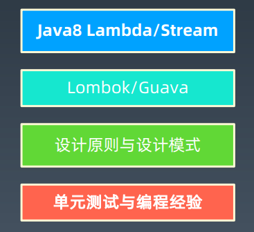


#### 作业实践

1、（选做）尝试使用 Lambda/Stream/Guava 优化之前作业的代码。
2、（选做）尝试使用 Lambda/Stream/Guava 优化工作中编码的代码。
3、（选做）根据课上提供的材料，系统性学习一遍设计模式，并在工作学习中思考如何用设计模式解决问题。
4、（选做）根据课上提供的材料，深入了解 Google 和 Alibaba 编码规范，并根据这些规范，检查自己写代码是否符合规范，有什么可以改进的。 


## 性能与SQL优化


### 性能优化

#### 什么是性能

> 性能是一个综合性问题。

- 吞吐与延迟：有些结论是反直觉的，知道我们关注什么
- 没有量化就没有改进：监控与度量指标，知道我们怎么去入手
- **80/20 原则**：先优化性能瓶颈问题，知道我们如何去优化
- 过早的优化是万恶之源：知道我们要选择优化的时机
- 脱离场景谈性能都是耍流氓：知道我们对性能要求要符合实际


#### DB/SQL优化是业务系统性能优化的核心

> 例如传统软件改成SaaS软件
>
> Saas : 软件及服务，功能软件，从单机版变成Web多租户
>
> PaaS：基础设施都是共享的，GAE，SAE，自己去部署应用
>
> Iaas：OpenStack，看起来拿到的是机器，自己安装任何东西
>
> Faas：Serverless，无头技术，大趋势，一个代码片段就可以给你执行
>
> Daas：Data，数据做服务

业务系统的分类：计算密集型，数据密集型

业务处理本身无状态，数据状态最终要保存到数据库

一般来说，**DB/SQL操作的消耗在一次处理中占比最大**

业务系统发展的不同阶段和时期，性能瓶颈要点不同，类似木桶装水


### 关系数据库MySQL

#### 什么是关系数据库

- 1970年，Codd提出关系模型，以关系代数理论为数据基础
- 《A Relational Model of Data for Large Shared Data Banks》
- 元组，tuple，()

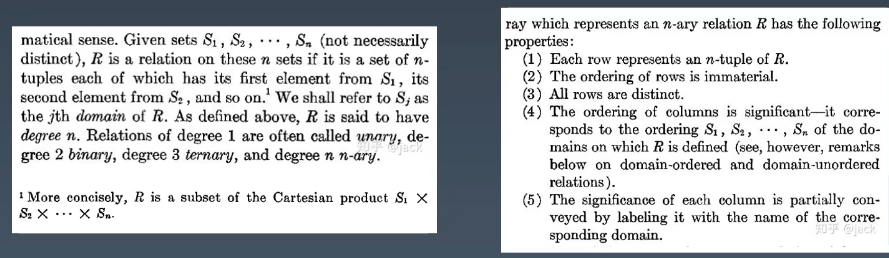

- E-R图
- 实体，属性

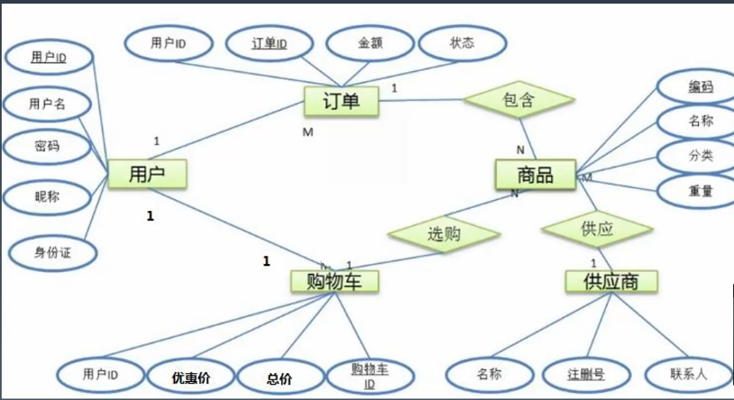


#### 数据库设计范式

- 第一范式（1NF）：关系R 属于第一范式，当且仅当R中的每一个属性A的值域只包含原子项

- 第二范式（2NF）：在满足1NF的基础上，消除非主属性对码的部分函数依赖

- 第三范式（3NF）：在满足3NF的基础上，消除非主属性对码的传递函数依赖

- BC范式（BCNF）：在满足3NF的基础上，消除主属性对码的部分和传递函数依赖

- 第四范式（4NF）：消除非平凡的多值依赖

- 第五范式（5NF）：消除一些不适合的连接依赖（理想条件）

  

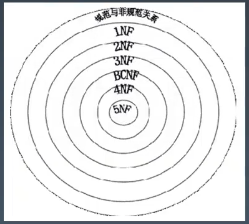

- 1NF：消除重复数据，即每一列都是不可再分的基本数据项，没个列都是原子的。
- 拆列


- 2NF：消除部分依赖，表中没有列只与主键的部分相关，即每一行都被主键唯一标识，每个列都有主键。
- 定义主键，拆

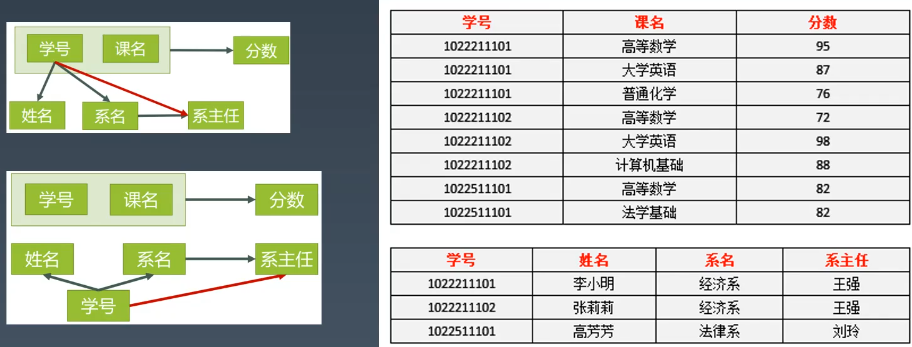

- 3NF：消除传递依赖，消除表中列不依赖主键，而是依赖表中的非主键列的情况，即没有列是与主键不相关的。
- 从表只应用主表的主键。
- 即表中每列都和主键相关。
- 非主键，拆

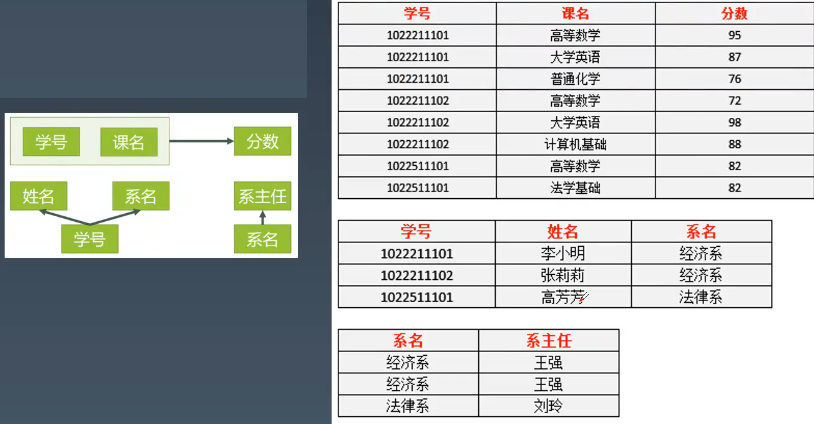

- BCNF：Boyce-Codd Normal Form(巴斯-科德范式)
- 3NF 的基础上消除主属性对于码的部分与传递函数依赖
- 非主键，意义不同，拆

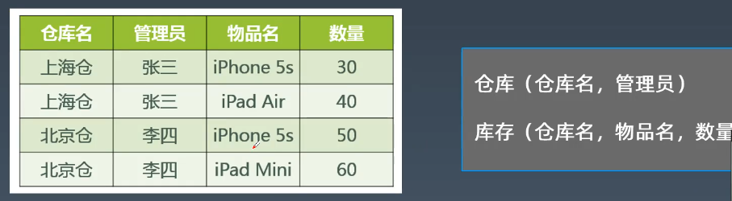


#### 常见数据库

- 常见关系数据库
  - 开源：MySQL，PostgreSQL
  - 商业：Oracle，DB2，SQL Server
- 内存数据库
  - Redis，VoltDB
- 图数据库（图论）
  - Neo4j，Nebula
- 时序数据库
  - InfluxDB，openTSDB
- 其他关系数据库
  - Access，Sqlite，H2，Derby，Sybase，Infomix等
- NoSQL数据库
  - MongoDb，Hbase，Cassandra，CouchDB
- NewSQL/ 分布式数据库
  - TiDB，CockroachDB，NuoDB，OpenGauss，OB，

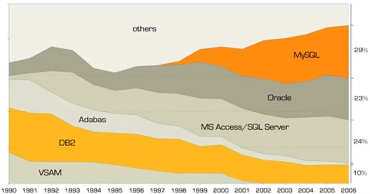


#### SQL语言

SQL语言1974年由Boyce和Chamberlin（BC）提出，并首先在IBM公司研制的关系数据库系统SystemR.上实现。

1979年ORACLE公司首先提供商用的SQL， IBM公司在DB2和SQL/DS数据库系统中也实现SQL。

1986年10月，美国ANSI采用SQL作为关系数据库管理系统的标准语言（ANSI X3.135-1986） ，后为国际标准化组织（ISO）采纳为国际标准。

1989年，美国ANSI采纳在ANSIX3.135-1989报告中定义的关系数据库管理系统的SQL标准语言，称为ANSI SQL 89，该标准替代ANSI X3.135- 1986版本。


#### 结构化查询语言

结构化查询语言包含6个部分：

1、 **数据查询语言** （DQL： Data Query Language） ：其语句， 也称为"数据检索语句”， 用以从表中获得数据，确定数据怎样在应用程序给出。保留字SELECT是DQL （也是所有SQL）用得最多的动词，其他DQL常用的保留字有WHERE， ORDER BY， GROUP BY和HAVING。这些DQL保留字常与其它类型的SQL语句一起使用。

2、**数据操作语言**（DML： Data Manipulation Language） ：其语句包括动词INSERT、UPDATE 和DELETE。它们分别用于添加、修改和删除。

3、事务控制语言（TCL）：它的语句能确保被DML语句影响的表的所有行及时得以更新。包括COMMIT （提交）命令、SAVEPOINT （保存点）命令、 ROLLBACK （回滚）命令。

4、数据控制语言（DCL） ：它的语句通过GRANT或REVOKE实现权限控制，确定单个用户和用户组对数据库对象的访问。某些RDBMS可用GRANT或REVOKE控制对表单个列的访问。

5、**数据定义语言**（DDL） ：其语句包括动词CREATE，ALTER和DROP。在数据库中创建新表或修改、删除表（CREAT TABLE或DROP TABLE） ；为表加入索引等。

6、指针控制语言（CCL） ：它的语句，像DECL ARE CURSOR，FETCH INTO和UPDATE WHI CURRENT用于对一个或多个表单独行的操作。


#### SQL 版本

> 常用的版本是：SQL92 和 99
>
> 1.手写，druid，mycat
>
> 2.antlr4，shardingsphere
>
> 3.yacc，mysql，tiDB，Cockroachdb
>
> 手写SQL解析：select id,name from users where id>100 order by id desc limit 10;

SQL各个版本:

1986年, ANSI X3.135-1986, ISO/IEC 9075:1986, SQL-86

1989年, ANSI X3.135-1989, ISO/IEC 9075:1989, SQL-89

**1992年, ANSI X3.135-1992, ISO/IEC 9075:1992, SQL-92 (SQL2)**

**1999年, ISO/IEC 9075:1999, SQL:1999 (SQL3)**

2003年, ISO/IEC 9075:2003, SQL:2003

2008年, ISO/IEC 9075:2008, SQL:2008

2011年, ISO/IEC 9075:2011, SQL:2011


#### MySQL 数据库

瑞典的MySQL AB创立于1995年。

2008年1月16日MySQL AB被Sun Microsystems收购。

2009年4月20日，甲骨文（Oracle） 收购Sun Microsystems公司。其后分离成两个版本： MariaDB和MySQL


#### MySQL 版本

> 选择学习哪个版本？（5.7）
>
> 阿里，直接使用 5.6 和 8.0，跳过 5.7版本，国内对 5.7 版本需求多
>
> 大多数开始使用 PostgreSQL

- 4.0 支持 InnoDB
- 2003年，5.0
- 5.6 ==> 历史使用最多的版本
- 5.7==> 近期使用最多的版本
- 8.0==> 最新和功能完善的版本


#### 5.6/5.7的区别

5.7 支持：

- 多主
- MGR高可用
- 分区表
- json
- 性能
- 修复 XA 等 （分布式事务）


#### 5.7/8.0的差异

- 通用表达式（直接使用SQL编程，CTE，pivot）
- 窗口函数
- 持久化参数（set persist）
- 自增列持久化
- 默认编码 utf8mb4(真utf8)
- DDL原子性
- JSON增强
- 不再对 group by 进行隐式排序 ==> 坑 （查询出来的数据顺序不一样了）


### 深入数据库原理

#### MySQL 架构图

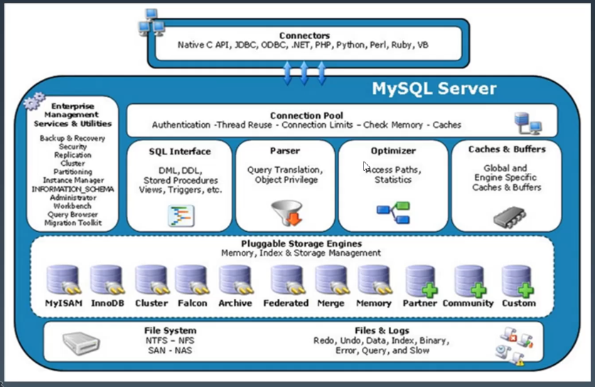


#### MySQL 存储

> show databases;
>
> use information_schema;
>
> show tables;
>
> create database k1;  (database  等价于 schema )
>
> create schema k2;
>
>  select  table_name from tables;（查看所有库里面的所有表的名字）
>
>  show columns from task; （查看表结构）
>
> show create table task; （查看表的创建语句）

独占模式

1)、日志组文件: ib_logfile0和ib_logfile1，默认均为5M

2)、表结构文件:*.frm

3)、独占表空间文件: *.ibd

4)、字符集和排序规则文件:db.opt

5) 、 binlog二进制日志文件:记录主数据库服务器的DDL和DML操作

6）、二进制日志索引文件:master-bin.index

共享模式innodb_file_per_table=1

1)、数据都在ibdata1


#### MySQL  简化执行流程

- 查询缓存
- 解析器
- 预处理器
- 查询优化器
- 查询执行引擎

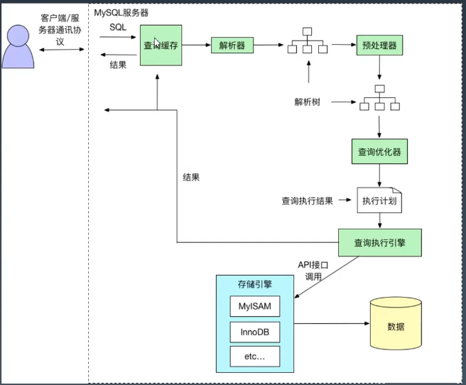


#### MySQL  详细执行流程

- Server 层
- 引擎层

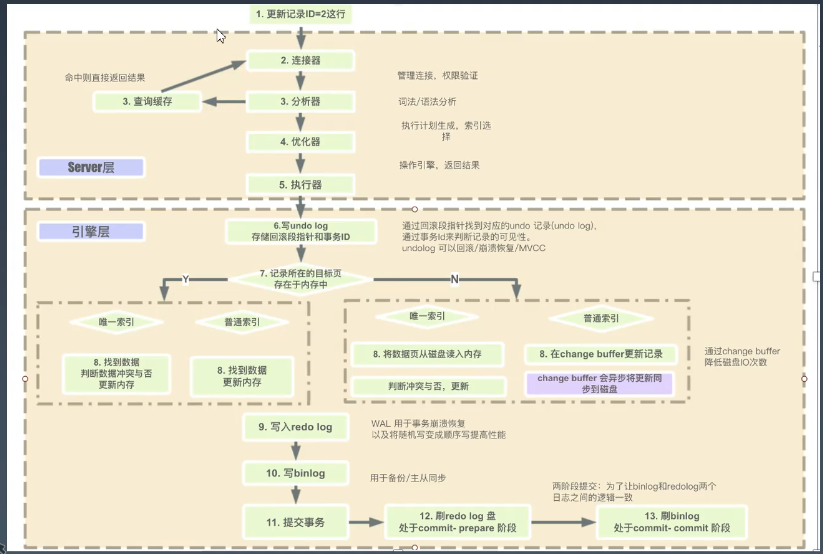


#### MySQL  执行引擎和状态

- 事务
- 锁

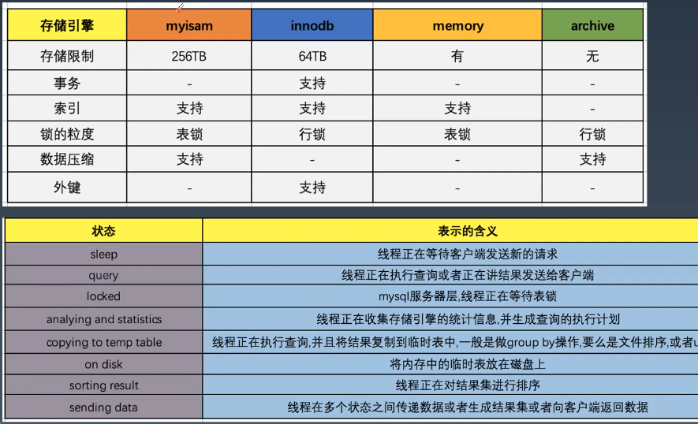


#### MySQL  对SQL的执行顺序

实际上这个过程也并不是绝对这样的，中间mysql会有部分的优化以达到最佳的优化效果，比如 在 select 筛选出找到的数据集。

- 整合表
- 根据条件筛选
- 选择数据
- 输出的限制

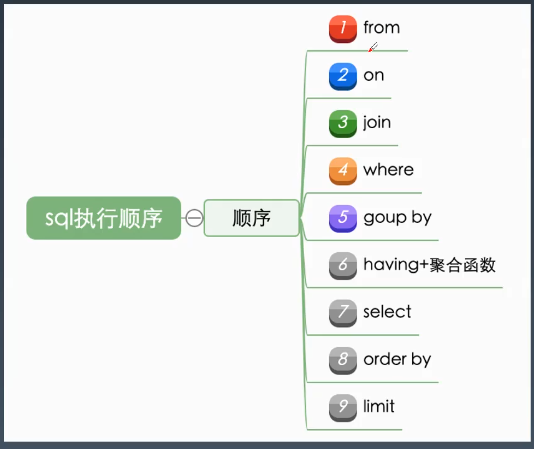


#### MySQL  索引原理

> 为什么一般单表数据不超过2000万？
>
> 一般 B+ 树不超过 3 层，保证主键都存储在内存，1170\*1170\*16。

数据是按**页**来分块的，当一个数据被用到时，其附近的数据也通常会马上被使用。

InnoDB使用 **B+ 树**实现聚集索引。

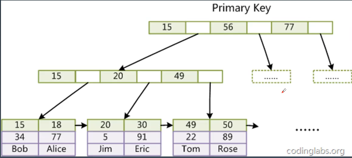


#### MySQL  数据库操作演示

> 5.6 、5.7 、8.0
>
> ```mysql
> # 启动
> mysql -hlocalhost -P3306 -uroot -ppassword
> 
> # docker
> docker pull mysql
> 
> # 打出 mysql 的变量
> mysql -hlocalhost -P3306 -uroot -e "show variables" > d:mysql.txt
> 
> # 直接命令行打印数据表内容
> mysql -hlocalhost -P3306 -uroot -e "select * from rmliu.words" 
> ```

操作示例

- 安装的几种方式，安装文件或命令，docker
- 安装工具，mysql-cli 或者 IDE（DataGrip，Mysql-workbench，MySQL-Front,Navicat等）
- MySQL库结构，操作语句与命令
- MySQL SQL语法演示

```sh
# 启动免安装的压缩包mysql脚本 startmysql.bat
cd bin
start mysql.exe
pause
```


### MySQL配置优化

#### 查看参数配置

- show variable like xxx
- 默认配置文件：my.cnf 文件
  - server: [mysqld]
  - client: [mysql]


#### 配置优化

1）连接请求的变量

- **max_connections** （最大连接数）
- back_log
- wait_timeout 和 interative_timeout

2）缓冲区配置(CPU越多，内存越大，就越快，尤其是预热之后，直接命中缓存，速度更快)

- key_buffer_size
- **query_cache_size** (查询缓存简称QC)
- max_connect_errors
- sort_buffer_size
- max_allowed_packet=32M
- join_buffer_size=2M
- thred_cache_size=300

3）配置 InnoDB 的几个变量

- **innodb_buffer_pool_size**
- innodb_buffer_log_at_trx_commit
- **innodb_thread_concurrency=0**
- innodb_log_buffer_size
- innodb_log_file_size=20M
- innodb_log_files_in_group=3
- **read_buffer_size=1M**
- read_rnd_buffer_size=16M
- bulk_insert_buffer_size=64M
- binary log


### 数据库设计优化

#### 最佳实践

> 还有哪些常见问题？

- 如何恰当选择引擎？
- 库表如何命名？（表名字，t_xxx，视图，v_xxx）
- 如何合理拆分宽表？
- 如何选择恰当数据类型：明确，尽量小
  - char，varchar 的选择
  - （text/blob/clob）的使用问题？(尽量少用)
  - 文件，图片是否要存入到数据库？（不建议，最好放到分布式文件系统中）
  - 时间日期的存储问题？（选择时间格式，定义时区，建议存时间戳，对计算友好）
  - 数值的精度问题？（float 和 long的精度存储会被抹掉，用 bigInt 存储，或者使用多少倍的方式存储，并存上倍数）
- 是否使用外键，触发器？（不建议）


#### 设计优化

> 性能是一个综合性问题

- 唯一约束和索引的关系？（唯一约束本身就是索引）
- 是否可以冗余字段？
- 是否使用游标，变量，视图，自定义函数，存储过程？（不建议）
- 自增主键的使用问题？（单表ID，全局ID，分布式ID）
- 能够在线修改表结构（DDL操作）？
- 逻辑删除还是物理删除？（重要数据，逻辑删除）
- 要不要加 create_time，update_time 时间戳？（非常建议，同步数据的时候，使用修改时间戳）
- 数据库碎片问题？(压缩数据库)
- 如何快速导入导出，备份数据？（备份数据，用原生命令更快）


### 总结回顾与作业实践 

#### 总结回顾 

1.再聊聊性能优化

2.关系数据库MySQL

3.深入数据库原理

4.MySQL配置优化*

5.数据库设计优化*

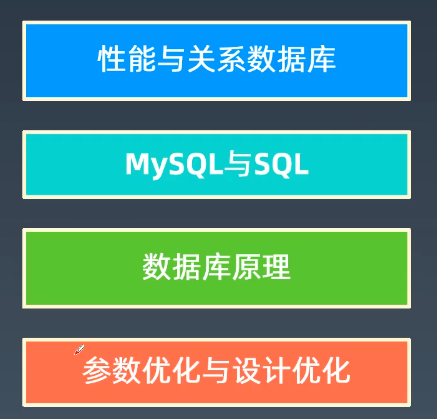


#### 作业实践 

1、（选做)∶基于课程中的设计原则和最佳实践，分析是否可以将自己负责的业务系统进行数据库设计或是数据库服务器方面的优化。

2、（必做)︰基于电商交易场景（用户、商品、订单），设计一套简单的表结构，提交DDL的SQL文件到Github（后面2周的作业依然要是用到这个表结构）。

3、（选做）:尽可能多的从“常见关系数据库"中列的清单，安装运行，并使用上一题的SQL测试简单的增删改查。

4、(选做)︰基于上一题，尝试对各个数据库测试100万订单数据的增删改查性能。

5、(选做）︰尝试对MySQL不同引擎下测试100万订单数据的增删改查性能。

6、(选做）︰模拟1000万订单数据，测试不同方式下导入导出（数据备份还原)  MySQL的速度，包括jdbc程序处理和命令行处理。思考和实践，如何提升处理效率。

7、（选做):对MySQL配置不同的数据库连接池（DBCP、C3PO、Druid、Hikarcp）测试增删改查100万次，对比性能，生成报告。


## MySQL性能优化

### MySQL事务与锁

#### MySQL事务

> 性能 VS. 可靠性

事务可靠性模型 ACID：

- Atomicity: 原子性,一次事务中的操作要么全部成功,要么全部失败。
- Consistency:一致性,跨表、跨行、跨事务,数据库始终保持一致状态。
- lsolation:隔离性,可见性,保护事务不会互相干扰,包含4种隔离级别。
- Durability,持久性,事务提交成功后,不会丢数据。如电源故障,系统崩溃。

InnoDB：

双写缓冲区、故障恢复、操作系统、fsync()、磁盘存储、缓存、UPS、网络、备份策略


#### 表级锁

> 上锁前需要先上意向锁！（I锁）

- **意向锁**:表明事务稍后要进行哪种类型的锁定

- 共享意向锁(IS): 打算在某些行上设置共享锁
- 排他意向锁(IX): 打算对某些行设置排他锁
- insert意向锁: lnsert操作设置的间隙锁其他

- 自增锁(AUTO-IN)
- LOCK TABLES/DDL

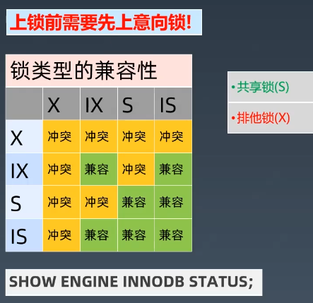


#### 行级锁（InnoDB）

- 记录锁(Record): 始终锁定索引记录，注意隐藏的聚簇索引;
- 间隙锁(Gap):
- 临键锁(Next-Key): 记录锁+间隙锁的组合;可“锁定”表中不存在记录
- 谓词锁(Predicat): 空间索引


#### 死锁

- 阻塞与互相等待
- 增删改、锁定读
- 死锁检测与自动回滚
- 锁粒度与程序设计


#### 事务隔离级别

> 并发性，可靠性，一致性，可重复性

《SQL:1992标准》规定了四种事务隔离级别(Isolation):

- 读未提交:READ UNCOMMITTED
- 读已提交:READ COMMITTED
- 可重复读:REPEATABLE READ
- 可串行化: SERIALIZABLE

事务隔离是数据库的基础特征。

MySQL:

- 可以设置全局的默认隔离级别
- 可以单独设置会话的隔离级别 
- InnoDB实现与标准之间的差异


##### 读未提交：READ UNCOMMITTED

- 很少使用
- 不能保证一致性
- 脏读(dirty read):使用到从未被确认的数据(例如:早期版本、回滚)
- 锁:
  - 以非锁定方式执行
  - 可能的问题:脏读、幻读、不可重复读


##### 读已提交：READ COMMITTED

- 每次查询都会设置和读取自己的新快照。
- 仅支持基于行的bin-log
- UPDATE优化:半一致读(semi-consistent read)
- 不可重复读:不加锁的情况下，其他事务UPDATE或 DELETE会对查询结果有影响
- 幻读(Phantom):加锁后，不锁定间隙,其他事务可以INSERT。
- 锁:
  - 锁定索引记录，而不锁定记录之间的间隙
  - 可能的问题:幻读、不可重复读


##### 可重复读：REPEATABLE READ

- lnnoDB的默认隔离级别
- 使用事务第一次读取时创建的快照
- 多版本技术
- 锁:
  - 使用唯一索引的唯一查询条件时,只锁定查找到的索引记录，不锁定间隙。
  - 其他查询条件，会锁定扫描到的索引范围,通过间隙锁或临键锁来阻止其他会话在这个范围中插入值。
  - 可能的问题:InnoDB不能保证没有幻读,需要加锁


##### 串行化：SERIALIZABLE

- 最严格的级别，事务串行执行，资源消耗最大;
- 问题回顾:
  - 脏读(dirty read):使用到从未被确认的数据(例如:早期版本、回滚)
  - 不可重复读:不加锁的情况下,其他事务update或delete会对结果集有影响
  - 幻读(Phantom):加锁之后,相同的查询语句,在不同的时间点执行时,产生不同的结果集

- 怎么解决?
  - 提高隔离级别、使用间隙锁或临键锁


#### undo log：撤销日志

- 保证事务的原子性
- 用处:事务回滚,一致性读、崩溃恢复。
- 记录事务回滚时所需的撤消操作
- 一条INSERT语句，对应一条DELETE的undo log
- 每个UPDATE语句，对应一条相反UPDATE的undo log
- 保存位置:
  - system tablespace (MySQL 5.7默认)
  - undo tablespaces (MySQL 8.0默认)
- 回滚段(rollback segment)


#### redo log：重做日志

- 确保事务的持久性，防止事务提交后数据未刷新到磁盘就掉电或崩溃.
- 事务执行过程中写入redo log,记录事务对数据页做了哪些修改。
- 提升性能: WAL(Write-Ahead Logging)技术,先写日志,再写磁盘。
- 日志文件:ib_logfile0, ib_logfile1
- 日志缓冲: innodb_log_buffer_size
- 强刷: fsync()


#### MVCC：多版本并发控制

- 使InnoDB支持一致性读:READ COMMITTED和 REPEATABLE READ。
- 让查询不被阻塞、无需等待被其他事务持有的锁，这种技术手段可以增加并发性能。
- lnnoDB保留被修改行的旧版本。
- 查询正在被其他事务更新的数据时，会读取更新之前的版本。
- 每行数据都存在一个版本号,每次更新时都更新该版本
- 这种技术在数据库领域的使用并不普遍。某些数据库,以及某些MySQL存储引擎都不支持。
- 聚簇索引的更新=替换更新
- 二级索引的更新=删除+新建


##### MVCC实现机制

- 隐藏列
- 事务链表，保存还未提交的事务，事务提交则会从链表中摘除
- Read view:每个5QL一个，包括rw_trx_ids, low_limit_id, up_limit_id, low_limit_no等
- 回滚段: 通过undo log动态构建旧版本数据

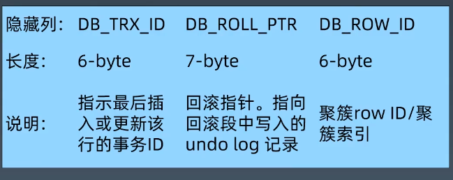


#### 演示事务与锁

```mysql
# 关闭自动 commit，变成手动事务
set autocommit=0;

# 开一个事务
begin;

# 事务结束，回滚
rollback；

# 展示 mysql 锁的情况
show engine innodb status\G;

# 排他锁 X， 间隙锁 gap，线上使用不要在 update，delete 中使用范围
# lock_mode X locks gap

# 死锁解决办法
# 1) 强杀， 2)超时
```


#### SQL复杂示例

- 连了巨多的表，大量的SQL，10+
- 条件巨复杂，20条件

- now 和 sysdate 区别？


### DB与SQL优化

#### 一个简单例子

- 写 SQL 按照 ID 进行数据的一半 倒序，一半 正序
- 给 SQL 加一个 if 函数

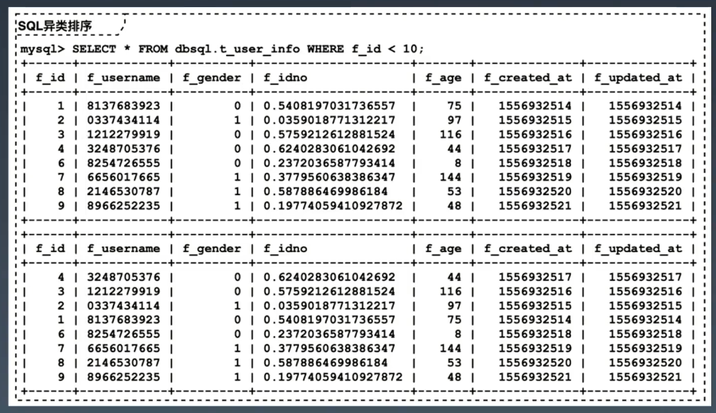


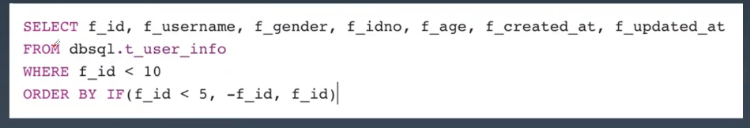


#### SQL 优化

- 如何发现需要优化的SQL？
- 了解的SQL优化方法有哪些？
- SQL优化有哪些好处？


#### 模拟需求1

- 研发团队
- 设计一个表，直接连接数据库设计


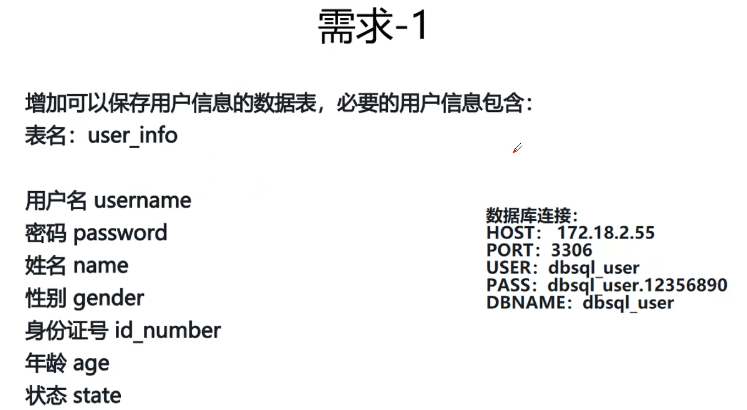


##### 数据类型选择

- 数字
- 字符
- 时间
- 存储的经济价值，与 索引的B+树内存查找块

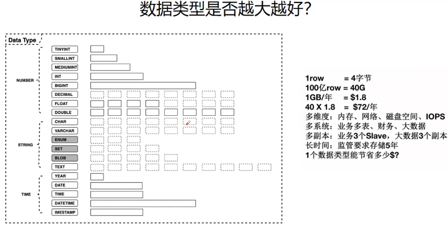


##### 存储引擎选择

- 事务，InnoDB
- 压缩，文档类，TokuDB

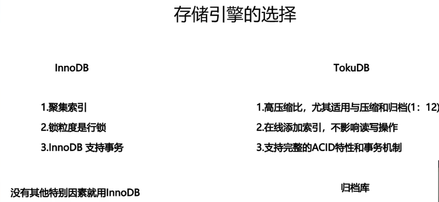


##### 设计表

- id， Bigint
- 时间，Bigint，记录毫秒数，后续操作方便，推荐使用
- mysql的真utf-8，utf8mb4

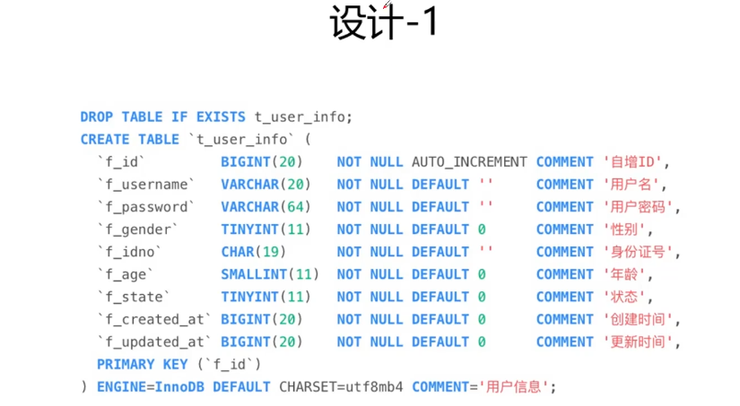


##### 小结

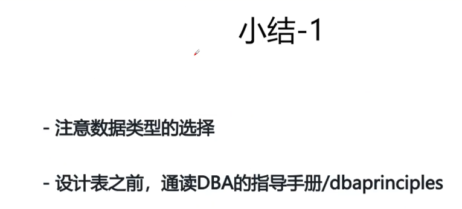


#### 模拟需求2

- 查询 SQL

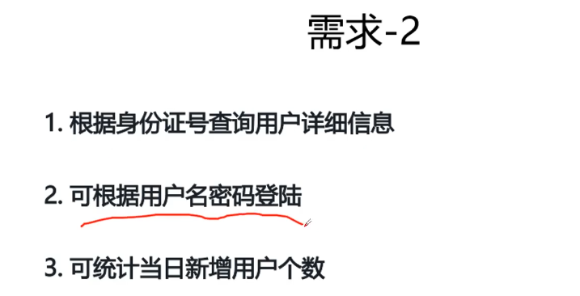


##### 设计SQL

- SQL的坑
- count(1), count(*), count(id), 区别不大，最好写 count(1)

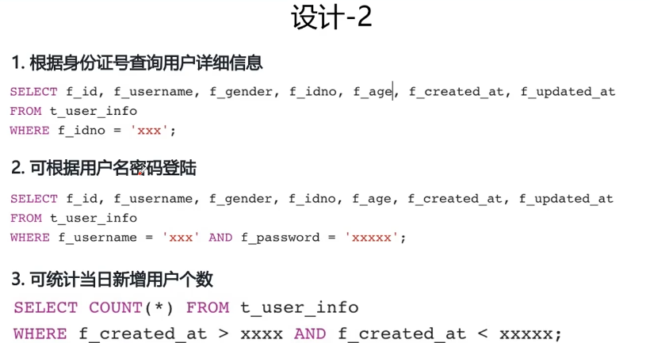


##### 隐式转换

- MySQL 将字符串 与 数字，进行隐式转换
- 隐式转换的时候，不走索引，就慢
- 永远不要将用户密码写到 SQL里

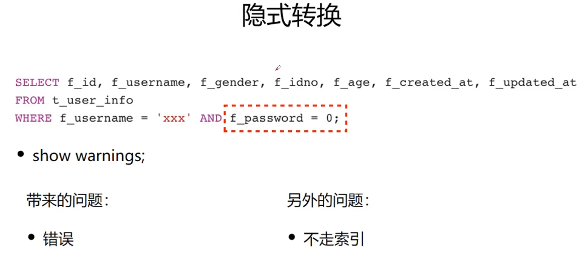


##### 小结


#### 模拟需求3

- 解决查询问题


##### 分析问题


##### 慢查询日志

- Rows examins
- Exec time


##### 监控

- QPS
- 看 SQL 的执行计划

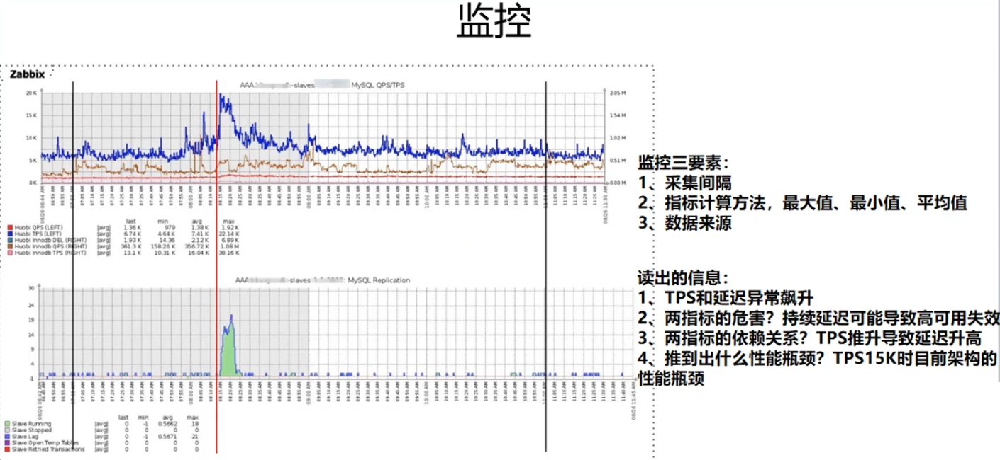

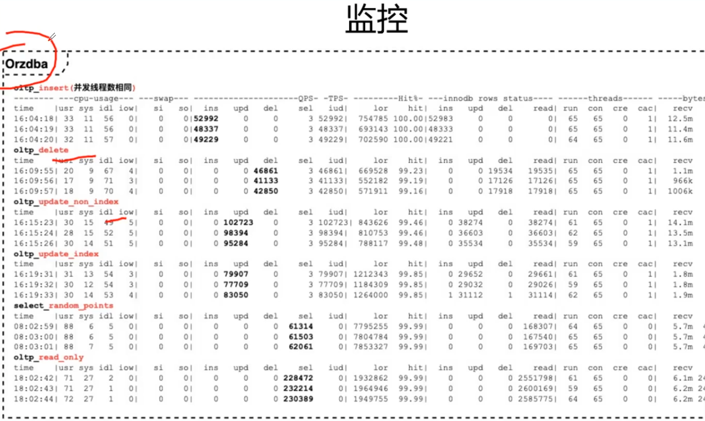


##### 解决方案

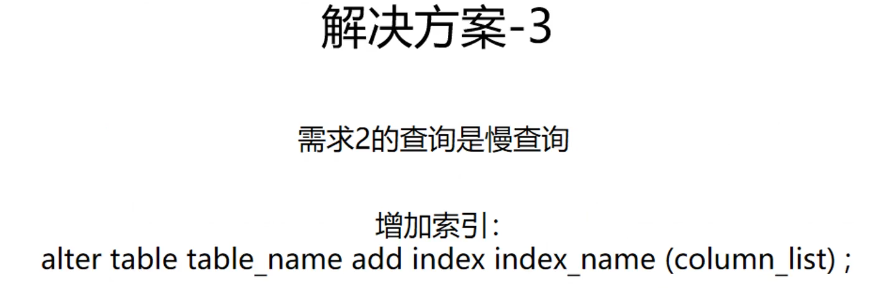


##### 索引类型

- Hash
- B-Tree/ B+Tree

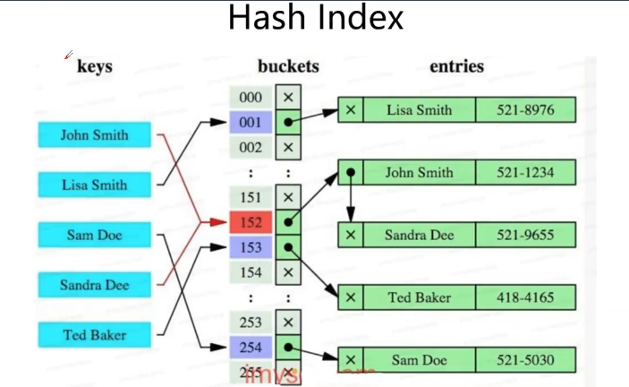

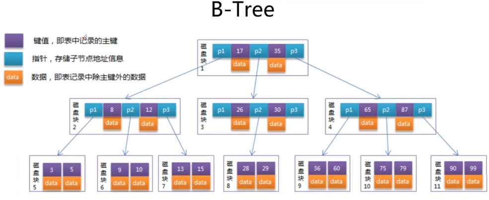


##### 为什么主键要单调递增?

- 页分裂

- 类似于一次设置一个数组的大小，不需要以后每次扩容

  

  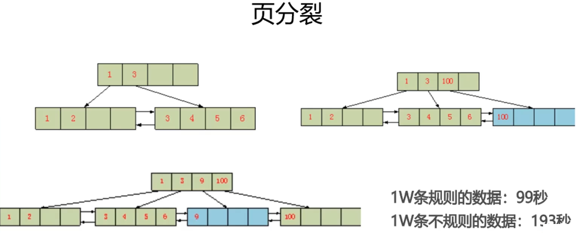


##### 索引思考题

- 为什么不使用 hash index
- 为什么 b+ tree 更适合做索引
- 为什么主键长度不能过大


##### 聚集索引和二级索引

- 谁快， 主键 VS. 二级索引
- 推荐：先拿到 ID

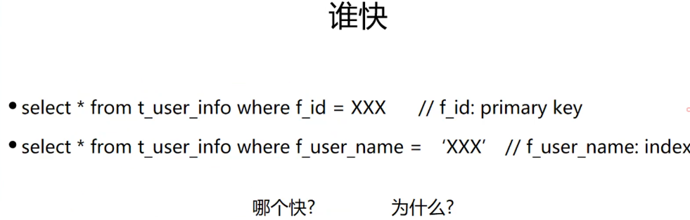

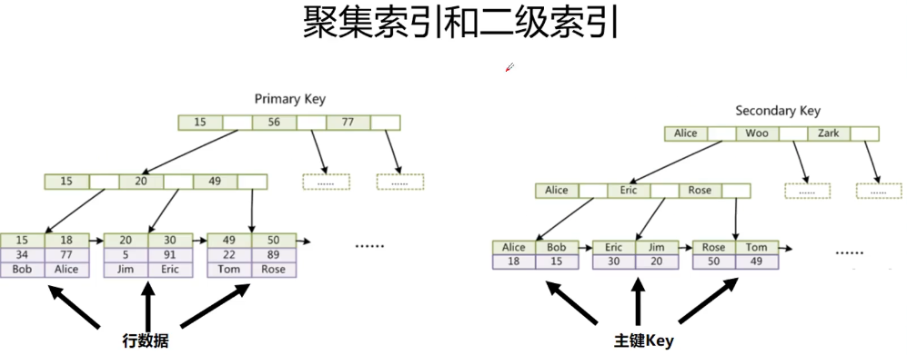


##### 索引选择性-最左原则

- 区分度好的字段 建立索引

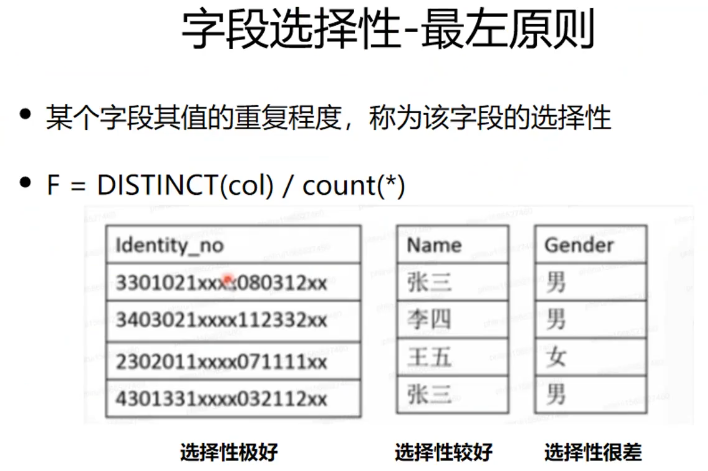


##### 索引冗余

- 最好使用用户名建立索引
- 名字建立索引会有重复
- 年龄更是重读

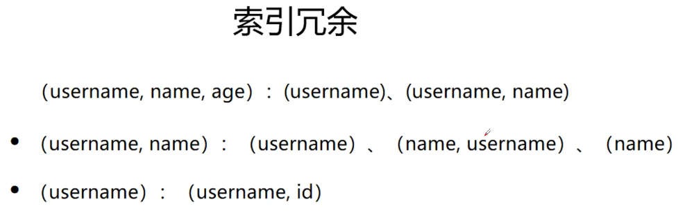


##### 修改表结构的危害

- 索引重建
- 锁表
- 抢占资源
- 主从延迟


##### 数据量问题

- 业务初期考虑不周，字段类型使用不合理，需要变更数据结构
- 随着业务的发展，需要增加新的字段（建议关联子表）
- 在无索引字段增加新的业务查询，需要增加索引


#### 总结：写入优化

- 大批量写入优化

  - ```mysql
    inert into t_user values(1, 18),(2, 47),...(999,25);
    ```

  - 只要写的长度不超过限制，就可以这么干

  - 查询也可以使用，示例：

  - ```mysql
    select * from t_user where (id, col1) = (1, 20);
    ```

  - 使用关系代数，数据库的底层这么写

- PreparedStatement 减少sql解析
- Multiple Values/ Add Batch 减少交互
- Load Data，直接导入
- 索引和约束问题
  
  - 将所有的数据，全部插入之后，再一次性创建索引


#### 总结：更新优化

- 数据的范围更新(最好精确到ID)
- 注意 GAP Lock 的问题（间隙锁的问题）
- 导致锁范围扩大


#### 总结：模糊查询

- Like 的问题(%的前面可以用到索引)
- 前缀匹配
- 否则不走索引
- 全文检索（数据量少）
- solr/ES


#### 总结：连接查询

- 连接查询优化（选驱动表，先拿到ID）
- 驱动表的选择问题
- 避免笛卡尔积


#### 总结：索引失效

- 索引失效的情况汇总
- NULL，not，not in，函数等
- 减少使用 or，可以用union（注意 union all 的区别），以及前面提到的 like
- 大数据量下，放弃所有条件组合都走索引的幻想，推荐全文索引
- 必要时，可以使用 force index 来强制查询走某个索引


#### 总结：查询SQL到底怎么设计？

- 查询数据量和查询次数的平衡
- 避免不必须的大量重复数据传输
- 避免使用临时文件排序或临时表
- 分析类需求，可以用汇总表（分时间段，尽量整块的查询，之后进行汇总）


### 常见场景分析

#### 怎么实现主键ID

> 还有没有其他方法？

- 自增（表的自增主键）
- sequence（全库的自增ID）
- 模拟 seq （一次发2000个，不够了增大了步长，发4000个，坏处是数据ID不连续）
- UUID（几百年都不会重复一次）
- 时间戳/随机数（老程序员方法）
- snowflake（雪花算法，用IP和MAC地址做生成器，保证不重复，分布式，各算各个，不会泄露数据的量，可以使用ID计算业务系统的订单量等）


#### 高效分页

- 分页：count/ pageSize/ pageNum，带条件的查询语句
- 常见实现-分页插件：使用查询SQL，嵌套一个count，性能的坑？
- 改进一下1，重写count
  - 大数量级分页的问题，limit 100000， 20
- 改进一下 2，反序
- 继续改进3，技术向：带ID
- 继续改进4，需求向：非精确分页（不显示总页数，点击下一页的时候，直接带入last ID，进行下一页查询的条件）
- 所有条件组合？索引？


#### 乐观锁与悲观锁

- 意味着什么？
- 将这一行的数据，一直锁着
- 为什么叫悲观锁

```mysql
# 悲观锁
select * from xxx for update
update xxx
commit;
```

- 为什么叫乐观锁
- 保证数据的幂等

```mysql
# 乐观锁
select * from xxx
update xxx where value=oldValue
```


### 总结回顾与作业实践 

#### 总结回顾 

1.MySQL事务与锁

2.DB与SQL优化*

3.常见场景分析*

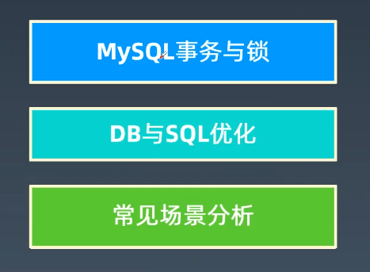


#### 作业实践 

1、(选做）用今天课上学习的知识，分析自己系统的SQL和表结构

2、(必做）按自己设计的表结构，插入100万订单模拟数据，测试不同方式的插入效率。

3、（选做）按自己设计的表结构，插入1000万订单模拟数据，测试不同方式的插入效率。

4、（选做）使用不同的索引或组合，测试不同方式查询效率。

5、（选做）调整测试数据，使得数据尽量均匀，模拟1年时间内的交易，计算一年的销售报表:销售总额，订单数，客单价，每月销售量，前十的商品等等（可以自己设计更多指标）。

6、（选做）尝试自己做一个ID生成器（可以模拟Seq或Snowflake)。

7、(选做）尝试实现或改造一个非精确分页的程序。


## 超越分库分表-高可用与读写分离 

### 从单机到集群

#### 单机MySQL数据库的几个问题

随着数据量的增大，读写并发的增加，系统可用性要求的提升，单机MySQL面临:

1、容量有限，难以扩容

2、读写压力，QPS过大，特别是分析类需求会影响到业务事务

3、可用性不足，宕机问题


#### 单机MySQL的技术演进

- 读写压力大，报表系统 单另使用从库，不影响主库
- 容量大，影响主从复制问题
- 数据库拆分，先垂直拆（会拆到头），后水平拆（分库分表）
- 使用事务，在强一致性事务 XA 性能会下降，退而求其次，使用柔性事务
- 金融系统：银行，证券（交易所），保险，
- 淘宝，2003年，PHP买的，三丰，淘宝总裁，服务化，不走数据库，RPC直接调接口，通过ID拿到具体的信息

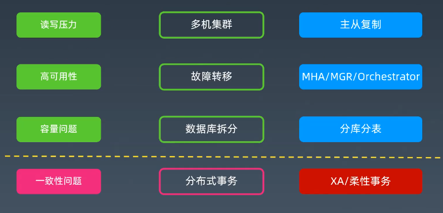


### MySQL主从复制

#### 主从复制原理

核心是：

- 1.主库写 binlog
- 2.从库 relay log

2000年，MySQL 3.23.15版本引入了**复制**

2002年，MySQL 4.0.2版本分离IO和SQL线程，引入了**relay log**

2010年，MySQL 5.5版本引入**半同步复制**

2016年，MySQL在5.7.17中引入**InnoDB Group Replication**

参考链接：

- GTID与复制:
  - https://blog.51cto.com/13540167/2086045
  - https://wwww.cnblogs.com/zping/p/10789151.html
- 半同步复制:
  - https://wwww.cnblogs.com/zero-gg/p/9057092.html
- 组复制:
  - https://www.cnblogs.com/kevingrace/p/10260685.html

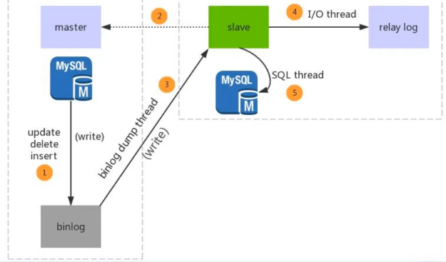


#### binlog 格式

- ROW (记录详细，每一行的改变)
- Statement（记录SQL语句）
- Mixed（混合，自己决定如何选择）

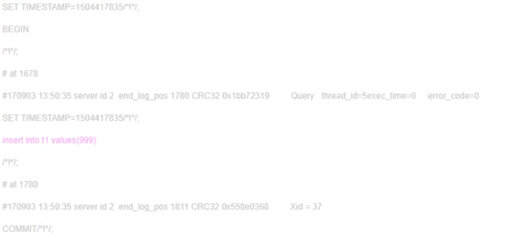


#### 异步复制(传统主从复制)

异步复制：传统主从复制--2000年，MySQL 3.23.15版本引入了Replication

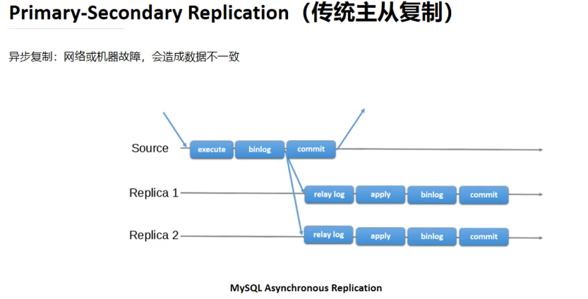


#### 半同步复制(传统主从复制)

需要启用 插件

-  改进点：将某一个从库收到 binlog 的时候，主库才可以提交
- 保证至少有一个人 可以跟上主库，主库出问题后，可以顶上去

- mysql-5.7.32-winx64\lib\plugin\semisync_master.dll
- mysql-5.7.32-winx64\lib\plugin\semisync_slave.dll

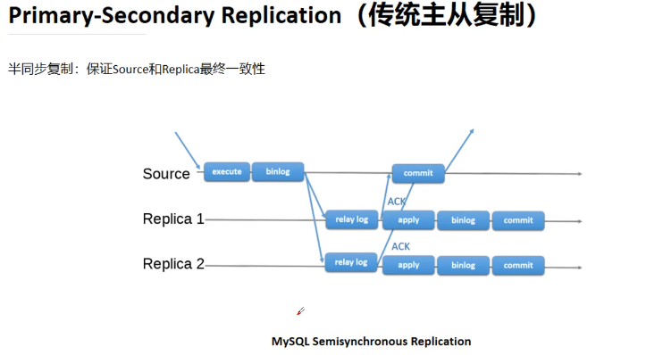


#### 组复制（MGR）

- mysql-5.7.32-winx64\lib\plugin\group_replication.dll

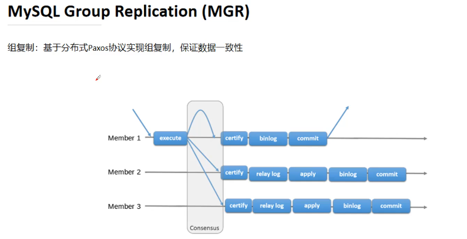


#### 主从复制演示

1.本地启动两个 MySQL

2.注意配置文件（思考几种安装，启动方式）

3.演示数据复制操作，创建表和写入，修改数据

- mysqld --initialize-insecure  (初始化数据表)
- mysqld （启动mysql）
- show variables like '%port%';
- show master statue\G
- show slave status\G
- stop slave;
- start slave;
- create table  t2(id int);
- create table t3 like t2;
- create schema test; ( 创建数据库)
- select * from information_schema.COLUMNS; （整个数据库的所有行都在这里）
- show create table columns;  （展示COLUMNS 表的创建语句）
- select * from information_schema.COLUMNS where table_name='tuser'; （展示一个tuser的表）
- select table_catalog from columns;  （catalog 默认是写死的，为空）
- insert into t2 values(1),(2),(3),(4);
- show plugins;  (查看mysql的安装插件)


#### 主从复制的局限性

- 主从延迟问题（需要数据拆分）
- 应用侧需要配合读写分离架构
- 不能解决高可用问题


### MySQL读写分离

#### 主从复制在业务系统里的应用

借助于主从复制，现在有了多个MySQL服务器示例。

如果借助这个新的集群，改进我们的业务系统数据处理能力？

答案：配置多个数据源，实现读写分离。


#### 读写分离-动态切换数据版本1

1、基于Spring/Spring Boot，配置多个数据源(例如2个，master和slave)

2、根据具体的Service方法是否会操作数据，注入不同的数据源,1.0版本

3、改进一下1.1：基于操作AbstractRoutingDataSource和自定义注解readOnly之类，简化自动切换数据源

4、改进二下1.2:支持配置多个从库;

5、改进三下1.3:支持多个从库的负载均衡。

今天的作业之一。

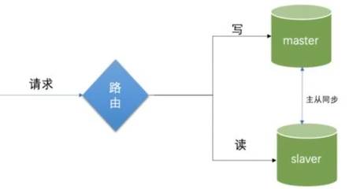


#### 读写分离-数据库框架版本2

1、分析前一版本"动态切换数据源"有什么问题?
1）侵入性还是较强
2）降低侵入性会导致"写完读"不一致问题

2、改进方式，ShardingSphere-jdbc的Master-Slave功能
1）SQL解析和事务管理，自动实现读写分离
2）解决"写完读"不一致的问题

今天作业之一:使用ShardingSphere-jdbc 5.0.0-alpha 实现读写分离配置。

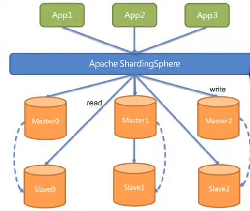


#### 读写分离-数据库中间件版本3

- 阿里云的 tddl，后期进化为DRDS
- 京东的早期 CDS，后期融合 Sharding
- 京东的 JSF，底层就是Dubbo，上面加了界面等
- 配置一个 Proxy ，直接管理整个数据库 主从，基于 Proxy进行数据的请求调整
- 多种环境都可以使用，多种语言也可以

1、分析前一版本"框架版本"有什么问题?
1）对业务系统还是有侵入
2）对已存在的旧系统改造不友好

2、改进方式，MyCat/ShardingSphere-Proxy的Master-Slave功能
1）需要部署一个中间件，规则配置在中间件
2）模拟一个MySQL服务器，对业务系统无侵入

今天作业之一:使用ShardingSphere-proxy 5.0.0-alpha 实现读写分离配置。


### MySQL高可用

#### 高可用定义（HA）

> 你维护的系统有几个9?99.95%算是几个9?
>
> 3 + lg(5) 个 9

高可用意味着，更少的不可服务时间。

一般用SLA/SLO衡量。一般说，三个9和四个9。

1年=365天=8760小时

99= 8760\*1%= 8760\*0.01= 87.6小时

99.9=8760\*0.1%=8760\*0.001 =8.76小时

99.99= 8760\*0.0001=0.876小时=0.876\*60=52.6分钟

99.999 =8760 *0.00001 =0.0876小时=0.0876 *60= 5.26分钟

后面的分布式课程讲稳定性，注意关系和区别。


#### 为什么要高可用

1.读写分离，提升读的处理能力

2.故障转移，提供failover能力

加上业务侧连接池的心跳充实，实现断线重连，业务不间断，降低RTO和RPO。


#### 什么是failover

什么是failover，故障转移，灾难恢复

容灾：热备和冷备

对于主从来说，简单讲就是主挂了，某一个从，变成主，整个集群来看，正常对外提供服务

常见的一些策略:

- 1、多个实例不在一个主机/机架上
- 2、跨机房和可用区部署
- 3、两地三中心容灾高可用方案


#### MySQL高可用0：主从手动切换

如果主节点挂掉，将某个从改成主;

重新配置其他从节点。

修改应用数据源配置。

有什么问题?

- 1.可能数据不一致。
- 2.需要人工干预。
- 3.代码和配置的侵入性。


#### MySQL高可用1：主从手动切换

用LVS+Keepalived实现多个结点的探活+请求路由。

配置VIP或DNS实现配置不变更。

有什么问题?

- 1.手工处理主从切换
- 2.大量的配置和脚本定义


#### MySQL高可用2：MHA

- 通过中间件，保证高可用

MHA (Master High Availability)目前在 MySQL高可用方面是一个相对成熟的解决方案，它由日本 DeNA公司的youshimaton(现就职于Facebook公司）开发，是一套优秀的作为MySQL高可用性环境下故障切换和主从提升的高可用软件。

基于Perl语言开发，一般能在30s内实现主从切换。

切换时，直接通过SSH复制主节点的日志。

有什么问题?

- 1.需要配置SSH信息
- 2.至少3台

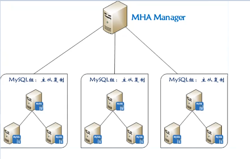


#### MySQL高可用3：MGR*

如果主节点挂掉，将自动选择某个从改成主;

无需人工干预，基于**组复制**，保证数据一致性。

有什么问题?

- 1.外部获得状态变更需要读取数据库。
- 2.外部需要使用LVS/VIP配置。

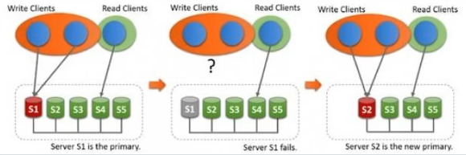


##### MGR特点

MySQL Group Replication (MGR)

MGR的特点

- 1.高一致性:基于分布式Paxos协议实现组复制，保证数据一致性;
- 2．高容错性:自动检测机制，只要不是大多数节点都宕机就可以继续工作，内置防脑裂保护机制;
- 3．高扩展性:节点的增加与移除会自动更新组成员信息，新节点加入后，自动从其他节点同步增量数据，直到与其他节点数据一致;
- 4．高灵活性:提供单主模式和多主模式，单主模式在主库宕机后能够自动选主，所有写入都在主节点进行，多主模式支持多节点写入


##### MGR使用场景

- 弹性复制，不停的加新的结点，共事的模块
- Environments that require a very fluid replication infrastructure, where the number of servers has to grow or shrink dynamically and with a lttlepain as possible.

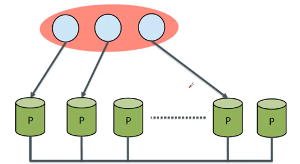


##### MGR适用场景

- 高可用分片，保证高可用
- Sharding is a popular approach to achieve write scale-out. Users can use MySQL Group Replication to implement highly available shards. Each shard can map into a Replication Group.

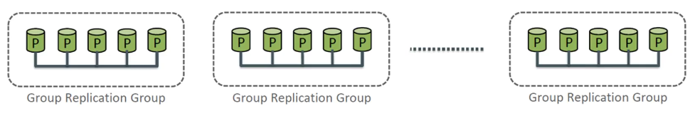


#### MySQL高可用4：MySQL Cluster

MysQL InnoDB Cluster是一个高可用的框架，它由下面这几个组件构成:

1. MysQL Group Replication:提供DB的扩展、自动故障转移
2. MysQL Router:轻量级中间件，提供应用程序连接目标的故障转移
3. MysQL Shell:新的MySQL客户端，多种接口模式。可以设置群组复制及Router

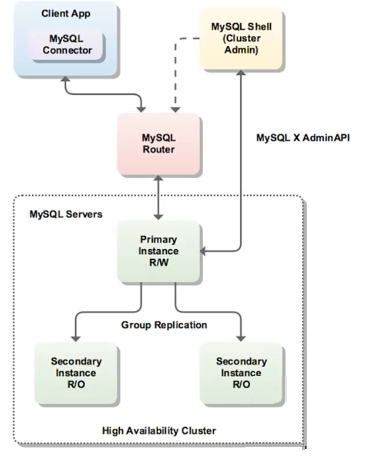


##### MySQL InnoDB Cluster

MysQL Shell

MySQL Shell是MysQL团队打造的一个统一的客户端，它可以对MysQL执行数据操作和管理。它支持通过JavaScript,Python，SQL对关系型数据模式和文档型数据模式进行操作。使用它可以轻松**配置管理InnoDB Cluster**。

MysQL Router

MySQL Router是一个轻量级的中间件，可以提供**负载均衡**和**应用连接的故障转移**。它是MysQL团队为MGR量身打造的，通过使用Router和shell，用户可以利用MGR实现完整的数据库层的解决方案。如果您在使用MGR，请一定配合使用Router和Shell，您可以理解为它们是为MGR而生的，会配合MySQL的开发路线图发展的工具。


#### MySQL高可用5：Orchestrator

- 基于go 语言开发的中间件，实现了高可用，有管理控制台
- Orchestrator，编排器

一款MysQL**高可用**和**复制拓扑管理工具**，支持复制拓扑结构的调整，自动故障转移和手动主从切换等。

后端数据库用MysQL或sQLite存储元数据，并提供web界面展示MysQL复制的拓扑关系及状态，通过web可更改MysQL实例的复制关系和部分配置信息，同时也提供命令行和API接口，方便运维管理。

特点:

- 1.自动发现MySQL的复制拓扑，并且在web上展示;
- 2.重构复制关系，可以在web进行拖图来进行复制关系变更;
- 3.检测主异常，并可以自动或手动恢复，通过Hooks进行自定义脚本;
- 4.支持命令行和web界面管理复制。

优势：

- 能直接在UI界面拖拽改变主从关系

两种部署方式

- orchestrator/raft:
- 1 数据一致性由orchestrator的**raft**协议保证
- 2 数据库之间不通信

- orchestrator/lgalera [ xtradb cluster [ innodb cluster]:
- 1.数据一致性由数据库集群保证
- 2.数据库结点之间通信

- 如果不部署client
- 1.使用HTTP(Vapi/leader-check)查询并路由到主节点

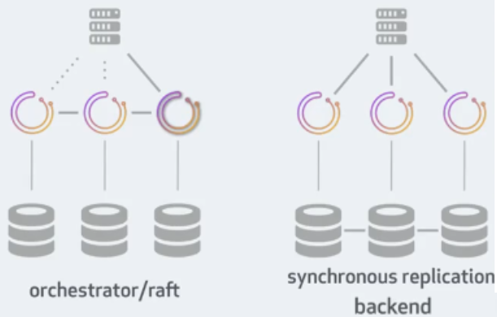


### 总结回顾

#### 总结回顾 

1.从单机到集群

2.MySQL主从复制*

3.MySQL读写分离*

4.MySQL高可用*


#### 作业实践

1、（选做）配置一遍异步复制，半同步复制、组复制。

2、（必做）读写分离-动态切换数据源版本1.0

3、（必做）读写分离-数据库框架版本2.0

4、（选做）读写分离-数据库中间件版本3.0

5、（选做）配置 MHA，模拟 master 宕机

6、（选做）配置 MGR，模拟 master 宕机

7、（选做）配置 Orchestrator，模拟 master 宕机，演练 UI 调整拓扑结构 


## 超越分库分表-数据库拆分与分库分表 

### 为什么要做数据库拆分

#### 单机MySQL的技术演进

- 单机不满足业务压力的时候，使用多个机器，分离压力，使用主从复制减少压力
- 多个数据库结点的时候，主库出问题，如何保证高可用
- 数据库还是太大，进行数据库拆分小


#### 单机数据库已经无法适应互联网的发展 

> 主从复制是否能解决这个容量问题？
>
> 主从都是全量的数据，数据量没有减少。从机备份会有延迟，可能会有好多天，

业务飞速发展导致了数据规模的急速膨胀，单机数据库已经无法适应互联网业务的发展

传统的将数据集中存储至单一数据节点的解决方案，在容量、性能、可用性和运维成本这三方面已经难于满足互联网的海量数据场景。我们在单库单表数据量超过一定容量水位的情况下，索引树层级增加，磁盘 IO 也很可能出现压力，会导致很多问题。

从**性能**方面来说，由于关系型数据库大多采用 B+树类型的索引，在数据量超过阈值的情况下，索引深度的增加也将使得磁盘访问的 IO 次数增加，进而导致查询性能的下降；同时，高并发访问请求也使得集中式数据库成为系统的最大瓶颈。

从**可用性**的方面来讲，服务化的无状态型，能够达到较小成本的随意扩容，这必然导致系统的最终压力都落在数据库之上。而单一的数据节点，或者简单的主从架构，已经越来越难以承担。从运维成本方面考虑，当一个数据库实例中的数据达到阈值以上，数据备份和恢复的时间成本都将随着数据量的大小而愈发不可控。 


#### 几个例子

1、**无法执行 DDL**，比如添加一列，或者增加索引，都会直接影响线上业务，导致长时间的数据库无响应。

2、**无法备份**，与上面类似，备份会自动先 lock 数据库的所有表，然后导出数据，量大了就没法执行了。

3、**影响性能与稳定性**，系统越来越慢，随时可能会出现主库延迟高，主从延迟很高，且不可控，对业务系统有极大的破坏性影响。 


#### 从读写分离到数据库拆分

> 还有没有其他办法？

主从结构解决了高可用，读扩展，但是单机容量不变，单机写性能无法解决。

提升容量-->分库分表，分布式，多个数据库，作为**数据分片**的集群提供服务。(数据分片 1024份，提升三个数量级)

降低单个节点的写压力。

提升整个系统的数据容量上限。 


#### 扩展立方体

X 轴：通过 clone 整个系统复制，集群

Y 轴：通过解耦不同功能复制，业务拆分

Z 轴：通过拆分不同数据扩展，数据分片 

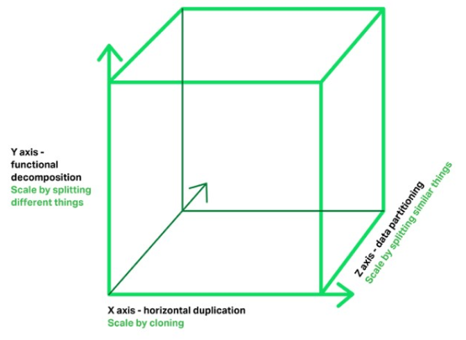


#### 数据库/数据的扩展 

- 数据复制（容量，读扩展）
- 垂直分库分表（微服务化，业务功能）
- 水平分库分表（分片，分层，分区）


### 数据库垂直拆分 

#### 垂直拆分-以淘宝的服务化为例

垂直分库分表 => 分布式服务化 => 微服务架构

以淘宝系统架构为例 说明。

1、服务不能复用（直接从jar包，调数据库，微服务提升为调接口API）

2、连接数不够 

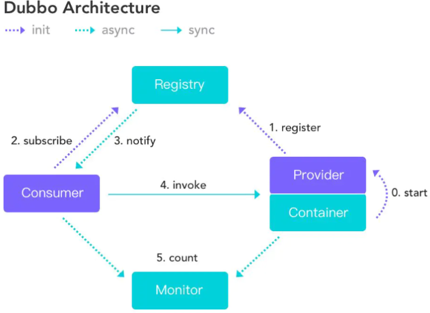


#### 拆库

垂直拆分（拆库）：将一个数据库，拆分成多个提供不同业务数据处理能力的数据库。

例如拆分所有**订单的数据**和**产品的数据**，变成两个独立的库，这种方式对业务系统有极大的影响，因为数据结构本身发生了变化，SQL 和关联关系也必随之发生了改变。

原来一个复杂 SQL直接把一批订单和相关的产品都查了出来（join操作），现在这个 SQL 不能用了，得改写 SQL 和程序。先查询订单库数据，拿到这批订单对应的所有产品 id，再根据产品 id 集合去产品库查询所有的产品信息，最后再业务代码里进行组装。 


#### 拆表

垂直拆分（拆表）：如果单表数据量过大，还可能需要对单表进行拆分。

比如一个 200 列的**订单主表**（表字段巨多），拆分成十几个子表：订单表、订单详情表、订单收件信息表、订单支付表、订单产品快照表等等。

这个对业务系统的影响有时候可能会大到跟新作一个系统差不多。对于一个高并发的线上生产系统进行改造，就像是给心脑血管做手术，动的愈多，越核心，出现大故障的风险越高。所以，我们一般情况下，尽量少用这种办法。 


#### 垂直拆分的优缺点

优点：

1、单库（单表）变小，便于管理和维护
2、对性能和容量有提升作用
3、改造后，系统和数据复杂度降低
4、可以作为微服务改造的基础

缺点：

1、库变多，管理变复杂（数据出错了，需要更改多个地方）
2、对业务系统有较强的侵入性
3、改造过程复杂，容易出故障
4、拆分到一定程度就无法继续拆分 


#### 垂直拆分的一般做法

1、梳理清楚拆分范围和影响范围
2、检查和评估 重构影响到的服务
3、准备新的数据库集群复制数据
4、修改系统配置并发布新版上线

注意：
1、先拆分系统，还是先拆分数据库？
2、先拆分多大范围？ 

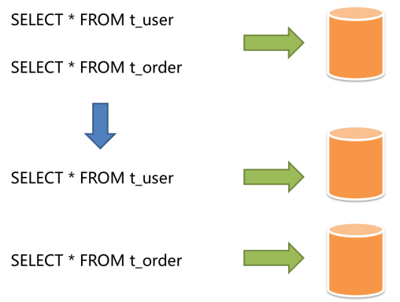


### 数据库水平拆分 

#### 什么是水平拆分

水平分库分表（减少数据量，与业务无关）

分为，分库、分表、分库分表三类

有什么区别？ 

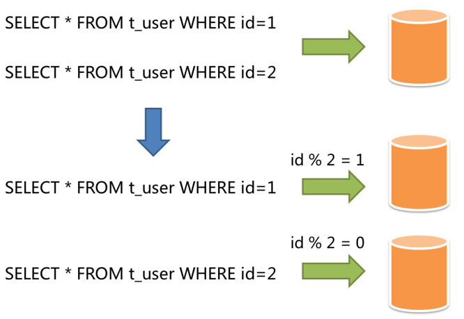


#### 数据库水平拆分（ID取模）

水平拆分（按主键分库分表）：水平拆分就是直接对数据进行分片，有分库和分表两个具体方式，但是都只是降低单个节点数据量，但不改变数据本身的结构。这样对业务系统本身的代码逻辑来说，就不需要做特别大的改动，甚至可以基于一些中间件做到透明。

比如把一个 10 亿条记录的订单单库单表（orderDB 库 t_order 表）。我们按照用户 id 除以32 取模，把单库拆分成 32 个库orderDB_00..31；再按订单 id 除以 32 取模，每个库里再拆分成 32 个表t_order_00..31。这样一共是 **1024 个子表**，单个表的数据量就只是 10 万条了。

一个查询如果能够直接路由到某个具体的字表，比如orderDB05.t_order_10 ，那么查询效率就会高很多。 

**注意**：需要明确带上分片键，ID，正确路由到明确的表上。


#### 数据库水平拆分（时间分表）

水平拆分（按时间分库分表）：很多时候，我们的数据是有时间属性的，所以自然可以按照时间维度来拆分。比如当前数据表和历史数据表，甚至按季度，按月，按天来划分不同的表。这样我们按照时间维度来查询数据时，就可以直接定位到当前的这个子表。更详细的分析参考下一个小节。

强制按条件指定分库分表：比如配置好某些用户的数据进入单独的库表，其他数据默认处理。

自定义方式分库分表：指定某些条件的数据进入到某些库或表。 


#### 数据库水平拆分

思考一个问题：

为什么有些 DBA 不建议分表，只建议分库？
（一些中间件，也只支持分库，不能分表） 

原因：

- 分表不解决容量和IO的问题，分库解决容量和IO的问题。
- 可以使用分库代替分表。


#### 分库还是分表，如何选择

一般情况下，如果数据本身的读写压力较大，磁盘 IO 已经成为瓶颈，那么分库比分表要好。

分库将数据分散到不同的数据库实例，使用不同的磁盘，从而可以并行提升整个集群的并行数据处理能力。

相反的情况下，可以尽量多考虑分表，降低单表的数据量，从而减少单表操作的时间，同时也能在单个数据库上使用并行操作多个表来增加处理能力。 


#### 分库分表有什么优缺点

优点：

1、解决容量问题
2、比垂直拆分对系统影响小
3、部分提升性能和稳定性

缺点：

1、集群规模大，管理复杂(尽量使用同一个分片规则)
2、复杂 SQL 支持问题（业务侵入性、性能）
3、数据迁移问题
4、一致性问题 

> 京东，淘宝，买家ID数据集群，卖家ID数据集群，....
>
> 使用异构的数据同步，保证查询的高性能


#### 分库分表演示

> [5.0.0-alpha](https://github.com/apache/shardingsphere/releases/tag/5.0.0-alpha)
>
> eg: -h 127.0.0.1 -P 3307
>
> [shardingsphere-ui-4.1.1](https://github.com/apache/shardingsphere/releases/tag/shardingsphere-ui-4.1.1)
>
> eg: port 8088

以 ShardingSphere-Proxy 为例。

按用户分库，按订单分表（为什么这么做）。

思考一下，分库分表条件写成：

- 分库 user_id % 2
- 分表 user_id % 2
- 会发生什么 ？ （此时，数据库会均匀命中，数据表只会进入某一个表，其他表没有数据。%2  + %3，拒绝数据倾斜）

注意：

- ShardingSphere 中间件，会产生一个虚拟表，指定ID可以直接名中表。
- 雪花算法生成的ID。
- 默认不支持范围查询，可以在UI中设置策略，实现范围查询，此时就会进行广播的方式，扫描全数据。
- 插入数据的时候，自动会对插入的数据，分开插入操作 所有的数据库和数据表。
- 进行排序的时候，可以实现多路归并排序算法，在多个表中取出数据，实现排序。
- 建表的时候，也会直接进行所有数据库中，全部建表，自动翻译。


#### ID生成算法

- MySQL自带的自增ID
- sequence
- 模拟seq
- UUID
- 时间戳/随机数
- snowflake


#### 数据的分类管理

通过分类处理提升数据管理能力

随着我们对业务系统、对数据本身的进一步了解，我们就会发现，很多数据对质量的要求是不同的。

比如，订单数据，肯定一致性要求最高，不能丢数据。而日志数据和一些计算的中间数据，我们则是可以不要那么高的一致性，丢了不要了，或者从别的地方找回来。

同样地，我们对于同样一张表里的订单数据，也可以采用不同策略，无效订单如果比较多，我们可以定期的清除或者转移（一些交易系统里有 80%以上是的机器下单然后取消的无意义订单，没有人会去查询它，所以可以清理）。 

如果没有无效订单，那么我们也可以考虑（冷/热/温数据）：
1. 最近一周下单但是未支付的订单，被查询和支付的可能性较大，再长时间的订单，我们可以直接取消掉。
2. 最近 3 个月下单的数据，被在线重复查询和系统统计的可能性最大。
3. 超过 3 个月、3 年以内的数据，查询的可能性非常小，我们可以不提供在线查询。
4. 3 年以上的数据，我们可以直接不提供任何方式的查询（银行的旧交易数据，三年，五年，十年，就直接不给查）。 

这样的话，我们就可以采取一定的手段去优化系统：
1. 定义一周内下单但未支付的数据为**热**数据，同时放到数据库和内存；
2. 定义三个月内的数据为**温**数据，放到数据库，提供正常的查询操作；
3. 定义 3 个月到 3 年的数据，为**冷**数据，从数据库删除，归档到一些便宜的磁盘，用压缩的方式（比如 MySQL 的 tokuDB 引擎，可以压缩到几十分之一）存储，用户需要邮件或者提交工单来查询，我们导出后发给用户；
4. 定义 3 年以上的数据为**冰**数据，备份到磁带之类的介质上，不提供任何查询操作。


我们可以看到，上面都是针对一些具体场景，来分析和给出解决办法。那么通过在各种不同的场景下，都对现有的技术和手段进行一些补充，我们就会逐渐得到一个复杂的技术体系。


### 框架和中间件 

#### 框架和中间件

Java 框架层面：

- TDDL
- Apache ShardingSphere-JDBC

中间件层面：

- DRDS（商业闭源，阿里）
- Apache ShardingSphere-Proxy
- MyCat/DBLE
- Cobar
- Vitness
- KingShard 

中间件的特点：

- 对应用透明
- 可以供给任何业务使用

国产数据库：

- 南大通用 informix
- 华为 gauss (100版本，200版本)


#### 数据库中间件的技术演进 

- 摩尔定律失效
- 分布式崛起
- CAP 原理（一致性，可靠性，分区容忍性）
- 类库/框架（Sharding-JDBC 使用的是最多的，最简单）
- 数据库中间件
- 分布式数据库
- 数据网格

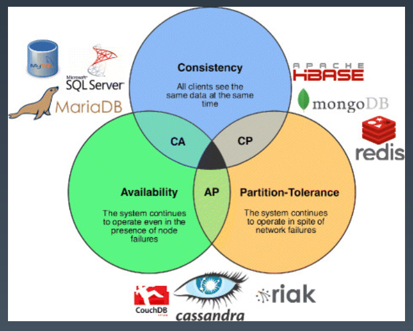

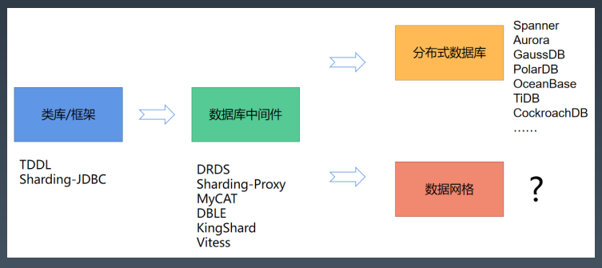

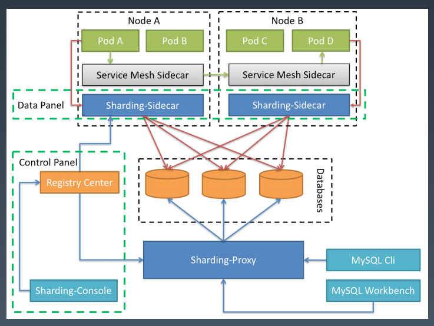


#### 数据库中间件 ShardingSphere

Apache ShardingSphere 是一套开源的**分布式数据库中间件解决方案**组成的生态圈，它由 JDBC、Proxy 和 Sidecar（规划中）这 3 款相互独立，却又能够混合部署配合使用的产品组成。 

它们均提供标准化的数据分片、分布式事务和数据库治理功能，可适用于如 Java 同构、异构语言、云原生等各种多样化的应用场景。 

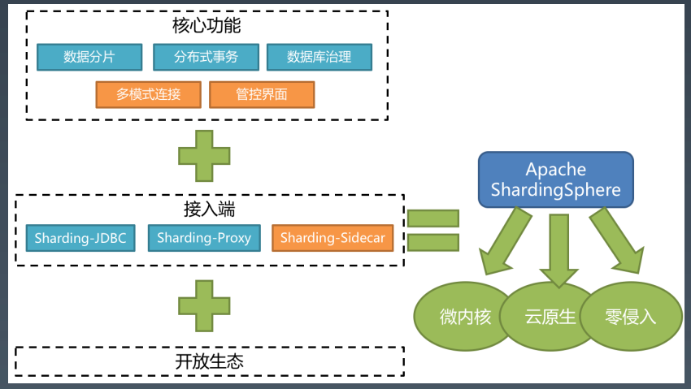


#### 框架 ShardingSphere-JDBC

直接在业务代码使用。

支持常见的数据库和 JDBC。

Java only。 

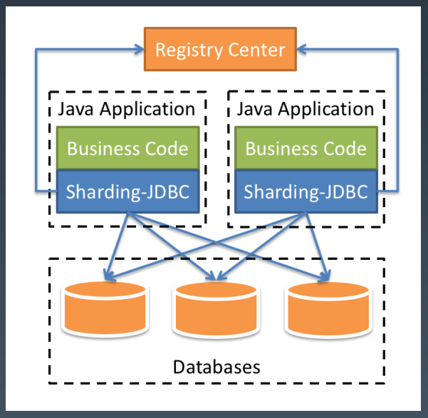


#### 中间件 ShardingSphere-Proxy

作为中间件，独立部署，对业务端透明。

目前支持 MySQL 和 PostgreSQL。

任何语言平台的系统都可以接入，可以使用 mysql 命令或者 IDE 操作。

对业务系统侵入性小。 


### 如何做数据迁移 

#### 数据迁移是重要的一环

> 迁移是最容易出故障的一个点

- 设计新系统容易，但是我们处理的都是老系统和历史诗句
- 怎么能更平滑的迁移旧数据到新的数据库和系统
- 特别是在异构的数据库结构情况下
- 达到数据准确，迁移速度快，减少停机，对业务影响小 


#### 数据迁移的方式：全量 

- 全量数据导出和导入
  - 1、业务系统停机，
  - 2、数据库迁移（先直接导入数据，最后加索引，速度更快），校验一致性（分片校验，md5值），
  - 3、然后业务系统升级，接入新数据库。

直接复制的话，可以 dump 后全量导入

（如果是）异构数据，需要用程序来处理

- 优点：最简单；
- 缺点：停机时间比较长


#### 数据迁移的方式：全量+增量

- 依赖于数据本身的时间戳
  - 1、先同步数据到最近的某个时间戳（指定一个时间点，将之前的数据导出，复制）
  - 2、然后在发布升级时停机维护，
  - 3、再同步最后一段时间（通常是一天）的变化数据。
  - 4、最后升级业务系统，接入新数据库。
- 优点：降低停机时间；
- 缺点： 还是需要停机


#### 数据迁移的方式：binlog+全量+增量

- 通过主库或者从库的 binlog 来解析和重新构造数据，实现复制。
- 一般需要中间件等工具的支持。
- 可以实现多线程，断点续传，全量历史和增量数据同步。
- 继而可以做到：
  - 1、实现自定义复杂异构数据结构；
  - 2、实现自动扩容和缩容，比如分库分表到单库单表，单库单表到分库分表，分4个库表到分64个库表。
- 优点：不需要停机，由于使用 binlog 不用锁表，不会影响业务数据操作；并且这种方式可以实现不同 ID 的信息查询，与大数据处理等操作，
- 缺点： 


#### 数据库中间件 ShardingSphere

迁移工具 ShardingSphere-scaling

- 支持数据全量和增量同步。
- 支持断点续传和多线程数据同步。
- 支持数据库异构复制和动态扩容。
- 具有 UI 界面，可视化配置。 
- 使用 binlog 实现捞数据。
- 每一片传完之后，进行校验。


#### 分库分表演示

以 ShardingSphere-Scaling 为例。

演示数据异构复制和迁移。

分库分表的 逻辑数据库（多个库表） -> 单库单表（master） -> 单库单表（slave） 


### 总结回顾与作业实践 

#### 总结回顾

1.为什么要做数据库拆分*
2.数据库垂直拆分*
3.数据库水平拆分*
4.相关的框架和中间件*
5.如何做数据迁移
6.总结回顾与作业实践 


#### 作业实践

1、（选做）分析前面作业设计的表，是否可以做垂直拆分。

2、（必做）设计对前面的订单表数据进行水平分库分表，拆分2个库，每个库16张表。并在新结构中演示常见的增删改查操作。代码、sql 和配置文件，上传到 Github。

3、（选做）模拟1000万的订单单表数据，迁移到上面作业2的分库分表中。

4、（选做）重新搭建一套4个库各64个表的分库分表，将作业2中的数据迁移到新分库。 


# 超越分库分表-分布式事务

### 分布式事务

#### 为什么需要分布式事务 


业务系统的复杂度提升，数据量的增加，比如导致出现分布式事务。 


#### 什么叫分布式事务

分布式条件下，多个节点操作的整体事务一致性。

特别是在微服务场景下，业务 A 和业务 B 关联，事务 A 成功，事务 B 失败，由于跨系统，就会导致不被感知。此时从整体来看，数据是不一致的。 

此时，业务系统只能拿到不完全的 A 服务数据，缺失 B 服务的数据 。


#### 如何实现分布式下的一致性

典型情况下是两个思路：

1、理想状态：直接想单机数据库事务一样，多个数据库自动通过某种协调机制，实现了跨数据库节点的一致性。

使用场景：要求严格的一致性，比如金融交易类业务。

2、一般情况：可以容忍一段时间的数据不一致，最终通过超时终止，调度补偿，等等方式，实现数据的最终状态一致性。

使用场景：准实时或非实时的处理，比如 T+1 的各类操作，或者电商类操作。 


1、强一致 : XA

2、弱一致 :

1) 不用事务，业务侧补偿冲正

2) 所谓的柔性事务，使用一套事务框架保证最终一致的事务 


### XA 分布式事务

#### XA 分布式事务协议

基于第一个强一致的思路，就有了基于数据库本身支持的协议，XA 分布式事务。
XA 整体设计思路可以概括为，如何在现有事务模型上微调扩展，实现分布式事务。 


应用程序(Application Program ，简称AP)：用于定义事务边界(即定义事务的开始和结束)，并且在事务边界内对资源进行操作。

资源管理器(Resource Manager，简称RM)：如数据库、文件系统等，并提供访问资源的方式

事务管理器(Transaction Manager ，简称TM)：负责分配事务唯一标识，监控事务的执行进度，并负责事务的提交、回滚等。 


#### XA 接口

xa_start ：负责开启或者恢复一个事务分支

xa_end： 负责取消当前线程与事务分支的关联(end表示不执行SQL了，可以进行提交状态了，此时是prepare)

xa_prepare：询问 RM 是否准备好提交事务分支

xa_commit：通知 RM 提交事务分支

xa_rollback： 通知 RM 回滚事务分支

xa_recover : 需要恢复的 XA 事务

思考：为什么 XA 事务又叫两阶段事务？ 


#### MySQL XA 事务

MySQL 从5.0.3开始支持 InnoDB 引擎的 XA 分布式事务， MySQL Connector/J 从5.0.0版本开始支持 XA。 

MySQL的连接器，非常稳定，不建议经常升级。MySQL的InnoDB 默认支持开启 XA。

```mysql
mysql> show engines;
+--------------------+---------+----------------------------------------------------------------+--------------+------+------------+
| Engine             | Support | Comment                                                        | Transactions | XA   | Savepoints |
+--------------------+---------+----------------------------------------------------------------+--------------+------+------------+
| FEDERATED          | NO      | Federated MySQL storage engine                                 | NULL         | NULL | NULL       |
| MRG_MYISAM         | YES     | Collection of identical MyISAM tables                          | NO           | NO   | NO         |
| MyISAM             | YES     | MyISAM storage engine                                          | NO           | NO   | NO         |
| BLACKHOLE          | YES     | /dev/null storage engine (anything you write to it disappears) | NO           | NO   | NO         |
| CSV                | YES     | CSV storage engine                                             | NO           | NO   | NO         |
| MEMORY             | YES     | Hash based, stored in memory, useful for temporary tables      | NO           | NO   | NO         |
| ARCHIVE            | YES     | Archive storage engine                                         | NO           | NO   | NO         |
| InnoDB             | DEFAULT | Supports transactions, row-level locking, and foreign keys     | YES          | YES  | YES        |
| PERFORMANCE_SCHEMA | YES     | Performance Schema                                             | NO           | NO   | NO         |
+--------------------+---------+----------------------------------------------------------------+--------------+------+------------+
9 rows in set (0.09 sec)
```

在 DTP 模型中， MySQL 属于资源管理器(RM)。分布式事务中存在多个 RM，由事务管理器 TM 来统一进行协调。 

XA 演示，

- xa start 'xa01';
- insert into test values(10, 'test');
- xa end 'xa01';
- xa prepare 'xa01';
- xa prepare 'xa01', 'ba01';   # xa的全局事务xa01，xa的分支事务ba01
- xa commit 'xa01';
- xa commit 'xa01', 'ba01'; 
- xa rollback 'xa01';
- xa recover 'xa01';


#### MySQL XA 事务状态 

- MySQL XA 事务状态 


- 完整的 XA 事务处理过程 
- 演示三个数据库的 XA
- 事务很重，会一直被卡住


- 单个 MySQL 的内部操作 


#### 思考一个问题：XA 过程中，事务失败怎么办？

1、业务 SQL 执行过程，某个 RM 崩溃怎么处理？

- TM 会通知回滚

2、全部 prepare 后，某个 RM 崩溃怎么处理？

- 5.7版本之前的会直接给回滚掉，找不到xa的事务，网抖一下就没了，5.7之后修复了。

3、commit 时，某个 RM 崩溃怎么办？ 

- 可以支持重试几次，如果不行就会滚。使用XA就使用MySQL的5.7版本。


#### MySQL各版本对XA的优化/bug修复

- 5.7对 MySQL XA 的优化/bug 修复 
- 


#### 主流支持 XA 的框架

主流支持 XA 的框架，比较推荐 Atomikos 和 narayana 

- Atomikos，shardingsephere默认使用，支持单机事务恢复，有自己的云，可以保证XA不丢失，内部的SPI接口，开源协议不允许实现
- narayana ，Jboss的产品，支持集群事务恢复模式，
- hmily
- Bitrwic


#### XA 协议存在的问题

- 做到传统的序列化隔离级别，性能下降三分之一
- show variables like '%iso%';  # tx_isolation，当前会话
- show global variables like '%iso%';    # 全局的
- 注意：XA 默认不会改变隔离级别 ，需要手动改
- 分库分表的时候，将数据尽量保证在一个数据库中，避免事务问题
- 不能保证100%，电商买货，小卖部的例子。


### BASE 柔性事务 

#### BASE 柔性事务

本地事务 -> XA(2PC) -> BASE

如果将实现了 ACID 的事务要素的事务称为刚性事务的话，那么基于 BASE 事务要素的事务则称为柔性事务。 BASE 是基本可用、柔性状态和最终一致性这三个要素的缩写。

- 基本可用（ Basically Available）保证分布式事务参与方不一定同时在线。
- 柔性状态（ Soft state）则允许系统状态更新有一定的延时，这个延时对客户来说不一定能够察觉。
- 而最终一致性（ Eventually consistent）通常是通过消息传递的方式保证系统的最终一致性。

在 ACID 事务中对隔离性的要求很高，在事务执行过程中，必须将所有的资源锁定。 柔性事务的理念则是通过业务逻辑将互斥锁操作从资源层面上移至业务层面。 通过放宽对强一致性要求，来换取系统吞吐量的提升。 


本地事务 -> XA(2PC) -> BASE 


#### BASE 柔性事务常见模式

1、 TCC

通过手动补偿处理

2、 AT

通过自动补偿处理 


### TCC/AT 以及相关框架 

#### 什么是 TCC

BASE 柔性事务 TCC

TCC 模式即将每个服务业务操作分为两个阶段，第一个阶段检查并预留相关资源，第二阶段根据所有服务业务的 Try 状态来操作，如果都成功，则进行 Confirm 操作，如果任意一个 Try 发生错误，则全部 Cancel。

TCC 使用要求就是业务接口都必须实现三段逻辑：

1.准备操作 Try：完成所有业务检查，预留必须的业务资源（冻结资产7块钱，try的时候，就把操作做完了）。

2.确认操作 Confirm：真正执行的业务逻辑，不做任何业务检查，只使用 Try 阶段预留的业务资源。因此，只要 Try 操作成功，Confirm 必须能成功。另外，Confirm 操作需满足幂等性，保证一笔分布式事务能且只能成功一次。

3.取消操作 Cancel：释放 Try 阶段预留的业务资源。同样的，Cancel 操作也需要满足幂等性。 

> Try 的时候，一个业务操作已经提交了，属于自己的一个小事务；
>
> confirm 的时候，要是失败，重试多次，还是失败，也属于自己的一个小事务；
>
> 那么此时 需要使用 Cancel 接口。

TCC 不依赖 RM 对分布式事务的支持，而是通过对业务逻辑的分解来实现分布式事务，不同于AT的是就是需要自行定义各个阶段的逻辑，对业务有侵入。 


#### TCC 需要注意的问题

TCC 需要注意的几个问题：

1、允许空回滚

- 没有 try 的时候，执行 cancel，可以正常操作，不报错。

2、防悬挂控制

- 由于 try 发的时候，网抖了一下，比 Cancel 慢了，此时的 try 就没有 cancel了，此时无法执行cancel，需要保证 try 直接不需要执行了

3、幂等设计 

- 重复 commit 的时候，不要出现多个相同的操作，执行多次。


#### 什么是 SAGA

Saga 模式没有 try 阶段，直接提交事务。

复杂情况下，对回滚操作的设计要求较高。 需要自己保证大的分步式事务失败之后，回滚操作可以正常执行。


#### 什么是 AT

AT 模式就是两阶段提交，自动生成反向 SQL 


#### 柔性事务下隔离级别

事务特性

- 原子性（ Atomicity）：正常情况下保证。
- 一致性（ Consistency），在某个时间点，会出现 A 库和 B 库的数据违反一致性要求的情况，但是最终是一致的。
- 隔离性（ Isolation），在某个时间点， A 事务能够读到B事务部分提交的结果。
- 持久性（ Durability），和本地事务一样，只要 commit 则数据被持久。

隔离级别

- 一般情况下都是读已提交（全局锁）、读未提交（无全局锁）。 


#### Seata

Seata-TCC/AT 柔性事务

Seata 是阿里集团和蚂蚁金服联合打造的分布式事务框架。 其 AT 事务的目标是在微服务架构下，提供增量的事务 ACID 语意，让开发者像使用本地事务一样，使用分布式事务，核心理念同 Apache ShardingSphere 一脉相承。

Seata AT 事务模型包含TM (事务管理器)，RM (资源管理器) 和 TC (事务协调器)。 TC 是一个独立部署的服务，TM 和 RM 以 jar 包的方式同业务应用一同部署，它们同 TC 建立长连接，在整个事务生命周期内，保持远程通信。 TM 是全局事务的发起方，负责全局事务的开启，提交和回滚。 RM 是全局事务的参与者，负责分支事务的执行结果上报，并且通过 TC 的协调进行分支事务的提交和回滚。 


Seata 管理的分布式事务的典型生命周期：

- TM 要求 TC 开始一个全新的全局事务。
- TC 生成一个代表该全局事务的 XID。
- XID 贯穿于微服务的整个调用链。
- TM 要求 TC 提交或回滚 XID 对应全局事务。
- TC 驱动 XID 对应的全局事务下的所有分支事务完成提交或回滚。 


#### Seata - TCC 


#### Seata - AT 原理

两阶段提交协议的演变：

一阶段：业务数据和回滚日志记录在同一个本地事务中提交，释放本地锁和连接资源。

二阶段：提交异步化，非常快速地完成。回滚通过一阶段的回滚日志进行反向补偿。 


通过全局锁的方式，实现读写隔离。

1、本地锁控制本地操作；

2、全局锁控制全局提交。 


#### hmily

Hmily 是一个高性能分布式事务框架，开源于2017年，目前有 2800 个 Star，基于TCC 原理实现，使用 Java 语言开发（ JDK1.8+），天然支持 Dubbo、 SpringCloud、 Motan 等微服务框架的分布式事务。 


#### hmily 功能

支持嵌套事务(Nested transaction support)等复杂场景

支持 RPC 事务恢复，超时异常恢复等，具有高稳定性

基于异步 Confirm 和 Cancel 设计，相比其他方式具有更高性能

基于 SPI 和 API 机制设计，定制性强，具有高扩展性

本地事务的多种存储支持 : redis/mongodb/zookeeper/file/mysql

事务日志的多种序列化支持 ： java/hessian/kryo/protostuff

基于高性能组件 disruptor 的异步日志性能良好

实现了 SpringBoot-Starter，开箱即用，集成方便

采用 Aspect AOP 切面思想与 Spring 无缝集成，天然支持集群

实现了基于 VUE 的 UI 界面，方便监控和管理 


#### hmily - TCC

MainService：事务发起者（业务服务）

TxManage：事务协调者

ActorService：事务参与者（多个业务服务）

Try：事务执行

Confirm：事务确认

Cancel：事务回滚

Redo 日志 ：可以选择任意一种进行存储 


#### 新事务机制

将数据的读写，结合 业务系统 和 数据 存储，实现一个 MVCC 的事务。


### ShardingSphere 对分布式事务的支持

由于应用的场景不同，需要开发者能够合理的在性能与功能之间权衡各种分布式事务。

强一致的事务与柔性事务的 API 和功能并不完全相同，在它们之间并不能做到自由的透明切换。在开发决策阶段，就不得不在强一致的事务和柔性事务之间抉择，使得设计和开发成本被大幅增加。

基于 XA 的强一致事务使用相对简单，但是无法很好的应对互联网的高并发或复杂系统的长事务场景；柔性事务则需要开发者对应用进行改造，接入成本非常高，并且需要开发者自行实现资源锁定和反向补偿。

整合现有的成熟事务方案，为本地事务、两阶段事务和柔性事务提供统一的分布式事务接口，并弥补当前方案的不足，提供一站式的分布式事务解决方案是 Apache ShardingSphere 分布式事务模块的主要设计目标。 


#### ShardingSphere 支持 XA 事务

ShardingSphere 支持 XA 事务的常见几个开源实现 

ShardingSphere  的 proxy 可以实现，一个本地事务，经过 proxy 之后，在后续的数据分片中实现 XA 的事务。


#### ShardingSphere 支持 Seata 的柔性事务

ShardingSphere 支持 Seata 的柔性事务。 


#### ShardingSphere 的分布式事务模块 

- 分布式事务位置
  - shardingsphere\shardingsphere-5.0.0-alpha\examples\shardingsphere-jdbc-example\transaction-example
- 编译 ShardingSphere 
  - mvn clean package install -Dmaven.test.skip=true -Dmaven.javadoc.skip=true -Drat.skip=true -Dcheckstyle.skip=true 
- 导入 transaction-example
  - 打开 shardingsphere\shardingsphere-5.0.0-alpha\examples\shardingsphere-jdbc-example\transaction-example 作为一个项目
  - 


