# Microservices Architecture

## 微服务架构核心

### 什么是微服务架构？

> 马丁·福勒（Martin Fowler) 

- 一组小的服务
- 独立的进程
- 轻量级通信
- 基于业务能力
- 独立部署
- 无集中式管理
- 一种架构风格，将单体应⽤划分成一组⼩的服务，服务之间相互协作，实现业务功能
- 每个服务运行在独⽴的进程中，服务间采用轻量级的通信机制协作（通常是HTTP/JSON）
- 每个服务围绕业务能力进行构建，并且能够通过⾃动化机制独立地部署
- 很少有集中式的服务管理，每个服务可以使用不同的语⾔言开发，使用不同的存储技术
- 参考： https://www.martinfowler.com/articles/microservices.html 

> Adrian Cockcroft （Netflix，网飞）

- Loosely coupled service oriented architecture with bounded context
- 基于有界上下⽂文的， 松散耦合的⾯面向服务的架构 


### 微服务的利弊

- 利
  - 强模块化边界
  - 可独立部署
  - 技术多样性 
- 弊
  - 分布式系统复杂性
  - 最终一致性
  - 运维复杂性
  - 测试复杂性 

> 如果你搞不定一个单块应用，别指望微服务能够拯救你！ 


### 康威法则

- Organizations which design systems … are constrained to produce designs which are copies of the communication structures of these organizations.
- 设计系统的组织，其产生的架构设计等价于组织间的沟通结构 
- 为什么架构师需要，了解技术架构与组织架构？


### 微服务的适用性 

> 企业应该在什么时候开始考虑引入微服务？
>
> 业务团队发展到百人的时候，就可以开始引入微服务。


#### 单块优先 

> 一开始不需要直接走微服务，风险高！


### 微服务组织架构 

- 从传统职能型到跨职能产品型 


- 端到端，闭环（End-end ownership）
- who buid it, who run it ！
- 两个披萨原则！


### 中台战略和微服务 

- 技术中台
- 业务中台
- 业务前台
- 大中台，小前台


### 服务分层概念 

- 基础服务
- 聚合服务


### 微服务总体技术架构体系图 

- 接入层
- 网关层
- 业务服务层
- 支撑服务
- 平台服务
- 基础设施层


### 服务发现 LB

#### 独立LB 

- 硬件 F5
- 软件 Nginx
- LB，(Load Balancer)


#### 进程内LB 


#### 主机独立进程LB 

- 运维成本比较高


### 微服务网关 

#### API Gateway

- 屏蔽内部服务的细节，对外展示一个接口
- 反向路由
- 认证安全
- 限流熔断
- 日志监控


#### Netflix Zuul 网关架构 


### Netflix 微服务服务发现路路由体系 

- Eurka(服务注册中心) + Zuul(网关层)


### 微服务配置中心原理 

- 一般都是自己写的配置文件，到处都是，无法追溯
- 非常重要的微服务组件


#### 携程 Apollo 配置中心

- 保证高可用，设计周到
- 定时拉取与实时推送配置


### RPC vs REST 

- 通信协议


### 服务框架和治理 

> Alibaba的 Dubbo框架。

- 服务注册发现
- 服务负载均衡
- 服务路由（软路由）
- 日志监控
- 延迟监控
- 调用链监控
- 限流熔断措施
- 安全和访问控制
- RPC和REST通讯调用
- 序列化
- 代码生成，契约开发
- 统一异常处理
- 文档
- 配置中心集成
- 后台服务集成


### 五层监控体系和监控分类 

- 基础设施监控
- 系统层监控
- 应用层监控
- 业务监控
- 端用户体验监控


#### 监控架构和主流技术栈 

- 一般监控架构
- 时间序列数据库：InfluxDB和Grafana


### 调用链监控

#### Trace调用链监控原理 

- 启动一个Span,生成 Span ID, trace ID。


#### 调用链监控选型 

- Cat
- Zipkin
- Pinpoint


### Netflix Hystrix 断路器原理 

- 限流，熔断，隔离，降级
- 雪崩效应


### 基于镜像治理和多环境的持续交付流水线 

- 容器部署技术
- Docker，环境一致性和镜像部署
- 镜像治理中心，docker registry。


#### 蓝绿、金丝雀和灰度发布 

- 蓝绿部署，依赖网关，进行新老版本切换
- 灰度发布，保证蓝绿部署，渐进过渡


### 资源调度框架 Mesos 架构 

- Mesos 最早来自谷歌，后来开源
- Mesos 将所有的资源集合起来，成为大型计算机，只作为资源调度
- Framework 进行任务的运行


### 基于容器云发布体系 


## 微服务架构实战

### OAuth2 和 微服务安全架构

#### 课程概述 

##### 课程概述

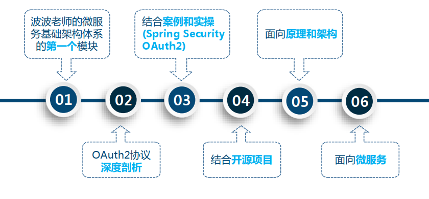


##### 课程参考书 

OAuth2 in Action：https://www.manning.com/books/oauth-2-in-action 

OAuth 2.0 Cookbook：https://www.packtpub.com/virtualization-and-cloud/oauth-20-cookbook 


##### 微服务基础架构体系2018预览(draft) 

- OAuth2授权认证中心架构和实践
- 微服务配置中心Apollo架构和实践
- 调用链监控CAT架构和实践
- 微服务网关Zuul架构和实践
- 容错限流Hystrix/Turbine架构和实践
- 微服务注册发现Eureka/Ribbon架构和实践
- 时间序列监控KairosDB架构和实践
- 微服务监控告警ZMon架构和实践
- 综合案例分析 


##### 架构和技术栈预览 

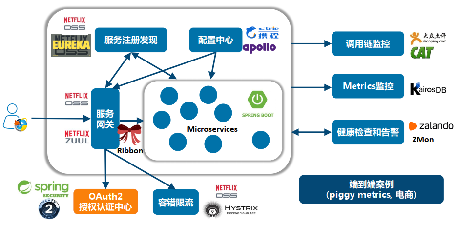


#### 问题域 

##### 开放系统间授权 

> 场景：相片拥有者想去使用云冲印服务，打印云存储服务商的粘片。

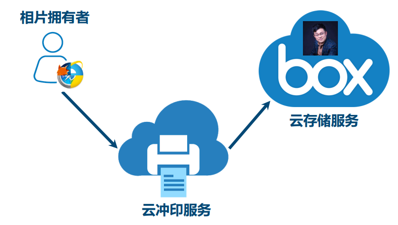


##### 图例 

- 资源拥有者
- 客户应用
- 受保护的资源

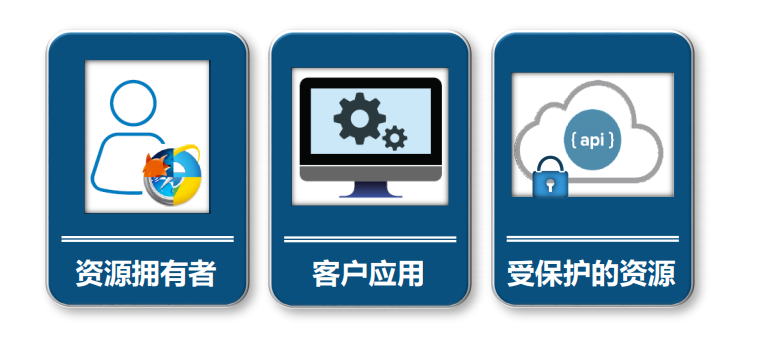


##### 办法1：密码用户名复制 

> 直接将用户名和密码给客户应用，进行登录，进行后续操作。

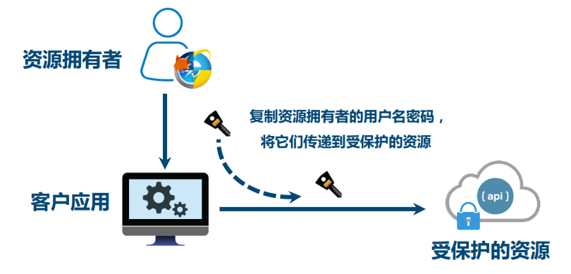


##### 办法2：万能钥匙 

> 使用一个key，访问某个受保护的资源文件，进行相应的操作。

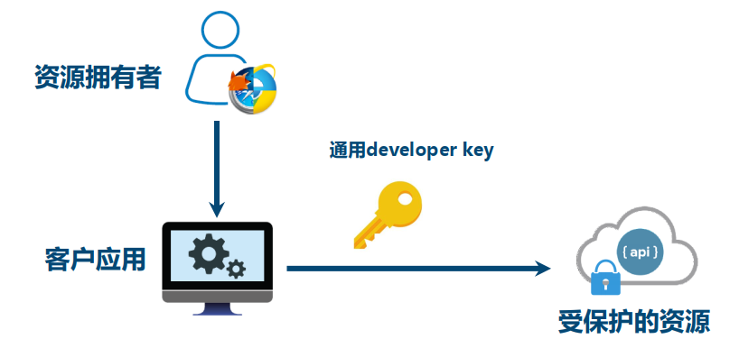


##### 办法3：特殊令牌 

> 使用令牌的方式，实现访问资源。

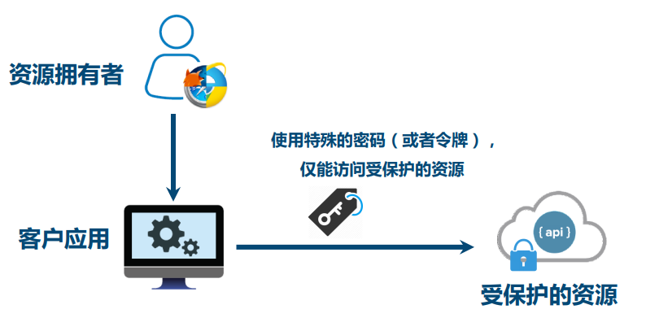


##### 传统单块应用安全 

- 登录工程：传统 Web 应用中的身份验证技术：https://insights.thoughtworks.cn/traditional-web-app-authentication/
- 传统中，登录的时候进行用户鉴权，然后才可以进行后续的操作；
- 为了保证不是每一次登录都进行数据库鉴权，使用Cookie和Session机制，给客户端发送Cookie，在后续访问中携带，服务端基于Cookie，找到之前的会话（Session），进行有状态的会话服务。

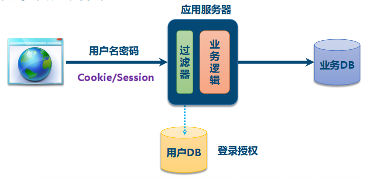


##### 现代微服务安全 

- 单独使用不是一个AuthServer ，进行鉴权；
- 各个客户端，进行访问的时候，传递token。

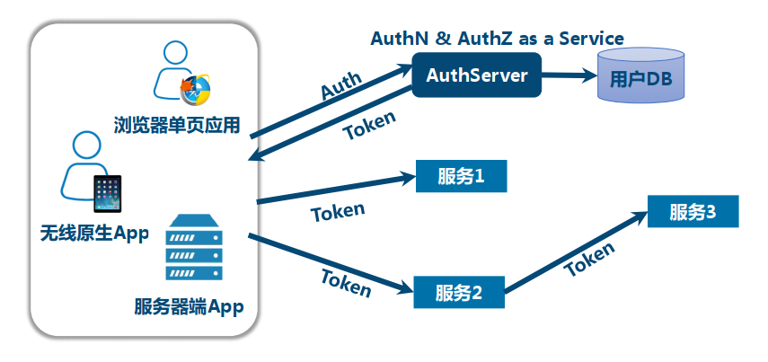


##### 你见过OAuth吗? 

- 不需要注册账号，直接就可以使用其他应用的账号进行登录方式；
- 使用微信登录，qq登录，微博登录等等。

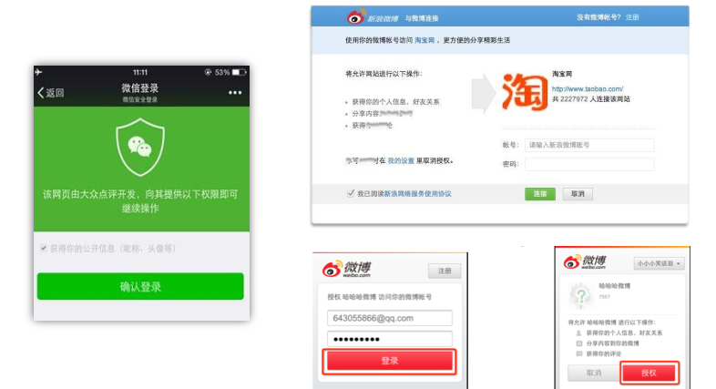


##### 总结： OAuth2解决问题域和场景 

- 开放系统间鉴权
- 现代微服务安全
- 企业内部应用认证鉴权（IAM/SSO）

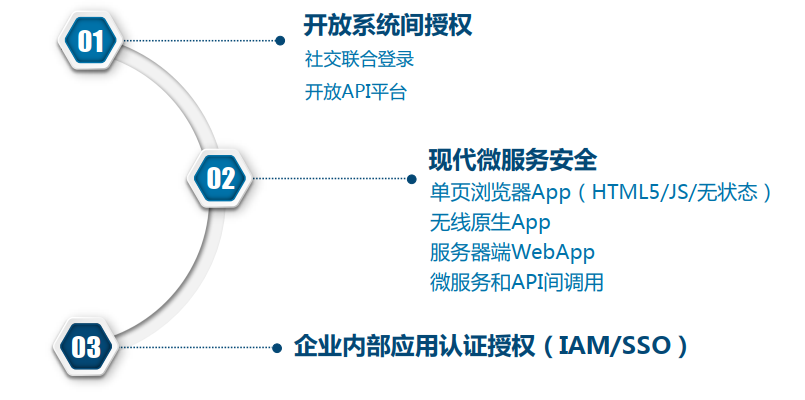


#### OAuth2最简向导 

- The Simplest Guide To OAuth 2.0：https://darutk.medium.com/the-simplest-guide-to-oauth-2-0-8c71bd9a15bb

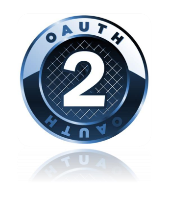


- 首先有用户的数据 
- 有个资源服务器负责管理用户数据 
- 有个客户应用需要访问用户的数据 
- 给资源服务器按个门暴露用户数据称为API 
- 客户应用可以通过API访问用户数据 
- 资源服务器返回用户数据 

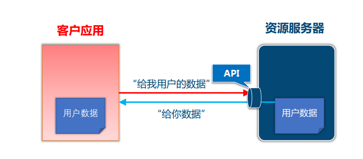


- 如果来了个恶意客户应用怎么办 
- 即使恶意客户应用要求访问用户数据 
- 资源服务器还是返回用户数据，恶意应用也能访问用户数据
- 需要一种机制保护用户数据

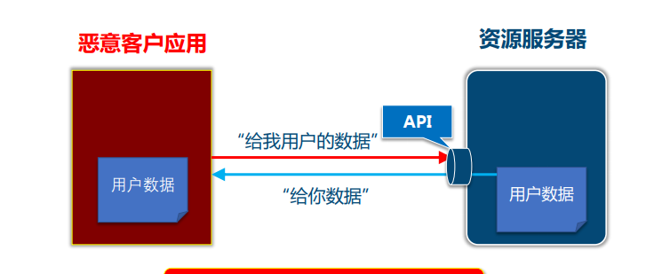


- 业界实践是提前给客户应用颁发一个Access Token，它表示客户应用被授权可以访问用户数据 
- 访问用户数据时，给出Access Token 
- 资源服务器取出请求中的Access Token 
- 并校验Access Token确认客户应用有访问用户数据的权限 
- 校验通过后，资源服务器返回用户数据 
- 该机制可以工作的前提是 必须提前给客户应用颁发Access Token 

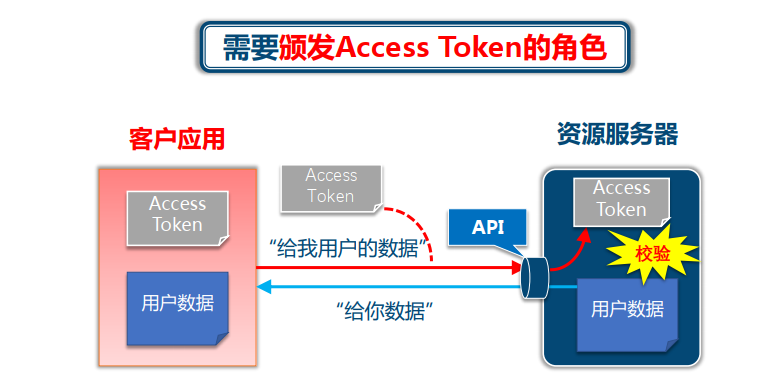


- 谁颁发Access Token呢？ 授权服务器
- 授权服务器和客户应用的关系如下 
- 授权服务器负责生成Access Token 
- 并给客户应用颁发Access Token 

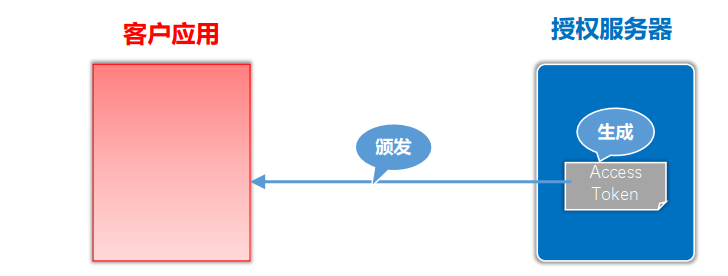


- 角色回顾：一个授权服务器，一个客户应用，一个资源服务器 
- 授权服务器负责生成Access Token 
- 并将Access Token颁发给客户应用 
- 客户应用带上Access Token访问用户数据 
- 资源服务器从请求中取出Access Token 
- 校验Access Token具有访问用户数据的权限 
- 校验通过后，资源服务器返回用户数据 

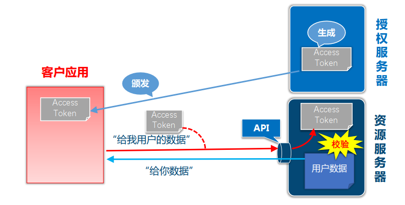


- 上面的流程中第一步是授权服务器生成Access Token，在真实流程中，在颁发Token前先要征询用户同意 
- 首先客户应用请求Access Token 
- 授权服务器征询用户意见，是否将权限授予客户应用 
- 如果用户同意授权服务器颁发token 
- 授权服务器生成一个Access Token 
- 并将token颁发给客户应用 
- 注意黄色椭圆圈起来的部分 
- OAuth 2.0标准化了Access Token的请求和响应部分，OAuth2.0的细节在RFC 6749（ OAuth 2.0授权框架）中描述 

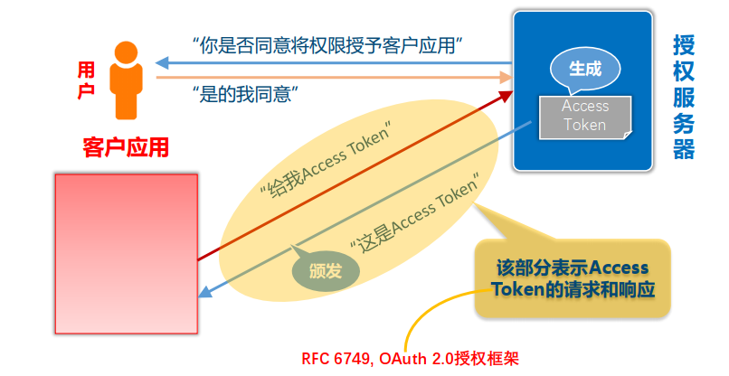


#### OAuth2定义和原理 

##### 什么是OAuth 2.0 

- 用于REST/APIs的代理授权框架(delegated authorization framework) 
- 基于令牌Token的授权，在无需暴露用户密码的情况下，使应用能获取对用户数据的有限访问权限 
- 解耦认证和授权 
- 事实上的标准安全框架，支持多种用例场景
  - 服务器端WebApp
  - 浏览器单页SPA
  - 无线/原生App
  - 服务器对服务器之间 


##### 令牌类比仆从钥匙(Valet Key) 

- 给应用授予有限的访问权限，让应用能够代表用户去访问用户的数据


##### OAuth 2.0历史 

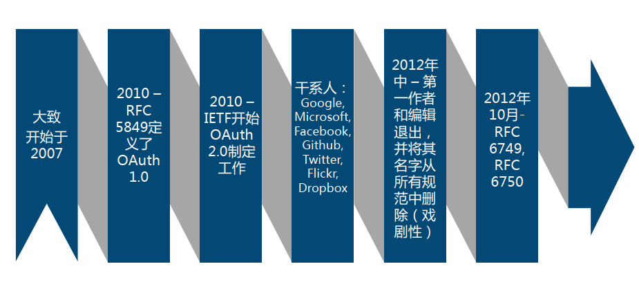


##### OAuth 2.0优势 

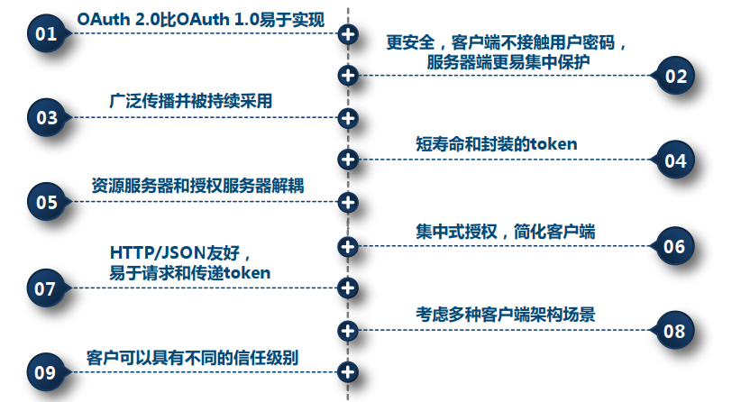


##### OAuth 2.0不足 

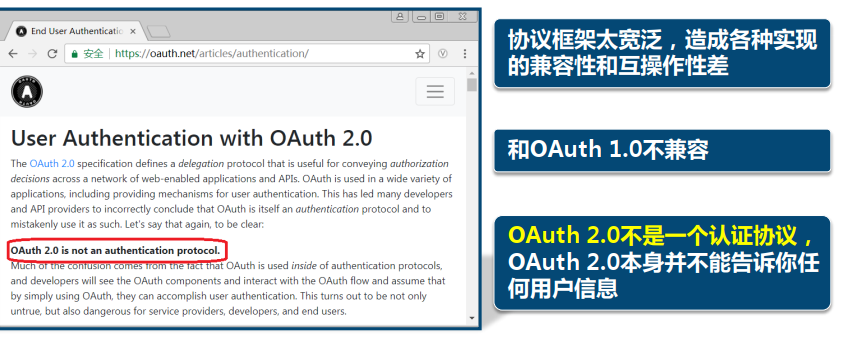


##### OAuth 2.0主要角色 

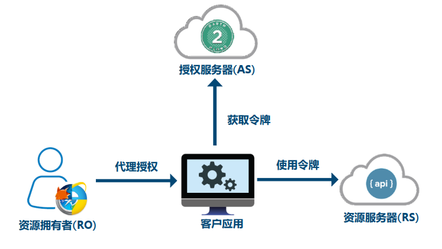


##### OAuth术语 

- 客户应用
- 资源服务器
- 授权服务器
- 资源拥有者

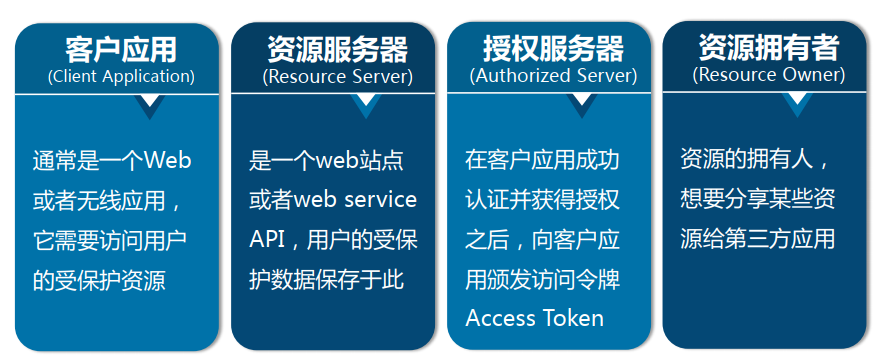

- 客户凭证
- 令牌
- 作用域

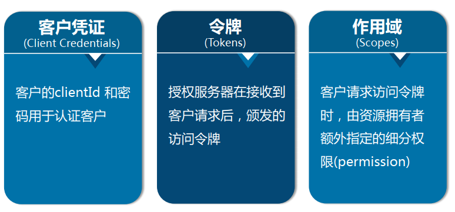


##### OAuth令牌类型 

- 访问令牌
- 刷新令牌
- 授权码
- Bearer Token
- Proof of Possession (PoP) Token

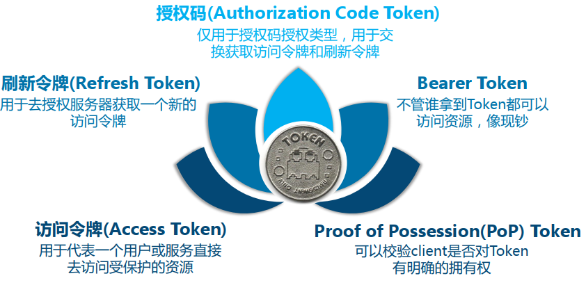


##### OAuth 2.0误解 

- Oauth 2 是一个认证框架，不是认证协议

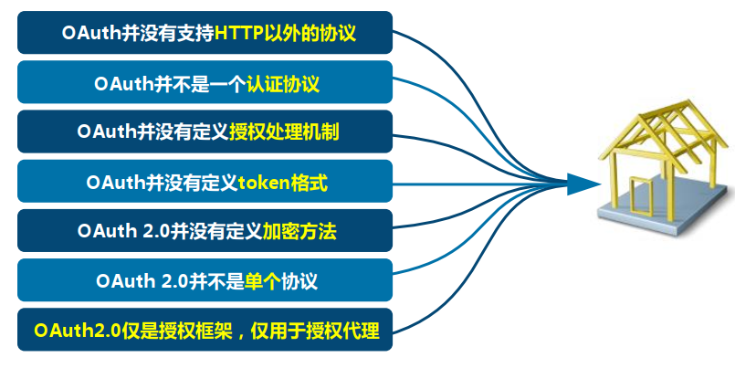


##### 回顾 

- Oauth 本质是，如何获取token和如何使用token

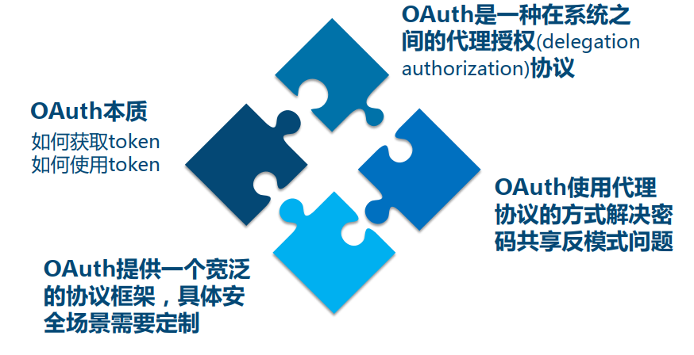


#### 典型OAuth Flow和选型 

##### 参考资料

- The OAuth 2.0 Authorization Framework(RFC6749)：https://tools.ietf.org/html/rfc6749
- 理解OAuth 2.0：http://www.ruanyifeng.com/blog/2014/05/oauth_2_0.html


##### 授权码模式 

> 目前最常用的方式。


##### 简化模式 

> 最容易受到攻击。

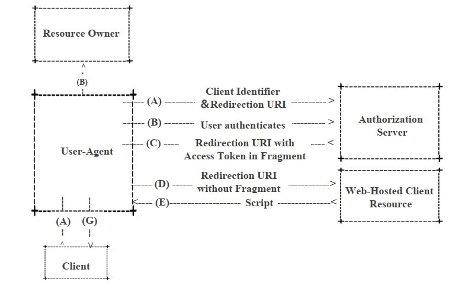


##### 密码模式

> 只有公司自己内部使用的时候，才可以使用，防止密码泄露！

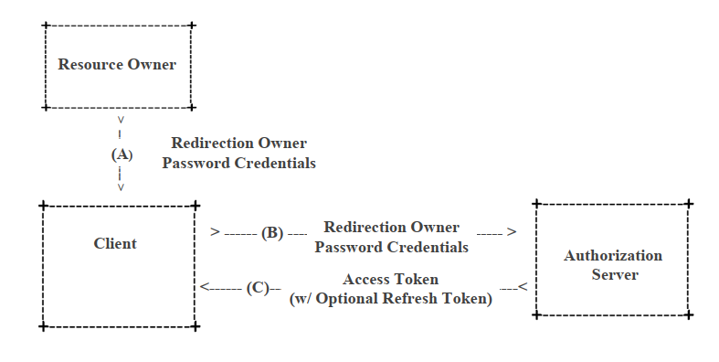


##### 客户端模式

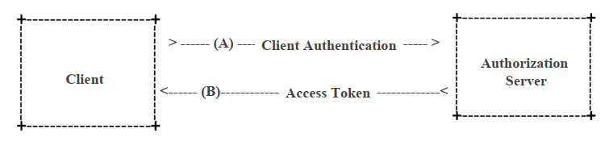


##### 刷新令牌

> 使用Token的存活时间，保证不一定每一次授权都走完整个授权流程。

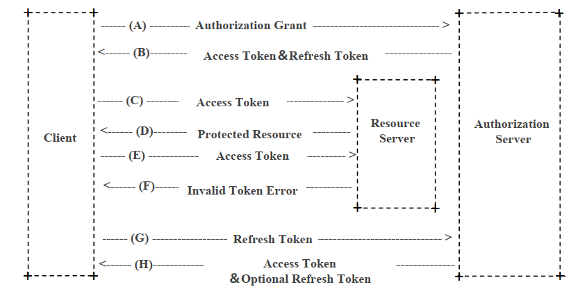


##### 授权流程渠道(channels) 

- 前端渠道
- 后端渠道

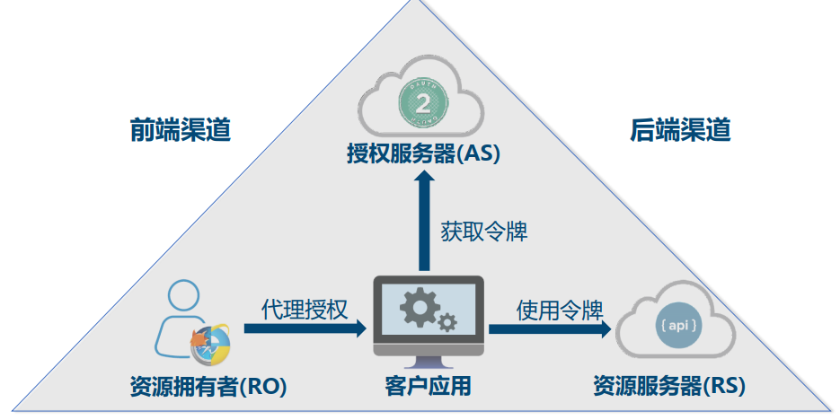


##### 四种OAuth 2.0授权类型(Flows) 

- 授权码
- 简化
- 用户名密码
- 客户端凭证

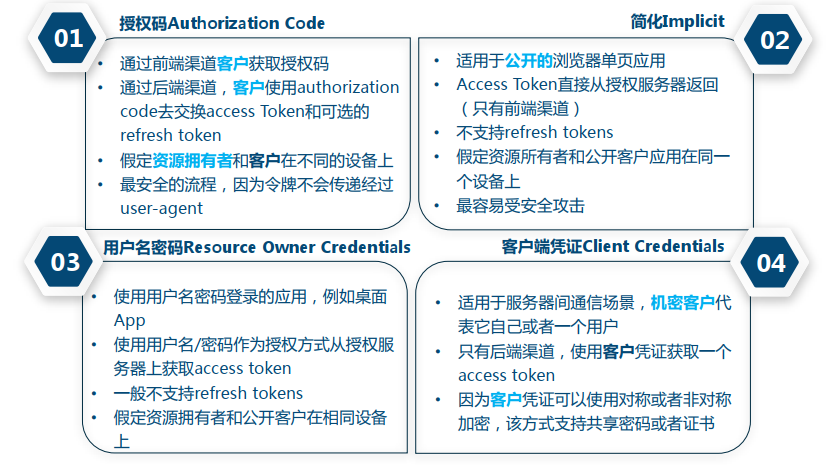


##### 授权类型选择~客户应用类型 

- 公开
- 私密

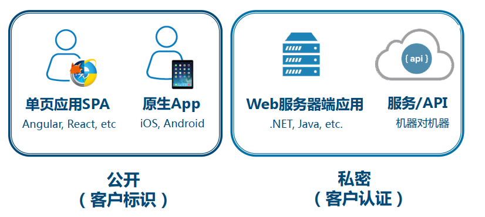


##### 授权类型选择~流程 

> 使用判断流程图，基于不同应用类型，选择不同的授权模式。

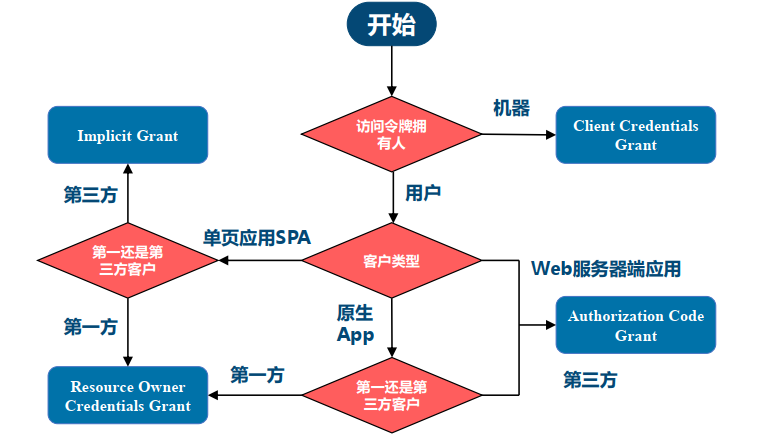


#### OAuth2授权服务器和资源服务器案例实操 

##### 授权服务器 

- 授权端点
- token端点
- 校验端点
- 吊销端点

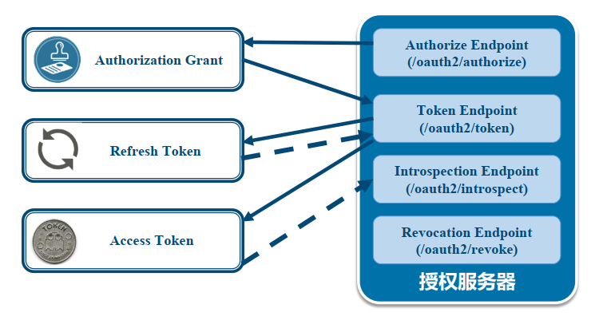


##### Spring Security OAuth2架构 

- OAuth：http://terasolunaorg.github.io/guideline/5.3.0.RELEASE/en/Security/OAuth.html

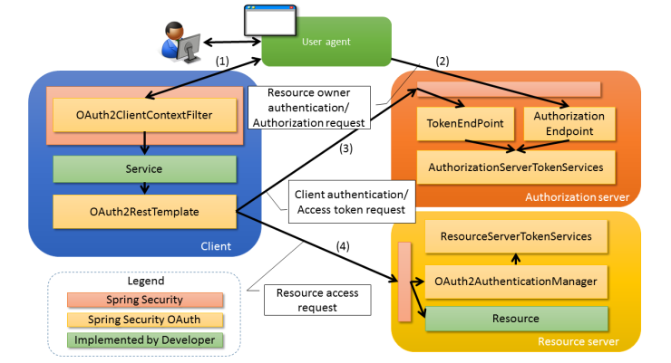


##### 基于授权码模式+Spring Security OAuth2的最简授权服务器

- 依赖

```xml
<dependency>
    <groupId>org.springframework.boot</groupId>
    <artifactId>spring-boot-starter-security</artifactId>
</dependency>
<dependency>
    <groupId>org.springframework.boot</groupId>
    <artifactId>spring-boot-starter-web</artifactId>
</dependency>
<!-- for OAuth 2.0 -->
<dependency>
    <groupId>org.springframework.security.oauth</groupId>
    <artifactId>spring-security-oauth2</artifactId>
</dependency>
```

- 见示例代码
- 

##### 基于简化模式+Spring Security OAuth2的最简授权服务器

- 见示例代码

##### 基于密码模式+Spring Security OAuth2的最简授权服务器

- 见示例代码

##### 基于客户端模式+Spring Security OAuth2的最简授权服务器

- 见示例代码


##### 实验扩展

- 支持刷新令牌Refresh Token 
- 使用关系数据库存储令牌和客户信息 
- 使用缓存Cache存储令牌提升性能 
- 授权服务器和资源服务器拆分 
- Revoke端点 （吊销端点）
- Introspection端点 （校验端点）


#### OAuth2客户端案例实操 

##### 客户端以授权码方式访问OAuth2服务器案例，使用rest template

- 见示例代码


##### 实验扩展

- 使用Spring Security OAuth2
- 客户端支持简化/密码/客户端模式 
- 客户端支持refresh token 


#### JWT令牌原理 

##### 访问令牌的类型 

- By reference token（透明令牌）
- By value token （自包含令牌）

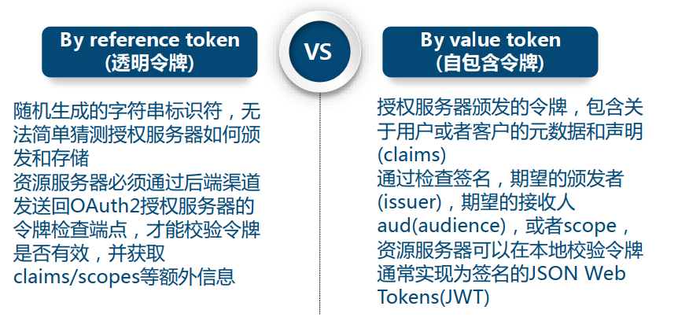


##### JSON Web Token(JWT) 

- 网址：https://jwt.io/
- 三部分组成：Header.Claims.Signature

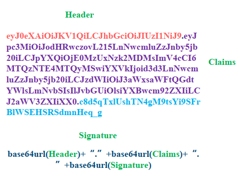

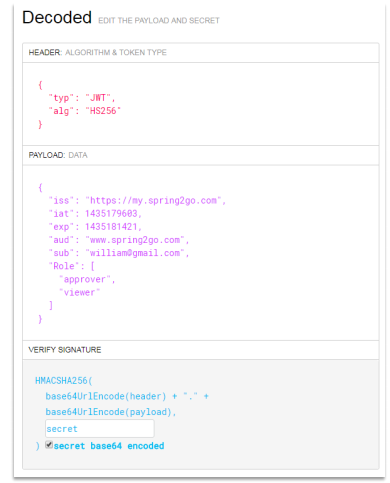


##### 令牌签发人和目标接收人 

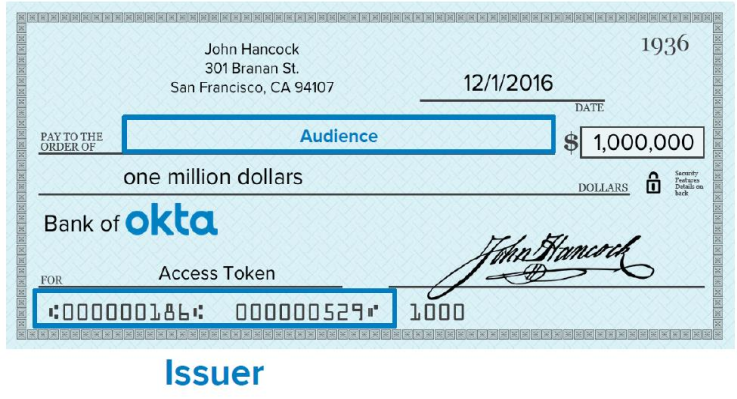


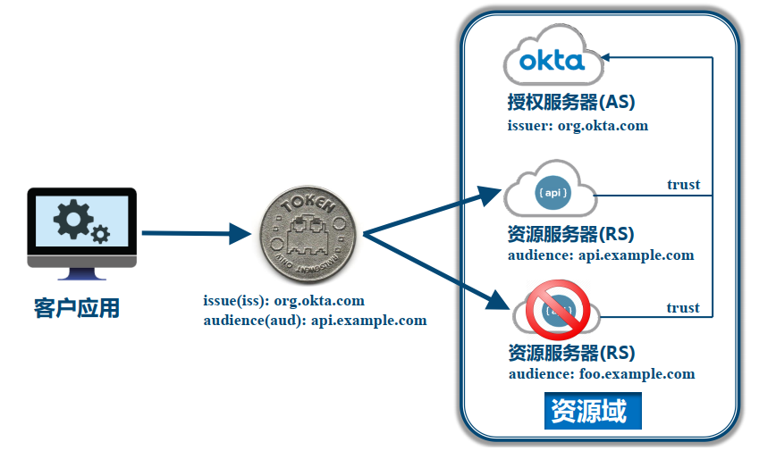


#### JWT案例实操 

##### 基于密码模式+Spring Security OAuth2+JWT的最简授权服务器

- jwt 依赖

```xml
<dependency>
    <groupId>org.springframework.security</groupId>
    <artifactId>spring-security-jwt</artifactId>
</dependency>
```

- authserver
- resourceserver
- 对称签名和校验
- 见示例代码


##### 实验扩展

- 在JWT令牌中增加定制claims
- JWT令牌的非对称签名和校验
- 使用JWE加密/解密JWT令牌 


#### Android无线应用接入OAuth2案例实操 

##### Android对接OAuth2授权服务器（基于Spring Security OAuth2+内存H2数据库）

- 见示例代码


##### 实验扩展

- 支持用户名密码模式
- 使用PKCE(RFC7636)增强无线客户使用授权码模式的安全性 


#### Angularjs单页应用接入OAuth2案例实操 

##### Angularjs对接OAuth2授权服务器（基于Spring Security OAuth2+Mysql数据库） 

- Spring REST API + OAuth2 + AngularJS：http://www.baeldung.com/rest-api-spring-oauth2-angularjs
-  AngularJS重点关注`oauth-ng.js`。
- 见示例代码


##### 实验扩展

- 支持密码模式


#### Github社交登录案例实操 

##### Github社交联合登录实验

- Spring Social：https://spring.io/projects/spring-social
- https://projects.spring.io/spring-social/
- Connect your Spring application with Software-as-a-Service (SaaS) API providers such as Facebook, Twitter, and LinkedIn.

- 依赖

```xml
<dependency>
    <groupId>org.springframework.social</groupId>
    <artifactId>spring-social-config</artifactId>
</dependency>
<dependency>
    <groupId>org.springframework.social</groupId>
    <artifactId>spring-social-core</artifactId>
</dependency>
<dependency>
    <groupId>org.springframework.social</groupId>
    <artifactId>spring-social-web</artifactId>
</dependency>
<dependency>
    <groupId>org.springframework.social</groupId>
    <artifactId>spring-social-github</artifactId>
    <version>1.0.0.M4</version>
</dependency>
```


##### 实验扩展

- 新浪微博，微信，QQ做对接实验
- Spring Social 文档学习


#### OAuth2安全风险和案例实操 

##### 常见OAuth 2.0安全问题 

- 确保HTTPS传输
- 防止泄露客户密码
- 很多输入需要验证

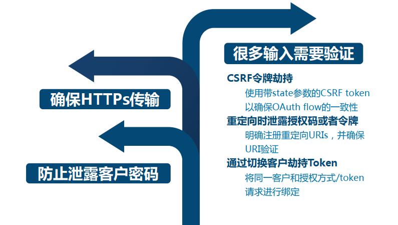


##### CSRF

> 黑客使用自己的账号和密码，获得授权码；
>
> 将授权码给正常使用的用户，让用户点击；
>
> 由于Spring social 具有跨站点防伪造安全机制，需要一个state传回去；
>
> 此时的点击就是错误的。
>
> Possible CSRF detected - state parameter was required but no state could be found

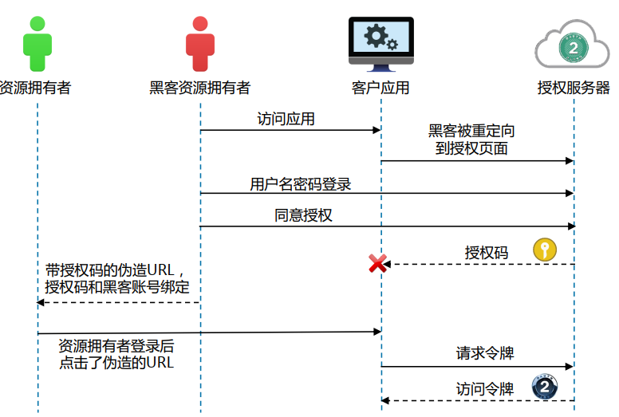


#### OpenId Connect简介 

##### OpenID Connect 

- (Identity, Authentication) + OAuth 2.0 = OpenID Connect 
- 比较新

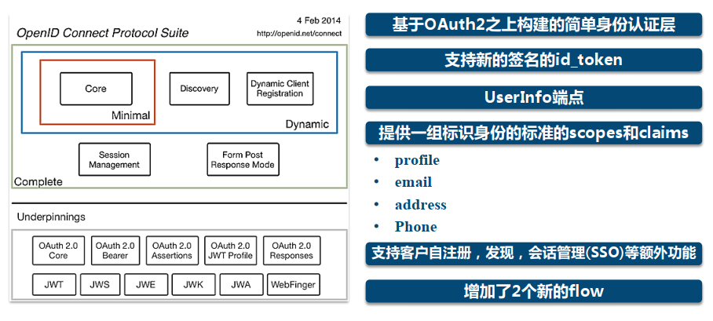


#### 下一代微服务安全架构 

##### 方案一

- 前端使用 Access Token（无意义的字符串）
- 后端使用 JWT（表征用户信息的有意义）
- 基于API网关，集中校验，进行Access Token 与 JWT的交换

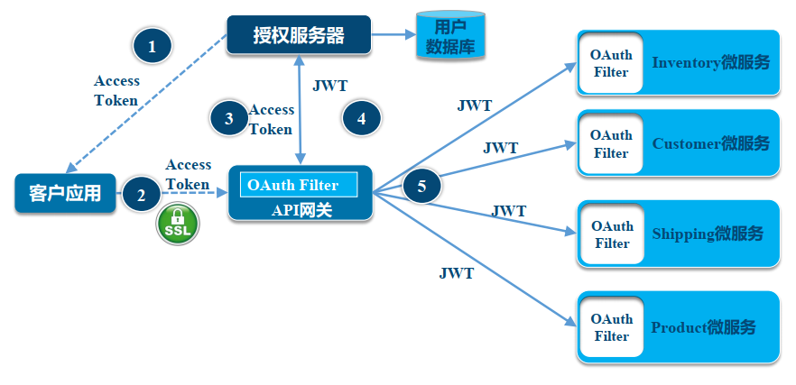


##### 方案二

- 全称加密 JWT
- API网关，直接进行自校验，不需要去授权服务器校验
- 不能吊销，只能等待JWT自己过期

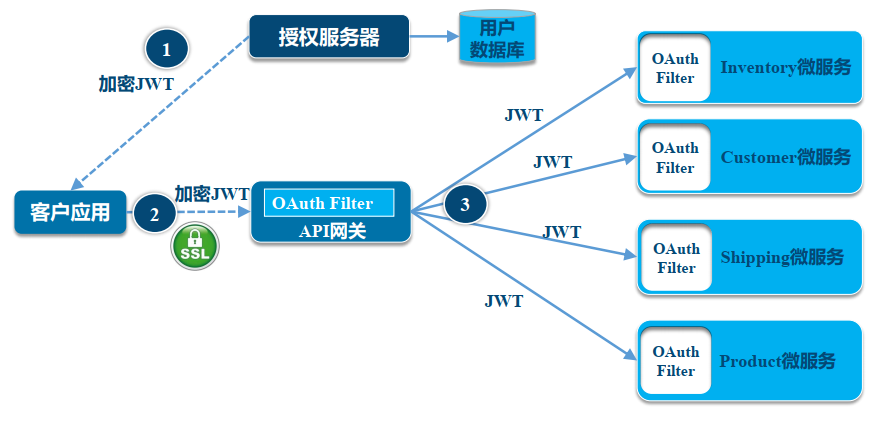


##### 方案三

- 加入缓存方式
- 优化方案一
- 基于API网关，集中校验，进行Access Token 与 JWT的交换
- 推荐使用，标准参考方案

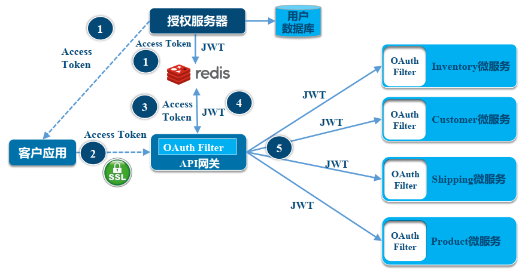


##### 生产级部署实践 

- 业务指标监控
- 接口调用性能指标
- 缓存 Caching
- HA和水平扩容（高可用，多台）

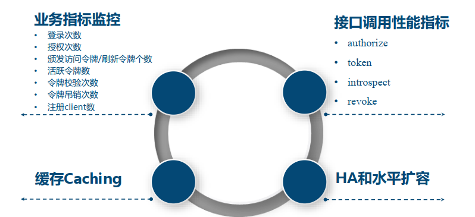


#### 参考资源和后续课程预览 

##### OAuth2/OIDC开源产品 

Redhat Keycloak（ Java）： http://www.keycloak.org

Apereo CAS（ Java）：https://www.apereo.org/projects/cas

IdentityServer（ C#）：https://identityserver.io/

OpenId-Connect-Java-Spring-Server：https://github.com/mitreid-connect/OpenIDConnect-Java-Spring-Server 

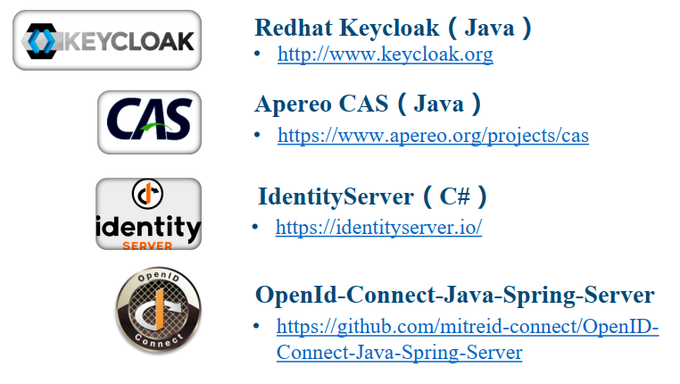


##### Spring Security OAuth2 

- Developer Guide：https://projects.spring.io/spring-security-oauth/docs/oauth2.html
- OAuth-2.0-Cookbook：
  - https://www.packtpub.com/product/oauth-2-0-cookbook/9781788295963
  - https://github.com/PacktPublishing/OAuth-2.0-Cookbook

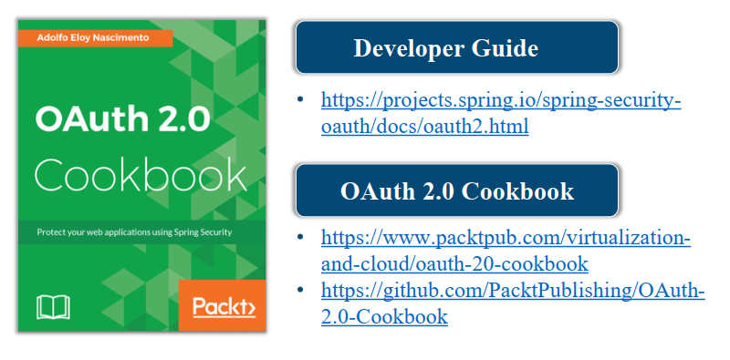


##### OAuth和OIDC库 

- Google OAuth Client Library
- ScribeJava
- Spring Security OAuth
- Nimbus OAuth SDK
- 各种语言的服务器和客户端库: https://oauth.net/code/ 


##### OAuth2/OIDC SaaS服务 

- okta: https://www.okta.com/
- Auth0: https://auth0.com/ 

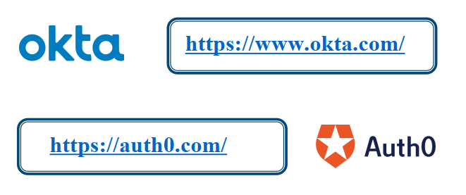


##### 规范参考 

- https://oauth.net
- https://jwt.io
- https://openid.net

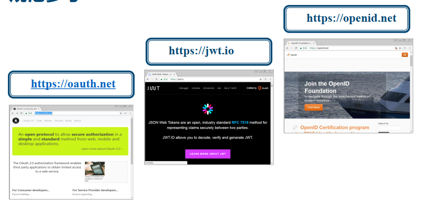


##### 参考文章 

- 理解OAuth2: http://www.ruanyifeng.com/blog/2014/05/oauth_2_0.html
- The Simplest Guide To OAuth 2.0：https://darutk.medium.com/the-simplest-guide-to-oauth-2-0-8c71bd9a15bb


##### 参考开源代码 

- OAuth2全家桶项目 :https://github.com/newnil/oauth2-family-barrel
- Apache Oltu+Shiro实现OAuth2服务器(李胜钊) :https://github.com/monkeyk/oauth2-shiro
- Using JWT with Spring Security OAuth :
  - https://www.baeldung.com/spring-security-oauth-jwt
  - https://github.com/Baeldung/spring-security-oauth


##### 课程代码 

- https://github.com/spring2go/oauth2lab


##### 后续课程预览~模块

- 服务安全
- 运行时支撑服务
- 服务容错
- 服务监控
- 服务框架
- 后台服务
- 服务部署平台

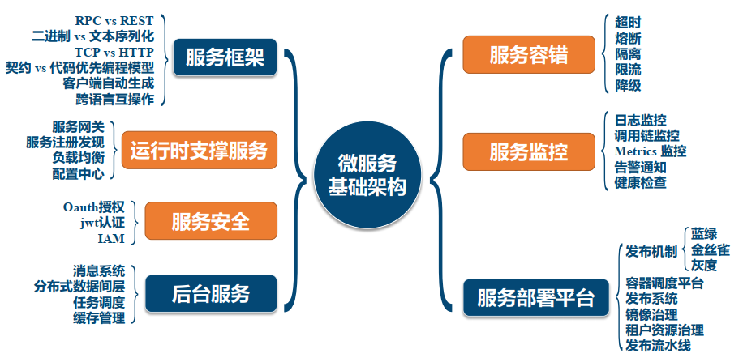


##### 后续课程预览~技术体系

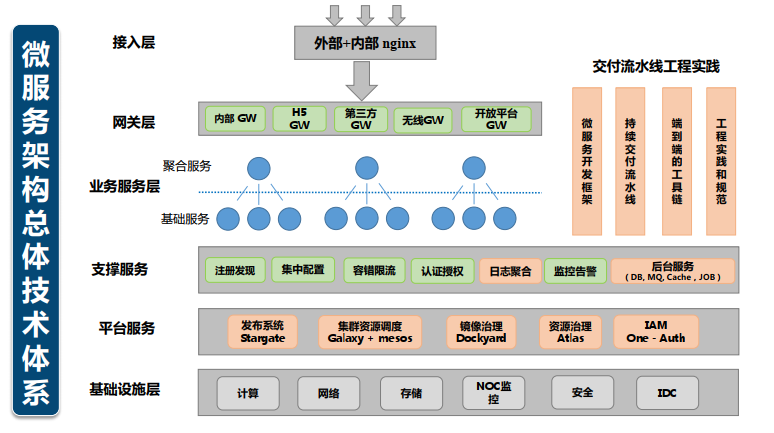


### Apollo 和 微服务配置中心架构


### Zuul 和 微服务网关架构

#### 课程概述 

- Netflix开源网关Zuul深度剖析
- 面向业务场景、架构和微服务
- Zuul核心源码分析
- Zuul定制扩展和集成
- 结合案例和实操
- 结合生产最佳实践
- Spring Cloud Zuul 简介 


##### 架构和技术栈预览 


#### Zuul网关和基本应用场景 

##### API网关是如何演化出来的？ 

- 单体应用
- 微服务

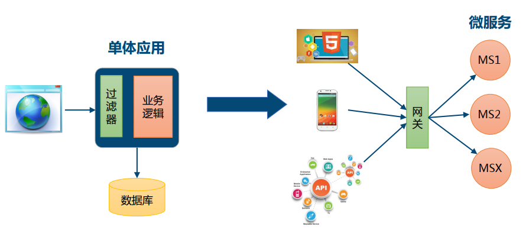


##### API网关基本功能 

- 单点入口
- 路由转发
- 限流熔断
- 日志监控
- 安全认证

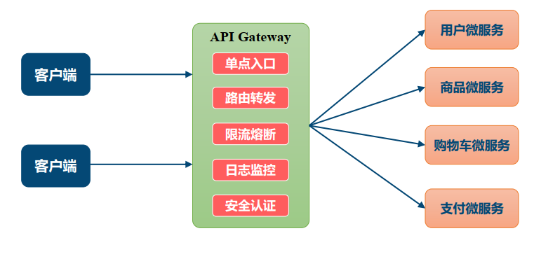


##### Netflix Zuul网关 

Netflix于2012年初开源

- https://github.com/Netflix/zuul
- Zuul is an edge service that provides dynamic routing, monitoring, resiliency, security, and more

亮点：可动态发布的过滤器机制

- Zuul在英文中是怪兽的意思，寓意看门神兽
- 2014年被Pivotal集成入Spring Cloud 体系 

Netflix前总架构师Adrian Cockcroft评价
“One of our most powerful mechanisms and somewhat overlooked NetflixOSS projects is the Zuul gateway service. ”


##### Netflix架构体系和Zuul 

- ELB 做负载均衡
- Zuul 网关

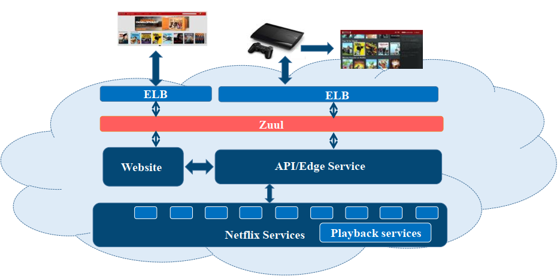


##### Netflix使用情况2017 

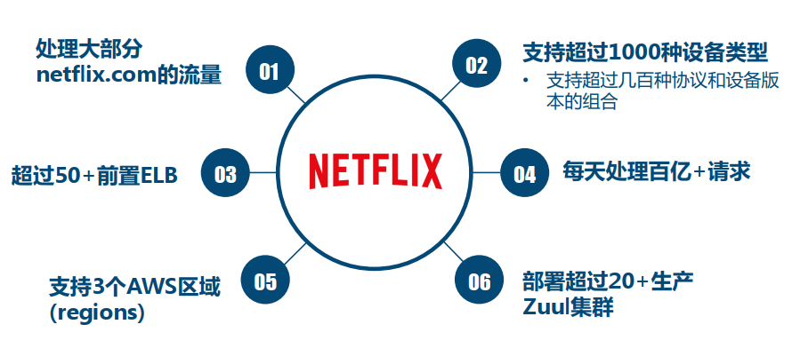


##### 国内公司落地案例 

- 携程
- 拍拍贷

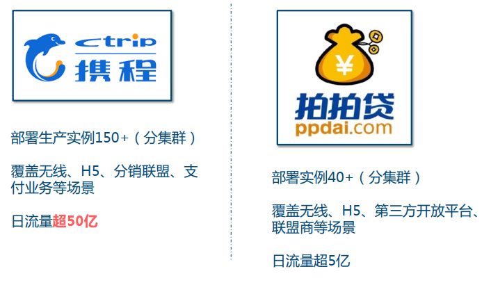


#### Zuul网关高级应用场景 

##### 红绿部署 

- 发布的时候，发布新的 V2 版本
- 通过网关，将生产流量从 V1 缓慢切换到 V2,，如果出现问题，直接切回到 V1

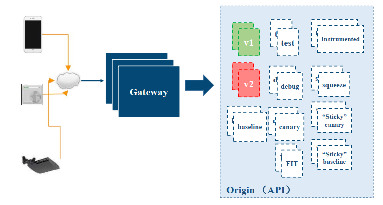


##### 开发者测试分支 

- 网关判断是开发者测试流量，就将其 导到 开发者测试集群中

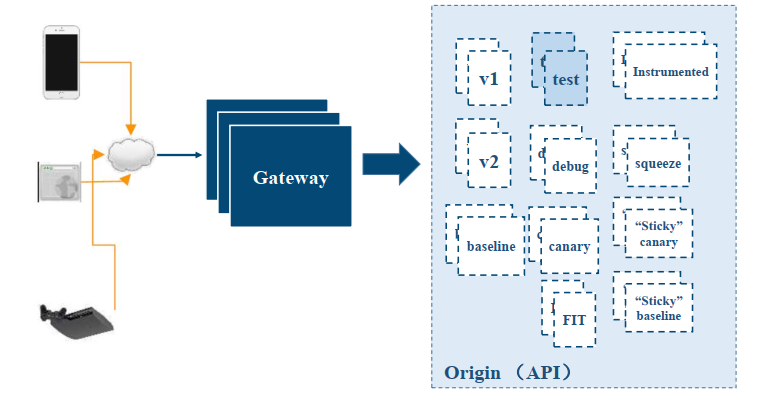


##### 埋点测试 

- 太多的埋点，直接上线，对于系统会有性能影响
- 但是有需要一些埋点，进行跟踪，就可以使用网关将流量导到埋点测试中

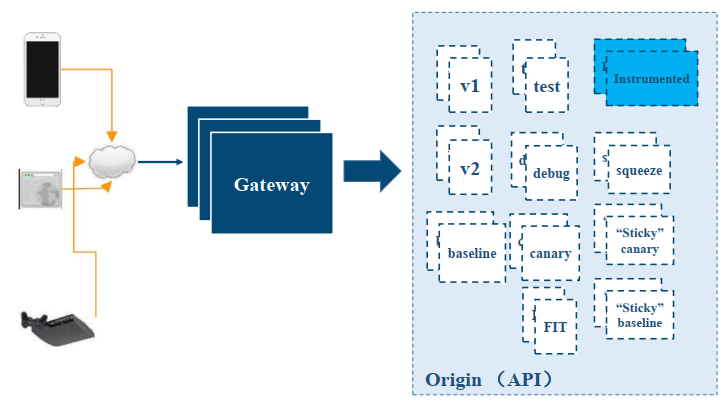


##### 压力测试 

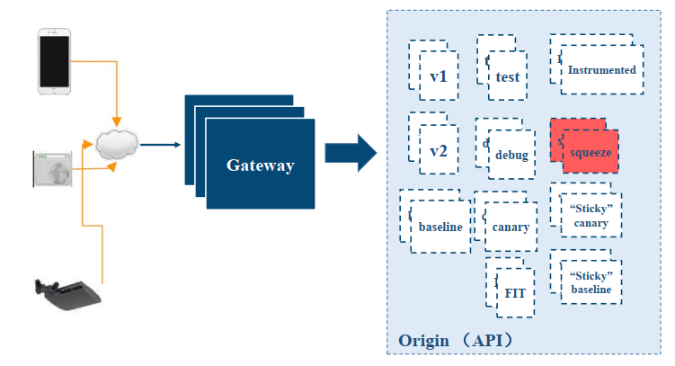


##### 调试路由 

- 开发者，添加特殊的 header，进行调试
- 有些问题，本地测不出来，需要去生产环境

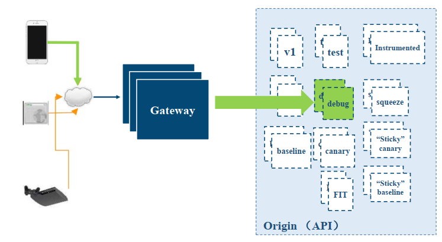


##### 金丝雀测试 

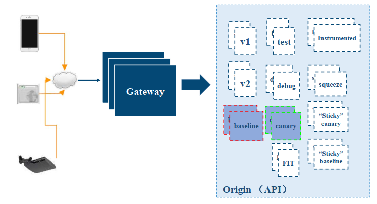


##### 粘性金丝雀 

- 根据用户的 IP信息，保证用户的访问一直都是这个集群
- 不会让用户的请求，到处跳

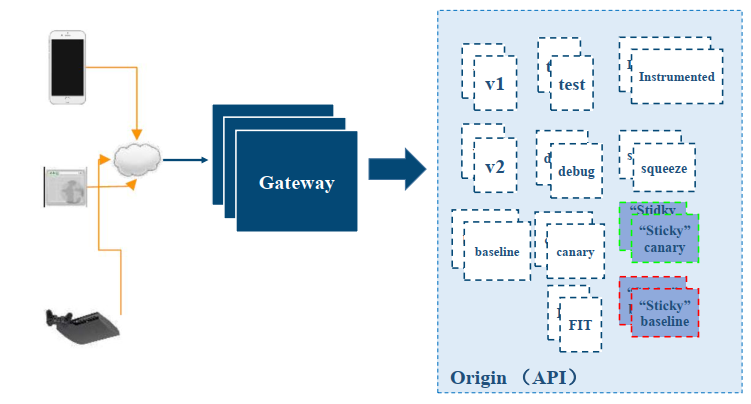


##### 失败注入测试 

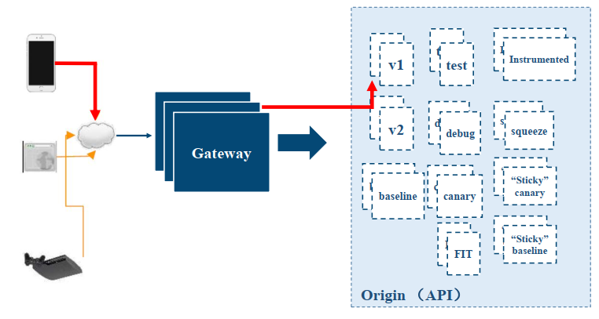


##### 降级测试 

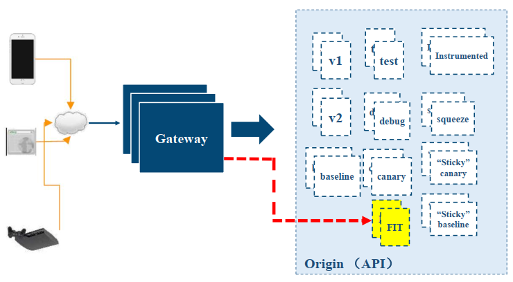


##### Netflix持续交付流水线 

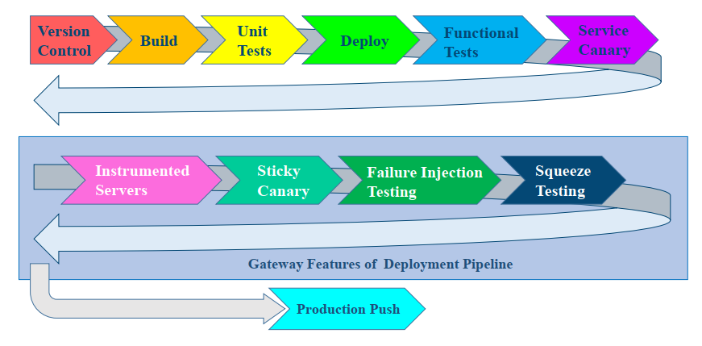


##### 跨区域高可用 

- 当某一部分出现问题后，会自动切换至其他集群

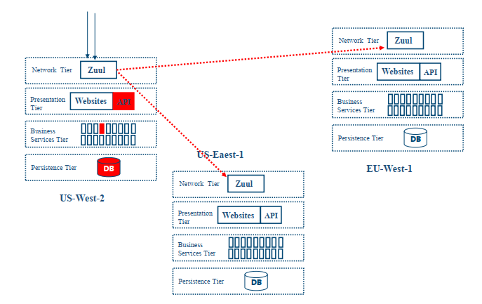


##### 防爬防攻击 

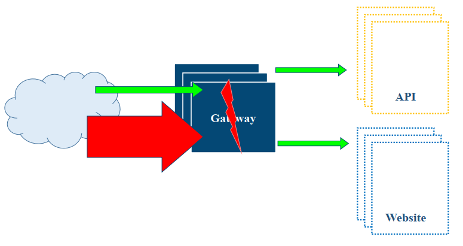


##### 健康检查和屏蔽坏节点 

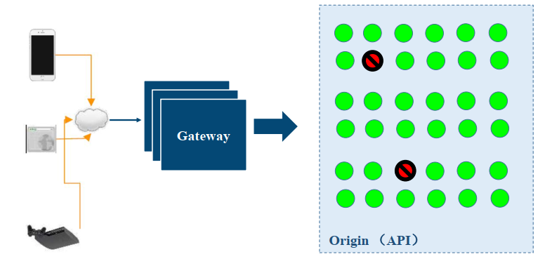


#### Zuul网关架构剖析 

##### Zuul网关架构 

- 过滤器管理模块
- 过滤器加载模块
- 网关过滤器运行时模块

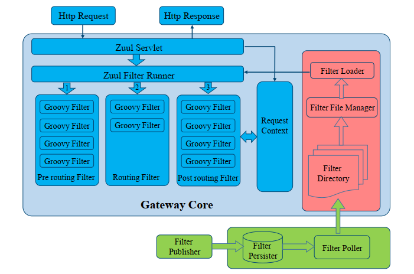


##### 请求处理生命周期 

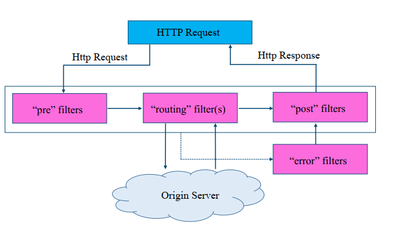


##### 过滤器关键概念

| 类型Type                             |
| ------------------------------------ |
| 定义在路由流程中，过滤器被应用的阶段 |

| 执行顺序Execution Order              |
| ------------------------------------ |
| 在同一个Type中，定义过滤器执行的顺序 |

| 条件Criteria               |
| -------------------------- |
| 过滤器被执行必须满足的条件 |

| 动作Action                           |
| ------------------------------------ |
| 如果条件满足，过滤器中将被执行的动作 |


##### 标准过滤器类型 

- Pre
- Routing
- Post
- Error

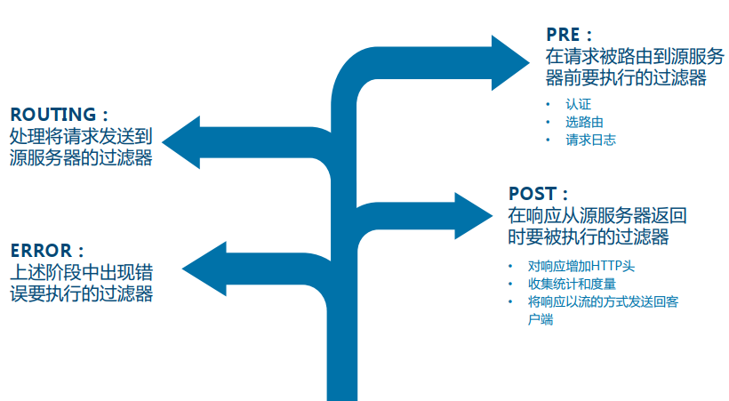


##### 过滤器样例 

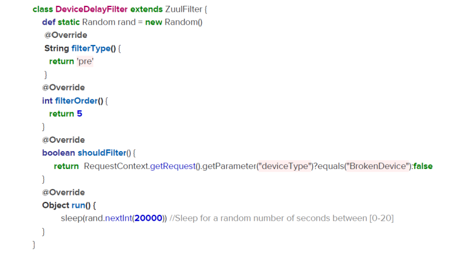


##### Filter管理 

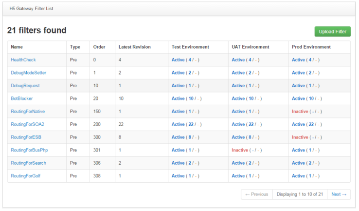


#### Zuul网关代码剖析(Code Review) 

- 网关是微服务架构的核心
- 网址：https://github.com/spring2go/s2g-zuul
- io.spring2go.zuul.servlet.InitializeServletListener
- io.spring2go.zuul.servlet.SyncZuulServlet
- io.spring2go.zuul.servlet.AsyncZuulServlet


#### Zuul过滤器管理工具(Code Review) 

- 使用 MySQL的类，io.spring2go.zuul.filters.JDBCZuulFilterDao
- 数据表：src/main/resources/db/schema.sql
- 使用 HTTP 的类，io.spring2go.zuul.filters.HttpZuulFilterDao
- 过滤器管理 类，io.spring2go.zuul.filters.FilterScriptManagerServlet
- 客户端管理页面，src/main/webapp/admin/filterLoader.jsp


#### 过滤器实验~前置过滤器

- pre


#### 过滤器实验~路由过滤器 

- route
- s2g-zuul-mobile/src/scripts/pre/TestRoute.groovy
- s2g-zuul-mobile/src/scripts/route/ExecuteRoute.groovy


#### 过滤器实验~后置过滤器 

- post
- s2g-zuul-mobile/src/scripts/post/DebugHeader.groovy
- s2g-zuul-mobile/src/scripts/post/SendResponse.groovy
- s2g-zuul-mobile/src/scripts/post/DebugResponse.groovy


#### Zuul网关对接Apollo 

##### Netflix Archaius 

- 进行对接Apollo ，是一个变色龙
- Archaius 是一个组合配置，分层级配置，上级覆盖下级

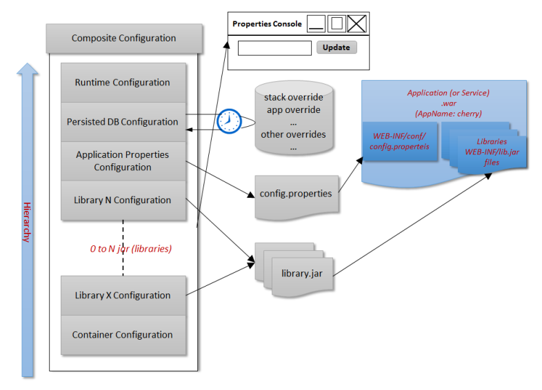


##### Zuul对接Apollo 

- 网址：https://github.com/netflix/archaius
- Apollo 支持与 Archaius 对接
- 使用Apollo 的配置作为最高级配置，将本地的Zuul配置覆盖，本地配置不生效
- Archaius 配置，不是实时生效，而是轮循的去拉，大概是30秒
- InfoBoard工具，看网关配置的值

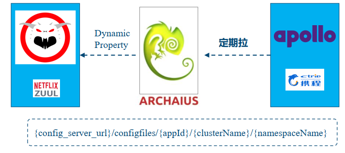


#### Zuul网关生产部署实践 

##### 参考部署架构案例 

- 负载均衡器：F5+Nginx
- Zuul网关，分集群部署，对应域名
- 集中式过滤器管理站点

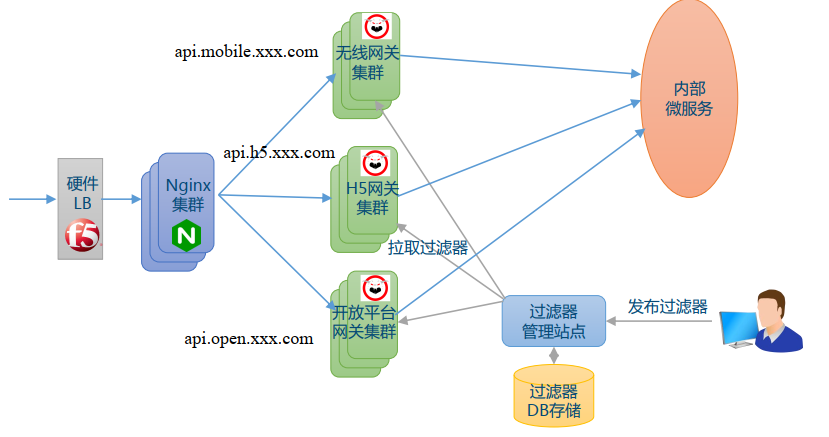


##### 分集群过滤器管理 

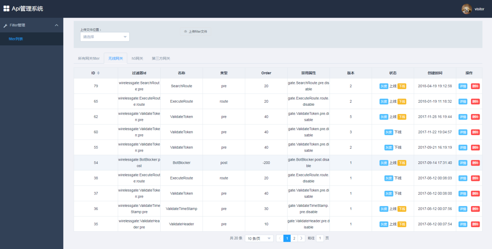


##### 网关生产级部署实践 

- 授权认证中心
- 配置中心
- 熔断（Hystric, Turbine, Eureka）
- 防爬虫系统
- 监控，Cat
- 日志，ELK
- 监控，时序数据库，KairosDB

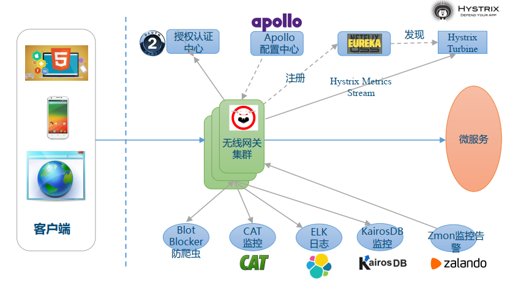


##### Zuul网关集成Hystrix实时监控 

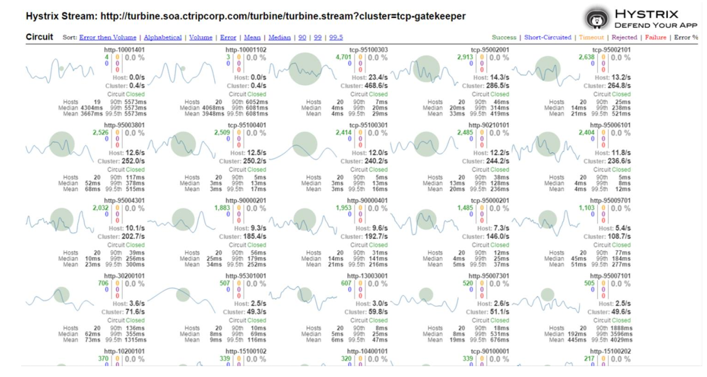


#### Zuul网关路由管理实践 

##### 基于Eureka自发现(Netflix做法) 

- 路由表在  Eureka 上，结合 Ribbon ，既可以自己发现路由表
- 根据表，得到对应的服务的 IP

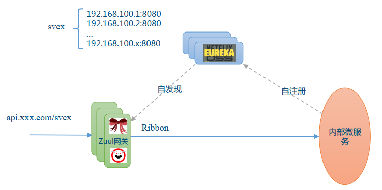


##### 基于域名做法 

- 大部分使用的方式
- 使用服务治理中心，后期定期拉取路由

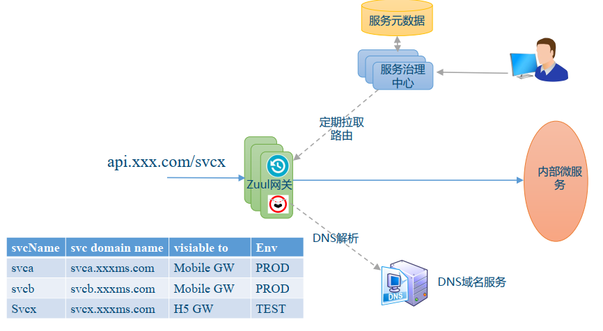


##### 简单基于Apollo做法 

- 实验与 Apollo 对接的时候，使用这种方式
- 网关配置在 Apollo 配置中心
- 网关定期拉取配置，更新配置

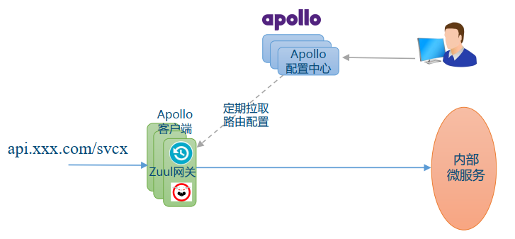


#### 基于网关的两层路由体系 

##### 内网Nginx静态配置做法 

- 两层集群
- 路由配置在服务治理中心，网关定期拉取路由表

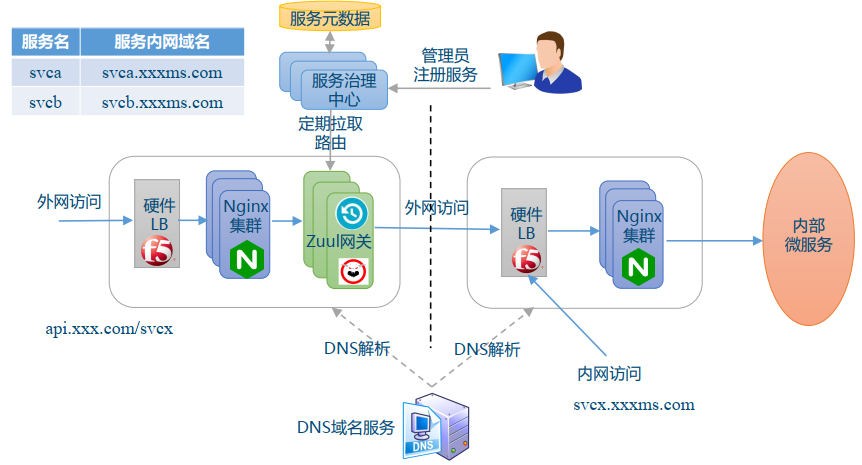


##### 内网Zuul动态配置做法 

- 使用Zuul，内部实现服务自注册，自发现
- 两层Zuul，性能会比较差
- Nginx使用c，Zuul是使用 JVM

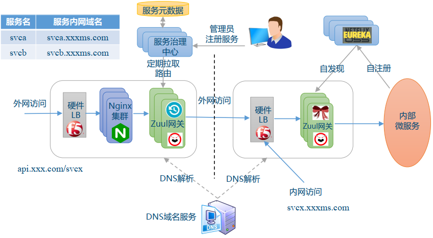


##### 内网kong动态配置做法 

- 使用 Kong 网关，提升 Zuul 的性能问题

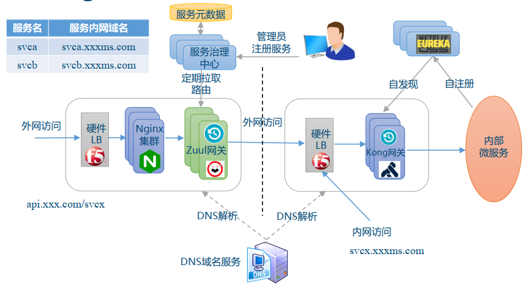


#### Spring Cloud Zuul 

##### Spring Cloud Zuul简介 

Spring Cloud Zuul = Netflix Zuul内核+Spring Boot

EnableZuulProxy标注 ，就可以启用 Zuul

**去掉了动态过滤器加载**！

建议：生产项目，直接使用Netflix Zuul，动态过滤器是一个好的特性。


#### Zuul 2.0简介 

##### Zuul 1.0~阻塞多线程模式 

- 请求进来，一次一个 Servlet 处理

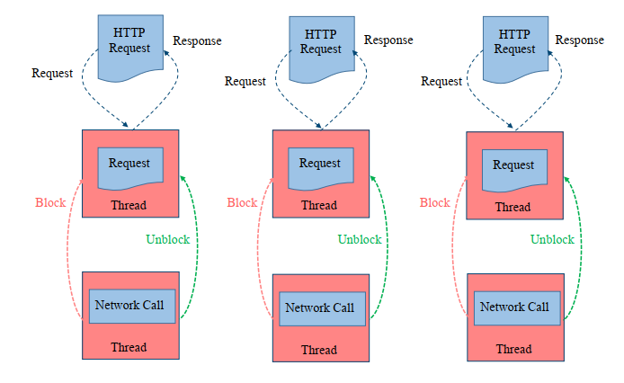


##### 阻塞同步模式优劣 

- 适用: 计算密集型(CPU bound)场景 

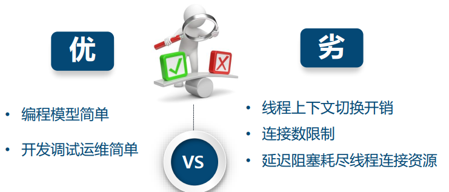


##### Zuul 2.0 ~ 非阻塞异步模式 

- 通过总线，队列，每个 Core 上一个事件环
- 前面发布事件，后面回调

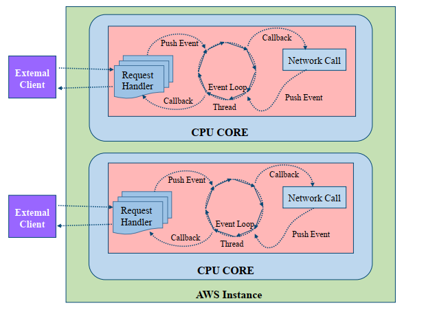


##### 非阻塞异步模式优劣 

- 适用: IO密集型(IO bound)场景 

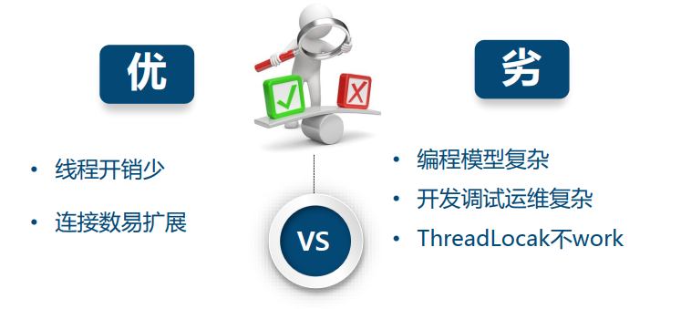


##### 性能比对 

- https://github.com/strangeloop/StrangeLoop2017/blob/master/slides/ArthurGonigberg-ZuulsJourneyToNonBlocking.pdf

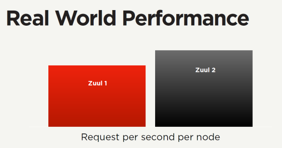


##### Zuul 2额外功能亮点 

- 服务器协议
- 弹性
- 运维

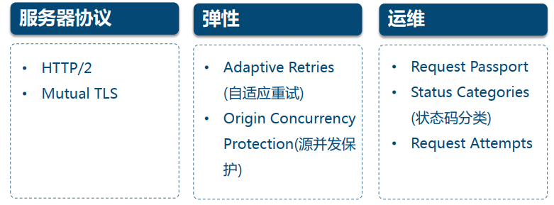


##### Zuul 2架构概览 

- 使用 Netty
- Inbound Filters
- Endpoint Filter
- Outbound Filters

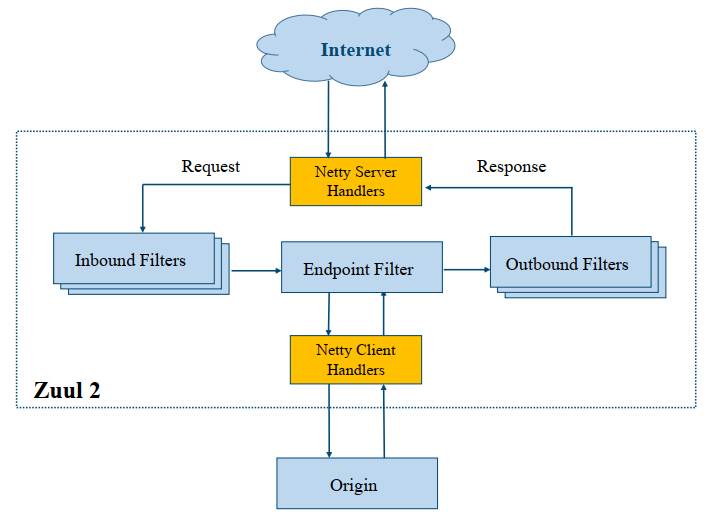


##### 个人建议 

- 生产使用 Zuul 1.0
- 关注和实验 Zuul 2.0

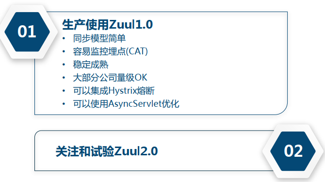


#### Zuul网关生产最佳实践 

##### Zuul网关最佳实践 (1.0版本)

- 异步AsyncServlet优化连接数（1.0本质是同步模式，使用Servlet）
- Apollo配置中心集成动态配置（不能经常部署网关和关闭启停）
- Hystrix熔断限流
  - 信号量隔离（不要使用线程隔离）
- 连接池管理
- CAT和Hystrix监控
- 过滤器调试技巧（直接先写成.java文件，然后调试完成，更改后缀为.groovy文件，上传文件之后就可以直接编译使用）
- 网关无业务逻辑
- 自助路由(需定制扩展) 


#### 参考资源和后续课程预览 

##### 参考文章

Announcing zuul edge service in the cloud
https://medium.com/netflix-techblog/announcing-zuul-edge-service-in-thecloud-ab3af5be08ee

Zuul 2 : The Netflix Journey to Asynchronous, Non-blocking Systems
https://medium.com/netflix-techblog/zuul-2-the-netflix-journey-toasynchronous-non-blocking-systems-45947377fb5c

Open Souring Zuul 2
https://medium.com/netflix-techblog/open-sourcing-zuul-2-82ea476cb2b3

Spring Cloud Zuul 
https://cloud.spring.io/spring-cloud-netflix/1.4.x/multi/multi__router_and_filter_zuul.html


##### 参考ppt

| Netflix’s Global Edge Architecture                           |
| ------------------------------------------------------------ |
| • https://www.slideshare.net/MikeyCohen1/edge-architecture-ieeeinternational-conference-on-cloud-engineering-32240 |

| Zuul @ Netflix                                               |
| ------------------------------------------------------------ |
| • https://www.slideshare.net/MikeyCohen1/zuul-netflix-springone-platform |

| Zuul’s Journey to Non-Blocking                               |
| ------------------------------------------------------------ |
| • https://github.com/strangeloop/StrangeLoop2017/blob/master/slides/ArthurGonigberg-ZuulsJourneyToNonBlocking.pdf |


##### 源码

Netflix Zuul
https://github.com/Netflix/zuul

Spring2go定制版Zuul 
https://github.com/spring2go/s2g-zuul


##### 其它开源网关产品

Kong(核心开源)
https://github.com/Kong/kong

Tyk(核心开源)
https://github.com/TykTechnologies/tyk

悟空API网关(部分开源+商业支持)
https://github.com/eolinker/GoKu-API-Gateway

小豹API网关(商业)
http://www.xbgateway.com/ 

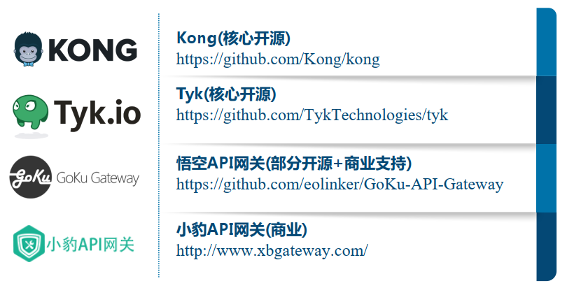


##### 后续课程预览~模块

- 服务安全
- 运行时支撑服务
- 服务容错
- 服务监控
- 服务框架
- 后台服务
- 服务部署平台


##### 后续课程预览~技术体系


### CAT 和 微服务调用链监控架构


