# Microservice Spring Boot Staffjoy

> 本文档属于微服务和云原生架构项目，基于 Spring Boot 和 Kubernetes 技术栈，
>
> 实现 Staffjoy 项目，构建微服务云原生应用 。

## 课程介绍和案例需求 

### 课程背景 

#### 课程背景

• 微服务+云原生理论和实际落地的鸿沟
• 纯教学案例过于简单
• 生产项目过于复杂
• 开发一个贴近生产的微服务+云原生教学案例 

#### eShopOnContainers 

- https://github.com/dotnet-architecture/eShopOnContainers
- 微软的开源微服务教学案例
- 基于 .net 技术栈

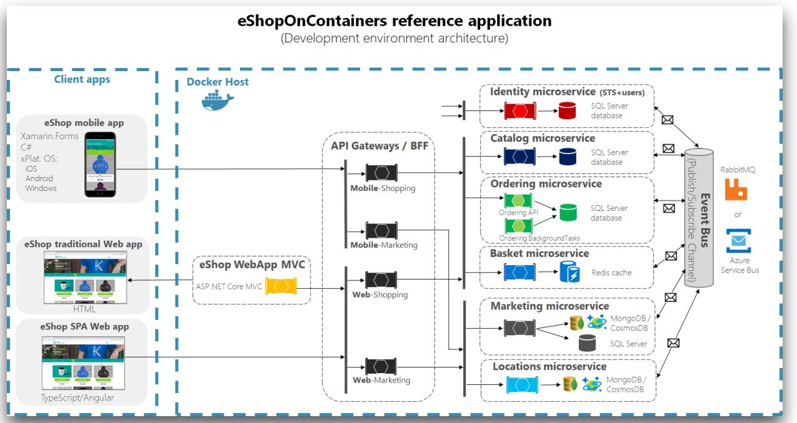

#### Microservices-Demo 

- https://github.com/GoogleCloudPlatform/microservices-demo
- 谷歌开源的云原生案例
- 基于谷歌的技术栈

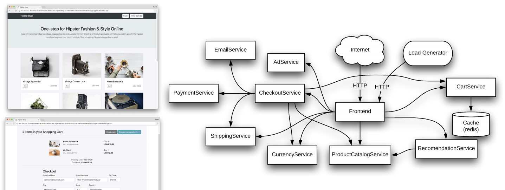

#### Piggy-Metrics 

- https://github.com/sqshq/piggymetrics
- 个人开源的微服务案例
- 在微服务基础架构中进行了实践与改版

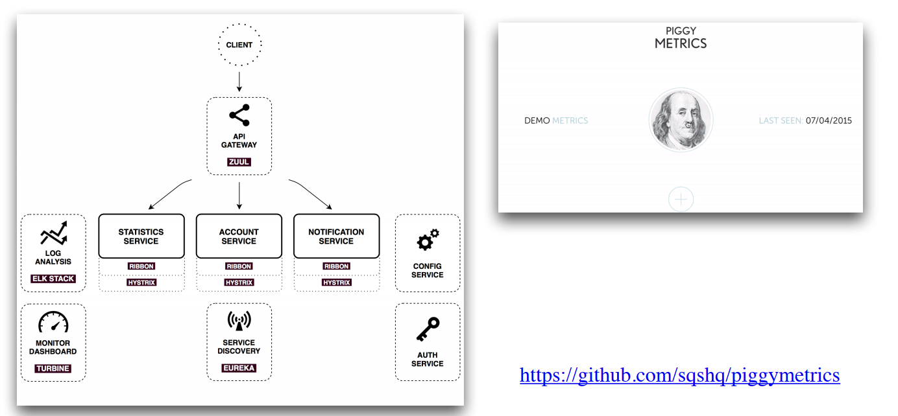

#### Staffjoy 教学版 

- https://github.com/LandRover/StaffjoyV2
- https://github.com/Staffjoy/v2
- 基于 go 语言实现，将其改版为 Spring Boot技术栈

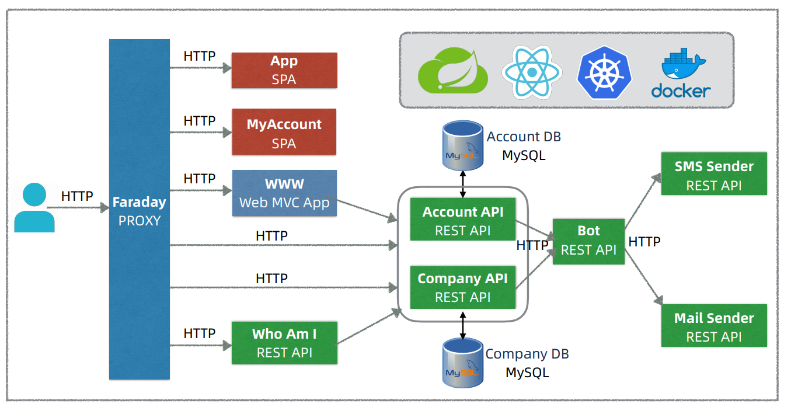

### 课程目标和主要内容 

#### 课程目标和主要内容 Dev 

1. 掌握微服务架构和前后分离架构设计
2. 掌握基于 Spring Boot 搭建微服务基础框架
3. 进一步提升 Java/Spring 微服务开发技能
4. 掌握 Spring Boot 微服务测试和相关实践
5. 理解 SaaS 多租户应用的架构和设计 

#### 课程目标和主要内容 Ops

6. 理解可运维架构理念和相关实践
7. 掌握服务容器化和容器云部署相关实践
8. 理解云时代的软件工程流程和实践 

### 案例需求 

#### Staffjoy 公司背景

- 硅谷初创公司（2015 ~ 2017）
- 工时排班（Scheduling）SaaS 服务
- 开源
  - https://github.com/staffjoy/v22. 
  - https://www.staffjoy.com/
  - 原版 Golang
  - Staffjoy 课程教学版 Java/Spring 

#### Staffjoy 应用需求

1. 功能
• 管理员 Admin 管理公司和排班
• 雇员 Worker 管理个人信息
2. 非功能
• SaaS + 定制部署
• 一键部署到 Kubernetes 容器云
• 营销和客服友好（Marketing & Customer Friendly） 

#### 首页产品介绍和注册 

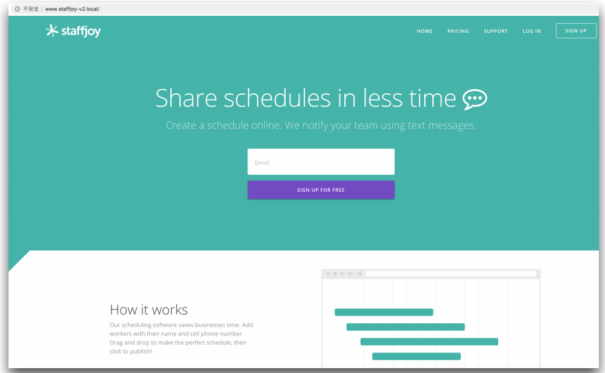

#### 产品订阅计划和报价 

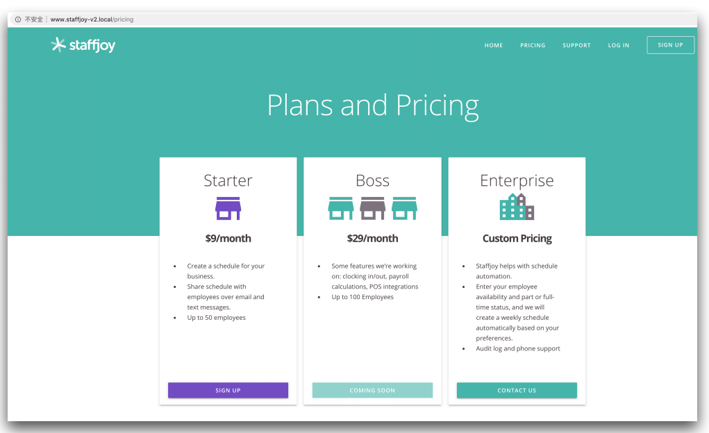

#### 登录页 

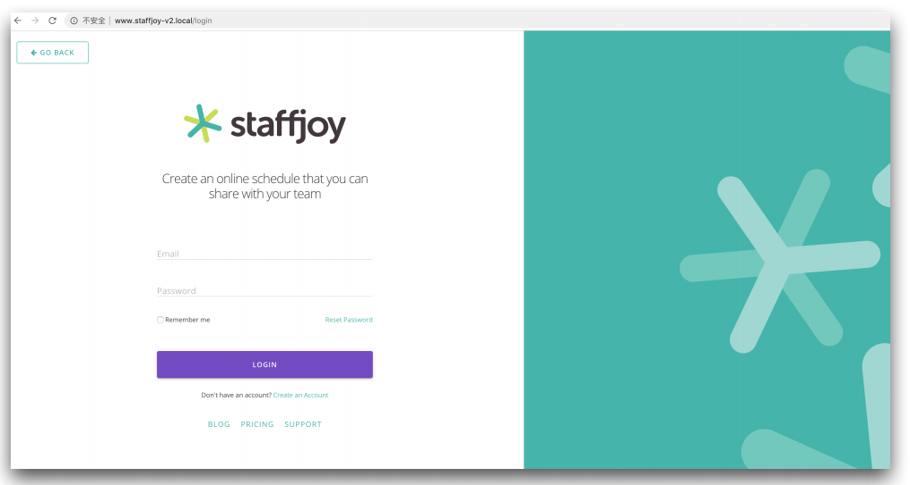

#### MyAccount 雇员账户管理页 

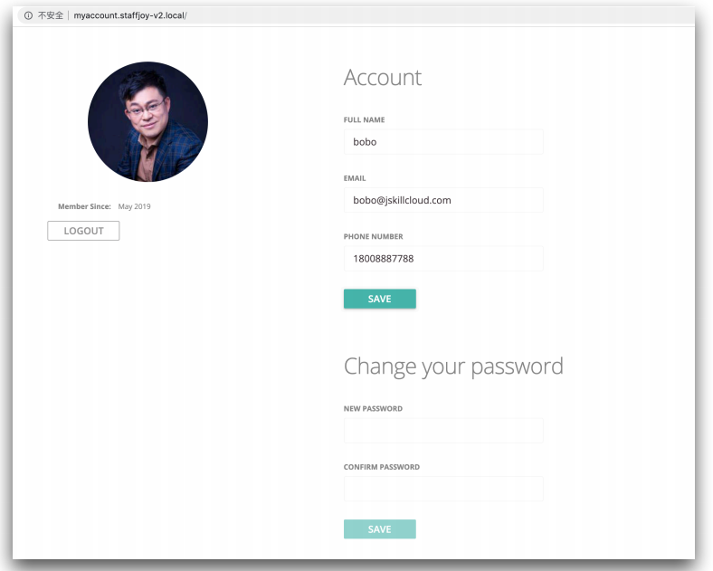

#### App 管理员排班界面 

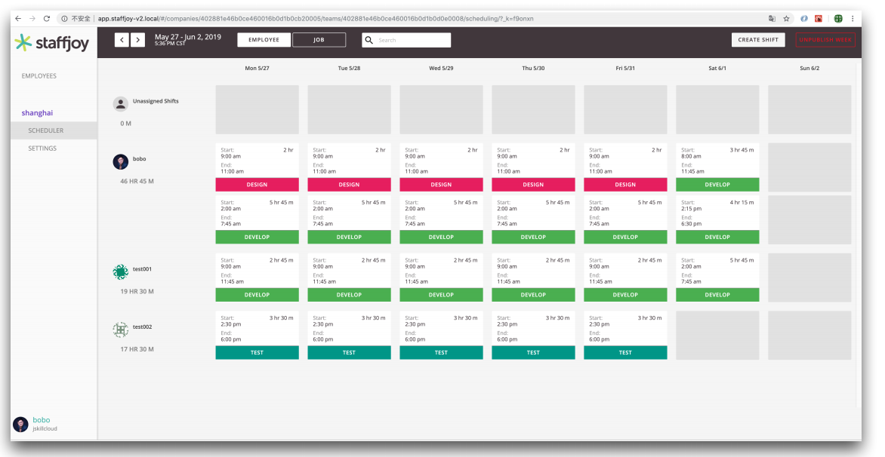

### 课程说明 

#### 课程先决条件

1. 主要面向应用开发工程师、DevOps 工程师或架构师
• 熟悉 Java/Spring、Web/HTML/JavaScript 和 MySQL

2. 主要开发工具
1. JDK 8 + Maven
2. Intellij IDEA or Eclipse STS
3. MySQL + Workbench
4. Node.js + npm
5. Docker 

#### 额外说明

1. 课程重点
• 课程目标
• 微服务和云原生架构
• Spring Boot + Kubernetes应用
2. 非重点
• 案例本身
• React.js 
3. 教学版 Staffjoy 改造
  • Golang -> Java/Spring
  • 去掉 gRPC API Gateway
  • 默认采用邮件通知
4. 教学版仅供参考！
5. Lombok 减少编码 

### 参考链接 

1. [微软微服务演示项目eShopOnContainers](https://github.com/dotnet-architecture/eShopOnContainers)
2. [谷歌微服务演示项目microservices-demo](https://github.com/GoogleCloudPlatform/microservices-demo)
3. [PiggyMetrics微服务演示项目](https://github.com/sqshq/piggymetrics)
4. [PiggyMetrics微服务演示项目改造版](https://github.com/spring2go/piggymetrics)
5. [Gitee开源项目](https://gitee.com/explore)
6. [Philip I. Thomas](https://www.linkedin.com/in/philipithomas/)
7. [Staffjoy Denouement](https://blog.staffjoy.com/denouement-abe7d26f2de0)
8. [Staffjoy开源项目](https://github.com/Staffjoy)
9. [Staffjoy V2](https://github.com/Staffjoy/v2)
10. [Staffjoy课程教学版](https://github.com/spring2go/staffjoy)
11. [Project Lombok](https://projectlombok.org/)

## 系统架构设计和技术栈选型 

### 为何采用微服务架构 

#### 观点1:单块优先 

- https://martinfowler.com/bliki/MonolithFirst.html

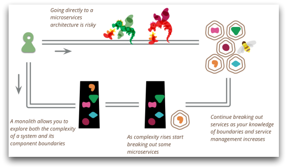

#### 微服务引入时机 

- https://martinfowler.com/bliki/MicroservicePremium.html

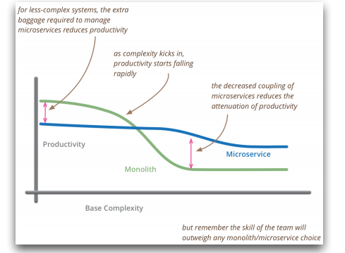

#### 观点2:微服务优先 

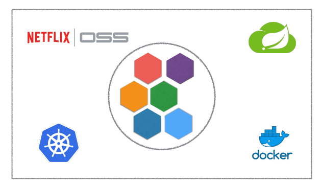

### 架构设计和技术栈选型 

