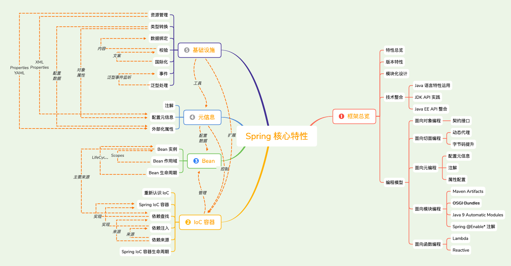
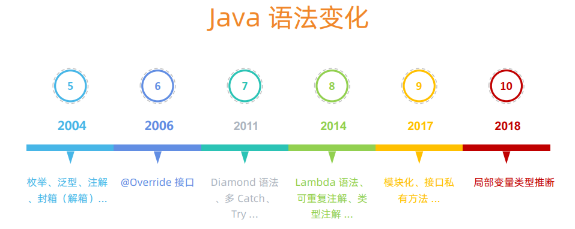
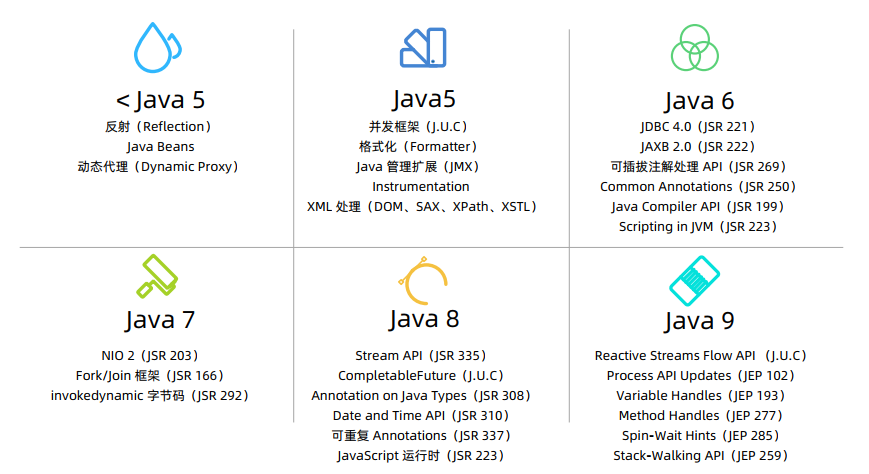
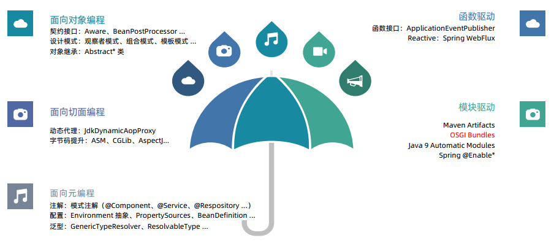
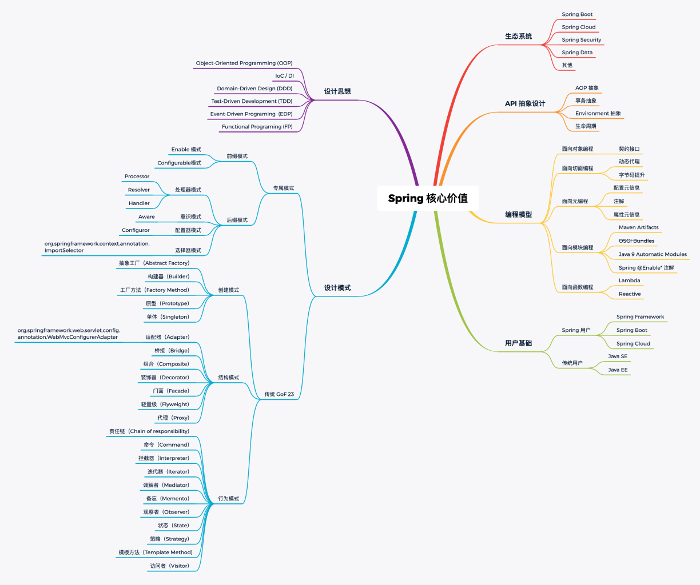
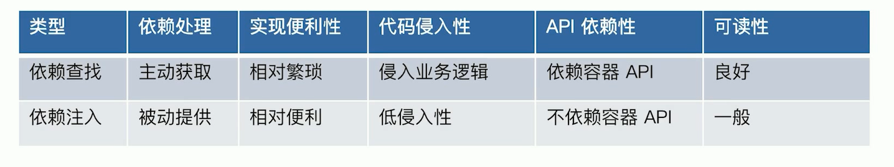
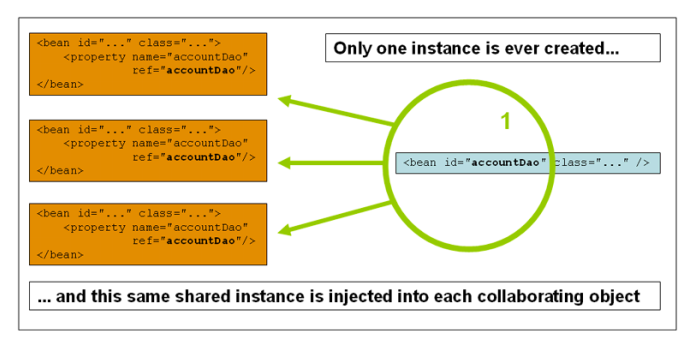
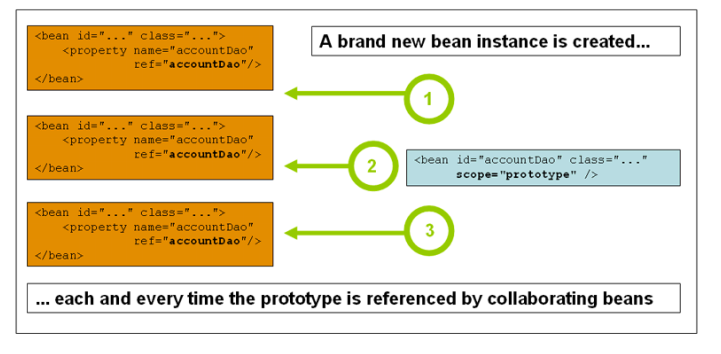

# Spring Core

## Spring Framework Overview

### Spring特性总览

#### 核心特性（core）

• IoC 容器（IoC Container）
• Spring 事件（Events）
• 资源管理（Resources）
• 国际化（i18n）
• 校验（Validation）
• 数据绑定（Data Binding）
• 类型装换（Type Conversion）
• Spring 表达式（Spring Express Language）
• 面向切面编程（AOP） 

#### 数据存储（Data Access）

• JDBC
• 事务抽象（Transactions）
• DAO 支持（DAO Support）
• O/R映射（O/R Mapping）
• XML 编列（XML Marshalling） 

#### Web技术（Web）

• Web Servlet 技术栈
	• Spring MVC
	• WebSocket
	• SockJS

• Web Reactive 技术栈
	• Spring WebFlux
	• WebClient
	• WebSocket 

#### 技术整合（Integration）

• 远程调用（Remoting）
• Java 消息服务（JMS）
• Java 连接架构（ JCA）
• Java 管理扩展（JMX）
• Java 邮件客户端（Email）
• 本地任务（Tasks）
• 本地调度（Scheduling）
• 缓存抽象（Caching）
• Spring 测试（Testing） 

#### 测试（Testing）

• 模拟对象（Mock Objects）
• TestContext 框架（TestContext Framework）
• Spring MVC 测试（Spring MVC Test）
• Web 测试客户端（WebTestClient） 

### Spring版本特性

#### java版本依赖于支持

| Spring Framework 版本 | Java 标准版 | Java 企业版           |
| --------------------- | ----------- | --------------------- |
| 1.x                   | 1.3+        | J2EE 1.3 +            |
| 2.x                   | 1.4.2+      | J2EE 1.3 +            |
| 3.x                   | 5+          | J2EE 1.4 和 Java EE 5 |
| 4.x                   | 6+          | Java EE 6 和 7        |
| 5.x                   | 8+          | Java EE 7             |

### Spring模块化设计

#### Spring模块化设计（Modular）

• spring-aop
• spring-aspects
• spring-context-indexer
• spring-context-support
• spring-context
• spring-core
• spring-expression
• spring-instrument
• spring-jcl
• spring-jdbc
• spring-jms
• spring-messaging
• spring-orm
• spring-oxm
• spring-test
• spring-tx
• spring-web
• spring-webflux
• spring-webmvc
• spring-websocket 

### Spring对java语言特性运用

#### java语法变化

java-5-2004

- 枚举，泛型，注解，封箱（解箱）

java-6-2006

- @Override接口

java-7-2011

- Diamond语言，多Catch、Try...

java-8-2014

- Lambda语言，可重复注解，类型注解

java-9-2017

- 模块化，接口私有方法

java-10-2018

- 局部变量类型推断

#### Spring对java语言特性运用

• Java 5 语法特性

| 语法特性               | Spring 支持版本 | 代表实现                   |
| ---------------------- | --------------- | -------------------------- |
| 注解（Annotation）     | 1.2 +           | @Transactional             |
| 枚举（Enumeration）    | 1.2 +           | Propagation                |
| for-each 语法          | 3.0 +           | AbstractApplicationContext |
| 自动装箱（AutoBoxing） | 3.0 +           |                            |
| 泛型（Generic）        | 3.0 +           | ApplicationListener        |

• Java 6 语法特性

| 语法特性       | Spring 支持版本 | 代表实现 |
| -------------- | --------------- | -------- |
| 接口 @Override | 4.0 +           |          |

• Java 7 语法特性 

| 语法特性                | Spring 支持版本 | 代表实现                    |
| ----------------------- | --------------- | --------------------------- |
| Diamond 语法            | 5.0 +           | DefaultListableBeanFactory  |
| try-with-resources 语法 | 5.0 +           | ResourceBundleMessageSource |

• Java 8 语法特性 

| 语法特性    | Spring 支持版本 | 代表实现                      |
| ----------- | --------------- | ----------------------------- |
| Lambda 语法 | 5.0 +           | PropertyEditorRegistrySupport |

### Spring对JDK API实践

#### JDK 核心API

#### Spring对JDK API实践

• < Java 5 API 

| API 类型                  | Spring 支持版本 | 代表实现                   |
| ------------------------- | --------------- | -------------------------- |
| 反射（Reflection）        | 1.0 +           | MethodMatcher              |
| Java Beans                | 1.0 +           | CachedIntrospectionResults |
| 动态代理（Dynamic Proxy） | 1.0 +           | JdkDynamicAopProxy         |

• Java 5 API 

| API 类型               | Spring 支持版本 | 代表实现                   |
| ---------------------- | --------------- | -------------------------- |
| XML 处理（DOM,SAX...） | 1.0 +           | XmlBeanDefinitionReader    |
| Java 管理扩展（JMX）   | 1.2 +           | @ManagedResource           |
| Instrumentation        | 2.0 +           | InstrumentationSavingAgent |
| 并发框架（J.U.C）      | 3.0 +           | ThreadPoolTaskScheduler    |
| 格式化（Formatter）    | 3.0 +           | DateFormatter              |

• Java 6 API 

| API 类型                       | Spring 支持版本 | 代表实现                           |
| ------------------------------ | --------------- | ---------------------------------- |
| JDBC 4.0（JSR 221）            | 1.0 +           | JdbcTemplate                       |
| Common Annotations（JSR 250 ） | 2.5 +           | CommonAnnotationBeanPostProcesso r |
| JAXB 2.0（JSR 222）            | 3.0 +           | Jaxb2Marshaller                    |
| Scripting in JVM（JSR 223）    | 4.2 +           | StandardScriptFactory              |
| 可插拔注解处理 API（JSR 269）  | 5.0 +           | @Indexed                           |
| Java Compiler API（JSR 199）   | 5.0 +           | TestCompiler（单元测试）           |

• Java 7 API 

| API 类型                  | Spring 支持版本 | 代表实现                |
| ------------------------- | --------------- | ----------------------- |
| Fork/Join 框架（JSR 166） | 3.1 +           | ForkJoinPoolFactoryBean |
| NIO 2（JSR 203）          | 4.0 +           | PathResource            |

• Java 8 API 

| API 类型                      | Spring 支持版本 | 代表实现                              |
| ----------------------------- | --------------- | ------------------------------------- |
| Date and Time API（JSR 310）  | 4.0 +           | DateTimeContext                       |
| 可重复 Annotations（JSR 337） | 4.0 +           | @PropertySources                      |
| Stream API（JSR 335）         | 4.2 +           | StreamConverter                       |
| CompletableFuture（J.U.C）    | 4.2 +           | CompletableToListenableFutureAdapt er |

### Spring对java EE API整合

#### Spring对java EE API整合

• Java EE Web 技术相关 

| JSR 规范                  | Spring 支持版本 | 代表实现                           |
| ------------------------- | --------------- | ---------------------------------- |
| Servlet + JSP(JSR 035）   | 1.0 +           | DispatcherServlet                  |
| JSTL(JSR 052)             | 1.0 +           | JstlView                           |
| JavaServer Faces(JSR 127) | 1.1 +           | FacesContextUtils                  |
| Portlet(JSR 168)          | 2.0 - 4.2       | DispatcherPortlet                  |
| SOAP(JSR 067)             | 2.5 +           | SoapFaultException                 |
| WebServices(JSR 109)      | 2.5 +           | CommonAnnotationBeanPostProcesso r |
| WebSocket(JSR 356)        | 4.0 +           | WebSocketHandler                   |

• Java EE 数据存储相关 

| JSR 规范                   | Spring 支持版本 | 代表实现              |
| -------------------------- | --------------- | --------------------- |
| JDO(JSR 12)                | 1.0 - 4.2       | JdoTemplate           |
| JTA(JSR 907)               | 1.0 +           | JtaTransactionManager |
| JPA(EJB 3.0 JSR 220的成员) | 2.0 +           | JpaTransactionManager |
| Java Caching API(JSR 107)  | 3.2 +           | JCacheCache           |

• Java EE Bean 技术相关 

| JSR 规范                               | Spring 支持版本 | 代表实现                              |
| -------------------------------------- | --------------- | ------------------------------------- |
| JMS(JSR 914)                           | 1.1 +           | JmsTemplate                           |
| EJB 2.0 (JSR 19)                       | 1.0 +           | AbstractStatefulSessionBean           |
| Dependency Injection for Java(JSR 330) | 2.5 +           | AutowiredAnnotationBeanPostProcess or |
| Bean Validation(JSR 303)               | 3.0 +           | LocalValidatorFactoryBean             |

• 资源相关 

• JSR 官方网址：https://jcp.org/
• 小马哥 JSR 收藏：https://github.com/mercyblitz/jsr
• Spring 官方文档根路径：https://docs.spring.io/spring 

### Spring编程模型

#### Spring编程模型

- 面向对象编程
- 面向切面编程
- 面向元编程
- 函数驱动
- 模块驱动

### Spring核心价值

- 生态系统
- API抽象设计
- 编程模型
- 设计思想
- 设计模式
- 用户基础

### 面试题

#### 什么是 Spring Framework？ 

答：Spring makes it easy to create Java enterprise applications. It provides everything you need to embrace the Java language in an enterprise environment, with support for Groovy and Kotlin as alternative languages on the JVM, and with the flexibility to create many kinds of architectures depending on an application’s needs. 

#### Spring Framework 有哪些核心模块？ 

答：
spring-core：Spring 基础 API 模块，如资源管理，泛型处理
spring-beans：Spring Bean 相关，如依赖查找，依赖注入
spring-aop : Spring AOP 处理，如动态代理，AOP 字节码提升
spring-context : 事件驱动、注解驱动，模块驱动等
spring-expression：Spring 表达式语言模块 

#### Spring Framework 的优势和不足是什么? 

答：这个问题的答案将贯穿整个系列 

## 重新认识IoC

### IoC发展简介

• 什么是 IoC ？ 

来源：https://en.wikipedia.org/wiki/Inversion_of_control 

In software engineering, inversion of control (IoC) is a programming principle. IoC inverts the flow of control as compared to traditional control flow. In IoC, custom-written portions of a computer program receive the flow of control from a generic framework. A software architecture with this design inverts control as compared to traditional procedural programming: in traditional programming, the custom code that expresses the purpose of the program calls into reusable libraries to take care of generic tasks, but with inversion of control, it is the framework that calls into the custom, or task-specific, code. 

• IoC 的简史

• 1983年，Richard E. Sweet 在《The Mesa Programming Environment》中提出“Hollywood Principle”（好莱坞原则）

• 1988年，Ralph E. Johnson & Brian Foote 在《Designing Reusable Classes》中提出“Inversion of control”（控制反转）

• 1996年，Michael Mattsson 在《Object-Oriented Frameworks, A survey of methodological issues》中将“Inversion of control”命名为 “Hollywood principle”

• 2004年，Martin Fowler 在《Inversion of Control Containers and the Dependency Injection pattern》中提出了自己对 IoC 以及 DI 的理解

• 2005年，Martin Fowler 在 《InversionOfControl》对 IoC 做出进一步的说明 

### IoC主要实现策略

**• 维基百科**（https://en.wikipedia.org/wiki/Inversion_of_control） 

Implementation techniques 小节的定义：

“In object-oriented programming, there are several basic techniques to implement inversion of control. These are:
• Using a service locator pattern
• Using dependency injection, for example
	• Constructor injection
	• Parameter injection
	• Setter injection
	• Interface injection
• Using a contextualized lookup
• Using template method design pattern
• Using strategy design pattern” 

• **《Expert One-on-One™ J2EE™ Development without EJB™》**提到的主要实现策略： （来自“Chapter 6. Lightweight Containers and Inversion of Control” 节选 ）

“IoC is a broad concept that can be implemented in different ways. There are two main types:

• Dependency Lookup: The container provides callbacks to components, and a lookup context. This is the EJB and Apache Avalon approach. It leaves the onus on each component to use container APIs to look up resources and collaborators. The Inversion of Control is limited to the container invoking callback methods that application code can use to obtain resources.

• Dependency Injection: Components do no look up; they provide plain Java methods enabling the container to resolve dependencies. The container is wholly responsible for wiring up components, passing resolved objects in to JavaBean properties or constructors. Use of JavaBean properties is called Setter Injection; use of constructor arguments is called Constructor Injection.”

### IoC容器的职责

• **维基百科**（https://en.wikipedia.org/wiki/Inversion_of_control）

在 Overview 小节中提到：
“Inversion of control serves the following design purposes:
• To decouple the execution of a task from implementation.
• To focus a module on the task it is designed for.
• To free modules from assumptions about how other systems do what they do and instead rely on contracts.
• To prevent side effects when replacing a module.

Inversion of control is sometimes facetiously referred to as the "Hollywood Principle: Don't call us, we'll call you".” 

• 通用职责

• 依赖处理
	• 依赖查找
	• 依赖注入

• 生命周期管理
	• 容器
	• 托管的资源（Java Beans 或其他资源）

• 配置
	• 容器
	• 外部化配置
	• 托管的资源（Java Beans 或其他资源） 

### IoC容器的实现

• 主要实现

• Java SE
	• Java Beans
	• Java ServiceLoader SPI
	• JNDI（Java Naming and Directory Interface）

• Java EE
	• EJB（Enterprise Java Beans）
	• Servlet

• 开源
	• Apache Avalon（http://avalon.apache.org/closed.html）
	• PicoContainer（http://picocontainer.com/）
	• Google Guice（https://github.com/google/guice）
	• Spring Framework（https://spring.io/projects/spring-framework） 

### 传统IoC容器的实现

• Java Beans 作为 IoC 容器

• 特性
	• 依赖查找
	• 生命周期管理
	• 配置元信息
	• 事件
	• 自定义
	• 资源管理
	• 持久化

• 规范
	• JavaBeans：https://www.oracle.com/technetwork/java/javase/tech/index-jsp-138795.html
	• BeanContext：https://docs.oracle.com/javase/8/docs/technotes/guides/beans/spec/beancontext.html 

### 轻量级IoC容器

• **《Expert One-on-One™ J2EE™ Development without EJB™》**认为轻量级容器的**特征**：“ 

• A container that can manage application code. 

• A container that is quick to start up.

• A container that doesn't require any special deployment steps to deploy objects within it.

• A container that has such a light footprint and minimal API dependencies that it can be run in a variety of environments.

• A container that sets the bar for adding a managed object so low in terms of deployment effort and performance overhead that it's possible to deploy and manage fine-grained objects, as well as coarse-grained components.” 

• **《Expert One-on-One™ J2EE™ Development without EJB™》**认为轻量级容器的**好处**：

• Escaping the monolithic container

• Maximizing code reusability

• Greater object orientation

• Greater productivity

• Better testability 

### 依赖查找 VS 依赖注入

• 优劣对比

### 构造器注入 VS Setter注入

• **Spring Framework** 对构造器注入与 Setter 的论点：

“The Spring team generally advocates constructor injection, as it lets you implement application components as immutable objects and ensures that required dependencies are not null. Furthermore, constructor-injected components are always returned to the client (calling) code in a fully initialized state. As a side note, a large number of constructor arguments is a bad code smell, implying that the class likely has too many responsibilities and should be refactored to better address proper separation of concerns.

Setter injection should primarily only be used for optional dependencies that can be assigned reasonable default values within the class. Otherwise, not-null checks must be performed everywhere the code uses the dependency. One benefit of setter injection is that setter methods make objects of that class amenable to reconfiguration or re-injection later. Management through JMX MBeans is therefore a compelling use case for setter injection.” 

• **《Expert One-on-One™ J2EE™ Development without EJB™》**认为 Setter 注入的**优点**：

“**Advantages of Setter Injection** include:

• JavaBean properties are well supported in IDEs.

• JavaBean properties are self-documenting.

• JavaBean properties are inherited by subclasses without the need for any code.

• It's possible to use the standard JavaBeans property-editor machinery for type conversions if necessary.

• Many existing JavaBeans can be used within a JavaBean-oriented IoC container without modification.

• If there is a corresponding getter for each setter (making the property readable, as well as writable), it is possible to ask the component for its current configuration state. This is particularly useful if we want to persist that state: for example, in an XML form or in a database. With Constructor Injection, there's no way to find the current state.

• Setter Injection works well for objects that have default values, meaning that not all properties need to be supplied at runtime.” 

• **《Expert One-on-One™ J2EE™ Development without EJB™》**认为 Setter 注入的**缺点**：

“**Disadvantages** include:
The order in which setters are called is not expressed in any contract. Thus, we sometimes need to invoke a method after the last setter has been called to initialize the component. Spring provides the org.springframework.beans.factory.InitializingBean interface for this; it also provides the ability to invoke an arbitrary init method. However, this contract must be documented to ensure correct use outside a container.

Not all the necessary setters may have been called before use. The object can thus be left partially configured.” 

• **《Expert One-on-One™ J2EE™ Development without EJB™》**认为构造器注入的**优点**：

“**Advantages of Constructor Injection** include:
Each managed object is guaranteed to be in a consistent state—fully configured—before it can be invoked in any business methods. This is the primary motivation of Constructor Injection. (However, it is possible to achieve the same result with JavaBeans via dependency checking, as Spring can optionally perform.) There's no need for initialization methods.

There may be slightly less code than results from the use of multiple JavaBean methods, although will be no difference in complexity.” 

• **《Expert One-on-One™ J2EE™ Development without EJB™》**认为构造器注入的**缺点**：

“**Disadvantages** include:

• Although also a Java-language feature, multi-argument constructors are probably less common in existing code than use of JavaBean properties.

• Java constructor arguments don't have names visible by introspection.

• Constructor argument lists are less well supported by IDEs than JavaBean setter methods.

• Long constructor argument lists and large constructor bodies can become unwieldy.

• Concrete inheritance can become problematic.

• Poor support for optional properties, compared to JavaBeans

• Unit testing can be slightly more difficult

• When collaborators are passed in on object construction, it becomes impossible to change the reference held in the object. ” 

### 面试题

#### 什么是 IoC ？ 

答：简单地说，IoC 是反转控制，类似于好莱坞原则，主要有依赖查找和依赖注入实现 

#### 依赖查找和依赖注入的区别？ 

答：**依赖查找**是主动或手动的依赖查找方式，通常需要依赖容器或标准 API实现。

而**依赖注入**则是手动或自动依赖绑定的方式，无需依赖特定的容器和API 

#### Spring 作为 IoC 容器有什么优势？ 

答：
典型的 IoC 管理，依赖查找和依赖注入
AOP 抽象
事务抽象
事件机制
SPI 扩展
强大的第三方整合
易测试性
更好的面向对象 

## Spring IoC容器概述

### Spring Ioc 依赖查找

• 根据 Bean 名称查找
	• 实时查找
	• 延迟查找

• 根据 Bean 类型查找
	• 单个 Bean 对象
	• 集合 Bean 对象

• 根据 Bean 名称 + 类型查找

• 根据 Java 注解查找
	• 单个 Bean 对象
	• 集合 Bean 对象 

**@link**:\MyJava\thinking-spring\ioc-container-overview\src\main\java\org\copydays\thinking\spring\ioc\overview\dependency\lookup

### Spring Ioc 依赖注入

• 根据 Bean 名称注入

• 根据 Bean 类型注入
	• 单个 Bean 对象
	• 集合 Bean 对象

• 注入容器內建 Bean 对象

• 注入非 Bean 对象

• 注入类型
	• 实时注入
	• 延迟注入 

### Spring Ioc 依赖来源

• 自定义 Bean

• 容器內建 Bean 对象

• 容器內建依赖 

### Spring Ioc 配置元信息

• Bean 定义配置
	• 基于 XML 文件
	• 基于 Properties 文件
	• 基于 Java 注解
	• 基于 Java API（专题讨论）

• IoC 容器配置
	• 基于 XML 文件
	• 基于 Java 注解
	• 基于 Java API （专题讨论）

• 外部化属性配置
	• 基于 Java 注解 

### Spring Ioc 容器

• BeanFactory 和 ApplicationContext 谁才是 Spring IoC 容器？ 

 The [`BeanFactory`](https://docs.spring.io/spring-framework/docs/5.2.2.RELEASE/javadoc-api/org/springframework/beans/factory/BeanFactory.html) interface provides an advanced configuration mechanism capable of managing any type of object. [`ApplicationContext`](https://docs.spring.io/spring-framework/docs/5.2.2.RELEASE/javadoc-api/org/springframework/context/ApplicationContext.html) is a sub-interface of `BeanFactory`.

### Spring 应用上下文

• ApplicationContext 除了 IoC 容器角色，还有提供：
	• 面向切面（AOP）
	• 配置元信息（Configuration Metadata）
	• 资源管理（Resources）
	• 事件（Events）
	• 国际化（i18n）
	• 注解（Annotations）
	• Environment 抽象（Environment Abstraction）

https://docs.spring.io/spring/docs/5.2.2.RELEASE/spring-framework-reference/core.html#beans-introduction 

### 使用Spring Ioc 容器

• BeanFactory 是 Spring 底层 IoC 容器

• ApplicationContext 是具备应用特性的 BeanFactory 超集 

### Spring Ioc 容器生命周期

• 启动

• 运行

• 停止 

### 面试题

#### 什么是 Spring IoC 容器？ 

答：Spring Framework implementation of the Inversion of Control (IoC) principle. IoC is also known as dependency injection (DI). It is a process whereby objects define their dependencies (that is, the other objects they work with) only through constructor arguments, arguments to a factory method, or properties that are set on the object instance after it is constructed or returned from a factory method. The container
then injects those dependencies when it creates the bean. 

#### BeanFactory 与 FactoryBean？ 

答：
BeanFactory 是 IoC 底层容器

FactoryBean 是 创建 Bean 的一种方式，帮助实现复杂的初始化逻辑 

#### Spring IoC 容器启动时做了哪些准备？ 

答：IoC 配置元信息读取和解析、IoC 容器生命周期、Spring 事件发布、国
际化等，更多答案将在后续专题章节逐一讨论 

## Spring Bean 基础

### 定义 Spring Bean

• 什么是 BeanDefinition？

• BeanDefinition 是 Spring Framework 中定义 Bean 的配置元信息接口，包含：
	• Bean 的类名
	• Bean 行为配置元素，如作用域、自动绑定的模式，生命周期回调等
	• 其他 Bean 引用，又可称作合作者（collaborators）或者依赖（dependencies）
	• 配置设置，比如 Bean 属性（Properties） 

### BeanDefinition 元信息

• BeanDefinition 元信息 

| 属性（Property）         | 说明                                          |
| ------------------------ | --------------------------------------------- |
| Class                    | Bean 全类名，必须是具体类，不能用抽象类或接口 |
| Name                     | Bean 的名称或者 ID                            |
| Scope                    | Bean 的作用域（如：singleton、 prototype 等） |
| Constructor arguments    | Bean 构造器参数（用于依赖注入）               |
| Properties               | Bean 属性设置（用于依赖注入）                 |
| Autowiring mode          | Bean 自动绑定模式（如：通过名称 byName）      |
| Lazy initialization mode | Bean 延迟初始化模式（延迟和非延迟）           |
| Initialization method    | Bean 初始化回调方法名称                       |
| Destruction method       | Bean 销毁回调方法名称                         |

• BeanDefinition 构建
	• 通过 BeanDefinitionBuilder
	• 通过 AbstractBeanDefinition 以及派生类 

### 命名 Spring Bean

• Bean 的名称

每个 Bean 拥有一个或多个标识符（identifiers），这些标识符在 Bean 所在的容器必须是唯一的。通常，一个 Bean 仅有一个标识符，如果需要额外的，可考虑使用别名（Alias）来扩充。在基于 XML 的配置元信息中，开发人员可用 id 或者 name 属性来规定 Bean 的 标识符。通常Bean 的 标识符由字母组成，允许出现特殊字符。如果要想引入 Bean 的别名的话，可在name 属性使用半角逗号（“,”）或分号（“;”) 来间隔。
Bean 的 id 或 name 属性并非必须制定，如果留空的话，容器会为 Bean 自动生成一个唯一的名称。Bean 的命名尽管没有限制，不过官方建议采用驼峰的方式，更符合 Java 的命名约定。 

• Bean 名称生成器（BeanNameGenerator）

• 由 Spring Framework 2.0.3 引入，框架內建两种实现：

​	• DefaultBeanNameGenerator：默认通用 BeanNameGenerator 实现

​	• AnnotationBeanNameGenerator：基于注解扫描的 BeanNameGenerator 实现，起始于
Spring Framework 2.5，关联的官方文档：
​	With component scanning in the classpath, Spring generates bean names for unnamed components,following the rules described earlier: essentially, taking the simple class name and turning its initial character to lower-case. However, in the (unusual) special case when there is more than onecharacter and both the first and second characters are upper case, the original casing gets preserved. These are the same rules as defined by java.beans.Introspector.decapitalize (which Spring uses here) 

• Bean 别名（Alias）的价值
	• 复用现有的 BeanDefinition
	• 更具有场景化的命名方法，比如：
	<alias name="myApp-dataSource" alias="subsystemA-dataSource"/>
	<alias name="myApp-dataSource" alias="subsystemB-dataSource"/> 

### 注册 Spring Bean

• BeanDefinition 注册
	• XML 配置元信息
		• <bean name=”...” ... />
	• Java 注解配置元信息
		• @Bean
		• @Component
		• @Import
	• Java API 配置元信息
		• 命名方式：BeanDefinitionRegistry#registerBeanDefinition(String,BeanDefinition)
		• 非命名方式：
BeanDefinitionReaderUtils#registerWithGeneratedName(AbstractBeanDefinition,BeanDefinitionRegistry)
		• 配置类方式：AnnotatedBeanDefinitionReader#register(Class...) 

• 外部单例对象注册
	• Java API 配置元信息
		• SingletonBeanRegistry#registerSingleton 

### 实例化 Spring Bean

• Bean 实例化（Instantiation）
	• 常规方式
		• 通过构造器（配置元信息：XML、Java 注解和 Java API ）
		• 通过静态工厂方法（配置元信息：XML 和 Java API ）
		• 通过 Bean 工厂方法（配置元信息：XML和 Java API ）
		• 通过 FactoryBean（配置元信息：XML、Java 注解和 Java API ）
	• 特殊方式
		• 通过 ServiceLoaderFactoryBean（配置元信息：XML、Java 注解和 Java API ）
		• 通过 AutowireCapableBeanFactory#createBean(java.lang.Class, int, boolean)
		• 通过 BeanDefinitionRegistry#registerBeanDefinition(String,BeanDefinition) 

### 初始化 Spring Bean

• Bean 初始化（Initialization）
	• @PostConstruct 标注方法
	• 实现 InitializingBean 接口的 afterPropertiesSet() 方法
	• 自定义初始化方法
		• XML 配置：<bean init-method=”init” ... />
		• Java 注解：@Bean(initMethod=”init”)
		• Java API：AbstractBeanDefinition#setInitMethodName(String)

思考：假设以上三种方式均在同一 Bean 中定义，那么这些方法的执行顺序是怎样？ 

### 延迟初始化 Spring Bean

• Bean 延迟初始化（Lazy Initialization）
	• XML 配置：<bean lazy-init=”true” ... />
	• Java 注解：@Lazy(true)

思考：当某个 Bean 定义为延迟初始化，那么，Spring 容器返回的对象与非延迟的对象存在怎样的差异？ 

注意：如果加上 @Lazy(false) 表示非延迟初始化，则还不如直接不加注解，默认就是直接初始化

### 销毁 Spring Bean

• Bean 销毁（Destroy）
	• @PreDestroy 标注方法
	• 实现 DisposableBean 接口的 destroy() 方法
	• 自定义销毁方法
		• XML 配置：<bean destroy=”destroy” ... />
		• Java 注解：@Bean(destroy=”destroy”)
		• Java API：AbstractBeanDefinition#setDestroyMethodName(String)

思考：假设以上三种方式均在同一 Bean 中定义，那么这些方法的执行顺序是怎样？ 

### 垃圾回收 Spring Bean

• Bean 垃圾回收（GC）
1. 关闭 Spring 容器（应用上下文）
2. 执行 GC
3. Spring Bean 覆盖的 finalize() 方法被回调 

### 面试题

#### 如何注册一个 Spring Bean？ 

答：通过 BeanDefinition 和外部单体对象来注册 

#### 什么是 Spring BeanDefinition？ 

答：回顾“定义 Spring Bean” 和 “BeanDefinition 元信息” 

#### Spring 容器是怎样管理注册 Bean ？

答：答案将在后续专题章节详细讨论，如：IoC 配置元信息读取和解析、依赖查找和注入以及 Bean 生命周期等。 

## Spring Ioc 依赖查找

### 依赖查找的今世前生

- 单一类型依赖查找
  - JNDI - javax.naming.Context#lookup(javax.naming.Name)
  - javaBeans - java.beans.beancontext.BeanContext
- 集合类型依赖查找
  - java.beans.beancontext/BeanContext
- 层次性依赖查找
  - java.beans.beancontext.BeanContext

### 单一类型依赖查找

• 单一类型依赖查找接口 - BeanFactory
	• 根据 Bean 名称查找
		• getBean(String)
		• Spring 2.5 覆盖默认参数：getBean(String,Object...)
	• 根据 Bean 类型查找
		• Bean 实时查找
			• Spring 3.0 getBean(Class)
			• Spring 4.1 覆盖默认参数：getBean(Class,Object...)
		• Spring 5.1 Bean 延迟查找
			• getBeanProvider(Class)
			• getBeanProvider(ResolvableType)
	• 根据 Bean 名称 + 类型查找：getBean(String,Class) 

### 集合类型依赖查找

- 集合类型依赖查找接口 - ListableBeanFactory
  - 根据 Bean 类型查找
    - 获取同类型 Bean 名称列表
      - getBeanNamesForType(Class)
      - Spring 4.2 getBeanNamesForType(ResolvableType)
    - 获取同类型 Bean 实例列表
      - getBeansOfType(Class) 以及重载方法
  - 通过注解类型查找
    - Spring 3.0 获取标注类型 Bean 名称列表
      -  getBeanNamesForAnnotation(Class<? extends Annotation>)
    - Spring 3.0 获取标注类型 Bean 实例列表
      - getBeansWithAnnotation(Class<? extends Annotation>)
    -  Spring 3.0 获取指定名称 + 标注类型 Bean 实例
      - findAnnotationOnBean(String,Class<? extends Annotation>) 

### 层次性依赖查找

- 层次性依赖查找接口 - HierarchicalBeanFactory
  - 双亲 BeanFactory：getParentBeanFactory()
  - 层次性查找
    -  根据 Bean 名称查找
      - 基于 containsLocalBean 方法实现
    - 根据 Bean 类型查找实例列表
      - 单一类型：BeanFactoryUtils#beanOfType
      - 集合类型：BeanFactoryUtils#beansOfTypeIncludingAncestors
    - 根据 Java 注解查找名称列表
      -  BeanFactoryUtils#beanNamesForTypeIncludingAncestors 

### 延迟依赖查找

- Bean 延迟依赖查找接口
  -  org.springframework.beans.factory.ObjectFactory
  -  org.springframework.beans.factory.ObjectProvider
    - Spring 5 对 Java 8 特性扩展
      - 函数式接口
        - getIfAvailable(Supplier)
        - ifAvailable(Consumer)
      - Stream 扩展 - stream() 

### 安全依赖查找

- 依赖查找安全性对比 

| 依赖查找类型 | 代表实现                           | 是否安全 |
| ------------ | ---------------------------------- | -------- |
| 单一类型查找 | BeanFactory#getBean                | 否       |
|              | ObjectFactory#getObject            | 否       |
|              | ObjectProvider#getIfAvailable      | 是       |
| 集合类型查找 | ListableBeanFactory#getBeansOfType | 是       |
|              | ObjectProvider#stream              | 是       |

注意：层次性依赖查找的安全性取决于其扩展的单一或集合类型的 BeanFactory 接口 

### 内检可查找的依赖

- AbstractApplicationContext 内建可查找的依赖 

| Bean 名称                   | Bean 实例                         | 使用场景                |
| --------------------------- | --------------------------------- | ----------------------- |
| environment                 | Environment 对象                  | 外部化配置以及 Profiles |
| systemProperties            | java.util.Properties 对象         | Java 系统属性           |
| systemEnvironment           | java.util.Map 对象                | 操作系统环境变量        |
| messageSource               | MessageSource 对象                | 国际化文案              |
| lifecycleProcessor          | LifecycleProcessor 对象           | Lifecycle Bean 处理器   |
| applicationEventMulticaster | ApplicationEventMulticaster 对 象 | Spring 事件广播器       |

- 注解驱动 Spring 应用上下文内建可查找的依赖

| Bean 名称                                                    | Bean 实例                                    | 使用场景                                               |
| ------------------------------------------------------------ | -------------------------------------------- | ------------------------------------------------------ |
| org.springframework.contex t.annotation.internalConfigu rationAnnotationProcessor | ConfigurationClassPostProcesso r 对象        | 处理 Spring 配置类                                     |
| org.springframework.contex t.annotation.internalAutowir edAnnotationProcessor | AutowiredAnnotationBeanPostP rocessor 对象   | 处理 @Autowired 以及 @Value 注解                       |
| org.springframework.contex t.annotation.internalCommo nAnnotationProcessor | CommonAnnotationBeanPostPr ocessor 对象      | （条件激活）处理 JSR-250 注解， 如 @PostConstruct 等   |
| org.springframework.contex t.event.internalEventListener Processor | EventListenerMethodProcessor 对象            | 处理标注 @EventListener 的 Spring 事件监听方法         |
| org.springframework.contex t.event.internalEventListener Factory | DefaultEventListenerFactory 对 象            | @EventListener 事件监听方法适 配为 ApplicationListener |
| org.springframework.contex t.annotation.internalPersiste nceAnnotationProcessor | PersistenceAnnotationBeanPost Processor 对象 | （条件激活）处理 JPA 注解场景                          |

### 依赖查找中的经典异常

• BeansException 子类型 

| 异常类型                         | 触发条件（举例）                            | 场景举例                                    |
| -------------------------------- | ------------------------------------------- | ------------------------------------------- |
| NoSuchBeanDefinitionException    | 当查找 Bean 不存在于 IoC 容器时             | BeanFactory#getBean ObjectFactory#getObject |
| NoUniqueBeanDefinitionExceptio n | 类型依赖查找时，IoC 容器存在多 个 Bean 实例 | BeanFactory#getBean(Cla ss)                 |
| BeanInstantiationException       | 当 Bean 所对应的类型非具体类时              | BeanFactory#getBean                         |
| BeanCreationException            | 当 Bean 初始化过程中                        | Bean 初始化方法执行异常 时                  |
| BeanDefinitionStoreException     | 当 BeanDefinition 配置元信息非法 时         | XML 配置资源无法打开时                      |

### 面试题

#### ObjectFactory 与 BeanFactory 的区别？ 

答：ObjectFactory 与 BeanFactory 均提供依赖查找的能力。

不过 ObjectFactory 仅关注一个或一种类型的 Bean 依赖查找，并且自身不具备依赖查找的能力，能力则由 BeanFactory 输出。

BeanFactory 则提供了单一类型、集合类型以及层次性等多种依赖查找方式。 

#### BeanFactory.getBean 操作是否线程安全？ 

答：BeanFactory.getBean 方法的执行是线程安全的，执行过程中会增加互斥锁 

#### Spring 依赖查找与注入在来源上的区别? 

答：答案将《Spring IoC依赖注入》以及《Spring IoC依赖来源》章节中继续讨论。 

## Spring Ioc 依赖注入

### 依赖注入的模式

- 手动模式 - 配置或者编程的方式，提前安排注入规则
  - XML 资源配置元信息
  - Java 注解配置元信息
  - API 配置元信息

- 自动模式 - 实现方提供依赖自动关联的方式，按照內建的注入规则
  - Autowiring（自动绑定） 

### 依赖注入的类型

- 依赖注入类型 

| 依赖注入类型 | 配置元数据举例                                   |
| ------------ | ------------------------------------------------ |
| Setter 方法  | <proeprty name="user" ref="userBean"/>           |
| 构造器       | <constructor-arg name="user" ref="userBean" />   |
| 字段         | @Autowired User user;                            |
| 方法         | @Autowired public void user(User user) { ... }   |
| 接口回调     | class MyBean implements BeanFactoryAware { ... } |

### 自动绑定（AutoWiring）

- 官方说明
  - The Spring container can autowire relationships between collaborating beans. You can let Spring resolve collaborators (other beans) automatically for your bean by inspecting the contents of the ApplicationContext.
- 优点
  - Autowiring can significantly reduce the need to specify properties or constructor arguments.
  - Autowiring can update a configuration as your objects evolve. 

### 自动绑定（AutoWiring）模式

- Autowiring modes 

| 模式        | 说明                                                         |
| ----------- | ------------------------------------------------------------ |
| no          | 默认值，未激活 Autowiring，需要手动指定依赖注入对象。        |
| byName      | 根据被注入属性的名称作为 Bean 名称进行依赖查找，并将对象设置到该 属性。 |
| byType      | 根据被注入属性的类型作为依赖类型进行查找，并将对象设置到该属性。 |
| constructor | 特殊 byType 类型，用于构造器参数。                           |

- 参考枚举：org.springframework.beans.factory.annotation.Autowire 

### 自动绑定（AutoWiring）限制和不足

- 官方说明
  - Limitations and Disadvantages of Autowiring 小节
  - 链接：https://docs.spring.io/spring-framework/docs/5.2.2.RELEASE/spring-framework-reference/core.html#beans-autowired-exceptions

### Setter 方法注入

- 实现方法
  - 手动模式
    - XML 资源配置元信息
    - Java 注解配置元信息
    - API 配置元信息
  - 自动模式
    - byName
    - byType 

### 构造器注入

- 实现方法
  - 手动模式
    - XML 资源配置元信息
    - Java 注解配置元信息
    - API 配置元信息
  - 自动模式
    - constructor 

### 字段注入

- 实现方法
  - 手动模式
    - Java 注解配置元信息
      - @Autowired
      - @Resource
      - @Inject（可选） 

### 方法注入

- 实现方法
  - 手动模式
    - Java 注解配置元信息
      - @Autowired
      - @Resource
      - @Inject（可选） 
      - @Bean

### 接口回调注入

- Aware 系列接口回调
  - 自动模式 

| 內建接口                       | 说明                                                     |
| ------------------------------ | -------------------------------------------------------- |
| BeanFactoryAware               | 获取 IoC 容器 - BeanFactory                              |
| ApplicationContextAware        | 获取 Spring 应用上下文 - ApplicationContext 对象         |
| EnvironmentAware               | 获取 Environment 对象                                    |
| ResourceLoaderAware            | 获取资源加载器 对象 - ResourceLoader                     |
| BeanClassLoaderAware           | 获取加载当前 Bean Class 的 ClassLoader                   |
| BeanNameAware                  | 获取当前 Bean 的名称                                     |
| MessageSourceAware             | 获取 MessageSource 对象，用于 Spring 国际化              |
| ApplicationEventPublisherAware | 获取 ApplicationEventPublishAware 对象，用于 Spring 事件 |
| EmbeddedValueResolverAware     | 获取 StringValueResolver 对象，用于占位符处理            |

### 依赖注入类型选择

- 注入选型
  - 低依赖：构造器注入
  - 多依赖：Setter 方法注入
  - 便利性：字段注入
  - 声明类：方法注入 

### 基础类型注入

- 基础类型
  - 原生类型（Primitive）：boolean、byte、char、short、int、float、long、double
  - 标量类型（Scalar）：Number、Character、Boolean、Enum、Locale、Charset、Currency、Properties、UUID
  - 常规类型（General）：Object、String、TimeZone、Calendar、Optional 等
  - Spring 类型：Resource、InputSource、Formatter 等 

### 集合类型注入

- 集合类型
  - 数组类型（Array）：原生类型、标量类型、常规类型、Spring 类型
  - 集合类型（Collection）
    - Collection：List、Set（SortedSet、NavigableSet、EnumSet）
    - Map：Properties 

### 限定注入

- 使用注解 @Qualifier 限定
  - 通过 Bean 名称限定
  - 通过分组限定
- 基于注解 @Qualifier 扩展限定
  - 自定义注解 - 如 Spring Cloud @LoadBalanced 

### 延迟依赖注入

- 使用 API ObjectFactory 延迟注入
  - 单一类型
  - 集合类型
- 使用 API ObjectProvider 延迟注入（推荐）
  - 单一类型
  - 集合类型 

### 依赖处理过程

- 基础知识
  - 入口 - DefaultListableBeanFactory#resolveDependency
  - 依赖描述符 - DependencyDescriptor
  - 自定绑定候选对象处理器 - AutowireCandidateResolver 

### @Autowired 注入

- @Autowired 注入规则
  - 非静态字段
  - 非静态方法
  - 构造器 

- @Autowired 注入过程
  - 元信息解析
  - 依赖查找
  - 依赖注入（字段、方法） 

### @Inject 注入

- @Inject 注入过程
  - 如果 JSR-330 存在于 ClassPath 中，复用 AutowiredAnnotationBeanPostProcessor 实现 

### Java 通用注解注入原理

- CommonAnnotationBeanPostProcessor
  - 注入注解
    - javax.xml.ws.WebServiceRef
    - javax.ejb.EJB
    - javax.annotation.Resource
  - 生命周期注解
    • javax.annotation.PostConstruct
    • javax.annotation.PreDestroy 

### 自定义依赖注入注解

- 基于 AutowiredAnnotationBeanPostProcessor 实现
- 自定义实现
  - 生命周期处理
    - InstantiationAwareBeanPostProcessor
    - MergedBeanDefinitionPostProcessor
  - 元数据
    - InjectedElement
    - InjectionMetadata 

### 面试题

#### 有多少种依赖注入的方式？

答：构造器注入，Setter注入，字段注入，方法注入，接口回调注入

#### 你偏好构造器注入还是 Setter 注入？ 

答：两种依赖注入的方式均可使用；

如果是必须依赖的话，那么推荐使用构造器注入，

如果是可选依赖的话，推荐使用Setter注入。

一般，如果参数比较少的时候，可以使用构造器注入，反之可以使用Setter注入。构造器注入依赖于注入的顺序，而Setter不存在顺序。

#### Spring 依赖注入的来源有哪些？ 

答：答案将《Spring IoC依赖来源》章节中继续讨论 

关注点：依赖查找的 getBean，依赖注入的 resolveDependency的实现中。

## Spring IoC 依赖来源 

### 依赖查找的来源

- 查找来源 

| 来源                  | 配置元数据                                   |
| --------------------- | -------------------------------------------- |
| Spring BeanDefinition | <bean id="user" class="org.geekbang...User"> |
|                       | @Bean public User user(){...}                |
|                       | BeanDefinitionBuilder                        |
| 单例对象              | API 实现                                     |

- Spring 內建 BeanDefintion 

| Bean 名称                                                    | Bean 实例                                  | 使用场景                                             |
| ------------------------------------------------------------ | ------------------------------------------ | ---------------------------------------------------- |
| org.springframework.contex t.annotation.internalConfigu rationAnnotationProcessor | ConfigurationClassPostProcessor 对象       | 处理 Spring 配置类                                   |
| org.springframework.contex t.annotation.internalAutowir edAnnotationProcessor | AutowiredAnnotationBeanPostPr ocessor 对象 | 处理 @Autowired 以及 @Value 注解                     |
| org.springframework.contex t.annotation.internalCommo nAnnotationProcessor | CommonAnnotationBeanPostPro cessor 对象    | （条件激活）处理 JSR-250 注解， 如 @PostConstruct 等 |
| org.springframework.contex t.event.internalEventListener Processor | EventListenerMethodProcessor 对 象         | 处理标注 @EventListener 的 Spring 事件监听方法       |

- Spring 內建单例对象 

| Bean 名称                   | Bean 实例                         | 使用场景                |
| --------------------------- | --------------------------------- | ----------------------- |
| environment                 | Environment 对象                  | 外部化配置以及 Profiles |
| systemProperties            | java.util.Properties 对象         | Java 系统属性           |
| systemEnvironment           | java.util.Map 对象                | 操作系统环境变量        |
| messageSource               | MessageSource 对象                | 国际化文案              |
| lifecycleProcessor          | LifecycleProcessor 对象           | Lifecycle Bean 处理器   |
| applicationEventMulticaster | ApplicationEventMulticaster 对 象 | Spring 事件广播器       |

### 依赖注入的来源

- 注入来源 

| 来源                   | 配置元数据                                   |
| ---------------------- | -------------------------------------------- |
| Spring BeanDefinition  | <bean id="user" class="org.geekbang...User"> |
|                        | @Bean public User user(){...}                |
|                        | BeanDefinitionBuilder                        |
| 单例对象               | API 实现                                     |
| 非 Spring 容器管理对象 |                                              |

### Spring 容器管理和游离对象

- 依赖对象

| 来源                  | Spring Bean 对象 | 生命周期管理 | 配置元信息 | 使用场景           |
| --------------------- | ---------------- | ------------ | ---------- | ------------------ |
| Spring BeanDefinition | 是               | 是           | 有         | 依赖查找、依赖注入 |
| 单体对象              | 是               | 否           | 无         | 依赖查找、依赖注入 |
| Resolvable Dependency | 否               | 否           | 无         | 依赖注入           |

### Spring BeanDefinition 作为依赖来源 

- 要素
  - 元数据：BeanDefinition
  - 注册：BeanDefinitionRegistry#registerBeanDefinition
  - 类型：延迟和非延迟
  - 顺序：Bean 生命周期顺序按照注册顺序 

### 单例对象作为依赖来源

- 要素
  - 来源：外部普通 Java 对象（不一定是 POJO）
  - 注册：SingletonBeanRegistry#registerSingleton
- 限制
  - 无生命周期管理
  - 无法实现延迟初始化 Bean 

### 非 Spring 容器管理对象作为依赖来源 

- 要素
  - 注册：ConfigurableListableBeanFactory#registerResolvableDependency
- 限制
  - 无生命周期管理
  - 无法实现延迟初始化 Bean
  - 无法通过依赖查找 

### 外部化配置作为依赖来源 

- 要素
  - 类型：非常规 Spring 对象依赖来源
- 限制
  - 无生命周期管理
  - 无法实现延迟初始化 Bean
  - 无法通过依赖查找 

### 面试题

#### 注入和查找的依赖来源是否相同？ 

答：否，

依赖查找的来源仅限于 Spring BeanDefinition 以及单例对象，

而依赖注入的来源还包括 Resolvable Dependency 以及@Value 所标注的外部化配置 

#### 单例对象能在 IoC 容器启动后注册吗？ 

答：可以的，

单例对象的注册与 BeanDefinition 不同，BeanDefinition 会被 ConfigurableListableBeanFactory#freezeConfiguration() 方法影响，从而冻结注册，单例对象则没有这个限制。 

#### Spring 依赖注入的来源有哪些？ 

答：
Spring BeanDefinition
单例对象
Resolvable Dependency
@Value 外部化配置 

## Spring Bean 作用域（scope）

### Spring Bean 作用域

- 作用域 

| 来源        | 说明                                                       |
| ----------- | ---------------------------------------------------------- |
| singleton   | 默认 Spring Bean 作用域，一个 BeanFactory 有且仅有一个实例 |
| prototype   | 原型作用域，每次依赖查找和依赖注入生成新 Bean 对象         |
| request     | 将 Spring Bean 存储在 ServletRequest 上下文中              |
| session     | 将 Spring Bean 存储在 HttpSession 中                       |
| application | 将 Spring Bean 存储在 ServletContext 中                    |

### "singleton" Bean 作用域 

- 配置 

### "prototype" Bean 作用域 

- 配置 

- 注意事项
  - Spring 容器没有办法管理 prototype Bean 的完整生命周期，也没有办法记录示例的存
    在。
  - 销毁回调方法将不会执行，可以利用 BeanPostProcessor 进行清扫工作。 

### "request" Bean 作用域 

- 配置
  - XML - <bean class= "..." scope = "request" />
  - Java 注解 - @RequestScope 或 @Scope(WebApplicationContext.SCOPE_REQUEST)
- 实现
  - API - RequestScope 

### "session" Bean 作用域 

- 配置
  - XML - <bean class= "..." scope = "session" />
  - Java 注解 - @RequestScope 或 @Scope(WebApplicationContext.SCOPE_REQUEST)
- 实现
  - API - SessionScope 

### "application" Bean 作用域 

- 配置
  - XML - <bean class= "..." scope = "application" />
  - Java 注解 - @ApplicationScope 或 @Scope(WebApplicationContext.SCOPE_APPLICATION)
- 实现
  - API - ApplicationScope 

### 自定义 Bean 作用域 

- 实现 Scope
  
  - org.springframework.beans.factory.config.Scope
- 注册 Scope
  - API - org.springframework.beans.factory.config.ConfigurableBeanFactory#registerScope
  - 配置

    <bean class="org.springframework.beans.factory.config.CustomScopeConfigurer">
        <property name="scopes">
    
            <map>
                <entry key="...">
                </entry>
       		</map>
       </property>
    </bean> 

### 课外资料 

- Spring Cloud RefreshScope 是如何控制 Bean 的动态刷新？ 

### 面试题

#### Spring 內建的 Bean 作用域有几种？ 

答：singleton、prototype、request、session、application 以及 websocket 

#### singleton Bean 是否在一个应用是唯一的？ 

答：否，singleton bean 仅在当前 Spring IoC 容器（BeanFactory）中是 单例对象。 

#### “application”Bean 是否被其他方案替代 

答：可以的，实际上，“application” Bean 与“singleton” Bean 没有本质区别 

## Spring Bean 生命周期（Beans Lifecycle）

### Spring Bean 元信息配置阶段 

- BeanDefinition 配置
  - 面向资源
    - XML 配置
    - Properties 资源配置
  - 面向注解
  - 面向 API 

### Spring Bean 元信息解析阶段 

- 面向资源 BeanDefinition 解析
  - BeanDefinitionReader
  - XML 解析器 - BeanDefinitionParser
- 面向注解 BeanDefinition 解析
  - AnnotatedBeanDefinitionReader 

### Spring Bean 注册阶段 

- BeanDefinition 注册接口
  - BeanDefinitionRegistry 

### Spring BeanDefinition 合并阶段 

- BeanDefinition 合并
  - 父子 BeanDefinition 合并
    - 当前 BeanFactory 查找
    - 层次性 BeanFactory 查找 

### Spring Bean Class 加载阶段 

- ClassLoader 类加载
- Java Security 安全控制
- ConfigurableBeanFactory 临时 ClassLoader 

### Spring Bean 实例化前阶段 

- 非主流生命周期 - Bean 实例化前阶段
  - InstantiationAwareBeanPostProcessor#postProcessBeforeInstantiation 

### Spring Bean 实例化阶段 

- 实例化方式
  - 传统实例化方式
    - 实例化策略 - InstantiationStrategy
  - 构造器依赖注入 

### Spring Bean 实例化后阶段

- Bean 属性赋值（Populate）判断
  - InstantiationAwareBeanPostProcessor#postProcessAfterInstantiation 

### Spring Bean 属性赋值前阶段

- Bean 属性值元信息
  - PropertyValues
- Bean 属性赋值前回调
  - Spring 1.2 - 5.0：InstantiationAwareBeanPostProcessor#postProcessPropertyValues
  - Spring 5.1：InstantiationAwareBeanPostProcessor#postProcessProperties 

### Spring Bean Aware 接口回调阶段

- Spring Aware 接口
  -  BeanNameAware
  -  BeanClassLoaderAware
  -  BeanFactoryAware
  -  EnvironmentAware
  -  EmbeddedValueResolverAware
  -  ResourceLoaderAware
  -  ApplicationEventPublisherAware
  -  MessageSourceAware
  -  ApplicationContextAware 

### Spring Bean 初始化前阶段

- 已完成
  - Bean 实例化
  - Bean 属性赋值
  - Bean Aware 接口回调
- 方法回调
  - BeanPostProcessor#postProcessBeforeInitialization 

### Spring Bean 初始化阶段

- Bean 初始化（Initialization）
  - @PostConstruct 标注方法
  - 实现 InitializingBean 接口的 afterPropertiesSet() 方法
  - 自定义初始化方法 

### Spring Bean 初始化后阶段

- 方法回调
  - BeanPostProcessor#postProcessAfterInitialization 

### Spring Bean 初始化完成阶段

- 方法回调
  - Spring 4.1 +：SmartInitializingSingleton#afterSingletonsInstantiated 

### Spring Bean 销毁阶段

- Bean 销毁（Destroy）
  - @PreDestroy 标注方法
  - 实现 DisposableBean 接口的 destroy() 方法
  - 自定义销毁方法 

### Spring Bean 垃圾收集

- Bean 垃圾回收（GC）
  - 关闭 Spring 容器（应用上下文）
  - 执行 GC
  - Spring Bean 覆盖的 finalize() 方法被回调 

### 面试题

#### BeanPostProcessor 的使用场景有哪些？ 

答：BeanPostProcessor 提供 Spring Bean 初始化前和初始化后的生命周期回调，分别对应 postProcessBeforeInitialization 以及postProcessAfterInitialization 方法，允许对关心的 Bean 进行扩展，甚至是替换。

加分项：其中，ApplicationContext 相关的 Aware 回调也是基于BeanPostProcessor 实现，即 ApplicationContextAwareProcessor。 

#### BeanFactoryPostProcessor 与BeanPostProcessor 的区别 

答：BeanFactoryPostProcessor 是 Spring BeanFactory（实际为 ConfigurableListableBeanFactory） 的后置处理器，用于扩展 BeanFactory，或通过 BeanFactory 进行依赖查找和依赖注入。

加分项：BeanFactoryPostProcessor 必须有 Spring ApplicationContext 执行，BeanFactory 无法与其直接交互。

而 BeanPostProcessor 则直接与BeanFactory 关联，属于 N 对 1 的关系。 

#### BeanFactory 是怎样处理 Bean 生命周期？ 

答：

BeanFactory 的默认实现为 DefaultListableBeanFactory，其中 Bean生命周期与方法映射如下：

• BeanDefinition 注册阶段 - registerBeanDefinition
• BeanDefinition 合并阶段 - getMergedBeanDefinition
• Bean 实例化前阶段 - resolveBeforeInstantiation
• Bean 实例化阶段 - createBeanInstance
• Bean 初始化后阶段 - populateBean
• Bean 属性赋值前阶段 - populateBean
• Bean 属性赋值阶段 - populateBean
• Bean Aware 接口回调阶段 - initializeBean
• Bean 初始化前阶段 - initializeBean
• Bean 初始化阶段 - initializeBean
• Bean 初始化后阶段 - initializeBean
• Bean 初始化完成阶段 - preInstantiateSingletons
• Bean 销毁前阶段 - destroyBean
• Bean 销毁阶段 - destroyBean 

